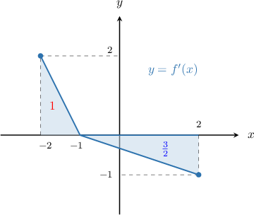
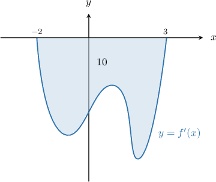
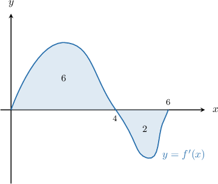
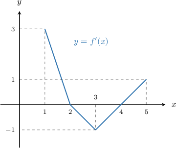
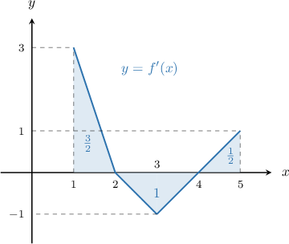

# Maximizing a Function Using the Graph of Its Derivative

Source: https://www.mathacademy.com/topics/1230?courseId=105
Topic ID: 1230

## Prerequisites

- [The Candidates Test](./364-the-candidates-test.md)
- [Interpreting the Graph of a Function's Derivative](./624-interpreting-the-graph-of-a-function-s-derivative.md)
- [Calculating the Definite Integral of a Function's Derivative Given its Graph](./1201-calculating-the-definite-integral-of-a-function-s-derivative-given-its-graph.md)

## Lesson

### Introduction

In this lesson, we will learn how to use the graph of a function's derivative to maximize the function. Let's understand how this process works by studying a specific example.

The graph of $y = f'(x),$ the *derivative* of $f(x),$ is shown in the picture below.

The areas of the shaded regions are indicated on the diagram. Additionally, it is known that $f(-2)=3.$ Our goal is find the *maximum* value of $f(x)$ on the interval $x\in [-2,2].$

To find the maximum value of $f(x),$ we use the candidates test.

According to the candidates test, the maximum value of $f(x)$ on $[-2,2]$ must occur at a critical point or an endpoint of the interval. Therefore, we proceed as follows.

**Step 1**: Find the critical points:

We see that $f'(x)$ is defined everywhere on $x\in (-2,2),$ so there are no non-stationary critical points. Additionally, we see that $f'(x)=0$ at $x=-1.$ Therefore, the candidates are

$$

x=-2,\quad x=-1,\quad x=2.

$$

**Step 2**: Compute the value of $f$ for each candidate using the fundamental theorem of calculus:

- The value of $f(x)$ at the left endpoint is given:

- To compute $f(-1),$ we apply the fundamental theorem of calculus. Since the area of the left triangle in our picture equals ${\color{red}{1}},$ we have

- To compute $f(2),$ we apply the fundamental theorem of calculus once more. Using the fact that the area of the left triangle equals ${\color{red}{1}}$ and the area of the right triangle equals ${\color{blue}{\dfrac32}},$ we have Notice that we *subtracted* the area of the right triangle since it lies *under* the $x$-axis.

**Step 3**: Select the largest value of $f$ from our candidates.

Comparing the values of $f$ found in step $2,$ we have

$$

f_{\text{max}} = \max\left\lbrace 3, 4, \dfrac{5}{2} \right\rbrace = 4.

$$

Therefore, the maximum value of $f$ is $f_{\text{max}}=4,$ and the value of $x$ that maximizes $f(x)$ is $x_\text{max}=-1.$

### Example: Finding a Maximum Value Given a Derivative Graph With One Area

#### Question

The function $f(x)$ is defined and differentiable on $[-2,3].$ The graph of $f'(x)$, the derivative of $f(x),$ is shown above, where the area of the region between the graph and the $x$-axis is $10.$ Find the maximum value of $f(x)$ on the interval $[-2,3]$ given that $f(-2)=3.$

#### Explanation

According to the candidates test, the maximum value of $f(x)$ on $[-2,3]$ must occur at a critical point or an endpoint of the interval.

****: Find the critical points:

We see that $f'(x)$ is defined everywhere on $x\in (-2,3),$ and $f'(x)\neq 0$ on this interval. Therefore, the candidates are $x=-2,\,3.$

****: Compute the value of $f$ for each candidate using the fundamental theorem of calculus:

Using the given information and the fundamental theorem of calculus, we have the following:

$$

\begin{aligned}𝑓(−2) & =3 \\ 𝑓(3) & =𝑓(−2)+∫_{3−2}^{}𝑓^{′}(𝑡)\,d𝑡 \\ & =3+(−10) \\ & =−7.\end{aligned}

$$

****: Select the largest value of $f$ from our candidates.

Comparing the values of $f$ found in step $2,$ we have

$$

f_{\text{max}} = \max\{3,-7\} = 3.

$$

Therefore, the maximum value of $f$ is $f_{\text{max}}=3,$ and the value of $x$ that maximizes $f(x)$ is $x_\text{max}=-2.$

### Example: Finding a Maximum Value Given a Derivative Graph With More Than One Area

#### Question

The function $f$ is defined and differentiable on $[0,6].$ The graph of $f'(x),$ the derivative of $f(x),$ is shown below, where the areas of the regions between the graph and the $x$-axis are $6$ and $2$ respectively (from left to right). Find the maximum value of $f(x)$ on the interval $[0,6]$ given that $f(0)=1.$

#### Explanation

According to the candidates test, the maximum value of $f(x)$ on $[0,6]$ must occur at a critical point or an endpoint of the interval.

****: Find the critical points:

We see that $f'(x)$ is defined everywhere on $x\in (0,6),$ and $f'(x)=0$ at $x=4.$ Therefore, the candidates are $x=0,4,6.$

****: Compute the value of $f$ for each candidate using the fundamental theorem of calculus:

Using the given information and the fundamental theorem of calculus, we have the following:

$$

\begin{aligned}𝑓(0) & =1 \\ 𝑓(4) & =𝑓(0)+∫_{40}^{}𝑓^{′}(𝑥)\,d𝑥 \\ & =1+6 \\ & =7 \\ 𝑓(6) & =𝑓(0)+∫_{60}^{}𝑓^{′}(𝑥)\,d𝑥 \\ & =1+6−2 \\ & =5\end{aligned}

$$

****: Select the largest value of $f$ from our candidates.

Comparing the values of $f$ found in step $2,$ we have

$$

f_{\text{max}} = \max\{1, 7, 5\} = 7.

$$

Therefore, the maximum value of $f$ is $f_{\text{max}}=7,$ and the value of $x$ that maximizes $f(x)$ is $x_\text{max}=4.$

### Example: Finding a Maximum Value by Computing Areas Under Curves

#### Question

The function $f(x)$ is defined and differentiable on $1 \leq x \leq 5.$ The graph of $f'(x),$ the derivative of $f(x),$ is shown below. Find a value of $x$ that maximizes $f(x)$ on the interval $[1,5]$ given that $f(1)=-2.$

#### Explanation

According to the candidates test, the maximum value of $f(x)$ on $[1,5]$ must occur at a critical point or an endpoint of the interval.

****: Find the critical points:

We see that $f'(x)$ is defined everywhere on $x\in (1,5),$ and $f'(x)=0$ at $x=2$ and $x=4.$ Therefore, the candidates are $x=1,2,4,5.$

****: Compute the value of $f$ for each candidate using the fundamental theorem of calculus:

The function is made up of $3$ triangles. Let's add the areas bounded by these shapes to our diagram:

Using the given information and the fundamental theorem of calculus, we have the following:

$$

\begin{aligned}𝑓(1) & =−2 \\ 𝑓(2) & =𝑓(1)+∫_{21}^{}𝑓^{′}(𝑥)\,d𝑥 \\ & =−2+\frac{3}{2} \\ & =−\frac{1}{2} \\ 𝑓(4) & =𝑓(1)+∫_{41}^{}𝑓^{′}(𝑥)\,d𝑥 \\ & =−2+\frac{3}{2}−1 \\ & =−\frac{3}{2} \\ 𝑓(5) & =𝑓(1)+∫_{51}^{}𝑓^{′}(𝑥)\,d𝑥 \\ & =−2+\frac{3}{2}−1+\frac{1}{2} \\ & =−1\end{aligned}

$$

****: Select the largest value of $f$ from our candidates.

Comparing the values of $f$ found in step $2,$ we have

$$

f_{\text{max}} = \max\left\lbrace -2,-\dfrac{1}{2},-\dfrac{3}{2},-1 \right\rbrace = -\dfrac{1}{2}.

$$

Therefore, the maximum value of $f$ is $f_{\text{max}}=-\dfrac{1}{2},$ and the value of $x$ that maximizes $f(x)$ is $x_\text{max}=2.$
