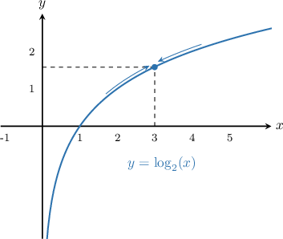
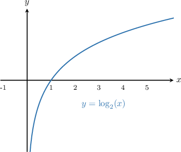
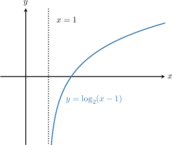
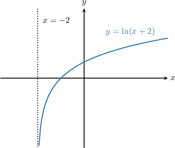
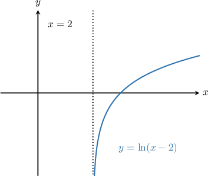

# Limits of Logarithmic Functions

Source: https://www.mathacademy.com/topics/1377?courseId=105
Topic ID: 1377

## Prerequisites

- [The Product and Quotient Rules for Limits](./1246-the-product-and-quotient-rules-for-limits.md)
- [Combining Graph Transformations of Logarithmic Functions](../algebra-ii/1707-combining-graph-transformations-of-logarithmic-functions.md)
- [Infinite Limits from Graphs](./1814-infinite-limits-from-graphs.md)
- [Limits at Infinity from Graphs](./1873-limits-at-infinity-from-graphs.md)

## Lesson

### Introduction

Let's look at the graph of $y=\log_2{x}$ below.

From the graph, we see that

$$

\lim_{x\to3}\log_2{x} = \log_2{3}\approx 1.58.

$$

For logarithmic functions, the limit at a point is equal to the value of the function at that point, so for any base $b \gt 1$ we have

$$

\lim_{x\to c}\log_b{x} = \log_b{c}.

$$

Remember that logarithms are only defined for positive inputs $x\gt 0,$ so we must have $c>0.$ Otherwise, the limit does not exist $\textrm{(DNE}).$

### Example: Evaluating Using Direct Substitution

#### Question

Find $\lim_\limits{x \to 4}\log_2 (x+4).$

#### Explanation

The function $\log_2 (x+4)$ is defined for $x>-4,$ so the limit as $x \to 4$ exists.

To find this limit, we substitute $x=4$ into the expression:

$$

\begin{aligned}\underset{𝑥→4}{lim}log_{2}⁡(𝑥+4) & =log_{2}⁡(4+4) \\ & =log_{2}⁡(8) \\ & =log_{2}⁡(2^{3}) \\ & =3\end{aligned}

$$

### Infinite Limits and Limits at Infinity of Logarithmic Functions

Let's take a look again at the function $y=\log_2(x).$

As $x$ gets larger and larger, the curve increases without bound. So, we have

$$

\lim_{x\to\infty} \log_2{x}= \infty.

$$

The curve is not defined for $x\leq 0,$ but as $x$ approaches zero from the right the curve *decreases* without bound. So

$$

\lim_{x\to0^+}\log_2{x} = -\infty.

$$

Also, note that

$$

\lim_{x\to0^-}\log_2{x} = \textrm{DNE},\qquad\qquad \lim_{x\to0}\log_2{x} = \textrm{DNE}.

$$

These properties are true for logarithms of any base $b\gt 1.$

### Example: Evaluating Limits at Infinity of Logarithmic Functions

#### Question

Find $\displaystyle{\lim_{x\to \infty} \log_2 \left(x-1\right)}.$

#### Explanation

Let's sketch the graph of $y = \log_2 \left(x-1\right).$

From the graph, we see that the function increases without bound as $x$ increases. Therefore,

$$

\lim_{x\to \infty} \log_2 \left(x-1\right) = \infty.

$$

### Example: Evaluating One-Sided Infinite Limits of Logarithmic Functions

#### Question

Calculate $\lim_\limits{x \to (-2)^{-}} \ln (x+2)$ and $\lim_\limits{x \to (-2)^{+}} \ln (x+2).$

#### Explanation

Let's sketch the graph of $y = \ln(x+2).$

The function is not defined for $x\leq -2.$ Therefore,

$$

\lim_\limits{x \to (-2)^{-}} \ln (x+2) = \textrm{DNE}.

$$

However, the function is defined for $x\gt -2.$ Therefore,

$$

\lim_\limits{x \to (-2)^{+}} \ln (x+2) = -\infty.

$$

### Example: Evaluating Infinite Limits of Logarithmic Functions

#### Question

Calculate $\lim_\limits{x \to 2} \ln (x-2).$

#### Explanation

Let's sketch the graph of $y = \ln(x-2).$

The function is not defined for $x\leq 2.$ Therefore,

$$

\lim_\limits{x \to 2^{-}} \ln (x-2) = \textrm{DNE}.

$$

However, the function is defined for $x\gt 2.$ Therefore,

$$

\lim_\limits{x \to 2^{+}} \ln (x-2) = -\infty.

$$

Since the left and right-sided limits are not equal, we have

$$

\lim_\limits{x \to 2} \ln (x-2) = \textrm{DNE}.

$$
