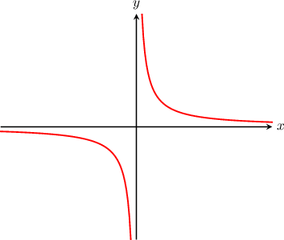
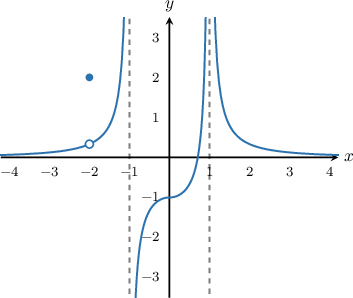
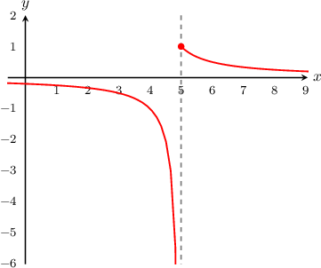

# Discontinuities Due to Vertical Asymptotes

Source: https://www.mathacademy.com/topics/2004?courseId=105
Topic ID: 2004

## Prerequisites

- [Defining Continuity at a Point](./314-defining-continuity-at-a-point.md)
- [Vertical Asymptotes of Rational Functions](./1815-vertical-asymptotes-of-rational-functions.md)

## Lesson

### Introduction

Let's take a look at the function $y=\dfrac 1 x$ below.

The function has a vertical asymptote at $x=0.$ There is also a discontinuity in the function at $x=0,$ since we cannot draw the points on the curve without taking our pen off the paper to cross the asymptote.

So, we say that $y = \dfrac 1 x$ has a **discontinuity due to a vertical asymptote** at $x=0.$ Discontinuities due to vertical asymptotes are also called **infinite discontinuities**.

Notice that here, both one-sided limits are infinite:

$$

\lim_{x\to 0^-} \left(\dfrac 1 x\right) =-\infty\qquad\text{and}\qquad\lim_{x\to 0^+} \left(\dfrac 1 x \right)=\infty.

$$

In general, a function $y=f(x)$ has a discontinuity due to a vertical asymptote at $x=c$ if either one-sided limit is infinite:

$$

\lim_{x\to c^-} f(x) =\pm \infty\qquad\text{or}\qquad\lim_{x\to c^+} f(x) =\pm \infty.

$$

Note that we only need a single limit to become infinite to conclude that there is an infinite discontinuity at $x=c.$

### Example: Finding Discontinuities Due to Vertical Asymptotes Using Graphs

#### Question

For the function $y=f(x)$ below, where does the function have a discontinuity due to a vertical asymptote?

#### Explanation

The function has discontinuities due to vertical asymptotes at $x=\pm 1.$ Note that

$$

\lim_{x\to (-1)^{+}} f(x) = -\infty,

$$

which is enough to conclude that there is a discontinuity due to a vertical asymptote at $x=-1.$ Similarly

$$

\lim_{x\to 1^{-}} f(x) = \infty,

$$

which is enough to conclude that there is a discontinuity due to a vertical asymptote at $x=1.$

There is also a discontinuity at $x=-2,$ but this is a point discontinuity, not a discontinuity due to a vertical asymptote.

### Example: Finding Infinite Discontinuities of Rational Functions

#### Question

Find all the points where the function $f(x) = \dfrac{1}{x^2-5x+6}$ has infinite discontinuities.

#### Explanation

Infinite discontinuities coincide with the vertical asymptotes of $y=f(x).$

To find the vertical asymptotes, let's start by factoring the expression in the denominator. This gives

$$

\begin{aligned}𝑓(𝑥) & =\frac{1}{𝑥^{2}−5𝑥+6} \\ & =\frac{1}{(𝑥−3)(𝑥−2)}.\end{aligned}

$$

There are no common factors in the numerator and denominator, so we can find the vertical asymptotes by setting the denominator to zero:

$$

(x-3)(x-2) = 0 \qquad \Longrightarrow\qquad x=2,3.

$$

Therefore, the function has infinite discontinuities at $x=2$ and $x=3.$

### Example: Finding Infinite Discontinuities of Rational Functions With Common Factors

#### Question

Find all the points where the function $f(x) = \dfrac{x^2+x-6}{x^2-4}$ has infinite discontinuities.

#### Explanation

Infinite discontinuities coincide with the vertical asymptotes of $y=f(x).$

To find the vertical asymptotes, let's start by factoring the expressions in the numerator and denominator. This gives

$$

\begin{aligned}𝑓(𝑥) & =\frac{𝑥^{2}+𝑥−6}{𝑥^{2}−4} \\ & =\frac{(𝑥−2)(𝑥+3)}{(𝑥−2)(𝑥+2)} \\ & =\frac{(𝑥−2)(𝑥+3)}{(𝑥−2)(𝑥+2)} \\ & =\frac{𝑥+3}{𝑥+2}.\end{aligned}

$$

To find the vertical asymptotes, we set the denominator equal to zero and solve:

$$

x+2 = 0 \qquad \Longrightarrow\qquad x=-2.

$$

Therefore, the function has an infinite discontinuity at $x=-2.$

### Example: Finding Infinite Discontinuities of a Piecewise Function

#### Question

Find all of the points where $f(x)$ below has infinite discontinuities.

$$

\begin{aligned}\frac{1}{𝑥−5},\, & 𝑥<5 \\ \frac{1}{𝑥−4},\, & 𝑥≥5.\end{aligned}

$$

#### Explanation

Infinite discontinuities coincide with the vertical asymptotes of $y=f(x).$ The only possible way that $y=f(x)$ can have vertical asymptotes is if either $\dfrac{1}{x-5}$ or $\dfrac{1}{x-4}$ grow without bound within their respective subdomains.

- We first compute the asymptotes of $\dfrac{1}{x-5}.$ Setting the denominator equal to zero, we get Although this branch of the function is defined for $x < 5$, we do have that and therefore we conclude that $x=5$ is indeed an infinite discontinuity.

- Next, we compute the asymptotes of $\dfrac{1}{x-4}.$ Setting the denominator equal to zero, we get However, this branch of the function is defined for $x \geq 5,$ which does not contain the neighborhood of $x=4.$ So $x=4$ cannot be a vertical asymptote, and therefore $x=4$ cannot be an infinite discontinuity.

Therefore, the function $f(x)$ only has a single infinite discontinuity, and it is at $x=5.$

This matches up with what we see in the graph of $y=f(x),$ shown below.

