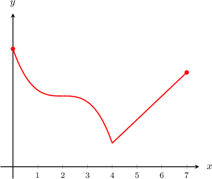
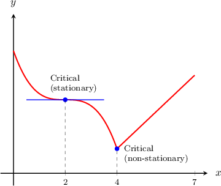
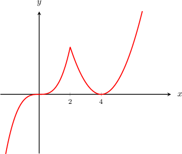
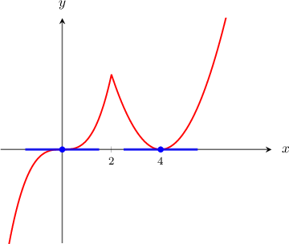
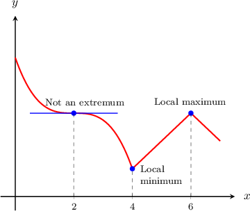
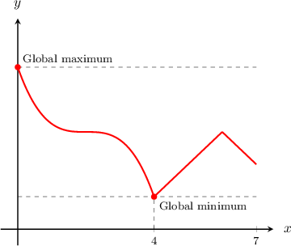
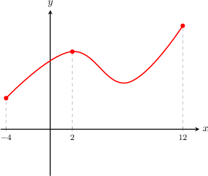

# Global vs. Local Extrema and Critical Points

Source: https://www.mathacademy.com/topics/313?courseId=105
Topic ID: 313

## Prerequisites

- [Calculating the Slope of a Tangent Line Using Differentiation](./332-calculating-the-slope-of-a-tangent-line-using-differentiation.md)
- [Continuity and Differentiability of Functions](./1691-continuity-and-differentiability-of-functions.md)

## Lesson

### Introduction

Let's consider the graph of the function $y=f(x)$ on the closed interval $[0,7]$ shown below.

The **critical points** of $f(x)$ are the values of $x$ where $f'(x)=0$ or $f'(x)$ doesn't exist. Graphically, those are the values where the tangent to the graph is horizontal or where the tangent does not exist, respectively.

In the given graph, we can see that

- at $x=2,$ the tangent to the graph is horizontal, so we have $f'(x)=0,$ while

- at $x=4,$ there is a sharp corner, so $f'(x)$ doesn't exist.

So, there are two critical points, and their $x$-coordinates are $x=2$ and $x=4.$

In particular, a critical point is called a **stationary point** if $f'(x)=0.$ So here, the points $x=2$ and $x=4$ are both critical points, but only the point at $x=2$ is a stationary point.

### Example: Identifying Critical and Stationary Points of a Function Given Its Graph

#### Question

The graph of $y=f(x)$ is plotted above. What are the $x$-coordinates of the stationary points?

#### Explanation

A stationary point of $f(x)$ is the value of $x$ where $f'(x)=0.$ Graphically, those are the values where the tangent to the graph is horizontal.

In the given graph, we can see that at $x=0$ and $x=4,$ the tangent to the graph is horizontal, so we have $f'(x)=0$ at those points.

So, there are two stationary points, and their $x$-coordinates are $x=0$ and $x=4$.

**** At $x=2$, there is a sharp corner, so $f'(2)$ doesn't exist. This gives one more critical point. But this is not a stationary point.

### Local and Global Extrema of a Function

Some critical points are **local extrema**. There are two types of local extrema:

- A **local minimum** is the lowest point of a valley in a graph. Equivalently, $x=a$ is a local minimum if for $x$ values "close" to $x=a,$ we have $f(x) \geq f(a)$.

- A **local maximum** is the highest point of a peak in a graph. Equivalently, $x=a$ is a local maximum if for $x$ values "close" to $x=a,$ we have $f(x) \leq f(a)$.

On the graph above, the critical point at $x=4$ is a local minimum since it is the lowest point of a valley. Likewise, the critical point at $x=6$ is a local maximum since it is the highest point of a peak. But the critical point at $x=2$ is not a local extremum since it is neither a peak nor a valley.

The **global extrema** of a function in an interval are given by the lowest or highest points of the function's graph in the whole interval.

- The lowest point is the **global minimum**, whereas

- the highest point is the **global maximum**.

Here, the global minimum is at $x=4$, and the global maximum is at $x=0.$

"Local" extrema are the lowest or highest points compared to points that are very close to them. On the other hand, "global" extrema are the lowest/highest points of the graph over its entire domain.

### Example: Identifying Extrema of a Function Given Its Graph

#### Question

Which of the following statements are true with respect to the function $y=f(x)$ plotted below?

1. $f(x)$ has a stationary point at $x=2$

2. $f(x)$ has a local maximum at $x=2$

3. $f(x)$ has a critical point at $x=2$

#### Explanation

Let's check our statements.

- Statement I is true. Stationary points are points where $f'(x) = 0.$ In this case, the graph of the function has a horizontal tangent line at $x=2$ and therefore, $f'(2)=0.$

- Statement II is true. The function has a local maximum at $x=2$ since it is the highest point of a peak in a graph.

- Statement III is true. The function has a critical point at $x=2$ since each stationary point is a critical point.

Therefore, all three statements are true.
