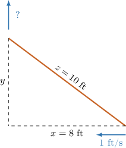
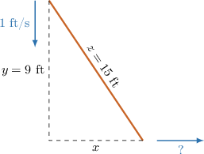
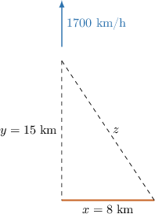

# Calculating Related Rates Using the Pythagorean Theorem

Source: https://www.mathacademy.com/topics/345?courseId=105
Topic ID: 345

## Prerequisites

- [Related Rates With Implicit Functions](./4059-related-rates-with-implicit-functions.md)

## Lesson

### Introduction

Suppose that we have a $10\,\textrm{ft}$ ladder that is leaning against the wall. A man is pushing the bottom of the ladder towards the wall at a rate of $1\textrm{ft}/\textrm{s}.$ How fast is the top of the ladder sliding up the wall when the bottom is at a distance of $8\,\textrm{ft}$ from the wall?

To solve this and similar problems, we can follow the four steps below.

**Step 1:** Draw a diagram.

In the diagram,

- $x$ is the distance between the bottom of the ladder and the wall,

- $y$ is the distance between the top of the ladder and the ground, and

- $z$ is the length of the ladder.

From the diagram, we see that $x,$ $y,$ and $z$ form a right triangle.

**Step 2:** Use the Pythagorean theorem to find the missing side.

At the particular moment in question we have $x = 8\textrm{ft}$ and $z=10\textrm{ft}.$ So, we can find $y$ at this moment using the Pythagorean theorem:

$$

\begin{aligned}𝑥^{2}+𝑦^{2} & =𝑧^{2} \\ 8^{2}+𝑦^{2} & =10^{2} \\ 64+𝑦^{2} & =100 \\ 𝑦^{2} & =36 \\ 𝑦 & =6.\end{aligned}

$$

**Step 3:** Identify the variables that change with time.

- The distance of the ladder from the wall ($x$) changes with time at a rate of $1\textrm{ft}/\textrm{s},$ which can be written as The rate $\dfrac{\textrm d x}{\textrm d t}$ is the velocity of the bottom of the ladder. It is negative because the ladder moves towards the wall (so $x$ becomes smaller with time).

- The length of the ladder ($z$) is fixed and doesn't change with time, so

- The distance of the top of the ladder from the ground ($y$) changes with time, and it's what we are looking for:

**Step 4:** Take the derivative with respect to time and plug in the known values.

To find $\dfrac{\textrm d y}{\textrm d t},$ we differentiate both sides of $x^2+y^2=z^2$ with respect to $t,$ using the chain rule:

$$

\begin{aligned}\frac{d}{d𝑡}(𝑥^{2}+𝑦^{2}) & =\frac{d}{d𝑡}(𝑧^{2}) \\ 2𝑥\frac{d𝑥}{d𝑡}+2𝑦\frac{d𝑦}{d𝑡} & =2𝑧\frac{d𝑧}{d𝑡} \\ 2𝑦\frac{d𝑦}{d𝑡} & =2𝑧\frac{d𝑧}{d𝑡}−2𝑥\frac{d𝑥}{d𝑡}.\end{aligned}

$$

Finally, we plug in the known values and solve for the unknown rate:

$$

\begin{aligned}2(6)\frac{d𝑦}{d𝑡} & =2(10)(0)−2(8)(−1) \\ \frac{d𝑦}{d𝑡} & =\frac{0+16}{12} \\ \frac{d𝑦}{d𝑡} & =\frac{4}{3}.\end{aligned}

$$

So, the ladder slides up the wall at a rate of approx $1.33 \textrm{ft}/\textrm{s}$ when the bottom is at a distance of $8\,\textrm{ft}$ from the wall.

### Example: Calculating the Rate of Change of a Leg Using the Pythagorean Theorem

#### Question

A $15\,\textrm{ft}$ ladder is leaning against a wall. If the top of the ladder is sliding down at a rate of $1\textrm{ft}/\textrm{s},$ how fast is the bottom of the ladder moving away from the wall when the top of the ladder is $9\,\textrm{ft}$ from the ground?

#### Explanation

We start by drawing a diagram of the problem.

In the diagram,

- $x$ is the distance between the bottom of the ladder,

- $y$ is the distance between the top of the ladder and the ground, and

- $z$ is the length of the ladder.

As shown in the diagram, $x,$ $y,$ and $z$ form a right triangle with $z$ as the hypotenuse. We wish to find the rate of change of $x,$ which is $\dfrac{\textrm d x}{\textrm d t}.$

We know that $y = 9\,\textrm{ft}$ and $z=15\,\textrm{ft}.$ We can find $x$ using the Pythagorean theorem, as follows:

$$

\begin{aligned}𝑥^{2}+𝑦^{2} & =𝑧^{2} \\ 𝑥^{2}+9^{2} & =15^{2} \\ 𝑥^{2} & =225−81 \\ 𝑥^{2} & =144 \\ 𝑥 & =12\,ft\end{aligned}

$$

We also know that:

- $\dfrac{\textrm d y}{\textrm d t} = -1\,\textrm{ft}/\textrm{s},$

- Note that the length of the ladder remains the same, so $\dfrac{\textrm d z}{\textrm d t} = 0.$

Finally, we differentiate both sides of $x^2+y^2=z^2$ with respect to $t$ and then substitute in the known values:

$$

\begin{aligned}\frac{d}{d𝑡}(𝑥^{2}+𝑦^{2}) & =\frac{d}{d𝑡}(𝑧^{2}) \\ 2𝑥\frac{d𝑥}{d𝑡}+2𝑦\frac{d𝑦}{d𝑡} & =2𝑧\frac{d𝑧}{d𝑡} \\ 2(12)\frac{d𝑥}{d𝑡}+2(9)(−1) & =2(15)(0) \\ \frac{d𝑥}{d𝑡} & =\frac{18}{24} \\ \frac{d𝑥}{d𝑡} & =0.75\end{aligned}

$$

Therefore, the ladder is sliding away at a rate of $0.75\text{ft}/\text{s}.$

### Example: Calculating the Rate of Change of a Hypotenuse Using the Pythagorean Theorem

#### Question

A rocket is launched vertically and is being tracked by a radar station which is located on the ground $8\,\textrm{km}$ from the launch site. If the speed of the rocket is $1700\,\textrm{km}/\textrm{h}$ when it is $15\,\textrm{km}$ from the ground, how fast is the distance between the radar station and the rocket increasing?

#### Explanation

We start by drawing a diagram of the problem.

In the diagram,

- $x$ is the distance between the radar station and the launch site,

- $y$ is the distance between the rocket and the ground, and

- $z$ is the distance between the radar station and the rocket.

As shown in the diagram, $x,$ $y,$ and $z$ form a right triangle with $z$ as the hypotenuse. We wish to find the rate of change of $z,$ which is $\dfrac{\textrm d z}{\textrm d t}.$

We know that $y = 15\,\textrm{km}$ and $x=8\,\textrm{km}.$ We can find $z$ using the Pythagorean theorem, as follows:

$$

\begin{aligned}𝑥^{2}+𝑦^{2} & =𝑧^{2} \\ 8^{2}+15^{2} & =𝑧^{2} \\ 64+225 & =𝑧^{2} \\ 289 & =𝑧^{2} \\ 𝑧 & =17\,km\end{aligned}

$$

We also know that:

- $\dfrac{\textrm d y}{\textrm d t} = 1700\,\textrm{km}/\textrm{h}$ when $y=15,$

- the distance between the radar station and the launch site ($x$) remains the same, so $\dfrac{\textrm d x}{\textrm d t}=0.$

Finally, we differentiate both sides of $x^2+y^2=z^2$ with respect to $t$ and then substitute in the known values, as follows:

$$

\begin{aligned}\frac{d}{d𝑡}(𝑥^{2}+𝑦^{2}) & =\frac{d}{d𝑡}(𝑧^{2}) \\ 2𝑥\frac{d𝑥}{d𝑡}+2𝑦\frac{d𝑦}{d𝑡} & =2𝑧\frac{d𝑧}{d𝑡} \\ 2(8)(0)+2(15)(1700) & =2(17)\frac{d𝑧}{d𝑡} \\ 51000 & =34\frac{d𝑧}{d𝑡} \\ \frac{d𝑧}{d𝑡} & =1500\end{aligned}

$$

Therefore, the distance between the radar station and the rocket is increasing at a rate of $1500\,\textrm{km}/\textrm{h}$ when the rocket is $15\,\textrm{km}$ from the ground.
