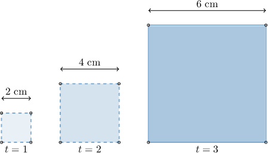
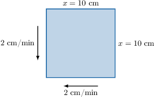
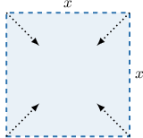
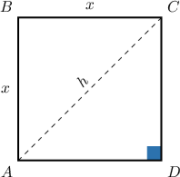
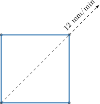

# Calculating Related Rates With Squares

Source: https://www.mathacademy.com/topics/368?courseId=105
Topic ID: 368

## Prerequisites

- [Diagonals of Squares](../geometry/2887-diagonals-of-squares.md)
- [Related Rates With Implicit Functions](./4059-related-rates-with-implicit-functions.md)

## Lesson

### Introduction

Suppose that the lengths of the sides of a square are growing at a **rate** of $2\,\textrm{cm}$ every second, as shown below.

If the square is growing, then its area is also increasing. Our question is, "*what is the rate at which the area of the square is increasing*?" In other words, if $A$ is the area of the square at time $t$, then what is

$$

\dfrac{\textrm d A}{\textrm d t}?

$$

Let $x$ be the length of the side of the square. We know that the relationship between the area $A$ and side length $x$ is given by

$$

A = x^2.

$$

Using implicit differentiation, we get

$$

\begin{aligned}\frac{d}{d𝑡}(𝐴) & =\frac{d}{d𝑡}(𝑥^{2}) \\ \frac{d𝐴}{d𝑡} & =\frac{d𝑥}{d𝑡}⋅\frac{d}{d𝑥}(𝑥^{2}) \\ \frac{d𝐴}{d𝑡} & =\frac{d𝑥}{d𝑡}⋅2𝑥.\end{aligned}

$$

We're told that $x$ grows at a **rate** of $2\,\textrm{cm/s},$ so we have

$$

\dfrac{\textrm d x}{\textrm d t} = 2.

$$

Substituting the above into our expression for $\dfrac{\textrm d A}{\textrm d t},$ we get

$$

\dfrac{\textrm d A}{\textrm d t} = 2 \cdot 2x =4x.

$$

And that's it. We're done!

If we want to calculate $\dfrac{\textrm d A}{\textrm d t}$ at a particular moment, we substitute the value of $x$ at that moment into the above.

For example, to work out the rate of change of area when $t=2$ seconds, we substitute the corresponding value of $x$ into the formula. When $t=2$ we have $x=4$ (from the diagram) and therefore

$$

\dfrac{\textrm d A}{\textrm d t} = 4(4) = 16\,\textrm{cm}^2/\textrm{s}.

$$

### Example: Calculating the Rate of Change of the Area Given the Rate of Change of the Side Length

#### Question

Each side of a square is decreasing at a rate of $2\,\text{cm/min}.$ How fast is the area of the square decreasing when the sides are $10\,\text{cm}?$

#### Explanation

Let $x$ and $A$ be the length of the sides and the area of the square, respectively. We want to find

$$

\dfrac{\textrm d A}{\textrm d t} .

$$

The area $A$ is related to side length $x$ by the formula

$$

A = x^2.

$$

Differentiating this relationship with respect to $t$ using implicit differentiation, we get

$$

\begin{aligned}\frac{d}{d𝑡}(𝐴) & =\frac{d}{d𝑡}(𝑥^{2}) \\ \frac{d𝐴}{d𝑡} & =\frac{d𝑥}{d𝑡}⋅\frac{d}{d𝑥}(𝑥^{2}) \\ \frac{d𝐴}{d𝑡} & =\frac{d𝑥}{d𝑡}⋅2𝑥\end{aligned}

$$

We're told that each side of the square is decreasing at a rate of $2\,\text{cm/min},$ so we have $\dfrac{\textrm d x}{\textrm d t} = -2.$ Also, when the sides are $10\,\text{cm},$ we have $x=10.$ Substituting this information into the above, we get

$$

\begin{aligned}\frac{d𝐴}{d𝑡} & =(−2)⋅2(10)=−40 cm^{2}/min.\end{aligned}

$$

Therefore, the area of the square decreases at a rate of $40\,\text{cm}^2/\text{min}.$

### Example: Finding an Expression for the Rate of Change of a Side Length Given the Rate of Change of the Area

#### Question

The area of a square decreases at a rate of $20 \text{cm}^2\text{/s}.$ If $x$ and $A$ denote the side length and area of the square respectively, then find an expression for $\dfrac{\textrm d x}{\textrm d t}$, where $t$ is the time in seconds.

#### Explanation

This situation is different. Here, the ** is changing at a constant rate, and we want to know the rate at which the side lengths are changing.

First, let's draw a diagram:

We want to find $\dfrac{\textrm d x}{\textrm d t}.$ The area $A$ is related to side length $x$ by the formula

$$

A = x^2.

$$

Differentiating this relationship with respect to $t$ using implicit differentiation, we get

$$

\begin{aligned}\frac{d}{d𝑡}(𝐴) & =\frac{d}{d𝑡}(𝑥^{2}) \\ \frac{d𝐴}{d𝑡} & =\frac{d𝑥}{d𝑡}⋅\frac{d}{d𝑥}(𝑥^{2}) \\ \frac{d𝐴}{d𝑡} & =\frac{d𝑥}{d𝑡}⋅2𝑥\end{aligned}

$$

We know from the given information that

$$

\begin{aligned}\frac{d𝐴}{d𝑡} & =−20 cm^2/s.\end{aligned}

$$

Substituting this information, we reach

$$

\begin{aligned}−20 & =\frac{d𝑥}{d𝑡}⋅2𝑥 \\ \frac{d𝑥}{d𝑡} & =−\frac{10}{𝑥}.\end{aligned}

$$

### Rates of Change Involving the Diagonals of a Square

Suppose that the rate of change of the diagonal of a square is known, and we're interested in finding the rate of change of some other quantity. For example, can we calculate the rate of change of the area of a square given the rate of change of its diagonal?

Before we get into that, let's recall a few facts about squares. Consider the square $ABCD$ with sides of length $x$ and diagonals of length $h.$

Using the Pythagorean Theorem, we know that

$$

\begin{aligned}𝑥^{2}+𝑥^{2} & =ℎ^{2} \\ 2𝑥^{2} & =ℎ^{2} \\ 𝑥^{2} & =\frac{ℎ^{2}}{2}.\end{aligned}

$$

We also know that the area $A$ of a square is given by $A = x^2.$ So, since $x^2 = \dfrac{h^2}{2},$ we have

$$

A = \dfrac{h^2}{2}.

$$

This formula will prove particularly handy in the next example.

### Example: Relating the Rate of Change of a Diagonal Length to Another Rate of Change

#### Question

The sides of a square are increasing. At a particular moment, the rate of increase of the area of the square is numerically equal to twice the rate of increase of the diagonal. What is the area of the square at that moment?

#### Explanation

Let $A$ be the area of the square, and $h$ be the length of the diagonal. The relationship between $A$ and $h$ is

$$

A = \dfrac{h^2}{2}.

$$

Using implicit differentiation and the chain rule, we get

$$

\begin{aligned}\frac{d}{d𝑡}(𝐴) & =\frac{d}{d𝑡}(\frac{ℎ^{2}}{2}) \\ \frac{d𝐴}{d𝑡} & =\frac{dℎ}{d𝑡}⋅\frac{d}{dℎ}(\frac{ℎ^{2}}{2}) \\ \frac{d𝐴}{d𝑡} & =\frac{dℎ}{d𝑡}⋅ℎ.\end{aligned}

$$

The given information tells us that $\dfrac{\textrm d A}{\textrm d t} = 2\dfrac{\textrm d h}{\textrm d t}$, so replacing $\dfrac{\textrm d A}{\textrm dt}$ in the above gives

$$

\begin{aligned}2\frac{dℎ}{d𝑡} & =ℎ\frac{dℎ}{d𝑡} \\ 2\frac{dℎ}{d𝑡} & =ℎ\frac{dℎ}{d𝑡} \\ 2 & =ℎ.\end{aligned}

$$

So at that particular moment, we have $h=2,$ and therefore the area of the square at that moment is

$$

A = \dfrac{2^2}{2} = 2.

$$

### Example: Calculating a Rate of Change of Area Given a Rate of Change of a Diagonal: Word Problem

#### Question

In a testing facility, a scientist is increasing the diagonals of a simple square at a rate of $12 \text{mm}\text{/min}.$ At what rate, in squared millimeters per minute, is the area of the square increasing when the length of the diagonal is $6\, \text{mm}?$

#### Explanation

Let $h$ and $A$ be the length of the diagonals and the area of the square, respectively. Using the Pythagorean theorem, it can be shown that the relationship between $A$ and $h$ is

$$

A = \dfrac{h^2}{2}.

$$

We want to find

$$

\dfrac{\textrm d A}{\textrm d t}.

$$

Differentiating this relationship with respect to $t$ using implicit differentiation, we get

$$

\begin{aligned}\frac{d}{d𝑡}(𝐴) & =\frac{d}{d𝑡}(\frac{ℎ^{2}}{2}) \\ \frac{d𝐴}{d𝑡} & =\frac{dℎ}{d𝑡}⋅\frac{d}{dℎ}(\frac{ℎ^{2}}{2}) \\ \frac{d𝐴}{d𝑡} & =\frac{dℎ}{d𝑡}⋅ℎ.\end{aligned}

$$

We're told that $h$ increases at a rate of $12\,\textrm{mm/min},$ so

$$

\begin{aligned}\frac{dℎ}{d𝑡} & =12.\end{aligned}

$$

Also, we want to compute the rate of change of the area when the diagonal has length $h=6.$ Substituting this information into our expression for $\dfrac{\textrm{d}A}{\textrm d t},$ we get

$$

\begin{aligned}\frac{d𝐴}{d𝑡} & =12⋅6=72 mm^{2}/min.\end{aligned}

$$
