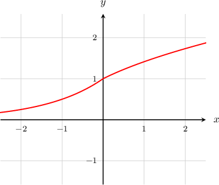

# Further Continuity of Piecewise Functions

Source: https://www.mathacademy.com/topics/3831?courseId=105
Topic ID: 3831

## Prerequisites

- [Left and Right Continuity](./474-left-and-right-continuity.md)

## Lesson

### Introduction

Let's consider the following piecewise function:

$$

\begin{aligned}𝑓(𝑥)=\begin{aligned}2^{𝑥} & \,𝑥<0 \\ \sqrt{√𝑥+1} & \,𝑥≥0\end{aligned}\end{aligned}

$$

Notice that the function has two "pieces," one for $x < 0$ and one for $x\geq 0.$ We wish to examine whether the function is continuous at $x=0.$

If we plot the function, it appears as though the function *is* continuous at this point.

However, to be sure that the function is continuous at $x=0,$ we need to check that the function is both left-continuous and right-continuous at $x=0,$ i.e.,

$$

\lim_{x\to 0^-}f(x) = \lim_{x\to 0^+}f(x) =f(0).

$$

First, we note that

$$

f(0) = \sqrt{0+1} = 1.

$$

Now, let's check the two limits:

- Approaching from the left, we have $x < 0,$ so we use the expression $f(x)=2^x.$ We get

- Approaching from the right, we have $x>0,$ so we use the expression $f(x)=\sqrt {x+1}.$ We get

Since the function is both left-continuous and right-continuous at $x=0,$ we conclude that it is continuous at $x=0.$

### Example: Verifying Continuity of Two-Piece Functions

#### Question

Which of the following statements are true regarding the function $h(x),$ defined below?

$$

\begin{aligned}𝑒^{𝑥−1},\, & 𝑥≤1, \\ 1−𝑥,\, & 𝑥>1\end{aligned}

$$

1. $h(x)$ is left-continuous at $x=1$

2. $h(x)$ is right-continuous at $x=1$

3. $h(x)$ is continuous at $x=1$

#### Explanation

We're required to determine the left and right continuity properties of $h(x)$ at $x = 1.$

Let's start by computing $h(1){:}$

$$

\begin{aligned}ℎ(1) & =𝑒^{1−1} \\ & =𝑒^{0} \\ & =1\end{aligned}

$$

Now, let's look at each statement in turn:

- Statement I is true. The function is left-continuous at $x=1$ since the left-sided limit is equal to the function value:

- Statement II is false. The function is ** right-continuous at $x=1$ since the right-sided limit is ** equal to the function value:

Statement III is false. For the function to be continuous at $x=1,$ it must be both left-continuous and right-continuous at this point. However, we have already determined that the function is not right-continuous at $x=1.$

Therefore, the correct answer is "I only."

### Example: Verifying Continuity of Three-Piece Functions

#### Question

Which of the following statements are true regarding the function $f(x),$ defined below?

$$

\begin{aligned}2−𝑥, & 𝑥<0 \\ 2, & 𝑥=0 \\ \frac{4}{𝑥+2}, & 𝑥>0\end{aligned}

$$

1. $f(x)$ is left-continuous at $x = 0$

2. $f(x)$ is right-continuous at $x = 0$

3. $f(x)$ is continuous at $x = 0$

#### Explanation

We're required to determine the left and right continuity properties of $f(x)$ at $x = 0.$

First, we note that

$$

\begin{aligned}𝑓(0)=2.\end{aligned}

$$

Now, let's look at each statement in turn:

- Statement I is true. The function is left-continuous at $x = 0$ since the left-sided limit is equal to the function value:

- Statement II is true. The function is right-continuous at $x = 0$ since the right-sided limit is equal to the function value:

- Statement III is true. The function is both left and right-continuous at $x=0,$ which implies that the function is continuous at $x=0.$

Therefore, the correct answer is "I, II, and III."
