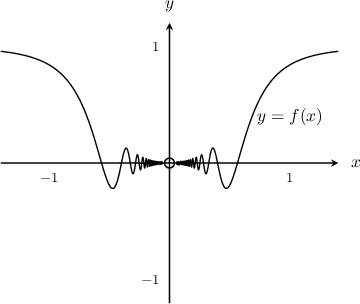
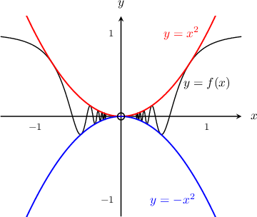

# The Squeeze Theorem

Source: https://www.mathacademy.com/topics/473?courseId=105
Topic ID: 473

## Prerequisites

- [Absolute Value Inequalities](../algebra-i/451-absolute-value-inequalities.md)
- [Limits of Absolute Value Functions](./605-limits-of-absolute-value-functions.md)

## Lesson

### Introduction

The function $f(x)=x^2\sin \left(\dfrac{1}{x^2}\right)$ is undefined at $x=0,$ but does that mean that the limit of this function at $x=0$ is also undefined?

To find out, let's start by looking at the graph of $y=f(x).$

Based on the graph, it looks like $f(x) \to 0$ as $x \to 0.$ But let's try to find more convincing evidence.

First, notice that the function $f(x)$ is squeezed (or sandwiched) between the two functions $y=x^2$ and $y=-x^2.$ This happens because $\sin(\cdots)$ ranges between $-1$ and $1,$ so $x^2 \sin (\cdots)$ ranges between $-x^2$ and $x^2.$

Starting with

$$

-x^2 \leq f(x) \leq x^2,

$$

we take the limit as $x\to 0$ and evaluate the two known limits, reaching

$$

\begin{aligned}\underset{𝑥→0}{lim}(−𝑥^{2})≤ & \underset{𝑥→0}{lim}𝑓(𝑥)≤\underset{𝑥→0}{lim}(𝑥^{2}) \\ 0≤ & \underset{𝑥→0}{lim}𝑓(𝑥)≤0.\end{aligned}

$$

There is only one number that satisfies the final inequality above, and that number is $0.$ Therefore,

$$

\lim_{x\to 0}f(x) =0.

$$

We just applied the **squeeze theorem**, also called the **sandwich theorem**. Written generally, the squeeze theorem states that if a function $f(x)$ is squeezed between two functions $g(x)$ and $h(x)$, i.e.,

$$

h(x) \le f(x) \le g(x),

$$

and

$$

\lim_{x\to a} h(x)=\lim_{x\to a} g(x) =L,

$$

for constants $a$ and $L,$ then

$$

\lim_{x\to a} f(x) =L.

$$

### Example: Evaluating a Limit of a Function Given Two Bounding Functions

#### Question

Find $\lim\limits_{x\to 2} f(x)$ given that

$$

4x-4 \le f(x) \le x^2.

$$

#### Explanation

Taking the limits gives

$$

\begin{aligned}\underset{𝑥→2}{lim}(4𝑥−4)≤ & \underset{𝑥→2}{lim}𝑓(𝑥)≤\underset{𝑥→2}{lim}𝑥^{2} \\ 4(2)−4≤ & \underset{𝑥→2}{lim}𝑓(𝑥)≤2^{2} \\ 4≤ & \underset{𝑥→2}{lim}𝑓(𝑥)≤4.\end{aligned}

$$

Therefore, by the squeeze theorem, we must have

$$

\lim\limits_{x\to 2} f(x)=4.

$$

### Example: Evaluating the Limit of the Product of an Even Power and a Trigonometric Function

#### Question

Evaluate $\lim\limits_{x\to0} x^4\cos \left(\dfrac{1}{x}\right).$

#### Explanation

Recall that $\cos(\theta)$ ranges between $-1$ and $1.$ So we have

$$

-1 \le \cos \left(\dfrac{1}{x}\right) \le 1,

$$

and multiplying both sides by $x^4$ gives

$$

-x^4 \le x^4\cos\left(\dfrac{1}{x}\right) \le x^4.

$$

Now, taking the limits gives

$$

\begin{aligned}\underset{𝑥→0}{lim}(−𝑥^{4})≤ & \underset{𝑥→0}{lim}𝑥^{4}cos⁡(\frac{1}{𝑥})≤\underset{𝑥→0}{lim}(𝑥^{4}) \\ 0≤ & \underset{𝑥→0}{lim}𝑥^{4}cos⁡(\frac{1}{𝑥})≤0,\end{aligned}

$$

which, by the squeeze theorem, implies that

$$

\lim\limits_{x\to0} x^4\cos \left(\dfrac{1}{x}\right) = 0.

$$

### Example: Evaluating a Limit with a Trigonometric Function in the Exponent

#### Question

Evaluate $\lim\limits_{x\to0} x^2e^{\cos (1/x)}.$

#### Explanation

Recall that $\cos(\theta)$ ranges between $-1$ and $1.$ So we have

$$

-1 \le \cos \left(\dfrac{1}{x}\right) \le 1.

$$

Now, since $e^x$ is a positive, increasing function, we can exponentiate both sides to give

$$

e^{-1} \le e^{\cos (1/x )} \le e^{1} .

$$

Multiplying both sides of the inequality by $x^2$ gives

$$

x^2e^{-1} \le x^2e^{\cos (1/x )} \le x^2e^{1},

$$

and taking the limits gives

$$

\begin{aligned}\underset{𝑥→0}{lim}𝑥^{2}𝑒^{−1}≤ & \underset{𝑥→0}{lim}𝑥^{2}𝑒^{cos⁡(1/𝑥)}≤\underset{𝑥→0}{lim}𝑥^{2}𝑒^{1} \\ 0≤ & \underset{𝑥→0}{lim}𝑥^{2}𝑒^{cos⁡(1/𝑥)}≤0.\end{aligned}

$$

Therefore, by the squeeze theorem, we must have

$$

\lim_{x\to0} x^2e^{\cos (1/x )} = 0.

$$

### Example: Evaluating the Limit of the Product of an Odd Power and a Trigonometric Function

#### Question

Evaluate $\displaystyle\lim_{x\to 0}x^3\sin\left(\dfrac 3 x\right).$

#### Explanation

Recall that $\sin(\theta)$ ranges between $-1$ and $1.$ So, we have

$$

\left|\sin{\left(\dfrac{3}{x}\right)}\right|\leq 1.

$$

Multiplying the above inequality by $|x^3|$ gives

$$

\begin{aligned}|𝑥^{3}|⋅sin⁡(\frac{3}{𝑥})≤|𝑥^{3}| \\ 𝑥^{3}sin⁡(\frac{3}{𝑥})≤|𝑥^{3}|,\end{aligned}

$$

and using the definition of absolute value, we have

$$

-|x^3| \leq x^3 \sin{\left(\dfrac{3}{x}\right)} \leq |x^3|.

$$

Note that we're using absolute value here because $x^3$ has an odd power.

Now, taking the limit as $x\to 0,$ we have

$$

\begin{aligned}\underset{𝑥→0}{lim}(−|𝑥^{3}|)≤ & \underset{𝑥→0}{lim}𝑥^{3}sin⁡(\frac{3}{𝑥})≤\underset{𝑥→0}{lim}(|𝑥^{3}|) \\ 0≤ & \underset{𝑥→0}{lim}𝑥^{3}sin⁡(\frac{3}{𝑥})≤0.\end{aligned}

$$

Therefore, by the squeeze theorem, we conclude that

$$

\lim_{x\to 0} x^3 \sin{\left(\dfrac{3}{x}\right)} = 0.

$$
