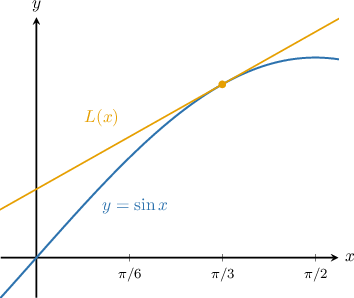
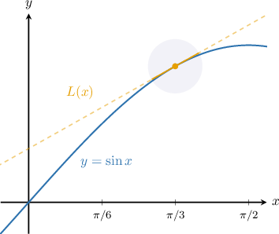
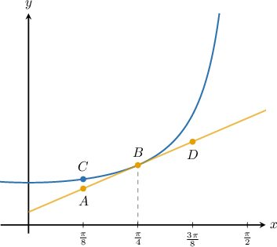

# Approximating Trigonometric Functions Using Local Linearity

Source: https://www.mathacademy.com/topics/623?courseId=105
Topic ID: 623

## Prerequisites

- [Approximating Functions Using Local Linearity and Linearization](./621-approximating-functions-using-local-linearity-and-linearization.md)

## Lesson

### Introduction

Let's consider the graph of the function $f(x)=\sin x$ and its tangent line $\color{orange}L$ at $x=\dfrac{\pi}{3}.$

From this graph, we see that near $x=\dfrac{\pi}{3},$ the tangent line and the function are very close to each other. So, the line $L(x)$ is a good approximation of the function for points close to $x=\dfrac{\pi}{3}.$

Here, the tangent line approximation of the function $f(x)=\sin x$ at the point $a=\dfrac{\pi}{3}$ is defined by

$$

L(x) = f\left( \dfrac{\pi}{3}\right) + f'\left(\dfrac{\pi}{3}\right)\left( x-\dfrac{\pi}{3}\right).

$$

Let's calculate $f\left(\dfrac{\pi}{3}\right)$ and $f' \left(\dfrac{\pi}{3}\right)$ in the expression above. Evaluating the function at $a=\dfrac{\pi}{3},$ we get

$$

f\left( \dfrac{\pi}{3}\right) = \sin\left(\dfrac{\pi}{3}\right) = \dfrac{\sqrt{3}}{2}.

$$

and computing the derivative, we get

$$

f'(x) = \dfrac{\textrm{d}}{\textrm{d}x}(\sin x) = \cos x,

$$

which in turn gives

$$

f'\left(\dfrac{\pi}{3}\right) = \cos\left(\dfrac{\pi}{3}\right) = \dfrac{1}{2}.

$$

Finally, we obtain

$$

\begin{aligned}𝐿(𝑥) & =𝑓(\frac{𝜋}{3})+𝑓^{′}(\frac{𝜋}{3})(𝑥−\frac{𝜋}{3}) \\ & =\frac{\sqrt{√3}}{2}+\frac{1}{2}(𝑥−\frac{𝜋}{3}) \\ & =\frac{\sqrt{√3}}{2}+\frac{1}{2}𝑥−\frac{𝜋}{6} \\ & =\frac{1}{2}𝑥+\frac{3\sqrt{√3}−𝜋}{6}.\end{aligned}

$$

### Example: Determining a Coordinate Corresponding to the Tangent Line Approximation of a Function

#### Question

The plot below shows the graph of $y=\sec x$ and its tangent line at $x=\dfrac{\pi}{4}.$ What value gives the tangent line approximation of $\sec\left(\dfrac{\pi}{8}\right)?$

#### Explanation

We are interested in the point that has an $x$-coordinate equal to $\dfrac{\pi}{8}$ and lies on the tangent line to $y=\sec x$ at $x=\dfrac{\pi}{4}.$ This is the point $A.$

Therefore, the value that gives the tangent line approximation of $\sec\left(\dfrac{\pi}{8}\right)$ is the $y$-coordinate of $A.$

### Example: Computing the Tangent Line Approximation of a Trigonometric Function

#### Question

What is the tangent line approximation of $\tan x$ at $x=\dfrac{\pi}{4}?$

#### Explanation

The tangent line approximation of $f(x) = \tan x$ at $x=\dfrac{\pi}{4}$ is

$$

L(x) = f\left(\dfrac{\pi}{4}\right) + f'\left(\dfrac{\pi}{4}\right)\left( x-\dfrac{\pi}{4}\right).

$$

Let's compute $f\left(\dfrac{\pi}{4}\right)$ and $f'\left(\dfrac{\pi}{4}\right)$ in the expression above. Evaluating the function at $a=\dfrac{\pi}{4},$ we get

$$

f\left(\dfrac{\pi}{4}\right) = \tan\left(\dfrac{\pi}{4}\right) = 1.

$$

Now, computing the derivative, we have

$$

f'(x) = \dfrac{\textrm{d}}{\textrm{d}x}(\tan x) = \sec^2 x,

$$

which in turn gives

$$

f'\left(\dfrac{\pi}{4}\right) = \sec^2 \left(\dfrac{\pi}{4}\right) = 2.

$$

So, the tangent line approximation is

$$

\begin{aligned}𝐿(𝑥) & =𝑓(\frac{𝜋}{4})+𝑓^{′}(\frac{𝜋}{4})(𝑥−\frac{𝜋}{4}) \\ & =1+2(𝑥−\frac{𝜋}{4}) \\ & =2𝑥+1−\frac{𝜋}{2}.\end{aligned}

$$

### Example: Estimating the Value of a Trigonometric Function Using a Tangent Line Approximation

#### Question

Approximate the value of $\cos \left(\dfrac{7\pi}{12}\right)$ using the tangent line approximation of $f(x)=\cos{x}$ at $x=\dfrac{\pi}{2}.$

#### Explanation

The tangent line approximation of $f(x)=\cos{x}$ at the point $a=\dfrac{\pi}{2}$ is

$$

\begin{aligned}𝐿(𝑥)=𝑓(\frac{𝜋}{2})+𝑓^{′}(\frac{𝜋}{2})(𝑥−\frac{𝜋}{2}).\end{aligned}

$$

Let's compute $f\left(\dfrac{\pi}{2}\right)$ and $f'\left(\dfrac{\pi}{2}\right)$ in the expression above. Evaluating the function at $a=\dfrac{\pi}{2},$ we get

$$

f\left(\dfrac{\pi}{2}\right) = \cos{\left(\dfrac{\pi}{2}\right)} =0.

$$

Now, computing the derivative, we have

$$

\begin{aligned}𝑓^{′}(𝑥) & =\frac{d}{d𝑥}(cos⁡𝑥)=−sin⁡𝑥,\end{aligned}

$$

which in turn gives

$$

f'\left(\dfrac{\pi}{2}\right) = -\sin{\left(\dfrac{\pi}{2}\right)} = -1.

$$

So, the tangent line approximation is

$$

\begin{aligned}𝐿(𝑥) & =0−(𝑥−\frac{𝜋}{2}) \\ & =\frac{𝜋}{2}−𝑥.\end{aligned}

$$

We can approximate $\cos \left(\dfrac{7\pi}{12}\right)$ by evaluating the tangent line approximation at $x=\dfrac{7\pi}{12}.$ We get

$$

\begin{aligned}cos⁡(\frac{7𝜋}{12}) & ≈𝐿(\frac{7𝜋}{12}) \\ & =\frac{𝜋}{2}−\frac{7𝜋}{12} \\ & =−\frac{𝜋}{12}.\end{aligned}

$$

### Example: Estimating the Value of a Trigonometric Function Given in Degrees Using a Tangent Line Approximation

#### Question

Approximate the value of $\cos{89^{\circ}}$ using the tangent line approximation of $f(x) = \cos x$ at $x=90^\circ.$

#### Explanation

Remember that the derivative of any trigonometric function is always expressed in radians. For that reason, we need to convert all degree units to radians.

To convert an angle expressed in degrees to an equivalent angle in radians, we multiply the angle in degrees by $\dfrac{\pi}{180^\circ}.$ This gives,

$$

90^\circ \cdot \dfrac{\pi}{180^\circ} = \dfrac{\pi}{2},

$$

and

$$

89^\circ \cdot \dfrac{\pi}{180^\circ} = \dfrac{89\pi}{180} .

$$

The tangent line approximation of $f(x) = \cos x$ at the point $a = 90^\circ = \dfrac{\pi}{2}$ is

$$

L(x) = f\left(\dfrac{\pi}{2}\right) +f'\left(\dfrac{\pi}{2}\right)\left( x-\dfrac{\pi}{2}\right).

$$

Let's compute $f\left(\dfrac{\pi}{2}\right)$ and $f'\left(\dfrac{\pi}{2}\right)$ in the expression above. Evaluating the function at $a = \dfrac{\pi}{2},$ we get

$$

f\left(\dfrac{\pi}{2}\right) = \cos\left(\dfrac{\pi}{2}\right) = 0.

$$

Now, computing the derivative, we have

$$

f'(x) = \dfrac{\textrm{d}}{\textrm{d}x}(\cos x) = -\sin x,

$$

which in turn gives

$$

f'\left(\dfrac{\pi}{2}\right) = -\sin\left(\dfrac{\pi}{2}\right) = -1.

$$

So, the tangent line approximation is

$$

\begin{aligned}𝐿(𝑥) & =0+(−1)(𝑥−\frac{𝜋}{2}) \\ & =−(𝑥−\frac{𝜋}{2}) \\ & =\frac{𝜋}{2}−𝑥.\end{aligned}

$$

We can approximate $\cos{89^{\circ}}$ by evaluating the tangent line approximation at $a = 89^{\circ} = \dfrac{89\pi}{180}.$ We get

$$

\begin{aligned}cos⁡89^{∘} & ≈𝐿(\frac{89𝜋}{180}) \\ & =\frac{𝜋}{2}−\frac{89𝜋}{180} \\ & =\frac{𝜋}{180}.\end{aligned}

$$
