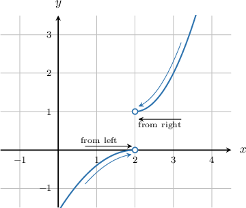
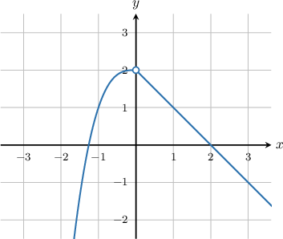
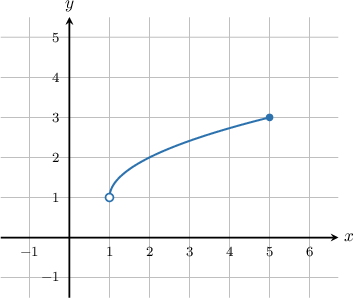
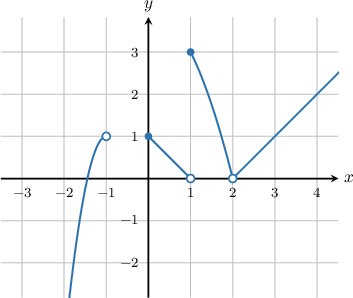

# Finding the Existence of a Limit Using One-Sided Limits

Source: https://www.mathacademy.com/topics/625?courseId=105
Topic ID: 625

## Prerequisites

- [The Left and Right-Sided Limits of a Function](./472-the-left-and-right-sided-limits-of-a-function.md)

## Lesson

### Introduction

In general, the limit of a function $f(x)$ at a point only exists if *both* the left-sided and right-sided limits *exist* and are the *same*.

For example, suppose we want to compute

$$

\lim_\limits{x\rightarrow 2}f(x)

$$

for the function whose graph is shown below. To do this, we must first compute the left and right-sided limits.

As $x$ approaches $2$ from the left, $y$ approaches $0.$ However, as $x$ approaches $2$ from the right, $y$ approaches $1.$ Therefore, we have the following left and right-sided limits.

$$

\begin{aligned}Left-sided limit: \, & \underset{𝑥→2^{−}}{lim}𝑓(𝑥)=0 \\ Right-sided limit: \, & \underset{𝑥→2^{+}}{lim}𝑓(𝑥)=1\end{aligned}

$$

Both of these limits exist. However, they are *not* the same. Consequently, the overall limit at $x=2$ does not exist:

$$

\lim_\limits{x\rightarrow 2}f(x)=\text{DNE}

$$

### Example: Identifying the Limit at an Interior Point

#### Question

Find $\lim_\limits{x\rightarrow 0}f(x)$ for the function $f(x)$ plotted below.

#### Explanation

From the graph, we see that as we approach $x=0$ from the left, the $y$ value approaches $2.$ So the left-hand limit is

$$

\lim_\limits{x\rightarrow \,0^{-}}f(x)=2.

$$

Similarly, when we approach $x=0$ from the right, the $y$ value again approaches $2.$ So the right-hand limit is

$$

\lim_\limits{x\rightarrow \,0^{+}}f(x)=2.

$$

Since both the left and right-hand limits exist and are equal to $2,$ we conclude that

$$

\lim_\limits{x\rightarrow \,0}f(x)=2.

$$

### Example: Identifying the Limit at an Endpoint

#### Question

The function $y=f(x)$ is defined on $x\in (1,5].$ Find $\lim_\limits{x\rightarrow \, 1}f(x)$ for the function.

#### Explanation

From the graph, we see that it is not possible to approach $x=1$ from the left. Therefore,

$$

\lim_\limits{x\rightarrow \,1^{-}}f(x)=\text{DNE}.

$$

When we approach $x=1$ from the right, we have

$$

\lim_\limits{x\rightarrow \,1^{+}}f(x)=1.

$$

Since $\lim_\limits{x\rightarrow 1^-} f(x) \ne \lim_\limits{x\rightarrow 1^+} f(x),$ we conclude that

$$

\lim_\limits{x\rightarrow \,1}f(x)=\text{DNE}.

$$

### Example: Identifying True Statements About Limits

#### Question

Which of the following statements are true concerning the function $y=f(x)$ whose graph is shown below?

1. $\lim_\limits{x\rightarrow \,2}f(x)=0$

2. $\lim_\limits{x\rightarrow \,1}f(x)=\text{DNE}$

3. $\lim_\limits{x\rightarrow \,-1}f(x)=\lim_\limits{x\rightarrow \,0}f(x)$

#### Explanation

Let's analyze each statement in turn.

- Statement I is true. We see from the graph that $\lim_\limits{x\rightarrow \,2^-}f(x)=\lim_\limits{x\rightarrow \,2^+}f(x)=0$. Consequently, $\lim_\limits{x\rightarrow \,2}f(x)=0.$

- Statement II is true. When approaching $x=1$ from the left and from the right, we get respectively. Since $\lim_\limits{x\rightarrow \,1^-}f(x)\ne\lim_\limits{x\rightarrow \,1^+}f(x),$ we conclude that $\lim_\limits{x\rightarrow \,1}f(x)=\text{DNE}.$

- Statement III is false. Both limits $\lim_\limits{x\rightarrow \,-1}f(x)$ and $\lim_\limits{x\rightarrow \,0}f(x)$ do not exist because the function $f(x)$ is not given in the interval $[-1,0)$. We ** say that the limits are equal because we can't compare the undefined values.

In conclusion, only statements I and II are true.
