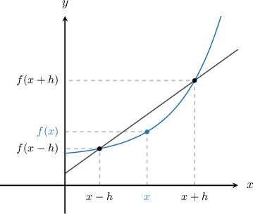
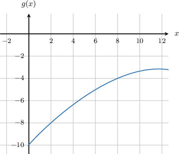
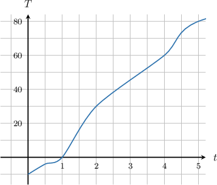

# Estimating Derivatives Using a Central Difference Quotient

Source: https://www.mathacademy.com/topics/640?courseId=105
Topic ID: 640

## Prerequisites

- [Estimating Derivatives Using a Forward Difference Quotient](./992-estimating-derivatives-using-a-forward-difference-quotient.md)
- [Estimating Derivatives Using a Backward Difference Quotient](./993-estimating-derivatives-using-a-backward-difference-quotient.md)

## Lesson

### Introduction

We've learned two methods for approximating the value of the derivative at a point by computing the rate of change between two points a distance of $h$ apart, where $h$ is small.

- The forward difference approximation computes the rate of change between the point $x$ and the point $x+h,$ which is a step of $h$ units forward.

- The backward difference approximation computes the rate of change between the point $x$ and the point $x-h,$ which is a step of $h$ units backward.

Now, we will introduce the **central difference approximation**, also known as the **symmetric difference approximation**. In this approximation, we compute the rate of change between the points $x-h$ and $x+h,$ a distance of $2h$ apart.

$$

f'(x) \approx \dfrac{f(x+h)- f(x-h)}{2h}

$$

Usually, the central difference approximation is a better approximation for $f '(x)$ than the forward difference approximation and the backward difference approximation. This is because for the central difference approximation, $x$ is the midpoint between the two points $x-h$ and $x+h$ that are used in the approximation.

### Example: Estimating a Derivative Given Data or Tables Using a Central Difference Approximation

#### Question

A function $f(x)$ has values according to the table below:

#### Explanation

We use the central difference approximation

$$

f'(x) \approx \frac{f(x+h) - f(x-h)}{2h}

$$

at the point $x=0.2.$ We choose the step size $h$ to be as small as possible, in this case $h=0.1.$ This gives

$$

\begin{aligned}𝑓^{′}(0.2) & ≈\frac{𝑓(0.2+0.1)−𝑓(0.2−0.1)}{2(0.1)} \\ & =\frac{𝑓(0.3)−𝑓(0.1)}{2(0.1)} \\ & =\frac{1.7−1.1}{0.2} \\ & =\frac{0.6}{0.2} \\ & =\frac{6}{2} \\ & =3.\end{aligned}

$$

### Example: Estimating a Derivative Given a Graph Using a Central Difference Approximation

#### Question

The graph of the function $y=g(x)$ is shown above. Approximate $g'(x)$ at the point $x=4$ using a central difference approximation with step size $h=4.$

#### Explanation

We use the central difference approximation

$$

g'(x) \approx \dfrac{g(x+h) - g(x-h)}{2h}

$$

at the point $x=4$ with step size $h=4.$ This gives

$$

\begin{aligned}𝑔^{′}(4) & ≈\frac{𝑔(4+4)−𝑔(4−4)}{2(4)} \\ & =\frac{𝑔(8)−𝑔(0)}{8} \\ & =\frac{−4−(−10)}{8} \\ & =\frac{6}{8} \\ & =0.75.\end{aligned}

$$

### Example: Estimating a Derivative Given a Graph Using a Central Difference Approximation: Word Problem

#### Question

A car engine is being heated from a temperature of about $-10^{\circ}.$ The temperature of the engine after $t$ minutes is given by $T(t).$ The graph of $T(t)$ is shown below.

Approximate the rate at which the temperature of the engine increases when $t = 3$ using a central difference approximation with step size $h=1.$

#### Explanation

We use the central difference approximation

$$

T'(t) \approx \dfrac{T(t+h) - T(t-h)}{2h},

$$

at the time $t=3$ with step size $h=1.$ This gives

$$

\begin{aligned}𝑇^{′}(3) & ≈\frac{𝑇(3+1)−𝑇(3−1)}{2(1)} \\ & =\frac{𝑇(4)−𝑇(2)}{2} \\ & =\frac{60−30}{2} \\ & =\frac{30}{2} \\ & =15.\end{aligned}

$$

Therefore, the rate of temperature increase is approximately $15^{\circ}$ per minute.
