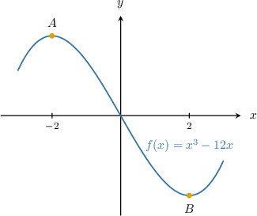

# Using Differentiation to Calculate Critical Points

Source: https://www.mathacademy.com/topics/752?courseId=105
Topic ID: 752

## Prerequisites

- [Roots of Rational Functions](../integrated-math-iii-honors/133-roots-of-rational-functions.md)
- [Global vs. Local Extrema and Critical Points](./313-global-vs-local-extrema-and-critical-points.md)
- [Solving Quadratic Equations by Completing the Square](../algebra-i/419-solving-quadratic-equations-by-completing-the-square.md)
- [Solving Equations Containing the Exponential Function](../algebra-ii/870-solving-equations-containing-the-exponential-function.md)
- [Trigonometric Equations Containing Transformed Tangent Functions](../integrated-math-iii-honors/923-trigonometric-equations-containing-transformed-tangent-functions.md)
- [Selecting Procedures for Calculating Derivatives](./1115-selecting-procedures-for-calculating-derivatives.md)
- [Completing the Square With Odd Linear Terms](../algebra-i/3842-completing-the-square-with-odd-linear-terms.md)

## Lesson

### Introduction

Recall that a critical point of $f(x)$ is a point $x=c$ in the domain of $f$ such that

- either $f'(c)=0$

- or $f'(c)$ does not exist.

For example, let's find the critical points of the function

$$

f(x) = x^3- 12x.

$$

Differentiating $f(x),$ we obtain

$$

\begin{aligned}𝑓^{′}(𝑥) & =\frac{d}{d𝑥}(𝑥^{3}−12𝑥) \\ & =3𝑥^{2}−12.\end{aligned}

$$

We now proceed to find the critical points:

- First, we compute the points where $f'(c) = 0.$ We set the derivative equal to zero, and solve for $x\mathbin{:}$ Therefore, $f(x)$ has stationary points at $x = \pm 2.$

- Second, we note that $f'(x)$ exists for all values of $x$ in the domain of $f(x).$ So $f(x)$ has no non-stationary critical points.

Therefore, we conclude that the critical points of $f(x)$ is $x= \pm 2.$

These values correspond to the points $A$ and $B,$ as shown on the graph.

### Example: Finding Critical Points of Polynomials

#### Question

Find the critical points of the function $f(x)=2x^3-3x^2+5.$

#### Explanation

A critical point of $f(x)$ is a point $x=c$ in the domain of $f$ such that either $f'(c)=0$ or $f'(c)$ does not exist.

Differentiating $f(x),$ we obtain

$$

\begin{aligned}𝑓^{′}(𝑥) & =\frac{d}{d𝑥}(2𝑥^{3}−3𝑥^{2}+5) \\ & =6𝑥^{2}−6𝑥.\end{aligned}

$$

We now proceed to find the critical points:

- First, we compute the points where $f'(c) = 0.$ We set the derivative equal to zero, and solve for $x\mathbin{:}$ Therefore, $f(x)$ has stationary points at $x=0$ and $x=1.$

- Second, we note that $f'(x)$ exists for all values of $x$ in the domain of $f(x).$ So $f(x)$ has no non-stationary critical points.

Therefore, we conclude that the critical points of $f(x)$ are $x=0$ and $x=1.$

### Example: Finding Critical Points of Exponential Functions

#### Question

Find the critical points of the function $f(x) = e^{x^3-x}.$

#### Explanation

A critical point of $f(x)$ is a point $x=c$ in the domain of $f$ such that either $f'(c)=0$ or $f'(c)$ does not exist.

Differentiating $f(x),$ we obtain

$$

\begin{aligned}𝑓^{′}(𝑥) & =\frac{d}{d𝑥}(𝑒^{𝑥^{3}−𝑥}) \\ & =(𝑥^{3}−𝑥)^{′}𝑒^{𝑥^{3}−𝑥} \\ & =(3𝑥^{2}−1)𝑒^{𝑥^{3}−𝑥}.\end{aligned}

$$

We now proceed to find the critical points:

- First, we compute the points where $f'(c) = 0.$ We set the derivative equal to zero, and solve for $x\mathbin{:}$ Since $e^{x^3-x} \neq 0$ for all $x,$ we can divide this equation by $e^{x^3-x}$ and solve the resulting equation. Therefore, $f(x)$ has stationary points at $x=\dfrac{\sqrt 3}{3}$ and $x=-\dfrac{\sqrt 3}{3}.$

- Second, we note that $f'(x)$ exists for all values of $x$ in the domain of $f(x).$ So $f(x)$ has no non-stationary critical points.

Therefore, we conclude that the critical points of $f(x)$ are $x=\dfrac{\sqrt 3}{3}$ and $x=-\dfrac{\sqrt 3}{3}.$

### Example: Finding Critical Points of Rational Functions

#### Question

What are the critical points of the function $f(x) = \dfrac {x-3}{x^2 -6}?$

#### Explanation

A critical point of $f(x)$ is a point $x=c$ in the domain of $f$ such that either $f'(c)=0$ or $f'(c)$ does not exist.

Differentiating $f(x),$ we obtain

$$

\begin{aligned}𝑓^{′}(𝑥) & =\frac{d}{d𝑥}(\frac{𝑥−3}{𝑥^{2}−6}) \\ & =\frac{(𝑥−3)^{′}⋅(𝑥^{2}−6)−(𝑥−3)⋅(𝑥^{2}−6)^{′}}{(𝑥^{2}−6)^{2}} \\ & =\frac{(𝑥^{2}−6)−(𝑥−3)⋅2𝑥}{(𝑥^{2}−6)^{2}} \\ & =\frac{−6+6𝑥−𝑥^{2}}{(𝑥^{2}−6)^{2}} \\ & =−\frac{𝑥^{2}−6𝑥+6}{(𝑥^{2}−6)^{2}}.\end{aligned}

$$

We now proceed to find the critical points:

- First, we compute the points where $f'(c) = 0.$ We set the derivative equal to zero, and solve for $x$ by completing the square: Therefore, $f(x)$ has stationary points at $x=3\pm \sqrt 3.$

- Second, we note that $f'(x)$ does not exist at $x=\pm \sqrt 6.$ But these points do not lie in the domain of $f(x).$ So $f(x)$ has no non-stationary critical points.

Therefore, we conclude that the critical points of $f(x)$ are $x=3\pm \sqrt 3.$

### Example: Calculating Critical Points of Trigonometric Functions

#### Question

Consider the function $f(x) = \sqrt 3\sin{2x} - \cos{2x}.$ Find critical points of $f(x)$ for $x \in \left(-\dfrac{\pi}{2}, \dfrac{\pi}{2}\right).$

#### Explanation

A critical point of $f(x)$ is a point $x=c$ in the domain of $f$ such that either $f'(c) = 0$ or $f'(c)$ does not exist.

Differentiating $f(x),$ we obtain

$$

\begin{aligned}𝑓^{′}(𝑥) & =\frac{d}{d𝑥}(\sqrt{√3}sin⁡2𝑥−cos⁡2𝑥) \\ & =\sqrt{√3}⋅\frac{d}{d𝑥}(sin⁡2𝑥)−\frac{d}{d𝑥}(cos⁡2𝑥) \\ & =2\sqrt{√3}cos⁡2𝑥+2sin⁡2𝑥.\end{aligned}

$$

We now proceed to find the critical points:

- First, we compute the points where $f'(c) = 0.$ We set the derivative equal to zero, and solve for $x\mathbin{:}$ The general solution to our equation is Solving for $x,$ we get We set $n=0, \pm 1, \pm 2,\ldots,$ until we have generated all solutions in the domain $-\dfrac{\pi}{2} \lt x \lt \dfrac{\pi}{2}\mathbin{:}$ setting $n=0$ gives $x = -\dfrac{\pi}{6}$ setting $n=1$ gives $x = \dfrac{\pi}{3}$ All other values of $n$ generate solutions outside the domain $-\dfrac{\pi}{2} \lt x \lt \dfrac{\pi}{2}.$ So, the solutions to this equation for $x \in \left(-\dfrac{\pi}{2}, \dfrac{\pi}{2}\right)$ are Therefore, $f(x)$ has stationary points at $x =-\dfrac{\pi}{6}$ and $x = \dfrac{\pi}{3}.$

- Second, we note that $f'(x)$ exists for all values of $x\in \left(-\dfrac\pi2, \dfrac\pi2\right).$ So $f(x)$ has no non-stationary critical points.

Therefore, we conclude that the critical points of $f(x)$ for $x\in \left(-\dfrac\pi2, \dfrac\pi2\right)$ are

$$

x_1 =-\dfrac{\pi}{6}, \qquad x_2 = \dfrac{\pi}{3}.

$$
