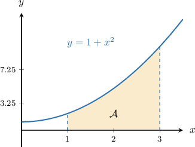
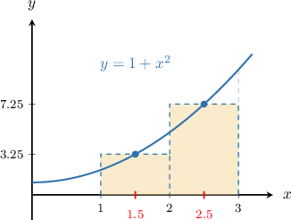
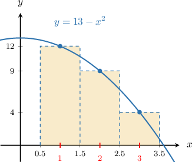
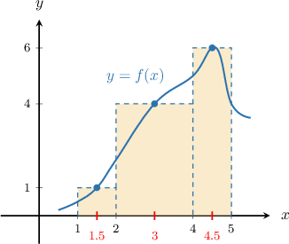

# Approximating Areas With the Midpoint Riemann Sum

Source: https://www.mathacademy.com/topics/944?courseId=105
Topic ID: 944

## Prerequisites

- [Intervals of Concavity](./363-intervals-of-concavity.md)
- [Approximating Areas With the Left Riemann Sum](./477-approximating-areas-with-the-left-riemann-sum.md)
- [Approximating Areas With the Right Riemann Sum](./1281-approximating-areas-with-the-right-riemann-sum.md)

## Lesson

### Introduction

Suppose we wish to approximate the area $\mathcal{A}$ under the curve $y=1+x^2$ over the interval $[1,3].$

We could use the left or right Riemann sum. However, there is a method that usually gives us an even better approximation.

This method is called the **midpoint Riemann sum**, which means that the curve passes through the top *midpoint* of each rectangle.

Let's approximate the area under the curve using a midpoint Riemann sum with two rectangles, as shown below.

Adding the areas of the two rectangles, we get

$$

\begin{aligned}A & ≈\overset{\overset{\,\overset{\overset{𝑓(1.5)}{}}{height}\,⋅\,\underset{width}{\underset{}{1}}\,}{}}{1st rectangle}+\overset{\overset{\,\overset{\overset{𝑓(2.5)}{}}{height}\,⋅\,\underset{width}{\underset{}{1}}\,}{}}{2nd rectangle} \\ & =[(1+1.5^{2})⋅1]+[(1+2.5^{2})⋅1] \\ & =3.25+7.25 \\ & =10.5.\end{aligned}

$$

Because the function is *concave up* over the interval $[1,3],$ the "missing" area between the rectangles and the function is greater than the "extra" area, which means our approximation is an *underestimate* of the actual area.

### A General Formula for the Midpoint Riemann Sum

The general formula for a midpoint Riemann sum for $y=f(x)$ over the interval $[a,b]$ is given by

$$

heights

$$

where $n$ is the number of rectangles, $x_i^\ast$ is the midpoint of the $i$th subinterval, and the step size $\Delta x$ is given by

$$

\Delta x=\dfrac{b-a}{n}.

$$

### Example: Using the Midpoint Riemann Sum With a Regular Step Size

#### Question

Estimate the area under the curve $y=13-x^2$ over the interval $[0.5,3.5]$ using a midpoint Riemann sum with $3$ rectangles of equal width. Is this an overestimate or an underestimate?

#### Explanation

Let's sketch our situation.

First, let's compute the step size $\Delta{x},$ which is just the width of each rectangle. In our case, the endpoints of the interval are $a=0.5$ and $b=3.5,$ and there are $n=3$ rectangles, so the step size is

$$

\Delta{x} = \dfrac{3.5-0.5}{3} = 1.

$$

Using the midpoints $x=1,2,3,$ the area $\mathcal{A}$ can be approximated using the formula

$$

\mathcal A \approx (\overbrace{{\color{red}{f(1)}}+{\color{red}{f(2)}}+{\color{red}{f(3)}}}^{\color{red}{\large\text{heights}}}) \cdot \underbrace{\color{blue}\Delta x}_{\color{blue}{\large\text{width}}}.

$$

So, we now set up a table with the values of $f(x)$ at the midpoints of each subinterval:

Finally, we obtain the following approximation for our area:

$$

\begin{aligned}A & ≈(12+9+4)⋅1=25\end{aligned}

$$

Because the function is ** over the interval $[0.5, 3.5],$ the "extra" area between the rectangles and the function is greater than the "missing" area, which means our approximation is an ** of the correct area.

### Midpoint Riemann Sum with Irregular Step Size

In the last few examples, the step size $\Delta x$ was the same for each of the rectangles. In these cases, we say that the step size is **regular**.

There are situations where the step size can vary, which we call an **irregular step size**. But we can still use a midpoint Riemann sum to approximate the area. Let's see an example.

### Example: Using the Midpoint Riemann Sum With an Irregular Step Size

#### Question

Use a midpoint Riemann sum with the partition

$$

[1,5] = [1,2] \cup [2,4] \cup [4,5]

$$

to approximate the area under the curve of the continuous function $y=f(x)$ whose data is given in the table below.

#### Explanation

Let's plot what this function might look like using the values given in the table.

We've drawn some rectangles to help us calculate our midpoint Riemann sum, and we have chosen the heights of each rectangle to be calculated using the midpoint of each subinterval.

Using the midpoints $x=1.5, 3, 4.5$ and calculating the area of each rectangle, we obtain the following approximation for our area:

$$

1

$$

Finally, we plug in the numbers to approximate the area under the curve, and we get

$$

\begin{aligned} \mathcal{A} &\approx {\color{red}1} \cdot ({\color{blue}2-1}) + {\color{red}4} \cdot ({\color{blue}4-2}) + {\color{red}6} \cdot ({\color{blue}5-4}) \\&= {\color{red}1} \cdot {\color{blue}1} +{\color{red}4} \cdot {\color{blue}2}+ {\color{red}6} \cdot {\color{blue}1} \\&=1+8+6\\&= 15. \end{aligned}

$$

### Example: Using the Midpoint Riemann Sum: Word Problems

#### Question

The following table shows the number of customers per minute that arrive at a counter to be served, measured over a period of $20$ minutes.

Use the midpoint Riemann sum with the partitions

$$

[0,6],\quad[6,20]

$$

to approximate the number of customers served over the $20$ minute period.

#### Explanation

In this context, we have $n=2$ rectangles and the area $\mathcal{A}$ under the curve $y=C(t)$ represents the total number of customers served over the $20$-minute period.

The midpoint Riemann sum states that

$$

\mathcal{A} \approx C(t_1^\ast)\Delta t_1+C(t_2^\ast)\Delta t_2,

$$

where each $\Delta t_i$ and $t_i^\ast$ denote, respectively, the width and the midpoint of the $i$th subinterval.

We set up a table of values that include the $\Delta t$'s and the midpoints:

Finally, we plug in the numbers to approximate the area under the curve, and we get

$$

\begin{aligned}A & ≈30⋅6+40⋅14 \\ & =180+560 \\ & =740.\end{aligned}

$$

Therefore, about $740$ customers were served over the $20$-minute period.
