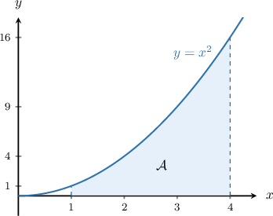
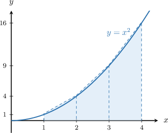
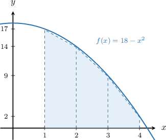
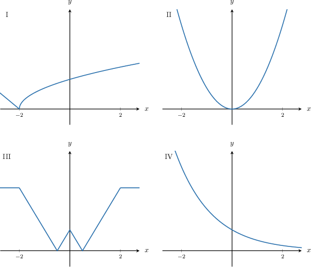
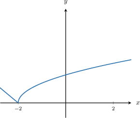
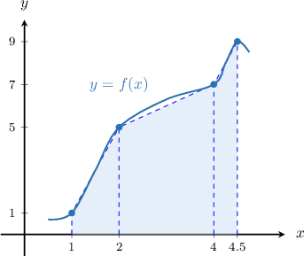

# Approximating Areas With the Trapezoidal Rule

Source: https://www.mathacademy.com/topics/945?courseId=105
Topic ID: 945

## Prerequisites

- [Intervals of Concavity](./363-intervals-of-concavity.md)
- [Approximating Areas With the Left Riemann Sum](./477-approximating-areas-with-the-left-riemann-sum.md)
- [Approximating Areas With the Right Riemann Sum](./1281-approximating-areas-with-the-right-riemann-sum.md)
- [Areas of Trapezoids](../grade-7/1353-areas-of-trapezoids.md)

## Lesson

### Introduction

Suppose that we wish to approximate the area under the curve on the interval

We have already seen how to estimate the area using left and right Riemann sums, in which we approximate the area using rectangles.

However, we can get an even better estimate using trapezoids instead. The process of approximating the area under a curve using trapezoids is called the **trapezoidal rule.**

Here, we will approximate the area under the graph of with three trapezoids, each with a height equal to Note that the trapezoids are turned on their side, so *their heights run horizontally*.

We compute the area of each trapezoid and add them all together:

Because the function is *concave up* over the interval the trapezoids reach above the function, and therefore our approximation is an *overestimate* of the actual area.

### The General Formula

In the previous problem, we had the following expression for the trapezoidal rule sum:

$$

\mathcal{A} \approx \dfrac{ {\color{red}f(1)}+{\color{red}f(2)} }{2}\cdot {\color{blue}\Delta x} + \dfrac{ {\color{red}f(2)}+ {\color{red}f(3)} }{2}\cdot {\color{blue}\Delta x} + \dfrac{ {\color{red}f(3)}+ {\color{red}f(4)} }{2}\cdot {\color{blue}\Delta x}

$$

Notice that we can simplify the above by factoring out $\dfrac{1}{2}$ and $\Delta x,$ and also collecting like terms:

$$

\mathcal{A} \approx \dfrac{1}{2} [ \overbrace{{\color{red}f(1)} + 2\left( {\color{red}f(2)}+{\color{red}f(3)}\right) +{\color{red}f(4)}}^{\color{red}\large\text{bases}} ] \underbrace{\color{blue}\Delta x}_{\color{blue}\large\text{height}}

$$

In general, we can compute the trapezoidal rule sum for a function $y=f(x)$ over an interval $[a,b]$ using the **general formula** as follows:

$$

\mathcal{A} \approx \dfrac{1}{2}\cdot [\overbrace{{\color{red}f(a)} + 2({\color{red}f(x_1)}+{\color{red}f(x_2)}+ \ldots +{\color{red}f(x_{n-1})}) +{\color{red}f(b)} }^{\color{red}\large\text{bases}} ] \cdot\!\! \underbrace{\color{blue}\Delta x}_{\color{blue}\large\text{height}},

$$

Here, $n$ is the number of trapezoids, and $\Delta x$ is the step size given by

$$

\Delta x = \dfrac{b-a}{n}.

$$

**Note:** If we look carefully at the formula, we realize that the trapezoidal rule is an average of the left and right Riemann sums!

### Example: Using the Trapezoidal Rule with Regular Step Size

#### Question

Estimate the area under the curve $y=18-x^2$ over the interval $[1,4]$ using the trapezoidal rule with $3$ trapezoids of equal height.

#### Explanation

Let $f(x)= 18 - x^2$ and let $\mathcal A$ denote the required area. The general formula for the trapezoidal rule states that

$$

\mathcal{A} \approx \frac{1}{2}\left[f(a)+ 2\left(f(x_1) + f(x_2)+\ldots + f(x_{n-1})\right)+f(b) \right]\Delta x,

$$

where $n$ is the number of trapezoids and $\Delta x = \dfrac{b-a}{n}$ is the step size.

Here, we have the following values:

- The number of trapezoids is $n=3.$

- The corresponding interval is $[1,4],$ so we have $a=1$ and $b=4.$

- The step size is given by

Using the above values, the general formula becomes

$$

\mathcal{A} \approx \frac{1}{2}\left[f(1)+ 2\left(f(2) + f(3)\right) + f(4) \right]\cdot 1.

$$

To identify the function values, we now set up a table with the values of $x$ and $f(x){:}$

.equal-width td {width: 20px; text-align: center;}

Finally, we obtain the following approximation for our area:

$$

\mathcal{A} \approx \frac{1}{2}\cdot\left[17 + 2\left(14 + 9\right)+ 2 \right]\cdot 1 = \dfrac{65}{2}

$$

Because the function is ** over the interval $[1,4],$ the trapezoids lie under the function, and therefore approximation is an ** of the correct area.

### Example: Identifying Whether the Trapezoidal Rule Sum Gives an Underestimate or Overestimate

#### Question

For which of the graphs shown below would the trapezoidal sum give an underestimate of the area under the curve between $x=-2$ and $x=2?$

#### Explanation

The trapezoidal rule underestimates the area under the curve if the function is concave down over the given interval.

From the given graphs, the only curve that is concave down on $[-2,2]$ is the one shown below.

### Trapezoidal Rule Sum with Irregular Step Size

So far, the step size $\Delta x$ has been the same for each trapezoid. In these cases, we say that the step size is **regular**.

However, in some situations, the step size can vary. In such cases, we say that the step size is **irregular**. But we can still use the trapezoidal rule to approximate the area under a curve. Let's see an example.

### Example: Using the Trapezoidal Rule With Irregular Step Size

#### Question

Using the trapezoidal rule with the partition

$$

[1,4.5] = [1,2] \cup [2,4] \cup [4,4.5],

$$

approximate the area under the curve of the continuous function $y=f(x)$ whose data is given in the table below.

.equal-width td {width: 20px; text-align: center;}

#### Explanation

Let's plot what this function might look like, using the values given in the table.

We've drawn some trapezoids to help calculate our trapezoidal rule sum. By calculating the area of each trapezoid, we obtain the following approximation for our area $\mathcal{A}\mathbin{:}$

$$

1

$$

Substituting the appropriate numbers into the above expression gives

$$

\begin{aligned}A & ≈\frac{1+5}{2}⋅(2−1)+\frac{5+7}{2}⋅(4−2)+\frac{7+9}{2}⋅(4.5−4) \\ & =3⋅1+6⋅2+8⋅0.5 \\ & =3+12+4 \\ & =19\,.\end{aligned}

$$

### Example: Using the Trapezoidal Rule: Word Problem

#### Question

The following table shows the speed of a car, in miles per hour, at certain moments in its $2$-hour journey.

.equal-width td {width: 30px; text-align: center;}

Use the trapezoidal rule with the partition

$$

[0,1.5] \cup [1.5,2],

$$

to approximate the total distance traveled during the $2$-hour journey.

#### Explanation

In this context, we have $n=2$ trapezoids, and the area $\mathcal{A}$ under the curve $y=v(t)$ represents the total distance traveled during the $2$-hour journey.

Using the trapezoidal rule, we estimate the area as follows:

$$

\mathcal{A} \approx \dfrac{ v(0)+v(1.5) }{2} \cdot \Delta t_1 + \dfrac{ v(1.5)+v(2) }{2} \cdot \Delta t_2

$$

Substituting the appropriate numbers into the above expression gives

$$

\begin{aligned}A & ≈\frac{0+60}{2}⋅(1.5−0)+\frac{60+40}{2}⋅(2−1.5) \\ & =30⋅(1.5)+50⋅(0.5) \\ & =70\,.\end{aligned}

$$

Therefore, the total distance covered during the $2$-hour journey is approximately $70\,\textrm{miles}.$
