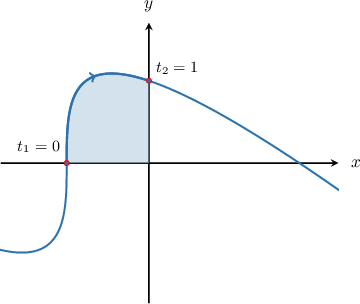
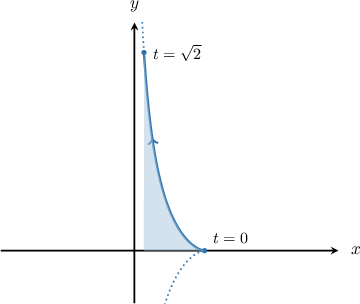
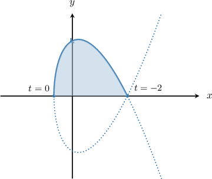

# Calculating Areas Bounded by Parametric Functions

Source: https://www.mathacademy.com/topics/1043?courseId=106
Topic ID: 1043

## Prerequisites

- [Introduction to Integration by Parts](./317-introduction-to-integration-by-parts.md)
- [Differentiating Parametric Curves](./798-differentiating-parametric-curves.md)
- [The Area Bounded by a Curve and the X-Axis](../ap-calculus-ab/1040-the-area-bounded-by-a-curve-and-the-x-axis.md)

## Lesson

### Introduction

Consider the curve defined parametrically as

$$

x=t^3-1, \qquad y=2t-t^3, \qquad t \in (-\infty, \infty).

$$

The shaded area shown in the diagram is the finite region bounded between the curve, the $x$-axis, and the vertical lines formed by $x$-axis and the points on the curve corresponding to $t_1=0$ to $t_2=1,$ as shown.

We know that the area of the curve is given by

$$

A = \int_{a}^{b} y \:\textrm{d}x.

$$

Since our curve is defined parametrically, we need to change the variable of integration from $x$ to $t$ using the change of variables formula, given by

$$

A = \int_{t_1}^{t_2} y(t) \dfrac{\textrm{d}x}{\textrm d t}\:\textrm d t.

$$

Now, in this case, we have

$$

\begin{aligned}\frac{d𝑥}{d𝑡}=\frac{d}{d𝑡}(𝑡^{3}−1)=3𝑡^{2}.\end{aligned}

$$

Applying the change of variables formula, we have

$$

\begin{aligned}𝐴 & =∫_{𝑡_{2}𝑡_{1}}^{}𝑦(𝑡)\frac{d𝑥}{d𝑡}\,d𝑡 \\ & =∫_{10}^{}(2𝑡−𝑡^{3})⋅3𝑡^{2}\,d𝑡 \\ & =∫_{10}^{}6𝑡^{3}−3𝑡^{5}\,d𝑡 \\ & =6∫_{10}^{}𝑡^{3}\,d𝑡−3∫_{10}^{}𝑡^{5}\,d𝑡 \\ & =6⋅\frac{𝑡^{4}}{4}_{10}^{}−3⋅\frac{𝑡^{6}}{6}_{10}^{} \\ & =6(\frac{1}{4}−0)−3(\frac{1}{6}−0) \\ & =\frac{3}{2}−\frac{1}{2} \\ & =1.\end{aligned}

$$

Therefore, the shaded area shown in the picture has an area of $1$ square unit.

### A General Formula for the Area Bounded by a Parametric Curve

In general, the area between the $x$-axis and the parametric curve

$$

x = x(t), \qquad y = y(t), \qquad t_1 \leq t \leq t_2

$$

is given by the absolute value of the integral

$$

\int_{t_1}^{t_2} y \dfrac{\textrm{d}x}{\textrm{d}t} \:\textrm{d}t.

$$

Note the following:

- When applying this formula, we assume that the chosen parametrization traverses the curve only once.

- It's possible that this integral gives a negative value for the area even when the corresponding region lies entirely above the $x$-axis! To see why, note that if the curve lies above the $x$-axis, we must have $y(t) > 0.$ However, if the curve is parameterized so that it is traversed from right to left, then $\dfrac{\textrm d x}{\textrm d t} < 0,$ and we have and thus, our integral turns out to be negative.

- To ensure that we get an unsigned area, we take the absolute value of the integral.

- In general, care must be taken when asked to compute the area bounded by a parametric curve when $y\dfrac{\textrm{d}x}{\textrm{d}t}$ changes sign over the domain of integration. However, we won't consider that scenario here.

Let's see another example.

### Example: Finding an Integral Expression for the Area Bounded by a Parametric Curve

#### Question

Find an integral expression for the area bounded between the curve defined parametrically as

$$

x = e^{-t^2}, \qquad y = t^3,

$$

and the $x$-axis for $0 \leq t \leq \sqrt{2} \,?$

#### Explanation

The unsigned area bounded by the parametric curve

$$

x = x(t), \qquad y = y(t), \qquad t_1 \leq t \leq t_2

$$

and the $x$-axis is given by the absolute value of the integral

$$

\int_{t_1}^{t_2} y \dfrac{\textrm{d}x}{\textrm{d}t} \:\textrm{d}t.

$$

First, we compute

$$

\begin{aligned}\frac{d𝑥}{d𝑡} & =\frac{d}{d𝑡}(𝑒^{−𝑡^{2}}) \\ & =−2𝑡𝑒^{−𝑡^{2}}.\end{aligned}

$$

So, we obtain the integral expression

$$

\begin{aligned}∫_{𝑡_{2}𝑡_{1}}^{}𝑦\frac{d𝑥}{d𝑡}\,d𝑡 & =∫_{\sqrt{√2}0}^{}𝑡^{3}(−2𝑡𝑒^{−𝑡^{2}})d𝑡 \\ & =−2∫_{\sqrt{√2}0}^{}𝑡^{4}𝑒^{−𝑡^{2}}\,d𝑡.\end{aligned}

$$

Notice that this integral will give us a negative number since $y\dfrac{\textrm{d}x}{\textrm{d}t} \leq 0$ for all $t \in [0, \sqrt{2}].$

Therefore, the area is given by

$$

A = -\left( -2 \int_{0}^{\sqrt{2}} t^4 e^{-t^2} \, \textrm{d}t \right) = 2 \int_{0}^{\sqrt{2}} t^4 e^{-t^2} \, \textrm{d}t.

$$

### Example: Finding the Area Bounded by a Parametric Curve

#### Question

Find the area bounded between the curve defined parametrically as

$$

x = t^2 - 1, \qquad y = t^3 - 4t

$$

and the $x$-axis for $t \in [-2,0].$

#### Explanation

The unsigned area bounded by the parametric curve

$$

x = x(t), \qquad y = y(t), \qquad t_1 \leq t \leq t_2

$$

and the $x$-axis is given by the absolute value of the integral

$$

\int_{t_1}^{t_2} y \dfrac{\textrm{d}x}{\textrm{d}t} \:\textrm{d}t.

$$

First, we compute

$$

\begin{aligned}\frac{d𝑥}{d𝑡} & =\frac{d}{d𝑡}(𝑡^{2}−1) \\ & =2𝑡.\end{aligned}

$$

So, we obtain the integral expression

$$

\begin{aligned}∫_{𝑡_{2}𝑡_{1}}^{}𝑦\frac{d𝑥}{d𝑡}\,d𝑡 & =∫_{0−2}^{}(𝑡^{3}−4𝑡)(2𝑡)\,d𝑡 \\ & =2∫_{0−2}^{}𝑡^{2}(𝑡^{2}−4)d𝑡.\end{aligned}

$$

Notice that this integral will give us a negative number since $y\dfrac{\textrm{d}x}{\textrm{d}t} \leq 0$ for all $t \in [-2,0].$

Therefore, the area is

$$

\begin{aligned}𝐴 & =−2∫_{0−2}^{}𝑡^{2}(𝑡^{2}−4)d𝑡 \\ & =2∫_{0−2}^{}𝑡^{2}(4−𝑡^{2})d𝑡 \\ & =2∫_{0−2}^{}(4𝑡^{2}−𝑡^{4})d𝑡 \\ & =8∫_{0−2}^{}𝑡^{2}\,d𝑡−2∫_{0−2}^{}𝑡^{4}\,d𝑡 \\ & =8⋅\frac{𝑡^{3}}{3}\,_{0−2}^{}−2⋅\frac{𝑡^{5}}{5}\,_{0−2}^{} \\ & =8(\frac{0^{3}}{3}−\frac{(−2)^{3}}{3})−2(\frac{0^{5}}{5}−\frac{(−2)^{5}}{5}) \\ & =8(\frac{8}{3})−2(\frac{32}{5}) \\ & =\frac{64}{3}−\frac{64}{5} \\ & =\frac{128}{15}.\end{aligned}

$$
