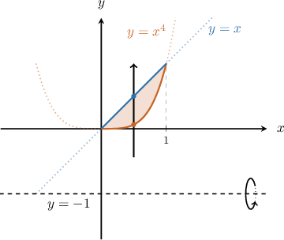
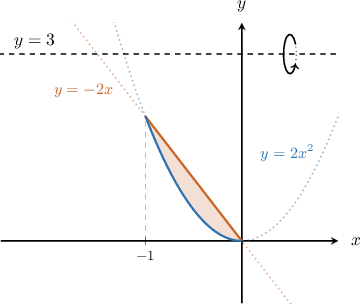
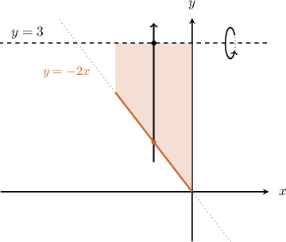
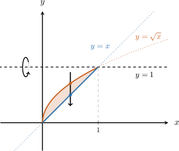
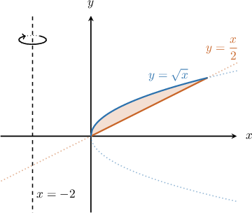
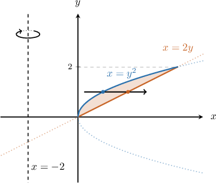
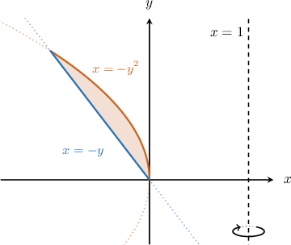
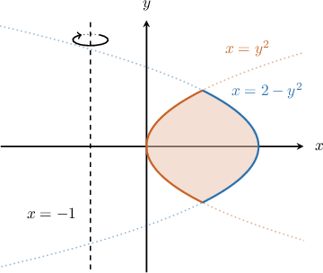
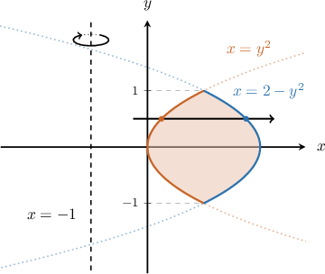

# Volumes of Revolution Using the Washer Method: Rotation About Other Axes

Source: https://www.mathacademy.com/topics/1082?courseId=106
Topic ID: 1082

## Prerequisites

- [Volumes of Revolution Using the Washer Method: Rotation About the Coordinate Axes](./414-volumes-of-revolution-using-the-washer-method-rotation-about-the-coordinate-axes.md)
- [Volumes of Revolution Using the Disc Method: Rotation About Other Axes](./1677-volumes-of-revolution-using-the-disc-method-rotation-about-other-axes.md)

## Lesson

### Introduction

The region enclosed by the curves $y=x^4$ and $y=x$ is shown below. Suppose that this region is rotated $2\pi$ radians about the horizontal line $y=-1,$ generating a solid of revolution. How can we write an integral expression that gives the volume of the solid?

First, we want to determine the limits of integration. We find the intersections of the curves by solving the following equation:

$$

\begin{aligned}𝑥^{4} & =𝑥 \\ 𝑥^{4}−𝑥 & =0 \\ 𝑥(𝑥^{3}−1) & =0 \\ 𝑥 & =0,1\end{aligned}

$$

Hence, our limits of integration are from $x=0$ to $x=1.$

Now, let's draw our vertical arrow through the given region. The arrow should be pointing away from the axis of rotation.

The vertical arrow

- *enters* the region through the inner curve $y=x^4,$ and

- *leaves* though the outer curve $y=x.$

Now, we can express the volume of our solid as the difference between the volumes of the solids generated by the outer and inner curves, as follows:

- **Step I.** Figure out the volume generated by the outer curve $y=x.$

The corresponding volume is given by

$$

\begin{aligned}𝑉_{outer} & =𝜋∫_{10}^{}[\,(upper)−(lower)\,]^{2}\,d𝑥 \\ & =𝜋∫_{10}^{}[\,(𝑥)−(−1)\,]^{2}\,d𝑥 \\ & =𝜋∫_{10}^{}[𝑥+1]^{2}\,d𝑥.\end{aligned}

$$

- **Step II.** Figure out the volume generated by the inner curve $y=x^4.$

The corresponding volume is given by

$$

\begin{aligned}𝑉_{inner} & =𝜋∫_{10}^{}[\,(upper)−(lower)\,]^{2}\,d𝑥 \\ & =𝜋∫_{10}^{}[\,(𝑥^{4})−(−1)\,]^{2}\,d𝑥 \\ & =𝜋∫_{10}^{}[𝑥^{4}+1]^{2}\,d𝑥.\end{aligned}

$$

- **Step III.** Find the difference. Finally, we can write the volume of the original solid as

### Example: Identifying an Integral Representing the Volume of a Solid Generated by Rotation About a Horizontal Line

#### Question

#### Explanation

First, let's draw our vertical arrow through the given region. The arrow should be pointing away from the axis of rotation.

The vertical arrow

- ** the region through the inner curve $y=-2x,$ and

- ** though the outer curver $y=2x^2.$

Now, we can find the volume of our solid as the difference between the volumes of the solids generated by the outer and inner curves.

- **** Figure out the volume generated by the outer curve $y=2x^2.$

The corresponding volume is given by

$$

\begin{aligned}𝑉_{outer} & =𝜋∫_{0−1}^{}[\,(upper)−(lower)\,]^{2}\,d𝑥 \\ & =𝜋∫_{0−1}^{}[\,(3)−(2𝑥^{2})\,]^{2}\,d𝑥 \\ & =𝜋∫_{0−1}^{}[3−2𝑥^{2}]^{2}\,d𝑥.\end{aligned}

$$

- **** Figure out the volume generated by the inner curve $y=-2x.$

The corresponding volume is given by

$$

\begin{aligned}𝑉_{inner} & =𝜋∫_{0−1}^{}[\,(upper)−(lower)\,]^{2}\,d𝑥 \\ & =𝜋∫_{0−1}^{}[\,(3)−(−2𝑥)\,]^{2}\,d𝑥 \\ & =𝜋∫_{0−1}^{}[3+2𝑥]^{2}\,d𝑥.\end{aligned}

$$

- **** Find the difference. Finally, we can write the volume of the original solid as

### Example: Computing the Volume of a Solid Generated by Rotation About a Horizontal Line

#### Question

The region below enclosed by the curves $y=\sqrt x$ and $y=x$ is rotated $2\pi$ radians about the line $y=1.$ Find the volume of the resulting solid.

#### Explanation

First, we want to determine the limits of integration. We find the intersections of the curves by solving the following equation:

$$

\begin{aligned} x & =\sqrt x \\[3pt] x-\sqrt x & = 0 \\[3pt] \sqrt x \left(\sqrt x - 1\right) &= 0 \\[3pt] x& = 0, 1 \end{aligned}

$$

Hence, our limits of integration are from $x=0$ to $x=1.$

Now, let's draw our vertical arrow through the given region. The arrow should be pointing away from the axis of rotation.

The vertical arrow

- ** the region through the inner curve $y=\sqrt{x},$ and

- ** though the outer curver $y=x.$

Next, we can find the volume of our solid as the difference between the volumes of the solids generated by the outer and inner curves.

- **** Figure out the volume generated by the outer curve $y=x.$

The corresponding volume is given by

$$

\begin{aligned}𝑉_{outer} & =𝜋∫_{10}^{}[\,(upper)−(lower)\,]^{2}\,d𝑥 \\ & =𝜋∫_{10}^{}[\,(1)−(𝑥)\,]^{2}\,d𝑥 \\ & =𝜋∫_{10}^{}[1−𝑥]^{2}\,d𝑥.\end{aligned}

$$

- **** Figure out the volume generated by the inner curve $y=\sqrt{x}.$ The corresponding volume is given by

- **** Find the difference. Finally, we can write the volume of the original solid as

### Rotation About a Vertical Line

Now, suppose that the region enclosed by the curves $y=\dfrac x2$ and $y=\sqrt x$ is rotated $360^\circ$ about the vertical line $x=-2.$ Let's find the volume of the resulting solid.

First, since we are rotating about a vertical line, we need to solve the equations of our curves for $x\mathbin{:}$

$$

\begin{aligned}𝑦=\frac{𝑥}{2} & \,⟹\,𝑥=2𝑦 \\ 𝑦=\sqrt{√𝑥} & \,⟹\,𝑥=𝑦^{2}\end{aligned}

$$

Now, we want to determine the limits of integration. We find the intersections of the curves by solving the following equation:

$$

\begin{aligned}2𝑦 & =𝑦^{2} \\ 𝑦^{2}−2𝑦 & =0 \\ 𝑦(𝑦−2) & =0 \\ 𝑦 & =0,2\end{aligned}

$$

Hence, our limits of integration are from $y=0$ to $y={2}.$

Now, let's draw a horizontal arrow through the given region. The arrow should be pointing away from the axis of rotation.

The horizontal arrow

- *enters* the region through the inner curve $x={y^2},$ and

- *leaves* though the outer curve $x=2y.$

Next, we can find the volume of our solid as the difference between the volumes of the solids generated by the outer and inner curves.

- **Step I.** Figure out the volume generated by the outer curve $x=2y.$

The corresponding volume is given by

$$

\begin{aligned}𝑉_{outer} & =𝜋∫_{20}^{}[\,(right)−(left)\,]^{2}\,d𝑦 \\ & =𝜋∫_{20}^{}[\,(2𝑦)−(−2)\,]^{2}\,d𝑦 \\ & =𝜋∫_{20}^{}[2𝑦+2]^{2}\,d𝑦.\end{aligned}

$$

- **Step II.** Figure out the volume generated by the inner curve $x=y^2.$

The corresponding volume is given by

$$

\begin{aligned}𝑉_{inner} & =𝜋∫_{20}^{}[\,(right)−(left)\,]^{2}\,d𝑦 \\ & =𝜋∫_{20}^{}[\,(𝑦^{2})−(−2)\,]^{2}\,d𝑦 \\ & =𝜋∫_{20}^{}[𝑦^{2}+2]^{2}\,d𝑦.\end{aligned}

$$

- **Step III.** Find the difference. Finally, we can write the volume of the original solid as

### Example: Identifying an Integral Representing the Volume of a Solid Generated by Rotation About a Vertical Line

#### Question

The region enclosed by the curves $x=-y^2$ and $x = -y$ is rotated $360^\circ$ about the line $x={1}.$ Find an integral that gives the volume of the resulting solid.

#### Explanation

First, we want to determine the limits of integration. We find the intersections of the curves by solving the following equation:

$$

\begin{aligned}−𝑦^{2} & =−𝑦 \\ 𝑦^{2}−𝑦 & =0 \\ 𝑦(𝑦−1) & =0 \\ 𝑦 & =0,1\end{aligned}

$$

Hence, our limits of integration are from $y=0$ to $y=1.$

Now, let's draw a horizontal arrow through the given region. The arrow should be pointing away from the axis of rotation.

The horizontal arrow

- ** the region through the inner curve $x=-{y}^2,$ and

- ** though the outer curve $x=-y.$

Next, we can find the volume of our solid as the difference between the volumes of the solids generated by the outer and inner curves.

- **** Figure out the volume generated by the outer curve $x=-y.$

The corresponding volume is given by

$$

\begin{aligned}𝑉_{outer} & =𝜋∫_{10}^{}[\,(right)−(left)\,]^{2}\,d𝑦 \\ & =𝜋∫_{10}^{}[\,(1)−(−𝑦)\,]^{2}\,d𝑦 \\ & =𝜋∫_{10}^{}[1+𝑦]^{2}\,d𝑦.\end{aligned}

$$

- **** Figure out the volume generated by the inner curve $x=-{y}^2.$ The corresponding volume is given by

- **** Find the difference. Finally, we can write the volume of the original solid as

### Example: Computing the Volume of a Solid Generated by Rotation About a Vertical Line

#### Question

The region enclosed by the curves $x=y^2$ and $x=2-y^2$ is rotated $2\pi$ radians about the line $x=-1.$ Find the volume of the resulting solid.

#### Explanation

First, to determine the limits of integration, we find the intersections of the curves by solving the following equation:

$$

\begin{aligned}𝑦^{2} & =2−𝑦^{2} \\ 2𝑦^{2} & =2 \\ 𝑦^{2} & =1 \\ 𝑦 & =±1\end{aligned}

$$

Hence, our limits of integration are from $y=-1$ to $y=1.$

Next, let's draw a horizontal arrow through the given region. The arrow should be pointing away from the axis of rotation.

The horizontal arrow

- ** the region through the inner curve $x=y^2,$ and

- ** though the outer curve $x={2-y^2}.$

Next, we can find the volume of our solid as the difference between the volumes of outer and inner solids.

- **** Figure out the volume generated by the outer curve $x={2-y^2}.$ The corresponding volume is given by

- **** Figure out the volume generated by the inner curve $x=y^2.$ The corresponding volume is given by

- **** Find the difference. Finally, we can write the volume of the original solid as
