# Volumes of Solids with Square Cross Sections

Source: https://www.mathacademy.com/topics/1083?courseId=106
Topic ID: 1083

## Prerequisites

- [The Area Between Curves Expressed as Functions of Y](./402-the-area-between-curves-expressed-as-functions-of-y.md)
- [Areas of Rectangles and Squares](../grade-7/1352-areas-of-rectangles-and-squares.md)
- [Evaluating Definite Integrals Using Symmetry](../ap-calculus-ab/2975-evaluating-definite-integrals-using-symmetry.md)

## Lesson

### Introduction

Consider the region that lies below the $x$-axis and is enclosed by the line $y=x-2$, between the vertical lines $x=0$ and $x=2,$ as shown in the following picture.

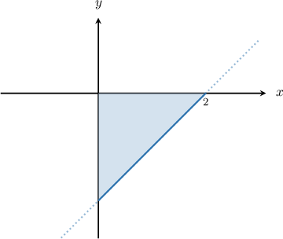

Suppose that we construct a solid with the following properties:

- The above triangle forms the base of the solid.

- The cross-sections are perpendicular to the $x$-axis and are all squares.

The solid is sketched below, with a few of the cross-sections shown. As we can see, the resulting solid looks a bit like a loudspeaker.

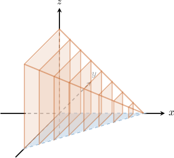

How do we find the volume of this solid?

If we are given the formula $A(x)$ for the area of the region determined by each cross-section, we find the volume as follows:

$$

V = \int_{a}^{b} A(x)\:\textrm{d}x

$$

To work out $A(x),$ let's first consider a cross-section at an arbitrary point $x$, where $x \in \left(0,2\right):$

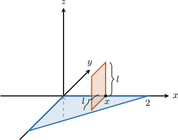

If we project this cross-section onto the $xy$-plane, then we get the following line segment which represents the base of the square:

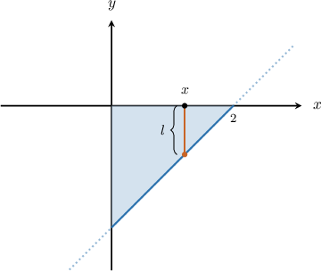

The length $l$ of a side of the square (cross-section) is

$$

\begin{aligned}𝑙 & =|𝑦|=|𝑥−2|.\end{aligned}

$$

So, the area of the cross-section is

$$

\begin{aligned}𝐴(𝑥) & =𝑙^{2} \\ & =|𝑥−2|^{2} \\ & =𝑥^{2}−4𝑥+4.\end{aligned}

$$

Finallly, we calculate the volume $V$, as follows:

$$

\begin{aligned}𝑉 & =∫_{𝑏𝑎}^{}𝐴(𝑥)\,d𝑥 \\ & =∫_{20}^{}(𝑥^{2}−4𝑥+4)d𝑥 \\ & =∫_{20}^{}𝑥^{2}\,d𝑥−4∫_{20}^{}𝑥\,d𝑥+4∫_{20}^{}\,d𝑥 \\ & =\frac{𝑥^{3}}{3}_{20}^{}−4⋅\frac{𝑥^{2}}{2}_{20}^{}+4𝑥_{20}^{} \\ & =(\frac{8}{3}−0)−4(\frac{4}{2}−0)+4(2−0) \\ & =\frac{8}{3}\end{aligned}

$$

Therefore, the volume of the solid is $V = \dfrac{8}{3}$ cubic units.

### Example: Computing the Volume When the Base Is Bounded by a Curve

#### Question

The base of a solid is a semicircle that lies below the $x$-axis and is enclosed by the curve $y=-\sqrt {4-x^2}$ from $x=-2$ to $x=2,$ as shown below. Cross-sections perpendicular to the $x$-axis are squares. Calculate the volume of the solid.

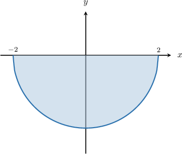

#### Explanation

Consider a cross-section at some point $x$, where $x \in (-2,2)$, and its projection onto the $xy$-plane:

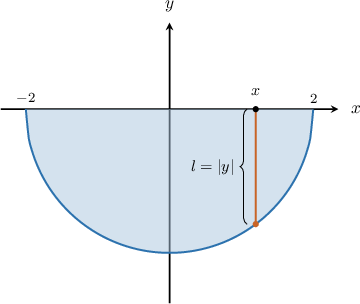

The length $l$ of a side of the square (cross-section) is

$$

\begin{aligned}𝑙=|𝑦|=−\sqrt{√4−𝑥^{2}}=\sqrt{√4−𝑥^{2}}.\end{aligned}

$$

The area of a square is $A = l^2.$ So, the expression for the area of the cross-section is

$$

\begin{aligned}𝐴(𝑥) & =𝑙^{2} \\ & =(\sqrt{√4−𝑥^{2}})^{2} \\ & =4−𝑥^{2}.\end{aligned}

$$

We can now calculate the volume $V$, as follows:

$$

\begin{aligned}𝑉 & =∫_{𝑏𝑎}^{}𝐴(𝑥)\,d𝑥 \\ & =∫_{2−2}^{}(4−𝑥^{2})\,d𝑥 \\ & =2∫_{20}^{}(4−𝑥^{2})d𝑥 \\ & =2(4𝑥−\frac{𝑥^{3}}{3})_{20}^{} \\ & =2([8−\frac{8}{3}]−0) \\ & =\frac{32}{3}\end{aligned}

$$

### Example: Computing the Volume When the Base Is Bounded by Two Curves

#### Question

The base of a solid is the region enclosed by the curves $y=x^2-2$ and $y=2,$ as shown in the picture. If cross-sections perpendicular to the $x$-axis are squares, what integral gives the volume of the solid?

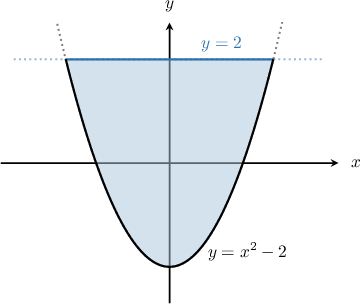

#### Explanation

Let $f(x)=2$ and $g(x)=x^2-2.$

First, we determine the limits of integration. To do that, we find the intersections of the two curves by setting the functions equal to one another and solving for $x.$

$$

\begin{aligned}𝑓(𝑥) & =𝑔(𝑥) \\ 2 & =𝑥^{2}−2 \\ 𝑥^{2}−4 & =0 \\ (𝑥−2)(𝑥+2) & =0.\end{aligned}

$$

Therefore, the solutions are $x=-2$ and $x=2.$

Now, consider a cross-section at some point $x$, where $x \in (-2,2)$, and its projection onto the $xy$-plane:

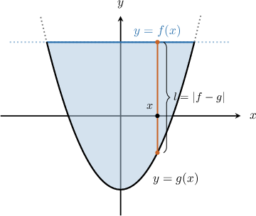

The length $l$ of a side of the square (cross-section) is

$$

\begin{aligned}𝑙 & =|𝑓(𝑥)−𝑔(𝑥)| \\ & =|2−(𝑥^{2}−2)| \\ & =|4−𝑥^{2}|.\end{aligned}

$$

The area of a square is $A = l^2.$ So, the expression for the area of the cross-section is

$$

\begin{aligned}𝐴(𝑥) & =𝑙^{2} \\ & =(4−𝑥^{2})^{2} \\ & =16−8𝑥^{2}+𝑥^{4}.\end{aligned}

$$

Finally, we can calculate the volume $V$ using the following integral:

$$

\begin{aligned}𝑉 & =∫_{𝑏𝑎}^{}𝐴(𝑥)\,d𝑥 \\ & =∫_{2−2}^{}(16−8𝑥^{2}+𝑥^{4})\,d𝑥\end{aligned}

$$

### Cross Sections Perpendicular to the y-Axis

Now suppose that the base of our solid is the quarter-circle enclosed by the curve $x=-\sqrt{1-y^2}$ and the $y$-axis from $y=-1$ to $y=0,$ as shown below.

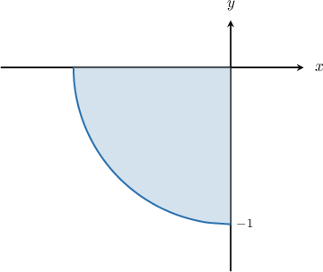

If the cross-sections perpendicular to the *$y$-axis* are squares, how do we find the volume of that solid?

The solid is sketched below, with a few of the cross-sections shown.

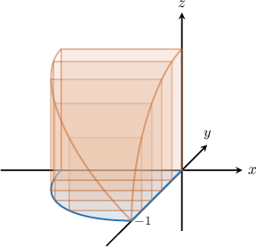

If we are given the formula $A(y)$ for the region determined by each cross-section, then we can find the volume as follows:

$$

V = \int_{c}^{d} A(y)\:\textrm{d}y

$$

To work out $A(y),$ let's consider a cross-section at an arbitrary point $y$, where $y \in (-1,0):$

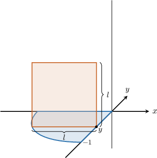

So, if we project this cross-section onto the $xy$-plane, we get the following line segment which represents the base of the square:

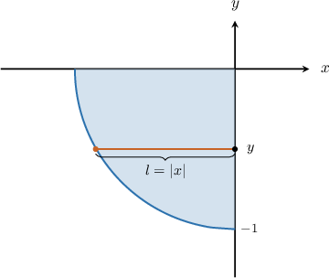

The length $l$ of a side of the square (cross-section) is

$$

\begin{aligned}𝑙 & =|𝑥| \\ & =−\sqrt{√1−𝑦^{2}} \\ & =\sqrt{√1−𝑦^{2}}.\end{aligned}

$$

The area of a square is $A = l^2.$ So, the expression for the area of the cross-section is

$$

\begin{aligned}𝐴(𝑦) & =𝑙^{2} \\ & =(\sqrt{√1−𝑦^{2}})^{2} \\ & =1−𝑦^{2}.\end{aligned}

$$

Finally, we can calculate the volume $V,$ as follows:

$$

\begin{aligned}𝑉 & =∫_{𝑑𝑐}^{}𝐴(𝑦)\,d𝑦 \\ & =∫_{0−1}^{}(1−𝑦^{2})d𝑦 \\ & =∫_{0−1}^{}\,d𝑦−∫_{0−1}^{}𝑦^{2}\,d𝑦 \\ & =𝑦_{0−1}^{}−\frac{𝑦^{3}}{3}_{0−1}^{} \\ & =(0−(−1))−(0−\frac{(−1)^{3}}{3}) \\ & =\frac{2}{3}\end{aligned}

$$

### Example: Computing the Volume When the Cross Sections Are Perpendicular to the y-Axis

#### Question

The base of a solid is the region enclosed by the curve $x=y^2-1$ and the $y$-axis, $-1\le y \le 1$, as shown in the picture. Cross-sections perpendicular to the $y$-axis are squares. Calculate the volume of the solid.

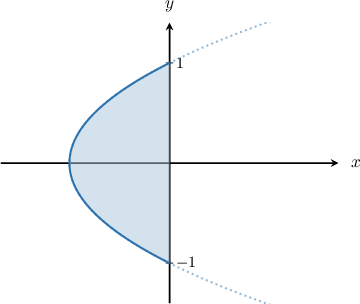

#### Explanation

Consider a cross-section at some point $y$, where $y \in (-1,1)$, and its projection onto the $xy$-plane:

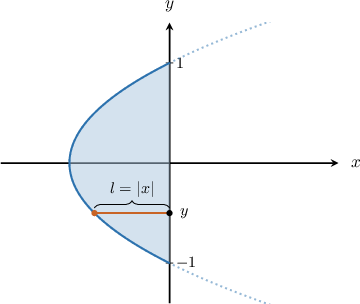

The length $l$ of a side of the square (cross-section) is

$$

\begin{aligned}𝑙 & =|𝑥|=|𝑦^{2}−1|.\end{aligned}

$$

The area of a square is $A = l^2.$ So, the expression for the area of the cross-section is

$$

\begin{aligned}𝐴(𝑦) & =𝑙^{2} \\ & =𝑦^{2}−1^{2} \\ & =(1−2𝑦^{2}+𝑦^{4}).\end{aligned}

$$

Finally, we can calculate the volume $V,$ as follows:

$$

\begin{aligned}𝑉 & =∫_{𝑑𝑐}^{}𝐴(𝑦)\,d𝑦 \\ & =∫_{1−1}^{}(1−2𝑦^{2}+𝑦^{4})d𝑦 \\ & =(𝑦−\frac{2𝑦^{3}}{3}+\frac{𝑦^{5}}{5})_{1−1}^{} \\ & =(1−\frac{2}{3}+\frac{1}{5})−(−1+\frac{2}{3}−\frac{1}{5}) \\ & =\frac{8}{15}−(−\frac{8}{15}) \\ & =\frac{16}{15}\end{aligned}

$$

### Example: Computing the Volume When the Base Is Bounded by Two Curves and Cross Sections are Perpendicular to the y-Axis

#### Question

The base of a solid is the region bounded by the curves $x=(y-1)^2$ and $x=2-(y-1)^2,$ from $y=0$ to $y=2,$ as shown in the picture. If cross-sections perpendicular to the $y$-axis are squares, what integral gives the volume of the solid?

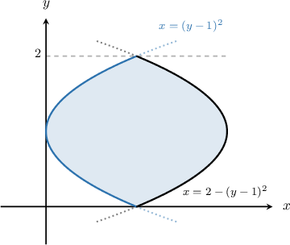

#### Explanation

Let $f(y)=2-(y-1)^2$ and $g(y)=(y-1)^2.$

Consider a cross-section at some point $y$, where $y \in \left(0,2\right)$, and its projection onto the $xy$-plane:

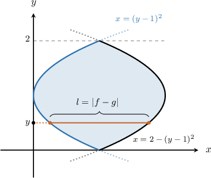

The length $l$ of a side of a square (cross-section) is

$$

\begin{aligned}𝑙 & =|𝑓(𝑥)−𝑔(𝑥)| \\ & =|2−(𝑦−1)^{2}−(𝑦−1)^{2}| \\ & =|2−2(𝑦−1)^{2}| \\ & =2|1−(𝑦−1)^{2}| \\ & =2|𝑦^{2}−2𝑦|.\end{aligned}

$$

The area of a square is $A = l^2.$ So, the expression for the area of the cross-section is

$$

\begin{aligned}𝐴(𝑦) & =𝑙^{2} \\ & =(2|𝑦^{2}−2𝑦|)^{2} \\ & =4(𝑦^{4}−4𝑦^{3}+4𝑦^{2})\end{aligned}

$$

We can now calculate the volume $V$ using the following integral:

$$

\begin{aligned}𝑉 & =∫_{𝑑𝑐}^{}𝐴(𝑦)\,d𝑦 \\ & =∫_{20}^{}4(𝑦^{4}−4𝑦^{3}+4𝑦^{2})d𝑦 \\ & =4∫_{20}^{}(𝑦^{4}−4𝑦^{3}+4𝑦^{2})d𝑦\end{aligned}

$$
