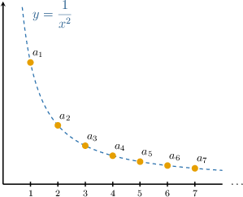
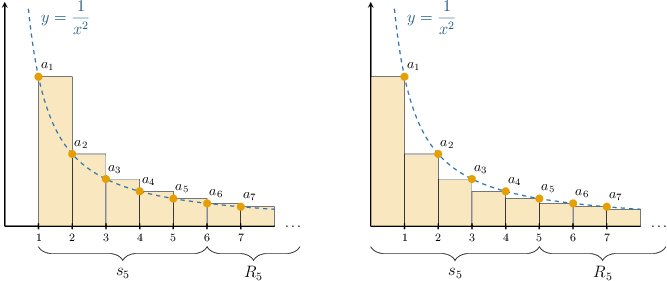
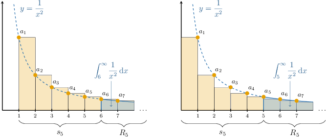

# The Remainder Estimate for the Integral Test

Source: https://www.mathacademy.com/topics/1173?courseId=106
Topic ID: 1173

## Prerequisites

- [The Integral Test](./744-the-integral-test.md)

## Lesson

### Introduction

Suppose we have a convergent series whose sum equals the finite number $S{:}$

$$

\displaystyle{S = \sum_{n=1}^\infty a_n}

$$

Let $s_N$ be the $N$th partial sum of this series. Then, we can write the sum $S$ as

$$

S = s_N + R_N

$$

where $R_N$ is called the **remainder** (or **error**) of $s_N.$

The remainder $R_N$ is simply the difference between the "true" value of the series and its $N$th partial sum:

$$

R_N = S - s_N

$$

Since finding the exact sum of an infinite series is often impossible, we often wish to approximate $S$ by $s_N$ and determine upper and lower bounds for the error $R_N.$

Now, suppose we have a function $f(x)$ such that

$$

a_n = f(n),\qquad n=1,2,3,\ldots.

$$

If $f(x)$ satisfies the conditions for the integral test (i.e., it is positive, continuous, decreasing), then we have the following lower and upper bounds for the remainder:

$$

\underbrace{\int_{N+1}^\infty f(x)\,\textrm d x}_{\textrm{lower bound}} \leq R_N \leq \underbrace{\int_{N}^\infty f(x)\,\textrm d x}_{\textrm{upper bound}}

$$

We call this condition the **remainder estimate for the integral test**.

We'll build some intuition behind the remainder estimate at the end of the lesson. But for now, let's consider a concrete example.

### A Worked Example

Let's consider the following series:

Suppose we approximate by its th partial sum What are the lower and upper bounds of the remainder in this case?

First, notice that the function defined as

is positive, continuous, and decreasing for Therefore, satisfies the conditions for the integral test.

Now, the remainder estimate for the integral test states that

Computing the two improper integrals, we obtain the following bounds on the remainder:

Let's check this result by computing the exact value of the remainder in this case.

It can be shown that rounded to six decimal places.

Moreover, the th partial sum is

Therefore, the true value of the remainder in this case is rounded to three decimal places. So, we see that indeed lies between and

### Example: Using the Remainder Estimate to Determine an Upper Bound

#### Question

Consider the following series:

$$

S = \sum\limits_{n = 1}^\infty \dfrac{1}{5^n}

$$

Suppose that $S$ is approximated by its $4$th partial sum. Use the remainder estimate for the integral test to determine an upper bound of the remainder $R_{4}.$

#### Explanation

For any convergent series

$$

S = \displaystyle \sum_{n=1}^\infty a_n

$$

the remainder (or error) $R_N$ obtained when $S$ is approximated using its $N$th partial sum $s_N$ is defined as

$$

R_N = S - s_N.

$$

If $f(x)$ satisfies the conditions for the integral test, then the remainder is bounded by

$$

\underbrace{\int_{N+1}^\infty f(x)\,\textrm d x}_{\textrm{lower bound}} \leq R_N \leq \underbrace{\int_{N}^\infty f(x)\,\textrm d x}_{\textrm{upper bound}}

$$

where $a_n = f(n)$ for $n = 1, 2, 3, \ldots.$

Notice that $f(x) = \dfrac{1}{5^x}$ is positive, continuous, and decreasing for $x \geq 1.$ Therefore, $f(x)$ satisfies the conditions for the integral test.

We wish to compute an ** bound for the remainder when $S$ is approximated by $s_{4}.$ Therefore, $N = 4,$ and we have

$$

R_{4} \leq \int_{4}^\infty f(x) \,\textrm d x.

$$

Let's now calculate the upper bound:

$$

\begin{aligned}𝑅_{4} & ≤∫_{∞4}^{}\frac{1}{5^{𝑥}}\,d𝑥 \\ & =∫_{∞4}^{}5^{−𝑥}\,d𝑥 \\ & =−\frac{1}{5^{𝑥}ln⁡5}\,_{∞4}^{} \\ & =−\frac{1}{ln⁡5}\underset{𝑏→∞}{lim}⁡[\frac{1}{5^{𝑥}}]_{𝑏4}^{} \\ & =−\frac{1}{ln⁡5}\underset{𝑏→∞}{lim}⁡(\frac{1}{5^{𝑏}}−\frac{1}{5^{4}}) \\ & =−\frac{1}{ln⁡5}(0−\frac{1}{625}) \\ & =−\frac{1}{ln⁡5}(−\frac{1}{625}) \\ & =\frac{1}{625ln⁡5} \\ & ≈0.000\,994\end{aligned}

$$

rounded to six decimal places.

### Example: Using the Remainder Estimate to Determine a Lower Bound

#### Question

Consider the following series:

$$

\sum\limits_{n = 1}^\infty \dfrac{1}{(2n+1)^3}

$$

Suppose that $S$ is approximated by its $8$th partial sum. Use the remainder estimate for the integral test to determine a lower bound of the remainder $R_{8}.$

#### Explanation

For any convergent series

$$

S=\displaystyle \sum_{n=1}^\infty a_n

$$

the remainder (or error) $R_N$ obtained when $S$ is approximated using its $N$th partial sum $s_N$ is defined as

$$

R_N = S - s_N.

$$

If $f(x)$ satisfies the conditions for the integral test, then the remainder is bounded by

$$

\underbrace{\int_{N+1}^\infty f(x)\,\textrm d x}_{\textrm{lower bound}} \leq R_N \leq \underbrace{\int_{N}^\infty f(x)\,\textrm d x}_{\textrm{upper bound}}

$$

where $a_n = f(n)$ for $n =1, 2, 3, \ldots.$

Notice that $f(x) = \dfrac{1}{(2x+1)^3}$ is positive, continuous, and decreasing for $x \geq 1.$ Therefore, $f(x)$ satisfies the conditions for the integral test.

We wish to compute a ** bound for the remainder when $S$ is approximated by $s_{8}.$ Therefore, $N = 8,$ and we have

$$

\int_{8 + 1}^\infty f(x)\,\textrm d x = \int_{9}^\infty f(x)\,\textrm d x \leq R_{8}.

$$

Let's now calculate the lower bound:

$$

\begin{aligned}𝑅_{8} & ≥∫_{∞9}^{}\frac{1}{(2𝑥+1)^{3}}\,d𝑥 \\ & =∫_{∞9}^{}(2𝑥+1)^{−3}\,d𝑥 \\ & =−\frac{1}{4(2𝑥+1)^{2}}\,_{∞9}^{} \\ & =−\frac{1}{4}\underset{𝑏→∞}{lim}⁡[\frac{1}{(2𝑥+1)^{2}}]_{𝑏9}^{} \\ & =−\frac{1}{4}\underset{𝑏→∞}{lim}⁡(\frac{1}{(2𝑏+1)^{2}}−\frac{1}{(2⋅9+1)^{2}}) \\ & =−\frac{1}{4}(0−\frac{1}{361}) \\ & =−\frac{1}{4}(−\frac{1}{361}) \\ & =\frac{1}{1\,444}\end{aligned}

$$

### Bounding the Sum of a Convergent Series

Suppose that a convergent series

$$

S = \sum_{n = 1}^\infty a_n

$$

has the following lower and upper bounds for the remainder $R_N{:}$

$$

L \leq R_N \leq U

$$

Let's add the corresponding partial sum $s_N$ to all sides of this inequality:

$$

s_N + L \leq s_N + R_N \leq s_N + U

$$

Now, since $S = s_N + R_N,$ we obtain the following bounds on the sum $S$ of the series:

$$

s_N + L \leq S \leq s_N + U

$$

For example, we previously determined that the series

$$

S = \sum_{n = 1}^\infty \dfrac{1}{n^2}

$$

has the following lower and upper bounds for the remainder $R_5{:}$

$$

\dfrac{1}{6} \leq R_5 \leq \dfrac{1}{5}

$$

By adding the corresponding partial sum $s_5$, we obtain the following bounds for the sum:

$$

\begin{aligned}𝑠_{5}+\frac{1}{6}≤𝑆≤𝑠_{5}+\frac{1}{5}\end{aligned}

$$

### Example: Bounding a Series

#### Question

Consider the following series:

$$

S = \sum\limits_{n = 1}^\infty \dfrac{1}{e^n}

$$

Suppose that $S$ is approximated by its $11$th partial sum $s_{11}.$ Find the upper bounds on $S$ in terms of $s_{11}$ and the corresponding integral test remainder estimate.

#### Explanation

For any convergent series

$$

S=\displaystyle \sum_{n=1}^\infty a_n

$$

the remainder (or error) $R_N$ obtained when $S$ is approximated using its $N$th partial sum $s_N$ is defined as

$$

R_N = S - s_N.

$$

If $f(x)$ satisfies the conditions for the integral test, then the remainder is bounded by

$$

\underbrace{\int_{N+1}^\infty f(x)\,\textrm d x}_{\textrm{lower bound}} \leq R_N \leq \underbrace{\int_{N}^\infty f(x)\,\textrm d x}_{\textrm{upper bound}}

$$

where $a_n = f(n)$ for $n=1,2,3\ldots.$

Notice that $f(x)= \dfrac{1}{e^x}$ is positive, continuous, and decreasing for $x\geq 1.$ Therefore, $f(x)$ satisfies the conditions for the integral test.

We wish to compute a ** bound for the remainder when $S$ is approximated by $s_{11}.$ Therefore, $N=11,$ and we have

$$

R_{11} \leq \int_{11}^\infty f(x)\,\textrm d x.

$$

Let's now calculate the upper bound:

$$

\begin{aligned}𝑅_{11} & ≤∫_{∞11}^{}\frac{1}{𝑒^{𝑥}}\,d𝑥 \\ & =∫_{∞11}^{}𝑒^{−𝑥}\,d𝑥 \\ & =−\frac{1}{𝑒^{𝑥}}_{∞11}^{} \\ & =−\underset{𝑏→∞}{lim}⁡[\frac{1}{𝑒^{𝑥}}]_{𝑏11}^{} \\ & =−\underset{𝑏→∞}{lim}⁡(\frac{1}{𝑒^{𝑏}}−\frac{1}{𝑒^{11}}) \\ & =−(0−\frac{1}{𝑒^{11}}) \\ & =−(−\frac{1}{𝑒^{11}}) \\ & =\frac{1}{𝑒^{11}}\end{aligned}

$$

Finally, we can form an upper bound for $S$ by adding $s_{11}$ to both sides of our inequality, as follows:

$$

\begin{aligned}𝑅_{11} & ≤\frac{1}{𝑒^{11}} \\ 𝑠_{11}+𝑅_{11} & ≤𝑠_{11}+\frac{1}{𝑒^{11}} \\ 𝑆 & ≤𝑠_{11}+\frac{1}{𝑒^{11}}\end{aligned}

$$

### The Intuition Behind the Bounds for the Remainder Estimate

Earlier, we determined that the remainder $R_5$ for the series

$$

S = \sum_{n = 1}^\infty \dfrac 1 {n^2}

$$

should satisfy the following inequality:

$$

\underbrace{\int_{6}^\infty \dfrac{1}{x^2} \,\textrm d x}_{\textrm{lower bound}} \leq R_5 \leq \underbrace{\int_{5}^\infty \dfrac{1}{x^2} \,\textrm d x}_{\textrm{upper bound}}

$$

To see why this is true, first recall that the function

$$

f(x)=\dfrac{1}{x^2}, \qquad x\geq 1

$$

satisfies the conditions for the integral test.

Let's visualize $f(x)$ and the corresponding terms $a_n = \dfrac{1}{n^2}$ for $n\geq 1$ using a diagram.

We can represent the sum of our series using the areas of vertical bars with a width of $1$ in the following two ways:

Note the following:

- On the left diagram, the *top-left* corner of the $n$th bar coincides with $a_n.$

- On the right diagram, the *top-right* corner of the $n$th bar coincides with $a_n.$

In both cases, the partial sum $s_5$ is represented by the combined area of the first $5$ bars, and the remainder $R_5$ is represented by the combined area of the remaining bars.

Finally, consider the following two diagrams.

Notice that:

- On the left diagram, the bars corresponding to $R_5$ contain the area below the curve for $x\geq 6.$ This means that

- On the right diagram, the area below the curve contains the bars corresponding to $R_5$ for $x\geq 5.$ This means that

Combining these two inequalities, we arrive at

$$

\int_{6}^\infty \dfrac{1}{x^2} \,\textrm d x \leq R_5 \leq \int_{5}^\infty \dfrac{1}{x^2} \,\textrm d x.

$$
