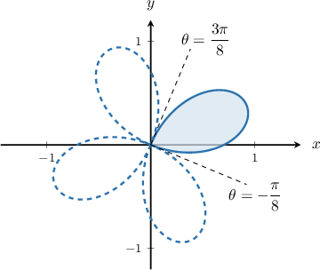
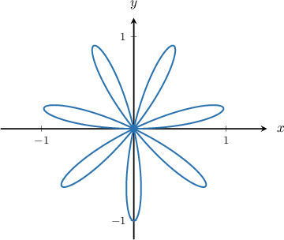
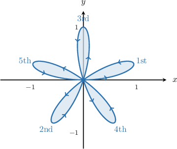
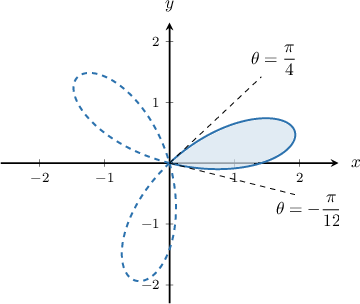

# The Total Area Bounded by a Single Polar Curve

Source: https://www.mathacademy.com/topics/2833?courseId=106
Topic ID: 2833

## Prerequisites

- [Finding the Limits of Integration For a Given Polar Region](./1345-finding-the-limits-of-integration-for-a-given-polar-region.md)

## Lesson

### Introduction

Suppose that the area of one loop of the polar curve $r=\sin(5\theta)$ (shown above) is given by the integral

$$

A = \dfrac{1}{2} \int_{0}^{\pi/5} \sin^2(5\theta) \:\textrm{d}\theta.

$$

How can we find the **total area** bounded by the curve?

One method is to count the number of petals and multiply the area of one petal by the total number of petals. In our case, we have $5$ petals in total, and so the total area bounded by the polar curve is

$$

A_\textrm{total}=5A = \dfrac{5}{2} \int_{0}^{\pi/5} \sin^2(5\theta) \:\textrm{d}\theta.

$$

### Example: Finding an Integral Expression For the Total Area Bounded by a Single Polar Curve

#### Question

The area of one loop of the polar curve $r=\sin\left(2\theta+\dfrac{\pi}{4} \right)$ (shown above) is given by the integral

$$

A = \dfrac{1}{2} \int_{-\pi/8}^{3\pi/8} \sin^2\left(2\theta+\dfrac{\pi}{4}\right) \:\textrm{d}\theta.

$$

Find an integral that represents the total area bounded by the polar curve.

#### Explanation

The given polar curve is the polar rose with $2 \cdot 2=4$ petals, and we know that the area of the first petal is

$$

A = \dfrac{1}{2} \int_{-\pi/8}^{3\pi/8} \sin^2\left(2\theta+\dfrac{\pi}{4}\right) \:\textrm{d}\theta.

$$

Therefore, the total area bounded by the polar curve is

$$

A_{\textrm{total}}=4\cdot A = 2 \int_{-\pi/8}^{3\pi/8} \sin^2\left(2\theta+\dfrac{\pi}{4}\right) \:\textrm{d}\theta.

$$

### Example: Finding the Total Area Bounded by a Single Polar Curve

#### Question

Find the total area bounded by the polar curve $r=\sin(7\theta),$ shown below.

#### Explanation

First, we want to find the interval for $\theta$ that corresponds to the first petal. Since the curve bounding the region crosses itself at the origin, we want to find the values of $\theta$ for which $r=0$, or

$$

\sin(7\theta) = 0.

$$

This gives us two solutions for $7\theta \in [0,2\pi)\mathbin{:}$

$$

7\theta = 0, \pi \qquad \Longrightarrow \qquad \theta=0,\dfrac{\pi}{7}.

$$

As a result, the first petal is traversed for $0 \leq \theta \leq \dfrac{\pi}{7}.$

Since there are $7$ petals, the total area bounded by the polar curve can be calculated as follows:

$$

\begin{aligned}𝐴_{total} & =7⋅𝐴_{petal} \\ & =7⋅\frac{1}{2}∫_{𝜋/70}^{}sin^{2}⁡(7𝜃)\,d𝜃 \\ & =\frac{7}{2}⋅\frac{1}{2}∫_{𝜋/70}^{}(1−cos⁡(14𝜃))d𝜃 \\ & =\frac{7}{4}(𝜃−\frac{1}{14}sin⁡(14𝜃))_{𝜋/70}^{} \\ & =\frac{7}{4}[(\frac{𝜋}{7}−\frac{1}{14}sin⁡(2𝜋))−(0−\frac{1}{14}sin⁡(0))] \\ & =\frac{7}{4}(\frac{𝜋}{7}−0) \\ & =\frac{𝜋}{4}\end{aligned}

$$

### Expressing the Total Area Bounded by a Single Polar Curve By Varying the Limits of Integration

Let's go back to our polar curve $r=\sin(5\theta).$ Recall that the area bounded by one petal is given by

$$

A = \dfrac{1}{2} \int_{0}^{\pi/5} \sin^2(5\theta) \:\textrm{d}\theta.

$$

Can we find an expression for the **total area** bounded by the curve by varying the limits of integration only?

Indeed, we can, and we do this by extending the upper bound of the integral to include all $5$ loops.

Note that:

- The $1$st petal is traversed from $\theta_1=0$ to $\theta_2=\dfrac{\pi}{5},$ and the length of this interval is $\dfrac{\pi}{5}.$

- To find the interval for the second petal, we have to add $\dfrac{\pi}{5}$ to both ends of the interval of the first petal:

- Next, to obtain the interval for the third petal, we add $\dfrac{\pi}{5}$ to both ends of the interval of the second petal:

Continuing this method, we obtain the following intervals for all $5$ petals of our rose:

$$

1

$$

Note that the curve traces the petals out of order. However, all $5$ petals are traced out as $\theta$ ranges from $0$ to $\pi.$

Therefore, we can obtain the total area of the given polar curve if we traverse it from $\theta = 0$ to $\theta = \pi \mathbin{:}$

$$

A_\textrm{total} = \dfrac{1}{2} \int_{0}^{\pi} \sin^2(5\theta) \:\textrm{d}\theta

$$

**Watch out!** It might be tempting to extend the top bound to $2\pi.$ However, the entire curve is traced out on the interval $\theta\in [0,\pi],$ so integrating from $0$ to $2\pi$ would give us *twice* the total area bounded by the curve!

### Example: Expressing the Total Area Bounded by a Single Polar Curve By Varying the Limits of Integration

#### Question

The area of one loop of the polar curve $r=2\cos\left(3\theta-\dfrac{\pi}{4}\right)$ (shown above) is given by the integral

$$

A = 2 \displaystyle \int_{-\pi/12}^{\pi/4} \cos^2\left(3\theta-\dfrac{\pi}{4}\right) \:\textrm{d}\theta.

$$

By changing the limits of integration, find an integral expression representing the total area bounded by the polar curve.

#### Explanation

The given polar curve is the polar rose with $3$ petals, and we know that the area of the first petal is

$$

A = 2 \int_{-\pi/12}^{\pi/4} \cos^2\left(3\theta-\dfrac{\pi}{4}\right) \:\textrm{d}\theta.

$$

The $1$st petal is traversed from $\theta_1=-\dfrac{\pi}{12}$ to $\theta_2=\dfrac{\pi}{4},$ and the length of this interval is

$$

\dfrac{\pi}{4} - \left(-\dfrac{\pi}{12}\right) = \dfrac{\pi}{3}.

$$

To find the interval for the second petal, we have to add $\dfrac{\pi}{3}$ to both ends of the interval of the first petal:

$$

\begin{aligned}𝜃_{3} & =𝜃_{1}+\frac{𝜋}{3}=−\frac{𝜋}{12}+\frac{𝜋}{3}=\frac{𝜋}{4} \\ 𝜃_{4} & =𝜃_{2}+\frac{𝜋}{3}=\frac{𝜋}{4}+\frac{𝜋}{3}=\frac{7𝜋}{12}\end{aligned}

$$

Finally, to obtain the interval for the third petal, we add $\dfrac{\pi}{3}$ to both ends of the interval of the second petal:

$$

\begin{aligned}𝜃_{5} & =𝜃_{3}+\frac{𝜋}{3}=\frac{𝜋}{4}+\frac{𝜋}{3}=\frac{7𝜋}{12} \\ 𝜃_{6} & =𝜃_{4}+\frac{𝜋}{3}=\frac{7𝜋}{12}+\frac{𝜋}{3}=\frac{11𝜋}{12}\end{aligned}

$$

Consequently, we obtain the following intervals for all $3$ petals of our rose:

$$

1

$$

Therefore, the total area of the given polar curve can be obtained if the curve is traversed from $\theta = -\dfrac{\pi}{12}$ to $\theta = \dfrac{11\pi}{12}\mathbin{:}$

$$

A_\textrm{total} = 2 \int_{-\pi/12}^{11\pi/12} \cos^2\left(3\theta-\dfrac{\pi}{4}\right) \:\textrm{d}\theta

$$
