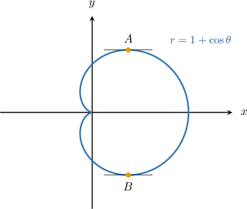
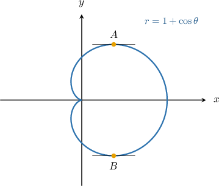
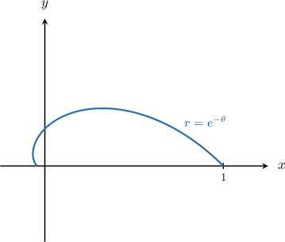
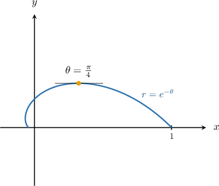
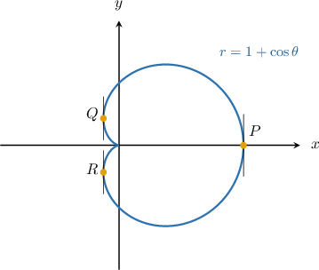
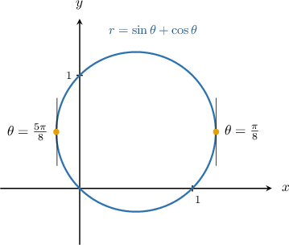

# Horizontal and Vertical Tangents to Polar Curves

Source: https://www.mathacademy.com/topics/3584?courseId=106
Topic ID: 3584

## Prerequisites

- [Using Differentiation to Calculate Critical Points](../ap-calculus-ab/752-using-differentiation-to-calculate-critical-points.md)
- [Solving Trigonometric Equations Using the Sin-Cos-Tan Identity](../integrated-math-iii-honors/947-solving-trigonometric-equations-using-the-sin-cos-tan-identity.md)
- [Differentiating Curves Given in Polar Form](./998-differentiating-curves-given-in-polar-form.md)
- [Solving Trigonometric Equations Using the Zero-Product Property](../integrated-math-iii-honors/1471-solving-trigonometric-equations-using-the-zero-product-property.md)

## Lesson

### Introduction

Suppose we have the polar curve

$$

r=1+\cos\theta, \qquad 0\leq \theta < 2\pi,

$$

whose graph is shown below:

This polar curve has **horizontal tangents** at the points $A$ and $B,$ shown above. Our goal is to compute the value of $\theta$ at each point.

At the horizontal tangents, we must have

$$

\dfrac{\textrm d y}{\textrm d x} = 0.

$$

Now, recall that the slope of the tangent line to a polar curve is given by

$$

\dfrac{\textrm d y}{\textrm d x} = \dfrac{y'(\theta)}{x'(\theta)}.

$$

Therefore, at the points $A$ and $B,$ we must have

$$

\dfrac{y'(\theta)}{x'(\theta)} = 0.

$$

For this equation to be satisfied for some value of $\theta,$ we require that the *numerator* is zero while the *denominator* is nonzero. Therefore, we must find the points where

$$

y'(\theta) = 0\qquad \textrm{and} \qquad x'(\theta) \neq 0.

$$

It's essential to check that $y'(\theta)$ and $x'(\theta)$ are zero and nonzero, respectively. If they are *both* zero, then this leads to

$$

\dfrac{y'(\theta)}{x'(\theta)} = \dfrac{0}{0},

$$

which is undefined. Points where $y'(\theta)$ and $x'(\theta)$ are both zero require further investigation.

Let's now compute the values of $\theta$ at the points $A$ and $B.$

### Finding Horizontal Tangents to Polar Curves

To find the horizontal tangents, we proceed as follows:

**Step 1**: Compute the derivatives $y'(\theta)$ and $x'(\theta).$

Doing this using the usual methods, we get

$$

x'(\theta)=-\sin\theta(2\cos\theta+1), \qquad y'(\theta)=2\cos^2\theta +\cos\theta - 1.

$$

**Step 2**: Find the values of $\theta$ where $y'(\theta)=0.$

Writing down the equation $y'(\theta) = 0$ and factoring, we get

$$

\begin{aligned}2cos^{2}⁡𝜃+cos⁡𝜃−1 & =0 \\ (2cos⁡𝜃−1)(cos⁡𝜃+1) & =0.\end{aligned}

$$

Therefore, by the zero-product property, we have to solve two equations:

$$

2\cos\theta-1 = 0, \qquad \cos\theta + 1= 0

$$

Let's solve each equation separately.

- First, we solve the equation The solutions to this equation are

- Then, we solve the equation The solution to this equation is

Therefore, we have three candidate solutions:

$$

\theta_1 = \dfrac{\pi}{3}, \qquad \theta_2 = \pi, \qquad \theta_3 = \dfrac{5\pi}{3}

$$

**Step 3**: Check to see whether any candidates have $x'(\theta) = 0.$

We substitute our candidate solutions into the expression for $x'(\theta).$ If $x'(\theta) = 0,$ further investigation is necessary.

- Substituting $\theta_1 = \dfrac{\pi}{3},$ we get Therefore, $\theta_1 = \dfrac{\pi}{3}$ is a valid solution.

- Substituting $\theta_2 = \pi,$ we get Therefore, we draw *no conclusion* regarding $\theta_2 = \pi.$

- Substituting $\theta_1 = \dfrac{5\pi}{3},$ we get Therefore, $\theta_1 = \dfrac{5\pi}{3}$ is a valid solution.

We now make the following conclusions:

- We have horizontal tangents where $\theta = \dfrac{\pi}{3}$ and $\theta = \dfrac{5\pi}{3}.$ These correspond to the points $A$ and $B,$ respectively.

- This analysis gave no conclusion regarding the point where $\theta = \pi.$ We'll learn to deal with points like this in future lessons.

For the remainder of this lesson, we will not concern ourselves with the case where $y'(\theta)$ and $x'(\theta)$ are both zero. However, it's worth carrying out step 3 regardless when solving these problems, as this will help develop good habits that will come in handy later.

### Example: Finding Points Where the Tangent Is Horizontal

#### Question

Compute the value of $\theta \in [0,\pi]$ for which the polar curve $r=e^{-\theta}$ (shown above) has a horizontal tangent, given that

$$

x'(\theta)=-e^{-\theta}(\cos\theta+\sin\theta), \qquad y'(\theta)=e^{-\theta}(-\sin\theta+\cos\theta).

$$

#### Explanation

We have a horizontal tangent when

$$

\dfrac{\textrm d y}{\textrm d x} = \dfrac{y'(\theta)}{x'(\theta)} = 0

$$

which is equivalent to

$$

y'(\theta) = 0 \qquad \textrm{and}\qquad x'(\theta) \neq 0.

$$

To find the horizontal tangents, we proceed as follows:

****: Compute the derivatives $y'(\theta)$ and $x'(\theta).$

We're given that

$$

x'(\theta)=-e^{-\theta}(\cos\theta+\sin\theta), \qquad y'(\theta)=e^{-\theta}(-\sin\theta+\cos\theta).

$$

****: Find the values of $\theta$ where $y'(\theta)=0.$

By writing down and solving the equation, we get

$$

\begin{aligned}𝑒^{−𝜃}(−sin⁡𝜃+cos⁡𝜃) & =0 \\ −sin⁡𝜃+cos⁡𝜃 & =0 \\ sin⁡𝜃 & =cos⁡𝜃 \\ tan⁡𝜃 & =1 \\ 𝜃 & =\frac{𝜋}{4}+𝜋𝑛\end{aligned}

$$

where $n$ is any integer. However, among the solutions above, only one belongs to the required domain, namely

$$

\theta_1 = \dfrac{\pi}{4}.

$$

****: Check to see whether any candidates have $x'(\theta) = 0.$

We substitute our candidate solutions into $x'(\theta)$ and check that $x'(\theta) \neq 0.$ If $x'(\theta) = 0,$ further investigation is necessary.

- Substituting $\theta_1 = \dfrac{\pi}{4},$ we get Therefore, $\theta_1 = \dfrac{\pi}{4}$ is a valid solution.

Therefore, our curve has a horizontal tangent at $\theta = \dfrac{\pi}{4}.$

### Vertical Tangents to Polar Curves

Let's revisit the following polar curve:

$$

r=1+\cos\theta, \qquad 0\leq \theta < 2\pi

$$

This polar curve has **vertical tangents** at the points $P, Q,$ and $R,$ shown above. We wish to compute the values of $\theta$ at these points.

The slope of the tangent line to a polar curve is given by

$$

\dfrac{\textrm d y}{\textrm d x} = \dfrac{y'(\theta)}{x'(\theta)}.

$$

The derivative becomes infinitely large as we approach the points $P, Q,$ and $R,$ which means that the *denominator* must approach zero while the *numerator* remains finite.

Therefore, to find the values of $\theta$ at these points, we must find the points where

$$

x'(\theta) = 0\qquad \textrm{and} \qquad y'(\theta) \neq 0.

$$

It's important to check that $x'(\theta)$ and $y'(\theta)$ are zero and nonzero, respectively. If they are *both* zero, then this leads to

$$

\dfrac{y'(\theta)}{x'(\theta)} = \dfrac{0}{0},

$$

which is undefined. Points where $y'(\theta)$ and $x'(\theta)$ are both zero require further investigation.

Let's now compute the values of $\theta$ at these points.

### Finding Vertical Tangents to Polar Curves

To find the vertical tangents, we proceed as follows:

**Step 1**: Compute the derivatives $y'(\theta)$ and $x'(\theta).$

Doing this using the usual methods, we get

$$

x'(\theta)=-\sin\theta(2\cos\theta+1), \qquad y'(\theta)=2\cos^2\theta +\cos\theta - 1.

$$

**Step 2**: Find the values of $\theta$ where $x'(\theta)=0{:}$

Writing down the equation $x'(\theta) = 0,$ we get

$$

\begin{aligned}−sin⁡𝜃(2cos⁡𝜃+1) & =0\end{aligned}

$$

Therefore, by the zero-product property, we have to solve two equations:

$$

\sin\theta = 0, \qquad 2\cos\theta+1= 0

$$

Let's solve each equation separately.

- First, we solve the equation The solutions to this equation are

- Then, we solve the equation The solutions to this equation are

Therefore, we have four candidate solutions:

$$

\theta_1 =0, \qquad \theta_2 = \dfrac{2\pi}{3}, \qquad \theta_3 = \pi, \qquad \theta_2 = \dfrac{4\pi}{3}.

$$

**Step 3**: Check to see whether any candidates have $y'(\theta) = 0.$

We substitute our candidate solutions into $y'(\theta)$ and check that $y'(\theta) \neq 0.$ If $y'(\theta) = 0,$ further investigation is necessary.

- Substituting $\theta_1 = 0,$ we get Therefore, $\theta_1 = 0$ is a valid solution.

- Substituting $\theta_2 = \dfrac{2\pi}{3},$ we get Therefore, $\theta_2 = \dfrac{2\pi}{3}$ is a valid solution.

- Substituting $\theta_3 = \pi,$ we get Therefore, we draw *no conclusion* regarding $\theta_3 = \pi.$

- Substituting $\theta_4 = \dfrac{4\pi}{3},$ we get Therefore, $\theta_4 = \dfrac{4\pi}{3}$ is a valid solution.

We now make the following conclusions:

- We have vertical tangents where $\theta = 0, \dfrac{2\pi}{3},\dfrac{4\pi}{3}.$ These correspond to the points $P, Q,$ and $R,$ respectively.

- Again, this analysis gave no conclusion regarding the point where $\theta = \pi.$ We'll learn to deal with points like this in future lessons.

### Example: Finding Points Where the Tangent Is Vertical

#### Question

Compute the values of $\theta \in [0,\pi]$ for which the polar curve $r=\sin\theta+\cos\theta$ has vertical tangents, given that

$$

x'(\theta) = \cos(2\theta)-\sin(2\theta), \qquad y'(\theta) = \cos(2\theta)+\sin(2\theta).

$$

#### Explanation

We have a vertical tangent when

$$

\dfrac{\textrm d y}{\textrm d x} = \dfrac{y'(\theta)}{x'(\theta)}

$$

is infinite. This means that

$$

x'(\theta) = 0 \qquad \textrm{and}\qquad y'(\theta) \neq 0.

$$

To find the vertical tangents, we proceed as follows:

****: Compute the derivatives $y'(\theta)$ and $x'(\theta).$

We're given that

$$

x'(\theta) = \cos(2\theta)-\sin(2\theta), \qquad y'(\theta) = \cos(2\theta)+\sin(2\theta).

$$

****: Find the values of $\theta$ where $x'(\theta)=0.$

By writing down and solving the equation, we get

$$

\begin{aligned}cos⁡(2𝜃)−sin⁡(2𝜃) & =0 \\ sin⁡(2𝜃) & =cos⁡(2𝜃) \\ tan⁡(2𝜃) & =1 \\ 2𝜃 & =\frac{𝜋}{4}+𝑛𝜋 \\ 𝜃 & =\frac{𝜋}{8}+\frac{𝑛𝜋}{2}\end{aligned}

$$

where $n$ is any integer. However, among the solutions above, only two belong to the required domain, namely

$$

\theta_1 = \dfrac{\pi}{8},\qquad \theta_2 = \dfrac{5\pi}{8} .

$$

****: Check to see whether any candidates have $y'(\theta) = 0.$

We substitute our candidate solutions into $y'(\theta)$ and check that $y'(\theta) \neq 0.$ If $y'(\theta) = 0,$ further investigation is necessary.

- Substituting $\theta_1 =\dfrac{\pi}{8},$ we get Therefore, $\theta_1 =\dfrac{\pi}{8}$ is a valid solution.

- Substituting $\theta_2 =\dfrac{5\pi}{8},$ we get Therefore, $\theta_2 = \dfrac{5\pi}{8}$ is also a valid solution.

Therefore, our curve has vertical tangents at $\theta = \dfrac{\pi}{8}, \dfrac{5\pi}{8}.$

