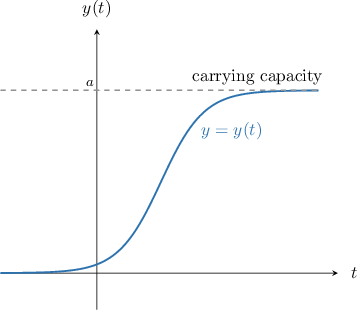

# Solving the Logistic Growth Equation

Source: https://www.mathacademy.com/topics/3674?courseId=106
Topic ID: 3674

## Prerequisites

- [Logistic Growth Models With First-Order ODEs](./1163-logistic-growth-models-with-first-order-odes.md)

## Lesson

### Introduction

Recall that a differential equation of the form

$$

\dfrac{\mathrm dy}{\mathrm dt} = ky(a-y)

$$

is called a logistic growth equation. The positive constant $a > 0$ is the carrying capacity, and $k > 0$ is a constant of proportionality.

A typical solution curve $y = y(t)$ to this equation is shown below.

It can be shown that the general solution to this equation is given by

$$

y(t) = \frac{a}{1+C e^{-ak t}}

$$

where $C$ is an integration constant.

Note the following properties of this general solution:

- Since $a$ and $k$ are both positive, $e^{-akt}\to0$ as $t\to\infty.$ Therefore, $y(t)\to a$ as $t\to\infty.$ In other words, $y(t)$ approaches the carrying capacity as $t$ increases. This agrees with the behavior shown in our diagram.

- Since $e^{-akt}\to\infty$ as $t\to-\infty,$ we have that $y(t)\to 0$ as $t\to-\infty.$ This also agrees with our diagram.

We can use the general solution of the logistic growth equation to make predictions about a population governed by logistic growth. Let's see how.

### Example: Solving a Logistic Growth Initial Value Problem

#### Question

The rate of growth of the panda population $P(t)$ in a particular forest follows the logistic growth model is

$$

\dfrac{\mathrm{d} P}{\mathrm{d} t} = 0.001\,25 P(800-P),

$$

where $t$ is the time, in years, since the beginning of the observations. Find an expression for the panda population after $t$ years, given that there were $400$ pandas initially.

#### Explanation

A logistic growth equation has the form

$$

\dfrac{\mathrm{d} P}{\mathrm{d} t} = kP(a-P),

$$

where $k > 0$ is a constant of proportionality, and $a > P$ is the carrying capacity.

The general solution to the logistic growth equation is

$$

P(t) = \dfrac{a}{1+Ce^{-akt}}.

$$

In this case, the constant of proportionality is $k=0.001\,25,$ and the carrying capacity is $a=800.$

Therefore, the general solution to our equation is

$$

P(t) = \dfrac{800}{1+Ce^{-(800\cdot 0.001\,25)t}}= \dfrac{800}{1+Ce^{-t}}.

$$

We now substitute the initial condition $P(0)=400$ and solve for $C.$ We get

$$

\begin{aligned}\frac{800}{1+𝐶𝑒^{−0}} & =400 \\ \frac{800}{1+𝐶} & =400 \\ \frac{1+𝐶}{800} & =\frac{1}{400} \\ 1+𝐶 & =\frac{800}{400} \\ 𝐶 & =2−1 \\ 𝐶 & =1.\end{aligned}

$$

Therefore, the panda population is given by

$$

P(t)= \dfrac{800}{1+e^{-t}} .

$$

### Example: Using the Particular Solution of a Logistic Growth Initial Value Problem to Make Predictions

#### Question

The growth rate of the hare population $P(t)$ in a particular forest is jointly proportional to the hare population at time $t,$ measured in years, and the difference between the forest's carrying capacity and the hare population. The constant of proportionality is $0.000\,01$ and the carrying capacity is $10\,000.$ How many hares will there be in the forest after $7$ years given that there were $2\,500$ hares initially? Round your answer to the nearest integer.

#### Explanation

Since the hare population's growth rate is ** proportional to the hare population at time $t$ and the difference between the carrying capacity and the hare population, the hare population follows a logistic growth model.

A logistic growth equation has the form

$$

\dfrac{\mathrm{d} P}{\mathrm{d} t} = kP(a-P),

$$

where $k > 0$ is a constant of proportionality, and $a > P$ is the carrying capacity.

The general solution to the logistic growth equation is

$$

P(t) = \dfrac{a}{1+Ce^{-akt}}.

$$

In this case, the constant of proportionality $k=0.000\,01,$ and the carrying capacity is $a=10\,000.$ Therefore, the hare population is given by the equation

$$

\frac{\mathrm{d} P}{\mathrm{d} t} = 0.000\,01 P(10\,000-P) .

$$

The general solution to this equation is

$$

P(t) = \dfrac{10\,000}{1+Ce^{-(10\,000\cdot 0.000\,01)t}}= \dfrac{10\,000}{1+Ce^{-0.1t}}.

$$

We now substitute the initial condition $P(0)=2\,500$ and solve for $C.$ We get

$$

\begin{aligned}𝑃(0) & =2\,500 \\ \frac{10\,000}{1+𝐶𝑒^{−0.1(0)}} & =2\,500 \\ \frac{10\,000}{1+𝐶} & =2\,500 \\ \frac{1+𝐶}{10\,000} & =\frac{1}{2\,500} \\ 1+𝐶 & =\frac{10\,000}{2\,500} \\ 1+𝐶 & =4 \\ 𝐶 & =3.\end{aligned}

$$

So, we have

$$

P(t) = \frac{10\,000}{1+3 e^{-0.1 t}}.

$$

Finally, to find the number of hares in the forest after $7$ years, we substitute $t=7$ into the expression for $P(t),$ and we get

$$

\begin{aligned}𝑃(7) & =\frac{10\,000}{1+3𝑒^{−0.1⋅7}} \\ & ≈4\,016.\end{aligned}

$$

### Deriving the General Solution

The general solution to the logistic growth equation

$$

\dfrac{\mathrm{d} y}{\mathrm{d} t} = ky(a-y)

$$

is given by

$$

y(t) = \dfrac{a}{1+Ce^{-akt}}

$$

where $C>0$ is an integration constant. Let's now derive this formula.

Our differential equation is separable, so we start by separating variables and then integrating with respect to $t\mathbin{:}$

$$

\begin{aligned}\frac{d𝑦}{d𝑡} & =𝑘𝑦(𝑎−𝑦) \\ \frac{1}{𝑦(𝑎−𝑦)}\frac{d𝑦}{d𝑡} & =𝑘 \\ ∫\frac{1}{𝑦(𝑎−𝑦)}\frac{d𝑦}{d𝑡}\,d𝑡 & =∫𝑘\,d𝑡 \\ ∫\frac{1}{𝑦(𝑎−𝑦)}\,d𝑦 & =∫𝑘\,d𝑡\end{aligned}

$$

Now, using the fact that

$$

\dfrac{ 1}{y(a-y)} = \dfrac{1}{a}\left(\dfrac{1}{y} + \dfrac{1}{a-y}\right),

$$

we can rewrite the integrand on the left-hand side and complete the integration, as follows:

$$

\begin{aligned}∫\frac{1}{𝑦(𝑎−𝑦)}\,d𝑦 & =∫𝑘\,d𝑡 \\ \frac{1}{𝑎}∫(\frac{1}{𝑦}+\frac{1}{𝑎−𝑦})\,d𝑦 & =∫𝑘\,d𝑡 \\ ∫(\frac{1}{𝑦}−\frac{1}{𝑦−𝑎})\,d𝑦 & =𝑎𝑘∫\,d𝑡 \\ −∫(\frac{1}{𝑦−𝑎}−\frac{1}{𝑦})\,d𝑦 & =𝑎𝑘∫\,d𝑡 \\ ∫(\frac{1}{𝑦−𝑎}−\frac{1}{𝑦})\,d𝑦 & =−𝑎𝑘∫\,d𝑡 \\ ln⁡|𝑦−𝑎|−ln⁡|𝑦| & =−𝑎𝑘𝑡+𝐶_{1} \\ ln⁡\frac{𝑦−𝑎}{𝑦} & =−𝑎𝑘𝑡+𝐶_{1} \\ \frac{𝑦−𝑎}{𝑦} & =𝑒^{−𝑎𝑘𝑡+𝐶_{1}} \\ \frac{𝑦−𝑎}{𝑦} & =𝑒^{𝐶_{1}}𝑒^{−𝑎𝑘𝑡} \\ \frac{𝑦−𝑎}{𝑦} & =±𝑒^{𝐶_{1}}𝑒^{−𝑎𝑘𝑡} \\ \frac{𝑦−𝑎}{𝑦} & =±𝐶𝑒^{−𝑎𝑘𝑡}\end{aligned}

$$

where $C=e^{C_1}$ is a positive constant.

In our modeling, we have assumed that $0 < y < a.$ Therefore, the left-hand side of the equation must be negative since the numerator is negative and the denominator is positive. Therefore, we discard the positive option, and we have

$$

\dfrac{y-a}{y} = -C e^{-akt}.

$$

Solving this equation for $y,$ we get

$$

\begin{aligned}\frac{𝑦−𝑎}{𝑦} & =−𝐶𝑒^{−𝑎𝑘𝑡} \\ 𝑦−𝑎 & =−𝐶𝑦𝑒^{−𝑎𝑘𝑡} \\ 𝑦+𝑦⋅𝐶𝑒^{−𝑎𝑘𝑡} & =𝑎 \\ 𝑦(1+𝐶𝑒^{−𝑎𝑘𝑡}) & =𝑎 \\ 𝑦 & =\frac{𝑎}{1+𝐶𝑒^{−𝑎𝑘𝑡}}\,\,\,.\end{aligned}

$$
