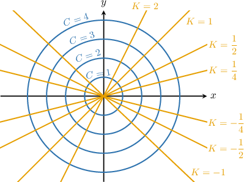
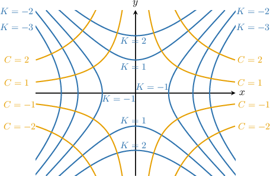

# Orthogonal Trajectories

Source: https://www.mathacademy.com/topics/1824?courseId=61
Topic ID: 1824

## Prerequisites

- [Solving First-Order ODEs Using Separation of Variables](./466-solving-first-order-odes-using-separation-of-variables.md)
- [Equations of Ellipses Centered at the Origin](../integrated-math-iii-honors/848-equations-of-ellipses-centered-at-the-origin.md)
- [Equations of Hyperbolas Centered at the Origin](../integrated-math-iii-honors/871-equations-of-hyperbolas-centered-at-the-origin.md)
- [Left and Right Opening Parabolas](../algebra-ii/1124-left-and-right-opening-parabolas.md)
- [Further Modeling With First-Order ODEs](./3860-further-modeling-with-first-order-odes.md)

## Lesson

### Introduction

Recall that a *one-parameter family* of curves in the $xy$-plane is defined by

$$

F(x,y,C) = 0,

$$

where $C$ denotes the parameter.

The **orthogonal trajectories** of a one-parameter family of curves form another one-parameter family of curves such that every curve in one family intersects at right angles every curve in the other.

For example, circles $x^2+y^2=C^2$ (with parameter $C$) and lines through the origin $y=Kx$ (with parameter $K$) are orthogonal trajectories.

Now, let $F(x,y,C) = 0$ be a family of curves with parameter $C.$ Suppose we can

- implicitly differentiate it with respect to $x,$ and

- eliminate $C$ using the derived and defining equations,

to get an equation in terms of $x,$ $y,$ and $\dfrac{\mathrm{d}y}{\mathrm{d}x}.$ Next, assume we can solve for the derivative and obtain a differential equation of the form

$$

\dfrac{\mathrm{d}y}{\mathrm{d}x} = f(x,y)

$$

that explicitly gives the slopes of the curves satisfying this ODE (at least locally, where the slope is defined).

For a curve to intersect at right angles with every curve in the family, its slope must be the negative reciprocal of the slope of curves in the family. So, the orthogonal trajectories of the family of curves must be the solutions of

$$

\dfrac{\mathrm{d}y}{\mathrm{d}x} = -\dfrac{1}{f(x,y)}.

$$

**Watch out!** This is true only where $f(x,y)\neq 0.$ If $f=0$, then original curves have slope $0$ (horizontal tangent), and orthogonal curves should have infinite slope (vertical tangent).

### A Worked Example

Suppose we want to determine the differential equation satisfied by the orthogonal trajectories of the family of curves $xy^3 = C^2,$ where $C\neq0$ is a parameter.

Orthogonal trajectories are families of curves that intersect another given family of curves at right angles. In other words, the tangent lines of curves from each family are perpendicular at every intersection point.

Let's determine the slope of the family of curves given by $xy^3 = C^2.$ First, we implicitly differentiate with respect to $x$ and solve for the derivative of $y{:}$

$$

\begin{aligned}\frac{d}{d𝑥}\,(𝑥𝑦^{3}) & =\frac{d}{d𝑥}\,(𝐶^{2}) \\ 𝑦^{3}+3𝑥𝑦^{2}𝑦^{′} & =0 \\ 3𝑥𝑦^{2}𝑦^{′} & =−𝑦^{3} \\ 𝑦^{′} & =−\frac{𝑦}{3𝑥}\end{aligned}

$$

Note that the parameter $C$ has already been eliminated.

For a curve to intersect this family orthogonally, its slope $y'_\perp$ must be the negative reciprocal of the slope $y'$ above. Hence,

$$

y'_\perp = -\dfrac{1}{y'} = -\dfrac{1}{\left(-\dfrac{y}{3x}\right)} = \dfrac{3x}{y}.

$$

Therefore, the orthogonal trajectories must satisfy

$$

\boxed{\dfrac{\mathrm{d}y}{\mathrm{d}x}= \dfrac{3x}{y}}.

$$

**Note**: Since $C \neq 0,$ the given family has $x\neq0$ and $y\neq0,$ so both $y'$ and $y'_\perp$ are well-defined.

### Example: Constructing the ODE Solved by the Orthogonal Trajectories of a One-Parameter Family

#### Question

Determine the differential equation satisfied by the orthogonal trajectories of the family of curves $y^2 = 9C^2\tan(x),$ where $C\neq0$ is a parameter, in terms of $x$ and $y$ only.

#### Explanation

Orthogonal trajectories are families of curves that intersect another given family of curves at right angles. In other words, the tangent lines of curves from each family are perpendicular at every intersection point.

Let's determine the slope of the family of curves given by $y^2 = 9C^2\tan(x).$ First, we implicitly differentiate with respect to $x$ and solve for the derivative of $y{:}$

$$

\begin{aligned}\frac{d}{d𝑥}(𝑦^{2}) & =\frac{d}{d𝑥}\,(9𝐶^{2}tan⁡(𝑥)) \\ 2𝑦𝑦^{′} & =9𝐶^{2}sec^{2}⁡(𝑥) \\ 𝑦^{′} & =\frac{9𝐶^{2}sec^{2}⁡(𝑥)}{2𝑦}\end{aligned}

$$

Now, we must eliminate $C.$ From the original family of curves equation, we have

$$

y^2 = 9C^2\tan(x) \quad\Longrightarrow\quad C^2 = \dfrac{y^2}{9\tan(x)}.

$$

Substituting this into our slope equation, we get

$$

y' = \dfrac{9\left(\dfrac{y^2}{9\tan(x)}\right)\sec^2(x)}{2y} = \dfrac{y\sec^2(x)}{2\tan(x)}.

$$

For a curve to intersect this family orthogonally, its slope $y'_\perp$ must be the negative reciprocal of the slope $y'$ above. Hence,

$$

y'_\perp = -\dfrac{1}{y'} = -\dfrac{1}{\left(\dfrac{y\sec^2(x)}{2\tan(x)}\right)} = -\dfrac{2\tan(x)}{y\sec^2(x)}.

$$

Therefore, the orthogonal trajectories must satisfy

$$

\dfrac{\mathrm{d}y}{\mathrm{d}x}= -\dfrac{2\tan(x)}{y\sec^2(x)}.

$$

****: Since we divide by $y$ when forming the orthogonal slope, the orthogonal-trajectory ODE is only valid where $y\neq 0$ (and where $\tan(x)$ is defined). In particular, the original family forces $y=0$ whenever $\tan(x)=0$.

### Example: Finding the Orthogonal Trajectories of a One-Parameter Family

#### Question

Find the orthogonal trajectories of the family of curves $y = \dfrac{C}{x^2},$ where $C\neq0$ is a parameter.

#### Explanation

Orthogonal trajectories are families of curves that intersect another given family of curves at right angles. In other words, the tangent lines of curves from each family are perpendicular at every intersection point.

Let's determine the slope of the family of curves given by $y = \dfrac{C}{x^2}.$ First, we implicitly differentiate with respect to $x$ and solve for the derivative of $y{:}$

$$

\begin{aligned}\frac{d}{d𝑥}(𝑦) & =\frac{d}{d𝑥}\,(\frac{𝐶}{𝑥^{2}}) \\ 𝑦^{′} & =−\frac{2𝐶}{𝑥^{3}}\end{aligned}

$$

Now, we must eliminate $C.$ From the original family of curves equation, we have

$$

y = \dfrac{C}{x^2} \quad\Longrightarrow\quad C = x^2y.

$$

Substituting this into our slope equation, we get

$$

y' = -\dfrac{2C}{x^3} = -\dfrac{2x^2y}{x^3} = -\dfrac{2y}{x}.

$$

For a curve to intersect this family orthogonally, its slope $y'_\perp$ must be the negative reciprocal of the slope $y'$ above. Hence,

$$

y'_\perp = -\dfrac{1}{y'} = -\dfrac{1}{\left(-\dfrac{2y}{x}\right)} = \dfrac{x}{2y}.

$$

Hence, the orthogonal trajectories must satisfy

$$

\dfrac{\mathrm{d}y}{\mathrm{d}x}= \dfrac{x}{2y}.

$$

To find the general solution, we separate the variables and integrate both sides with respect to $x{:}$

$$

\begin{aligned}2𝑦⋅\frac{d𝑦}{d𝑥} & =𝑥 \\ ∫2𝑦⋅\frac{d𝑦}{d𝑥}\,d𝑥 & =∫𝑥\,d𝑥 \\ ∫2𝑦\,d𝑦 & =∫𝑥\,d𝑥 \\ 𝑦^{2} & =\frac{𝑥^{2}}{2}+𝐾 \\ 2𝑦^{2}−𝑥^{2} & =𝐾\end{aligned}

$$

Note that $K$ is a constant of integration.

Therefore, the orthogonal trajectories of the family of curves $y = \dfrac{C}{x^2},$ where $C$ is a parameter, are given by

$$

2y^2 - x^2 = K,

$$

where $K$ is a parameter. Some curves from each family for specific parameter values are given in the diagram below.

****: Since $C\neq0,$ we have $y\neq0$ on every curve in the family, so slopes $y'$ and $'_\perp$ are well-defined.
