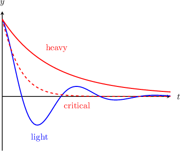

# Damped Oscillators

Source: https://www.mathacademy.com/topics/2525?courseId=61
Topic ID: 2525

## Prerequisites

- [Second-Order Homogeneous ODEs: Characteristic Equations With Repeated Roots](./879-second-order-homogeneous-odes-characteristic-equations-with-repeated-roots.md)
- [Simple Harmonic Oscillators](./2524-simple-harmonic-oscillators.md)

## Lesson

### Introduction

**Damped harmonic motion** is a form of harmonic motion where there is an additional damping force proportional to the object's velocity, $y',$ and acts in the opposite direction to that of the motion. This damping force acts to decrease the object's amplitude over time.

If the **damping coefficient** is $b,$ then the equation of damped harmonic motion is

$$

y'' = - by' - \omega^2 y \quad \Longrightarrow \quad y'' + by' + \omega^2 y = 0.

$$

Concretely, if you take a simple harmonic oscillator and place it in a viscous fluid (e.g., air), the result will be a damped harmonic oscillator.

### Example: Identifying Equations that Represent Damped Harmonic Motion

#### Question

The function $y(t)$ gives the position of a particle at time $t.$ Which of the following equations represents a situation in which the particle is undergoing damped harmonic motion?

1. $y''+4y' - y = 0$

2. $y''+ 4 = 0$

3. $y''+y'+4y = 0$

#### Explanation

The equation of damped harmonic motion is

$$

y'' + b y' + \omega^2 y = 0.

$$

With that in mind, let's inspect each equation.

- Equation I does not take the form It would require $\omega^2=-1,$ which is not possible for any real number $\omega$ since $\omega^2 \geq 0.$

- Equation II does not take the form because it has a constant term, $4.$

- Equation III takes the form with and $b = 1.$ Therefore, equation III represents damped harmonic motion.

Therefore, the correct answer is "III only."

### Light, Critical, and Heavy Damping

There are three types of damped harmonic motion:

- **Heavy damping** occurs when the damping force is so large that the object returns to the equilibrium position very slowly, without any oscillation.

- **Critical damping** occurs when the damping force is just sufficient to allow the object to return to the equilibrium position in the shortest amount of time. There are no oscillations.

- **Light damping** occurs when the damping force is light enough that the object passes beyond the equilibrium position. The object oscillates back and forth about the equilibrium position, but the amplitude of oscillation is gradually reduced over time.

Given an equation that describes damped motion, we can determine the type of damping by computing the discriminant $\mathcal{D}$ of the characteristic equation:

- $\mathcal{D} < 0$ leads to light damping.

- $\mathcal{D} > 0$ leads to heavy damping.

- $\mathcal{D} = 0$ leads to critical damping.

Intuitively, $\mathcal{D} < 0$ leads to light damping because the characteristic equation has two complex solutions, meaning that the general solution contains sinusoidal terms that are multiplied by an exponential decay term. This results in oscillations that decay in amplitude as $t$ increases.

On the other hand, $\mathcal{D} > 0$ leads to heavy damping because the characteristic equation has two real solutions. In practice, both of these real solutions will be negative, leading to exponential decay in the amplitude of the oscillator as $t$ increases.

Finally, the case $\mathcal{D} = 0$ leads to critical damping because the characteristic equation has exactly one real solution, meaning that the general solution can be written in terms of as a single exponential decay term $y(t) = (c_1 + c_2 t)e^{\lambda t}.$

### Example: Identifying Types of Damped Oscillations

#### Question

Which of the following statements are true?

1. $y'' +y'+2 y = 0$ represents an oscillator undergoing light damping.

2. $y'' +2y'+ y = 0$ represents an oscillator undergoing critical damping.

3. $y'' +4y'+3y = 0$ represents an oscillator undergoing heavy damping

#### Explanation

Remember that, given the equation of a damped harmonic oscillator, the type of damping depends on the discriminant of the characteristic equation:

- $\mathcal{D} > 0$ leads to heavy damping,

- $\mathcal{D} = 0$ leads to critical damping, and

- $\mathcal{D} < 0$ leads to light damping.

With that in mind, let's inspect each equation.

- The differential equation $y'' +y'+2 y = 0$ represents damped harmonic motion, and its characteristic equation is The discriminant of the characteristic equation is: which corresponds to light damping. Therefore, statement I is correct.

- The differential equation $y'' +2y'+y = 0$ represents damped harmonic motion, and its characteristic equation is The discriminant of the characteristic equation is which corresponds to critical damping. Therefore, statement II is correct.

- The differential equation $y'' +4y'+3 y$ represents damped harmonic motion, and its characteristic equation is The discriminant of the characteristic equation is which corresponds to heavy damping. Therefore, statement III is correct.

In conclusion, the correct answer is "I, II, and III".

### The Equation of Motion for a Mass-Spring System with Damping

Remember that, if an object of mass $m$ is attached to a spring with spring constant $k,$ then the equation of motion is

$$

my'' = -ky.

$$

If there is an additional damping force with damping coefficient $c,$ then we have

$$

my'' = -cy'-ky.

$$

### Example: Constructing a Differential Equation Governing a Damped Harmonic Motion

#### Question

A particle of mass $5\,\textrm{kg}$ is attached to a massless spring. The spring constant associated with the spring is $k = 15\, \textrm{kg/s}^2.$ The particle is also subject to a resistive force that's proportional to the particle's velocity, and has a damping coefficient $c = 10\, \textrm{kg/s}.$ The position of the particle is $y(t)$ (measured in meters), and $t>0$ is the time in seconds. If the particle moves with damped harmonic motion, what is the governing equation?

#### Explanation

The equation of damped harmonic motion is

$$

m y'' =-cy' -k y .

$$

Substituting our values for $m,$ $k,$ and $c$ gives

$$

5 y'' =-10y' -15 y .

$$

Rearranging the above equation, we get

$$

\begin{aligned}5𝑦^{″}+10𝑦^{′}+15𝑦 & =0 \\ 𝑦^{″}+2𝑦^{′}+3𝑦 & =0.\end{aligned}

$$

### Example: Calculating the Period of a Damped Oscillation

#### Question

The position $y(t)$ of a particle oscillating with light damped harmonic motion is governed by the equation

$$

y'' + 2y' + 5y = 0,

$$

where $t > 0$ is the time, in seconds. What is the period of the damped oscillation?

#### Explanation

In order to find the period of the damped oscillation, we need to find the solution and then find the period of the sinusoidal terms in the solution.

To find the solution, we first find the characteristic equation:

$$

\lambda^2 + 2\lambda + 5 = 0

$$

The characteristic equation can be solved by completing the square:

$$

\begin{aligned}𝜆^{2}+2𝜆+5 & =0 \\ (𝜆^{2}+2𝜆+1)−1+5 & =0 \\ (𝜆+1)^{2}+4 & =0 \\ (𝜆+1)^{2} & =−4 \\ 𝜆+1 & =±2i \\ 𝜆 & =−1±2i\end{aligned}

$$

So, the general solution is

$$

y_c =e^{-t}\left(A\cos{2t} + B\sin{2t}\right).

$$

From the solution, the value of the angular frequency is $\Omega = 2\,\textrm{s}^{-1}.$

The period of the damped oscillation $T$ is related to the angular frequency as follows:

$$

T = \dfrac{2\pi}{\Omega}

$$

So, the period is

$$

T = \dfrac{2\pi}{2} = \pi \,\textrm{s}.

$$
