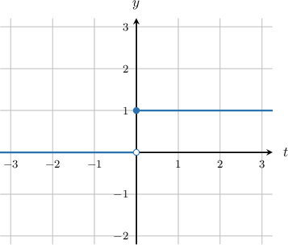
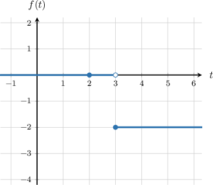
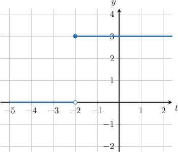
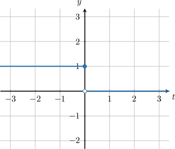
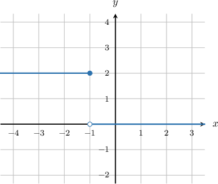

# The Unit Step Function

Source: https://www.mathacademy.com/topics/2760?courseId=61
Topic ID: 2760

## Prerequisites

- [Piecewise Functions](../algebra-i/165-piecewise-functions.md)
- [Combining Reflections With Other Graph Transformations](../algebra-ii/2841-combining-reflections-with-other-graph-transformations.md)

## Lesson

### Introduction

The **unit step function**, $u(t)$, is used to model quantities that change suddenly at a specific time, such as the application of a force, the switching of a circuit, or the start of a signal.

The unit step function is defined as

$$

\begin{aligned}1, & 𝑡≥0, \\ 0, & 𝑡<0.\end{aligned}

$$

In other words, the function is *off* before $t=0$ and *on* afterward. The graph of the unit step function is shown below.

There are two primary ways to modify the unit step function:

- **Scaling**: Multiplying $u(t)$ by a constant changes the magnitude (height) of the step.

- **Shifting**: Replacing $t$ with $t-a$ changes the turn-on time from $t=0$ to $t=a.$ Applying only the shift results in the function $u(t - a),$ defined by This function remains at $0$ until $t=a$ and then immediately jumps to $1.$

Combining both modifications gives the general form of a **scaled and shifted** step function:

$$

f(t) = c \cdot u(t-a)

$$

This function remains at $0$ for $t < a$, and then jumps to the constant value $c$ at $t=a.$ In this way, the unit step function allows us to model both the *timing* and the *magnitude* of a sudden change.

Next, we will look at a concrete example of graphing a specific scaled and shifted step function.

### A Worked Example

Consider an example of a scaled and shifted step function $c\cdot u(t-a).$

Let $f(t) = -2u(t-3),$ where $u$ is the unit step function. We evaluate this function at $t=2.$

Substituting $t = 2,$ we have

$$

\begin{aligned}𝑓(2) & =−2𝑢(2−3) \\ & =−2𝑢(−1) \\ & =(−2)⋅0 \\ & =0.\end{aligned}

$$

Therefore, $f(2)=0.$

In the graph, $f(2)$ lies on the flat blue segment before the step activates, so its value is $0.$

Now, let’s get some practice working through a few examples.

### Example: Evaluating the Step Function

#### Question

Evaluate $f(t) = 9u(t-9)$ at $t=9,$ where $u$ is the unit step function.

#### Explanation

The unit step function $u(t)$ is defined as

$$

\begin{aligned}1,\,𝑡≥0, \\ 0,\,𝑡<0.\end{aligned}

$$

Evaluating $f(t)$ at $t=9,$ we have

$$

\begin{aligned}𝑓(9) & =9𝑢(9−9) \\ & =9𝑢(0) \\ & =9⋅1 \\ & =9.\end{aligned}

$$

Therefore, $f(9)=9.$

### Example: Graphs of Transformed Step Functions

#### Question

The graph of $y=f(t)$ is shown above. Which of the following could be $f(t),$ where $u$ denotes the unit step function?

#### Explanation

The unit step function $u(t)$ is defined as

$$

\begin{aligned}1,\,𝑡≥0, \\ 0,\,𝑡<0.\end{aligned}

$$

The graph of $y=u(t)$ is shown below.

Notice that to transform $y=u(t)$ to the given function $y=f(t),$ we perform the following transformations:

- First, we shift $y=u(t)$ by $2$ units to the left, giving $y=u(t+2).$

- Then, we scale $y=u(t+2)$ by a factor of $3$ parallel to the $y$-axis, giving $y=3u(t+2).$

Therefore, we conclude that $f(t)=3u(t+2).$

### The Function y = u(-t)

So far, we have seen how scaling and shifting affect the unit step function. We now examine how the unit step function behaves under **reflection**.

The graph of $y = u(-t)$ represents the reflection of the unit step function $u(t)$ across the $y$-axis.

Under this transformation, the step still occurs at $t = 0$, but the direction of the step is reversed. In particular,

- $u(t)$ *turns on* at $t=0$ and remains on for $t>0,$

- $u(-t)$ *turns off* at $t=0$ and remains off for $t>0.$

Now, let’s look at a few examples to see how reflection works in practice.

### Example: Graphs of Reflected Step Functions

#### Question

The graph of $y = f(t)$ is shown above. Which of the following could be $f(t),$ where $u$ denotes the unit step function?

#### Explanation

The unit step function $u(t)$ is defined as

$$

\begin{aligned}1,\,𝑡≥0, \\ 0,\,𝑡<0.\end{aligned}

$$

The graph of $y = u(t)$ is shown below.

Notice that to transform the function $y = u(t)$ to the given function $y = f(t),$ we perform the following transformations:

- First, we reflect $y = u(t)$ in the $y$-axis, which gives $y = u(-t).$

- Next, we shift by one unit to the left, giving $y = u(-(t+1)) = u(-1 - t).$

- Finally, we scale by a scale factor of $2$ parallel to the $y$-axis, giving $y = 2u(-1 - t).$

Therefore, we conclude that $f(t) = 2u(-1 - t).$
