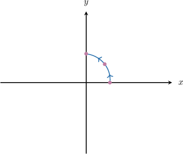
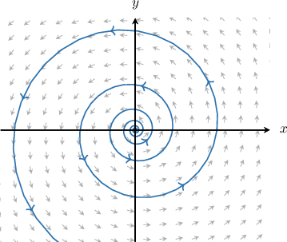
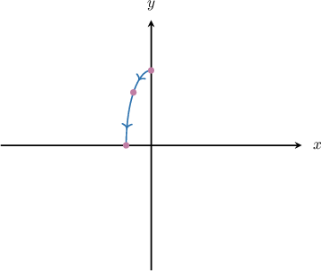
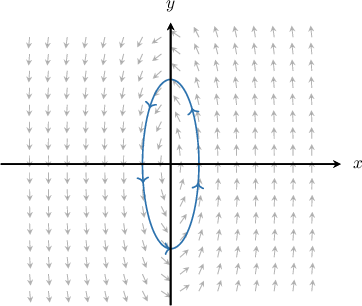
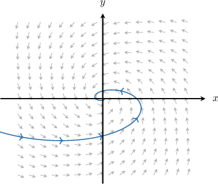

# Phase Portraits for Linear Systems With Complex Eigenvalues

Source: https://www.mathacademy.com/topics/3241?courseId=61
Topic ID: 3241

## Prerequisites

- [Parametric Equations of Ellipses](../integrated-math-iii-honors/2746-parametric-equations-of-ellipses.md)
- [Solving Homogeneous Systems of ODEs With Complex Eigenvalues](./2819-solving-homogeneous-systems-of-odes-with-complex-eigenvalues.md)
- [Phase Portraits for Linear Systems With Real Distinct Eigenvalues](./3239-phase-portraits-for-linear-systems-with-real-distinct-eigenvalues.md)

## Lesson

### Introduction

In this topic, we'll study phase portraits of linear systems where the eigenvalues of a matrix are

Let where be an eigenvector corresponding to the eigenvalue

Then, a complex solution of the system is given by

Using Euler's formula, we obtain

Therefore, the general solution of the system is

Notice that and are bounded, so the factor controls the long-term behavior:

- If then as So, trajectories are *unbounded*, and we have a *spiral* that is traversed toward infinity as In particular, the trajectory is unbounded for

- If then as So, trajectories *approach the origin*, and we have a *spiral* that is traversed toward the origin as In particular, the trajectory is bounded for although it is unbounded if is allowed to approach

- If then for all So, trajectories are *bounded*, and we have an *ellipse*.

Let's see some concrete examples.

### Systems With Complex Eigenvalues

Consider the system of linear differential equations below.

$$

\begin{aligned}𝑥^{′}(𝑡)=\frac{1}{2}𝑥(𝑡)−4𝑦(𝑡) \\ 𝑦^{′}(𝑡)=4𝑥(𝑡)+\frac{1}{2}𝑦(𝑡)\end{aligned}

$$

The eigenvalues of the system's matrix are $\lambda_{1,2} = \dfrac{1}{2}\pm4\text{i},$ for which the corresponding eigenvectors are $\mathbf{v}_{1,2} = [\pm \text{i}, 1]^T,$ respectively. Given that the general solution of the system is

$$

[\begin{aligned}𝑥(𝑡) \\ 𝑦(𝑡)\end{aligned}]

$$

we are interested in sketching the phase portrait of the system of differential equations given above.

If we set $c_1 = 1$ and $c_2 = 0$ in the general solution of the system, we obtain the particular solution:

$$

\begin{aligned}𝑥=𝑒^{𝑡/2}cos⁡(4𝑡) \\ 𝑦=𝑒^{𝑡/2}sin⁡(4𝑡)\end{aligned}

$$

Computing the coordinates (rounded to two decimal places) of several points on the curve, we get the table below.

Let's sketch this solution in the phase space.

Notice that $|\sin(4t)| \leq 1$ and $|\cos(4t)| \leq 1,$ but $e^{t/2} \to \infty$ as $t \to \infty.$ Thus, the obtained curve is unbounded. So, we have a spiral that is traversed counterclockwise.

Again, since $e^{t/2} \to \infty$ as $t \to \infty,$ the spiral is traversed toward infinity as $t \to \infty.$

The phase portrait of our system looks as follows:

### Example: Sketching the Phase Portrait of a System

#### Question

Consider the system of linear differential equations below.

$$

\begin{aligned}𝑥^{′}(𝑡)=−𝑦(𝑡) \\ 𝑦^{′}(𝑡)=9𝑥(𝑡)\end{aligned}

$$

The eigenvalues of the system's matrix are $\lambda_{1,2} = \pm3\text{i},$ for which the corresponding eigenvectors are $\mathbf{v}_{1,2} = [\pm \text{i}, 3]^T,$ respectively. Given that the general solution of the system is

$$

[\begin{aligned}𝑥(𝑡) \\ 𝑦(𝑡)\end{aligned}]

$$

sketch the phase portrait of the system of differential equations given above.

#### Explanation

We are given that the general solution of the system is

$$

[\begin{aligned}𝑥(𝑡) \\ 𝑦(𝑡)\end{aligned}]

$$

For example, when $c_1=1$ and $c_2=0,$ we obtain the following curve:

$$

\begin{aligned}𝑥=−sin⁡(3𝑡) \\ 𝑦=3cos⁡(3𝑡)\end{aligned}

$$

Computing the coordinates (rounded to two decimal places) of several points on the curve, we get the table below.

Let's sketch this solution in the phase space.

Notice that $|\sin(3t)| \leq 1$ and $|\cos(3t)| \leq 1.$ Thus, the obtained curve is bounded. So, we have an ellipse that is traversed counterclockwise.

The phase portrait of our system looks as follows:

### Example: Identifying the Parameters of a System Given Its Phase Portrait

#### Question

The phase portrait for a system of linear differential equations whose matrix has two complex eigenvalues $\lambda = a \pm b\text{i}$ is shown above. Provide an interpretation of the portrait and determine the possible values of $a.$

#### Explanation

Let $\mathbf{v}=\mathbf{p}+\mathbf{q}\text{i},$ where $\mathbf{p},\mathbf{q} \in \mathbb{R}^2,$ be an eigenvector corresponding to the eigenvalue $\lambda = a + b\text{i}.$

Then, a complex solution of the system is given by

$$

\mathbf{x}_{\text{complex}}(t) = \mathbf{v} e^{\lambda t}.

$$

Using Euler's formula, we obtain

$$

\begin{aligned}𝐱_{complex}(𝑡) & =𝐯𝑒^{(𝑎+𝑏i)𝑡} \\ & =𝑒^{𝑎𝑡}(cos⁡(𝑏𝑡)+isin⁡(𝑏𝑡))(𝐩+𝐪i) \\ & =𝑒^{𝑎𝑡}(cos⁡(𝑏𝑡)𝐩−sin⁡(𝑏𝑡)𝐪)+i𝑒^{𝑎𝑡}(sin⁡(𝑏𝑡)𝐩+cos⁡(𝑏𝑡)𝐪).\end{aligned}

$$

Therefore, the general solution of the system is

$$

\textbf{x}(t) = c_1 e^{at}\big(\cos(bt)\mathbf{p}-\sin(bt)\mathbf{q}\big) + c_2 e^{at}\big(\sin(bt)\mathbf{p}+\cos(bt)\mathbf{q}\big),

$$

where the parts $\big(\cos(bt)\mathbf{p}-\sin(bt)\mathbf{q}\big)$ and $\big(\sin(bt)\mathbf{p}+\cos(bt)\mathbf{q}\big)$ are bounded.

Now notice that the given curve is unbounded, representing a spiral that is traversed counterclockwise. Thus, we must have $a \neq 0.$

Also, notice that the spiral is traversed toward the origin.

Hence, to insure that $e^{at} \to 0,$ we require $a < 0.$

### Classification of Equilibria

Finally, let’s summarize what we’ve learned so far.

Again, we are considering a linear system

$$

[\begin{aligned}𝑥(𝑡) \\ 𝑦(𝑡)\end{aligned}]

$$

where the eigenvalues of a $2 \times 2$ matrix $A$ are

$$

\lambda_{1,2}=a\pm bi, \qquad b\neq 0.

$$

As for the classification of the equilibrium at the origin, we get the following:

- The type of the curve is determined by the parameter $a{:}$ If $a=0,$ we have bounded closed curves (ellipses/circles). If $a \neq 0,$ we have spirals.

- The stability is determined by the sign of $a{:}$ If $a>0,$ we have an **unstable spiral** (source). If $a<0,$ we have a **stable spiral** (sink). If $a=0,$ we have a **center**.

**Note:** The center is a *stable* equilibrium but not *asymptotically stable* since trajectories do not converge to it.

Let's see an example.

### Example: Classifying Systems of Linear Differential Equations With Complex Eigenvalues

#### Question

$$

\begin{aligned}𝑥^{′}(𝑡)=−2𝑦(𝑡) \\ 𝑦^{′}(𝑡)=2𝑥(𝑡)\end{aligned}

$$

Consider the system of linear differential equations above. The eigenvalues of the system's matrix are $\lambda=\pm2\text{i}.$ Provide an interpretation of the equilibrium point (origin) for the system of differential equations given above.

#### Explanation

Let $\mathbf{v}=\mathbf{p}+\mathbf{q}\text{i},$ where $\mathbf{p},\mathbf{q} \in \mathbb{R}^2,$ be an eigenvector corresponding to the eigenvalue $\lambda = a + b\text{i}.$

Then, a complex solution of the system is given by

$$

\mathbf{x}_{\text{complex}}(t) = \mathbf{v} e^{\lambda t}.

$$

Using Euler's formula, we obtain

$$

\begin{aligned}𝐱_{complex}(𝑡) & =𝐯𝑒^{(𝑎+𝑏i)𝑡} \\ & =𝑒^{𝑎𝑡}(cos⁡(𝑏𝑡)+isin⁡(𝑏𝑡))(𝐩+𝐪i) \\ & =𝑒^{𝑎𝑡}(cos⁡(𝑏𝑡)𝐩−sin⁡(𝑏𝑡)𝐪)+i𝑒^{𝑎𝑡}(sin⁡(𝑏𝑡)𝐩+cos⁡(𝑏𝑡)𝐪).\end{aligned}

$$

Therefore, the general solution of the system is

$$

\textbf{x}(t) = c_1 e^{at}\big(\cos(bt)\mathbf{p}-\sin(bt)\mathbf{q}\big) + c_2 e^{at}\big(\sin(bt)\mathbf{p}+\cos(bt)\mathbf{q}\big),

$$

where the parts $\big(\cos(bt)\mathbf{p}-\sin(bt)\mathbf{q}\big)$ and $\big(\sin(bt)\mathbf{p}+\cos(bt)\mathbf{q}\big)$ are bounded.

Now, notice that $a = \text{Re}(\lambda) = 0$ and $e^{at} = e^{0\cdot t} = 1$ for all $t.$ Thus, we have an ellipse that curves around the origin.

Therefore, since $\text{Re}(\lambda) = 0,$ the equilibrium point (origin) is a center.
