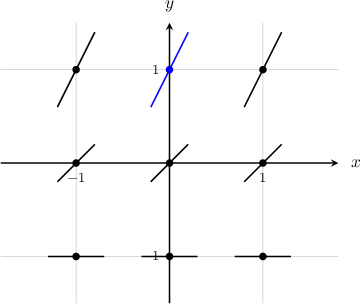
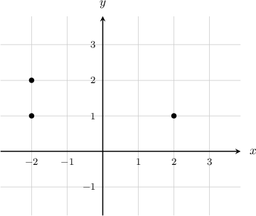
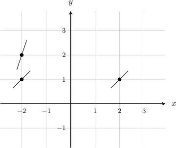
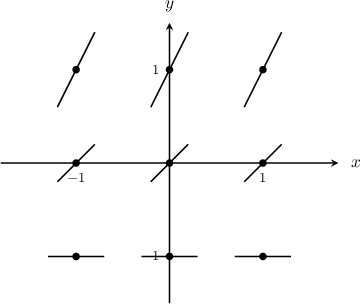
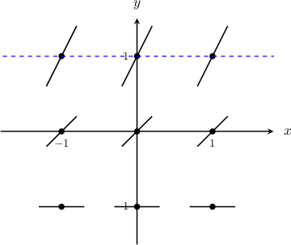
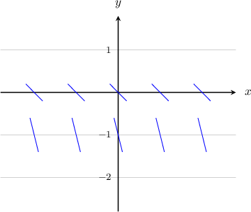
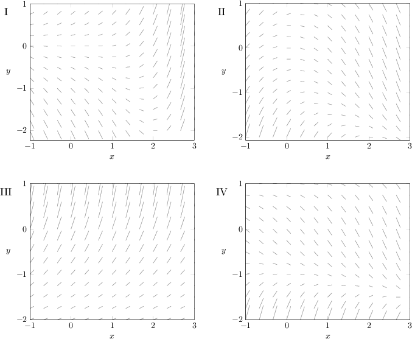
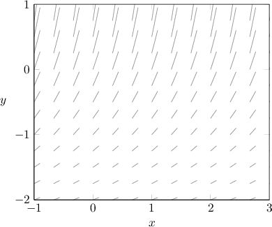
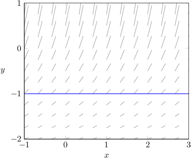

# Slope Fields for Autonomous Differential Equations

Source: https://www.mathacademy.com/topics/3351?courseId=61
Topic ID: 3351

## Prerequisites

- [Slope Fields for Directly Integrable Differential Equations](./3276-slope-fields-for-directly-integrable-differential-equations.md)

## Lesson

### Introduction

Consider the following differential equation:

$$

\dfrac{\textrm d y}{\textrm d x} = y^3+1

$$

To plot the slope field for this equation, we set up a table of values as usual.

We then calculate the slope at each point and record each answer in the table. For example, the slope at the point $(0,1)$ is

$$

\left.\dfrac{\textrm d y}{\textrm d x}\right|_{(0,1)} = (1)^3+1 = {\color{blue}{2}}.

$$

Filling in our table gives the following set of results:

Finally, sketching our slope field, we get the following diagram:

### Example: Sketching the Slope Field of a Differential Equation at Some Isolated Points

#### Question

Sketch the slope field of the differential equation $\dfrac{\textrm d y}{\textrm d x} = 2y-1$ at the points indicated in the diagram above.

#### Explanation

We have to sketch the slope field at the points $(2,1), (-2,1),$ and $(-2,2).$

To sketch the slope field at the given points, we substitute their coordinates into the right-hand side of the differential equation:

$$

\begin{aligned} & \frac{d𝑦}{d𝑥}_{(2,1)}=2(1)−1=1 \\ & \frac{d𝑦}{d𝑥}_{(−2,1)}=2(1)−1=1 \\ & \frac{d𝑦}{d𝑥}_{(−2,2)}=2(2)−1=3\end{aligned}

$$

Setting up our points and drawing our line segments, we get the following:

### Properties of Slope Fields of Autonomous Equations

Let's go back to our original differential equation:

$$

\dfrac{\textrm d y}{\textrm d x} = y^3+1

$$

The right-hand side is a function of $y$ only (i.e., the equation is autonomous). This means that the slope (derivative) at each point in the slope field is *independent of the value of $x$ at that point.*

Let's remind ourselves of the slope field for this differential equation:

If we draw a fixed horizontal line, the slopes touching the line do not vary as we move left and right along the line.

In general, for any autonomous differential equation

$$

\dfrac{\textrm d y}{\textrm d x} = f(y),

$$

the slope field does not vary with $x$ (for a fixed value of $y$).

### Example: Identifying True Statements Regarding Slope Fields

#### Question

Consider the differential equation $\dfrac{\textrm{d}y}{\textrm{d}x} = 3y-1$ and its slope field. Which of the following statements are true?

1. At every point along the line $y = -1,$ the slope of the slope field does not vary

2. At every point along the line $x = 0,$ the slope of the slope field varies

3. At every point along the line $y = 0,$ the slope field is horizontal

#### Explanation

Notice that we are given an equation of the form

$$

\dfrac{\textrm d y}{\textrm d x} = f(y).

$$

This is an autonomous equation because the right-hand side is a function of $y$ only. This means that, for a fixed value of $y,$ the slope does not vary with $x.$

Now, let's check each statement:

- Statement I is true. Consider a point of the form $(x,-1)$ where $x$ is arbitrary. We have and this implies that the slope at the point $(x,-1)$ is equal to $-4$ for any $x.$

- Statement II is true. Consider a point of the form $(0,y)$ where $y$ is arbitrary. We have and this implies that the slope of the slope field at the point $(0,y)$ depends on $y.$

- Statement III is false. Consider a point of the form $(x,0)$ where $x$ is arbitrary. We have and this implies that the slope at the point $(x,0)$ is $-1$ for any $x.$

Therefore, the correct answer is "I and II only."

We can use the information given by the true statements to begin sketching the slope field, as shown below.

### Example: Identifying a Possible Slope Field Based on the Type of Equation

#### Question

Which of the following could be the slope field for the differential equation $\dfrac{\textrm d y}{\textrm d x} = f(y)?$

#### Explanation

Notice that we are given an equation of the form

$$

\dfrac{\textrm d y}{\textrm d x} = f(y).

$$

This is an autonomous equation because the right-hand side is a function of $y$ only. This means that, for a fixed value of $y,$ the slope does not vary with $x.$

Of the given slope fields, the only one that does not vary with $x$ for a fixed value of $y$ is the following:

To see this more clearly, notice that if we draw a horizontal line, the slopes touching the line do not vary as we move left and right along the line.

