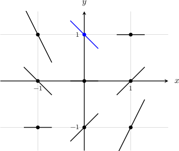
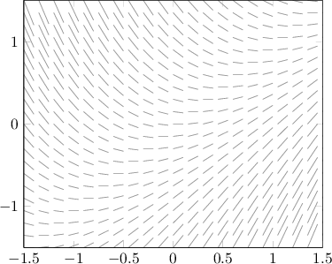
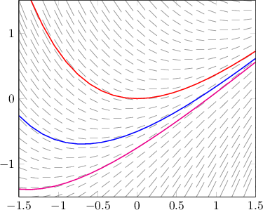
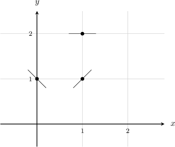
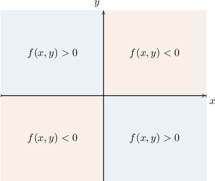
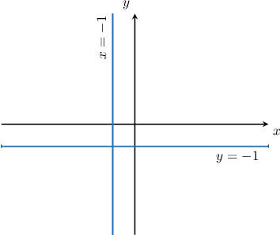
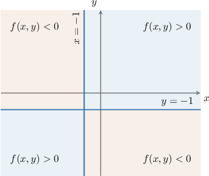
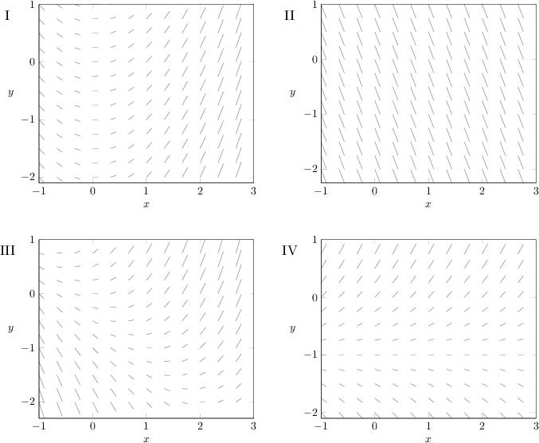
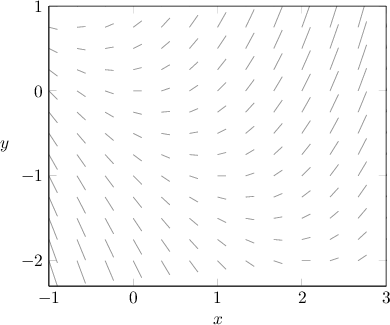
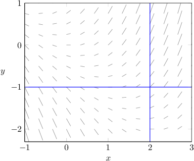

# Slope Fields for Nonautonomous Differential Equations

Source: https://www.mathacademy.com/topics/3352?courseId=61
Topic ID: 3352

## Prerequisites

- [Slope Fields for Autonomous Differential Equations](./3351-slope-fields-for-autonomous-differential-equations.md)
- [Further Solving of Two-Variable Nonlinear Inequalities](../integrated-math-iii-honors/3684-further-solving-of-two-variable-nonlinear-inequalities.md)

## Lesson

### Introduction

Let's plot the slope field of the differential equation

$$

\dfrac {\textrm{d}y} {\textrm{d}x}=x-y.

$$

Notice that the right-hand side of our equation is a function of both $x$ and $y.$ However, the procedure for sketching the slope field is the same as usual.

We start by setting up a table of values.

We then calculate the slope at each point and record each answer in the table. For example, the slope at the point $(0,1)$ is

$$

\left.\dfrac{\textrm d y}{\textrm d x}\right|_{(0,1)} = 0-1 ={\color{blue}{-1}}.

$$

Filling in our table gives the following set of results:

Finally, sketching our slope field, we get the following diagram:

We're done!

Note that if we were to pick more points and use a computer to plot our slope field, it would look more like this:

From here, it's easy to get an idea of the solution curves. For example, three particular solutions to the differential equation are given below.

### Example: Sketching the Slope Field of a Differential Equation at Some Isolated Points

#### Question

For the differential equation

$$

\dfrac{\textrm d y}{\textrm d x} = 2x^2-y,

$$

plot the slope field at the points $(1,1),$ $(0,1),$ and $(1,2).$

#### Explanation

We have to sketch the slope field at the points $(1,1),$ $(0,1),$ and $(1,2).$

To sketch the slope field at the given points, we substitute their coordinates into the right-hand side of the differential equation:

$$

\begin{aligned}\frac{d𝑦}{d𝑥}_{(1,1)} & =2(1)^{2}−1=1 \\ \frac{d𝑦}{d𝑥}_{(0,1)} & =2(0)^{2}−1=−1 \\ \frac{d𝑦}{d𝑥}_{(1,2)} & =2(1)^{2}−2=0\end{aligned}

$$

Setting up our points and drawing our line segments, we get the following diagram.

### Example: Identifying Quadrants Where a Slope Field Is Positive or Negative

#### Question

Consider the differential equation $\dfrac{\textrm{d}y}{\textrm{d}x} = -2xy$ and its slope field. Which of the following statements are true?

1. At every point in the second quadrant, the slope of the slope field is negative

2. At every point in the third quadrant, the slope of the slope field is negative

3. At every point in the fourth quadrant, the slope of the slope field is positive

#### Explanation

First, we define $f(x,y) = -2xy.$ Then, our differential equation is $\dfrac{\textrm dy}{\textrm d x} = f(x,y).$

Notice that $f(x,y) = 0$ when $x=0$ or $y=0.$ The lines $x=0$ and $y=0$ divide the plane into the usual four quadrants.

If we compute the sign of $f(x,y)$ in each quadrant (by considering some test points, for example), we get the following:

With that in mind, let's check each statement:

- Statement I is false. If $(x,y)$ is in the second quadrant, then according to our diagram, we have This implies that the slope of the slope field is positive for any point $(x, y)$ in the second quadrant.

- Statement II is true. If $(x,y)$ is in the third quadrant, then according to our diagram, we have This implies that the slope of the slope field is negative for any point $(x, y)$ in the third quadrant.

- Statement III is true. If $(x,y)$ is in the fourth quadrant, then according to our diagram, we have This implies that the slope of the slope field is positive for any point $(x, y)$ in the fourth quadrant.

Therefore, the correct answer is "II and III only."

### Example: Identifying Rectangular Regions Where a Slope Field Is Positive or Negative

#### Question

Consider the differential equation $\dfrac{\textrm{d}y}{\textrm{d}x}=(x+1)(y+1)$ and its slope field. Which of the following statements are true?

1. At every point $(x,y)$ where $x \gt -1$ and $y \gt -1,$ the slope of the slope field is positive

2. At every point $(x,y)$ where $x \lt -1$ and $y \lt -1,$ the slope of the slope field is positive

3. At every point $(x,y)$ where $x \gt -1$ and $y \lt -1,$ the slope of the slope field is negative

#### Explanation

First, we define $f(x,y) = (x+1)(y+1).$ Then, our differential equation is $\dfrac{\textrm dy}{\textrm d x} = f(x,y).$

Notice that $f(x,y) = 0$ when $x = -1$ or $y = -1.$ This divides the $xy$-plane into four regions, as shown below.

If we compute the sign of $f(x,y)$ in each of those four regions (by considering some test points, for example), we get the following:

With that in mind, let's check each statement:

- Statement I is true. If $x \gt -1$ and $y \gt -1,$ then according to our diagram, we have This implies that the slope of the slope field is positive for any point $(x, y)$ in this region.

- Statement II is true. If $x \lt -1$ and $y \lt -1,$ then according to our diagram, we have This implies that the slope of the slope field is positive for any point $(x, y)$ in this region.

- Statement III is true. If $x \gt -1$ and $y \lt -1,$ then according to our diagram, we have This implies that the slope of the slope field is negative for any point $(x, y)$ in this region.

Therefore, the correct answer is "I, II, and III."

### Symmetry in Slope Fields

Note the following facts regarding slope fields:

- Recall that for a differential equation of the form $y' = f(x),$ the slope field has *vertical* symmetry.

- Also recall that for a differential equation of the form $y' = g(y),$ the slope field has *horizontal* symmetry.

- In contrast, a differential equation of the form $y' = f(x,y)$ usually has neither vertical nor horizontal symmetry.

We can use these facts to determine the type of equation that generates a particular slope field. Let's see an example.

### Example: Identifying a Possible Slope Field Based on the Type of Equation

#### Question

Which of the following could be the slope field for the differential equation $\dfrac{\textrm d y}{\textrm d x} = x+y?$

#### Explanation

Notice that we are given an equation of the form

$$

\dfrac{\textrm d y}{\textrm d x} = f(x,y).

$$

The right-hand side is a function of $x$ and $y.$ This means that the slope varies with both $x$ and $y.$

Of the given slope fields, the only one that varies with both $x$ and $y$ is the following:

To see this more clearly, notice that if we draw a vertical line and a horizontal line, the slopes vary if we move along either of the two lines.

