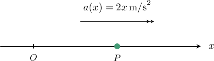
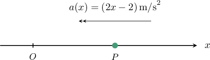
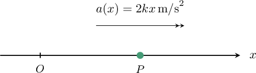
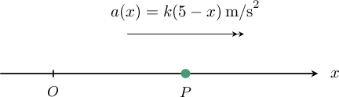

# Determining Properties of Objects Described as Functions of Displacement

Source: https://www.mathacademy.com/topics/3693?courseId=61
Topic ID: 3693

## Prerequisites

- [Velocity and Acceleration as Functions of Displacement](./3235-velocity-and-acceleration-as-functions-of-displacement.md)
- [Determining Characteristics of Moving Objects Using Integration](../ap-calculus-ab/3582-determining-characteristics-of-moving-objects-using-integration.md)

## Lesson

### Introduction

We've seen how to calculate a particle's velocity and displacement when its acceleration is a function of *displacement.* In this lesson, we'll use this knowledge to compute various properties of a particle in motion.

Suppose a particle $P$ moves along the $x$-axis. Its displacement from the origin is $x\,\rm{m},$ its velocity is $v\,\rm{m/s},$ and its acceleration is $2x\,\rm{m/s}^2.$

Furthermore, suppose $P$ has velocity $2\,\rm{m/s}$ when its displacement is $\sqrt{3}\,\rm{m}.$

Let's use this information to determine at which values of $x$ the particle is instantaneously at rest.

Since the acceleration of the particle $P$ is $2x\,\rm{m/s}^2,$ we have

$$

\dfrac{\textrm{d}v}{\textrm{d}t} =2x.

$$

Using the fact that

$$

\dfrac{\textrm{d}v}{\textrm{d}t}= \dfrac{\textrm{d}}{\textrm{d}x}\left(\dfrac{1}{2}v^2\right),

$$

we can rewrite our equation as

$$

\dfrac{\textrm{d}}{\textrm{d}x}\left(\dfrac{1}{2}v^2\right) = 2x.

$$

Integrating both sides of the above equation with respect to $x,$ we have

$$

\int \dfrac{\textrm{d}}{\textrm{d}x} \left(\dfrac12v^2\right) \textrm{d}x = \int 2x \:\textrm{d}x

$$

which gives the general solution

$$

\dfrac12v^2 = x^2+ C.

$$

Now, since $v=2\,\rm{m/s}$ when $x=\sqrt 3\,\rm{m},$ we can find the value of the constant $C,$ as follows:

$$

\begin{aligned}\frac{1}{2}𝑣^{2} & =𝑥^{2}+𝐶 \\ \frac{1}{2}(2)^{2} & =(\sqrt{√3})^{2}+𝐶 \\ 2 & =3+𝐶 \\ 𝐶 & =−1\end{aligned}

$$

Therefore,

$$

\dfrac12v^2 = x^2-1.

$$

Finally, the particle is instantaneously at rest when $v(x) = 0\,\rm{m/s}.$ We find the displacement of the particle when $P$ is instantaneously at rest by substituting $v=0$ in the equation above and solving for $x{:}$

$$

\begin{aligned}\frac{1}{2}𝑣^{2} & =𝑥^{2}−1 \\ \frac{1}{2}(0)^{2} & =𝑥^{2}−1 \\ 𝑥^{2} & =1 \\ 𝑥 & =±1\,m\end{aligned}

$$

### Example: Finding Points Where a Particle Is at Instantaneous Rest

#### Question

A particle $P$ moves along the $x$-axis where $x \geq 1.$ When the displacement of $P$ from the origin is $x$ meters, its velocity is $v\,\rm{m/s},$ the magnitude of its acceleration is $(2x-2) \, \rm{m/s}^2,$ and the acceleration is directed toward $O.$ If $P$ has velocity $\sqrt2\,\rm{m/s}$ when its displacement is $1\,\rm{m},$ find the value of $x$ for which $P$ is instantaneously at rest.

#### Explanation

Since the acceleration of the particle $P$ has magnitude $(2x-2)\,\rm{m/s}^2$ and is directed ** $O,$ we have

$$

\dfrac{\textrm{d}v}{\textrm{d}t} = -(2x-2).

$$

Using the fact that

$$

\dfrac{\textrm{d}v}{\textrm{d}t}= \dfrac{\textrm{d}}{\textrm{d}x}\left(\dfrac{1}{2}v^2\right),

$$

we can rewrite our equation as

$$

\dfrac{\textrm{d}}{\textrm{d}x}\left(\dfrac{1}{2}v^2\right) = -(2x-2).

$$

Integrating both sides of the above equation with respect to $x,$ we have

$$

\int \dfrac{\textrm{d}}{\textrm{d}x} \left(\dfrac12v^2\right) \textrm{d}x = \int (-2x+2) \:\textrm{d}x

$$

which gives the general solution

$$

\dfrac12v^2 = -x^2+2x + C.

$$

Now, since $v=\sqrt{2}\,\rm{m/s}$ when $x=1\,\rm{m},$ we can find the value of the constant $C,$ as follows:

$$

\begin{aligned}\frac{1}{2}𝑣^{2} & =−𝑥^{2}+2𝑥+𝐶 \\ \frac{1}{2}(\sqrt{√2})^{2} & =−(1)^{2}+2(1)+𝐶 \\ 𝐶 & =1+1−2 \\ 𝐶 & =0\end{aligned}

$$

Therefore,

$$

\dfrac12v^2 = -x^2+2x.

$$

Finally, the particle is instantaneously at rest when $v(x) = 0\,\rm{m/s}.$ We find the displacement of the particle when instantaneously at rest by substituting $v=0$ in the equation above and solving for $x{:}$

$$

\begin{aligned}\frac{1}{2}𝑣^{2} & =−𝑥^{2}+2𝑥 \\ \frac{1}{2}(0)^{2} & =−𝑥^{2}+2𝑥 \\ 𝑥^{2}−2𝑥 & =0 \\ 𝑥(𝑥−2) & =0\end{aligned}

$$

The only solution of this equation for $x \geq 1$ is $x=2\,\rm{m}.$

### Example: Finding an Unknown Value

#### Question

A particle $P$ moves along the $x$-axis. When the displacement of $P$ from the origin is $x\,\rm{m},$ the velocity is $v\,\rm{m/s},$ and the acceleration is $2kx\,\rm{m/s}^2,$ where $k$ is a positive constant. If $P$ has velocity $v=2\,\rm{m/s}$ at the origin and the particle has velocity $v=4\,\rm{m/s}$ when its displacement is $1 \,\rm{m},$ find the value of $k.$

#### Explanation

Since the acceleration of the particle $P$ is $2kx\,\rm{m/s}^2,$ we have

$$

\dfrac{\textrm{d}v}{\textrm{d}t} =2 kx.

$$

Using the fact that

$$

\dfrac{\textrm{d}v}{\textrm{d}t}= \dfrac{\textrm{d}}{\textrm{d}x}\left(\dfrac{1}{2}v^2\right),

$$

we can rewrite our equation as

$$

\dfrac{\textrm{d}}{\textrm{d}x}\left(\dfrac{1}{2}v^2\right) = 2kx.

$$

Integrating both sides of the above equation with respect to $x,$ we have

$$

\int \dfrac{\textrm{d}}{\textrm{d}x}\left(\dfrac{1}{2}v^2\right) \textrm{d}x = \int 2kx \:\textrm{d}x

$$

which gives the general solution

$$

\dfrac12v^2 = kx^2 + C.

$$

Now, since $v=2\,\rm{m/s}$ when $x=0\,\rm{m},$ we can find the value of the constant $C,$ as follows:

$$

\begin{aligned}\frac{1}{2}𝑣^{2} & =𝑘𝑥^{2}+𝐶 \\ \frac{1}{2}(2)^{2} & =𝑘(0)^{2}+𝐶 \\ 𝐶 & =2\end{aligned}

$$

Therefore,

$$

\dfrac12v^2 = kx^2 + 2.

$$

Finally, since $v=4\,\rm{m/s}$ when $x=1\,\rm{m},$ we can find the value of the positive constant $k,$ as follows:

$$

\begin{aligned}\frac{1}{2}𝑣^{2} & =𝑘𝑥^{2}+2 \\ \frac{1}{2}(4)^{2} & =𝑘(1)^{2}+2 \\ 8 & =𝑘+2 \\ 𝑘 & =6\end{aligned}

$$

### Example: Finding the Maximum Speed of a Particle

#### Question

A particle $P$ moves along the $x$-axis in the direction of increasing $x$ where $x \geq 0.$ When the displacement of $P$ from the origin is $x \, \rm{m},$ the velocity is $v \, \rm{m/s},$ and the acceleration is $k(5 - x) \, \rm{m/s}^2,$ where $k$ is a positive constant. If $P$ has velocity $v = \sqrt{6} \, \rm{m/s}$ at the origin and has velocity $v = 2\sqrt{6} \, \rm{m/s}$ when its displacement is $1 \, \rm{m},$ find the maximum velocity of the particle.

#### Explanation

The extrema of the velocity occur at the critical points of $v.$ Since the acceleration of the particle $P$ is $k(5 - x)\,\rm{m/s}^2,$ we have

$$

\dfrac{\textrm{d}v}{\textrm{d}t} = k(5 - x).

$$

To find the moments where $v$ is a maximum, we need to solve $\dfrac{\textrm{d}v}{\textrm{d}t} = 0$ and test each solution using the first derivative test.

Solving $\dfrac{\textrm{d}v}{\textrm{d}t} = 0$ gives

$$

\begin{aligned}𝑘(5−𝑥) & =0 \\ 5−𝑥 & =0 \\ 𝑥 & =5.\end{aligned}

$$

Hence, the extremum of the velocity function occurs when $x = 5 \, \rm{m}.$

We now test the extreme value using the first derivative test. We summarize the necessary information in a table, shown below.

We conclude that the velocity is maximized when $x = 5\,\rm{m}.$

Next, using the fact that

$$

\dfrac{\textrm{d}v}{\textrm{d}t}= \dfrac{\textrm{d}}{\textrm{d}x}\left(\dfrac{1}{2}v^2\right),

$$

we can rewrite our initial equation as

$$

\dfrac{\textrm{d}}{\textrm{d}x}\left(\dfrac{1}{2}v^2\right) = k(5 - x).

$$

Integrating both sides of the above equation with respect to $x,$ we have

$$

\int \dfrac{\textrm{d}}{\textrm{d}x}\left(\dfrac{1}{2}v^2\right) \textrm{d}x = \int k(5 - x) \:\textrm{d}x

$$

which gives the general solution

$$

\dfrac{1}{2}v^2 = k\left(5x - \dfrac{1}{2}x^2 \right) + C.

$$

Now, since $v = \sqrt{6} \, \rm{m/s}$ when $x = 0 \, \rm{m},$ we can find the value of the constant $C,$ as follows:

$$

\begin{aligned}\frac{1}{2}𝑣^{2} & =𝑘(5𝑥−\frac{1}{2}𝑥^{2})+𝐶 \\ \frac{1}{2}(\sqrt{√6})^{2} & =𝑘(5(0)−\frac{1}{2}(0)^{2})+𝐶 \\ 𝐶 & =3\end{aligned}

$$

Therefore,

$$

\dfrac{1}{2}v^2 = k\left(5x - \dfrac{1}{2}x^2 \right) + 3.

$$

Also, since $v = 2\sqrt{6} \, \rm{m/s}$ when $x = 1 \, \rm{m},$ we can find the value of the positive constant $k,$ as follows:

$$

\begin{aligned}\frac{1}{2}𝑣^{2} & =𝑘(5𝑥−\frac{1}{2}𝑥^{2})+3 \\ \frac{1}{2}(2\sqrt{√6})^{2} & =𝑘(5(1)−\frac{1}{2}(1)^{2})+3 \\ 12 & =\frac{9𝑘}{2}+3 \\ \frac{9𝑘}{2} & =9 \\ 𝑘 & =2\end{aligned}

$$

Therefore,

$$

\begin{aligned}\frac{1}{2}𝑣^{2} & =2(5𝑥−\frac{1}{2}𝑥^{2})+3 \\ \frac{1}{2}𝑣^{2} & =10𝑥−𝑥^{2}+3 \\ 𝑣^{2} & =20𝑥−2𝑥^{2}+6 \\ 𝑣 & =±\sqrt{√−2𝑥^{2}+20𝑥+6}.\end{aligned}

$$

Since the particle is moving in the direction of increasing $x,$ we have that $v(x) \gt 0,$ so we can disregard the negative square root. Therefore,

$$

v(x) = \sqrt{-2x^2 + 20x + 6}.

$$

Finally, we calculate the maximum velocity:

$$

v_{\max} = v(5) =\sqrt{-2(5)^2 + 20(5) + 6} = 2\sqrt{14}\,\rm{m/s}

$$
