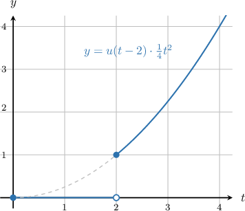

# The Second Shifting Theorem of Laplace Transforms

Source: https://www.mathacademy.com/topics/6370?courseId=61
Topic ID: 6370

## Prerequisites

- [Calculating Trigonometric Ratios Using the Sum Formula for Sine](../integrated-math-iii-honors/3837-calculating-trigonometric-ratios-using-the-sum-formula-for-sine.md)
- [Calculating Trigonometric Ratios Using the Sum Formula for Cosine](../integrated-math-iii-honors/3839-calculating-trigonometric-ratios-using-the-sum-formula-for-cosine.md)
- [The Smoothness Property of Laplace Transforms](./6402-the-smoothness-property-of-laplace-transforms.md)

## Lesson

### Introduction

The **unit step function** $u(t-a)$ acts like a switch:

- If $t < a$, then $u(t-a)=0$.

- If $t \ge a$, then $u(t-a)=1$.

So, when we multiply a function $g(t)$ by $u(t-a)$, the function becomes

$$

\begin{aligned}0, & 𝑡<𝑎, \\ 𝑔(𝑡), & 𝑡≥𝑎.\end{aligned}

$$

This operation "switches on" the function $g(t)$ at time $t=a$.

For example, consider the function $y(t)=u(t-2) \cdot \dfrac14 t^2.$ Here, $a=2$ and $g(t) = \dfrac{1}{4}t^2,$ so

$$

\begin{aligned}0, & 𝑡<2, \\ \frac{1}{4}𝑡^{2}, & 𝑡≥2.\end{aligned}

$$

The plot of this function is shown below. Note that the curve follows the parabola for $t \ge 2$ but is zero for $t < 2$.

Suppose we know the Laplace transform of $g(t).$ We'll now learn how to find the Laplace transform of $u(t-a)\,g(t).$

### Deriving the Second Shifting Theorem

From the definition of the Laplace transform, we have

$$

\mathcal{L}\{u(t-a)\,g(t)\} =\int_0^\infty e^{-st}u(t-a)g(t)\,\textrm{d}t.

$$

Because $u(t-a)=0$ for $t < a$ and $u(t-a)=1$ for $t\ge a$, the integrand is zero until $t=a$. So the integral reduces to

$$

\mathcal{L}\{u(t-a)\,g(t)\} =\int_a^\infty e^{-st}g(t)\,\textrm{d}t.

$$

To compare this with a standard Laplace transform, we shift the variable of integration so that the lower limit is $0$.

Let $\tau=t-a$. Then $t=\tau+a$ and $\textrm{d}t=\textrm{d}\tau$. Also, when $t=a$, we have $\tau=0$.

Substituting gives

$$

\int_a^\infty e^{-st}g(t)\,\textrm{d}t =\int_0^\infty e^{-s(\tau+a)}g(\tau+a)\,\textrm{d}\tau.

$$

Now separate the exponential term:

$$

e^{-s(\tau+a)}=e^{-as}e^{-s\tau}.

$$

This allows us to factor out the constant $e^{-as}$:

$$

\int_0^\infty e^{-s(\tau+a)}g(\tau+a)\,\textrm{d}\tau =e^{-as}\int_0^\infty e^{-s\tau}g(\tau+a)\,\textrm{d}\tau.

$$

The remaining integral has exactly the form of a Laplace transform, so recognize

$$

\int_0^\infty e^{-s\tau}g(\tau+a)\,\textrm{d}\tau =\mathcal{L}\{g(t+a)\}.

$$

Putting everything together, we obtain the **second shifting theorem**:

$$

\mathcal{L}\{u(t-a)\,g(t)\} =e^{-as}\,\mathcal{L}\{g(t+a)\}, \qquad \text{for } s>s_0

$$

The key takeaway is that the unit step shifts the *start time* of the function to $t=a$, and changing variables shifts it back to $0$. The exponential factor $e^{-as}$ records this delay in the $s$-domain.

### Example: Calculating Laplace Transforms Using the Second Shifting Theorem

#### Question

Given that $\mathcal{L} \big\{t^n\big\}=\dfrac{n!}{s^{n+1}}$ for $s>0$, find $\mathcal{L}\left\{u(t-2)\big(t^2+3t+2\big) \right\},$ where $u(t)$ is the unit step function.

#### Explanation

The second shifting theorem states that if $a \ge 0$ and $\mathcal{L} \big\{u(t-a)\,g(t)\big\}$ exists for $s > s_0,$ then

$$

\mathcal{L} \big\{u(t-a)\,g(t)\big\} = e^{-as}\,\mathcal{L}\big\{g(t+a)\big\}, \qquad \text{for} \; s > s_0,

$$

where $u(t)$ is the unit step function.

In our case, we wish to find

$$

\mathcal{L}\left\{ u(t-2)\big(t^2+3t+2\big) \right\}.

$$

Therefore, $a=2,$ and we have

$$

\mathcal{L} \big\{u(t-2)\,g(t)\big\} = e^{-2s}\,\mathcal{L}\big\{g(t+2)\big\},

$$

where $g(t)=t^2+3t+2.$

Notice that

$$

\begin{aligned}𝑔(𝑡+2) & =(𝑡+2)^{2}+3(𝑡+2)+2 \\ & =𝑡^{2}+4𝑡+4\,+\,3𝑡+6\,+\,2 \\ & =𝑡^{2}+7𝑡+12.\end{aligned}

$$

Since $\mathcal{L} \big\{t^n\big\}=\dfrac{n!}{s^{n+1}}$ and $\mathcal{L} \{1\} = \dfrac{1}{s}$ for $s>0,$ we have

$$

\begin{aligned}L{𝑔(𝑡+2)} & =L{𝑡^{2}+7𝑡+12} \\ & =L{𝑡^{2}}+7L{𝑡}+12L{1} \\ & =\frac{2}{𝑠^{3}}+7⋅\frac{1}{𝑠^{2}}+12⋅\frac{1}{𝑠} \\ & =\frac{2}{𝑠^{3}}+\frac{7}{𝑠^{2}}+\frac{12}{𝑠}.\end{aligned}

$$

Therefore, applying the second shifting theorem, we get

$$

\begin{aligned}L{𝑢(𝑡−2)\,𝑔(𝑡)} & =𝑒^{−2𝑠}\,L{𝑔(𝑡+2)} \\ & =𝑒^{−2𝑠}(\frac{2}{𝑠^{3}}+\frac{7}{𝑠^{2}}+\frac{12}{𝑠}).\end{aligned}

$$

### Example: Laplace Transforms of Trig Functions Using the Second Shifting Theorem

#### Question

Given that

$$

\begin{aligned}L{sin⁡𝜔𝑡} & =\frac{𝜔}{𝑠^{2}+𝜔^{2}}, & & 𝑠>0, \\ L{cos⁡𝜔𝑡} & =\frac{𝑠}{𝑠^{2}+𝜔^{2}}, & & 𝑠>0,\end{aligned}

$$

find $\mathcal{L}\left\{u(t-4)\,\cos(9\pi t) \right\},$ where $u(t)$ is the unit step function.

#### Explanation

The second shifting theorem states that if $a \ge 0$ and $\mathcal{L} \big\{u(t-a)\,g(t)\big\}$ exists for $s > s_0,$ then

$$

\mathcal{L} \big\{u(t-a)\,g(t)\big\} = e^{-as}\,\mathcal{L}\big\{g(t+a)\big\}, \qquad \text{for} \; s > s_0,

$$

where $u(t)$ is the unit step function.

In our case, we wish to find

$$

\mathcal{L}\left\{ u(t -4)\,\cos(9\pi t) \right\}.

$$

Therefore, $a=4,$ and we have

$$

\mathcal{L} \big\{u(t-4)\,g(t)\big\} = e^{-4s}\,\mathcal{L}\big\{g(t+4)\big\},

$$

where $g(t)= \cos(9\pi t).$

Notice that

$$

\begin{aligned}𝑔(𝑡+4) & =cos\,(9𝜋(𝑡+4)) \\ & =cos⁡(9𝜋𝑡+36𝜋) \\ & =cos⁡9𝜋𝑡cos⁡36𝜋−sin⁡9𝜋𝑡sin⁡36𝜋 \\ & =cos⁡9𝜋𝑡⋅1−sin⁡9𝜋𝑡⋅0 \\ & =cos⁡9𝜋𝑡.\end{aligned}

$$

Since $\mathcal{L} \left\{\cos(\omega t)\right\}=\dfrac{s}{s^2 + \omega^2}$ for $s>0,$ we have

$$

\begin{aligned}L{𝑔(𝑡+4)} & =L{cos⁡(9𝜋𝑡)} \\ & =\frac{𝑠}{𝑠^{2}+81𝜋^{2}}.\end{aligned}

$$

Therefore, applying the second shifting theorem, we get

$$

\begin{aligned}L{𝑢(𝑡−4)\,𝑔(𝑡)} & =𝑒^{−4𝑠}\,L{𝑔(𝑡+4)} \\ & =𝑒^{−4𝑠}⋅\frac{𝑠}{𝑠^{2}+81𝜋^{2}}.\end{aligned}

$$

### Alternative Form of the Second Shifting Theorem

We begin with the second shifting theorem:

$$

\mathcal{L}\{u(t-a) g(t)\} = e^{-as}\,\mathcal{L}\{g(t+a)\}.

$$

In many applications, the function multiplied by the unit step already appears in the shifted form

$$

u(t-a)\,f(t-a).

$$

Our goal is to rewrite the theorem so that this structure can be handled directly.

Suppose $f(t)$ is a function with Laplace transform

$$

\mathcal{L}\{f(t)\}=F(s).

$$

To match the form $u(t-a)f(t-a)$, define

$$

g(t)=f(t-a).

$$

Then the left-hand side becomes

$$

\mathcal{L}\{u(t-a) g(t)\} =\mathcal{L}\{u(t-a)\,f(t-a)\}.

$$

Next, determine what happens to the right-hand side. If $g(t)=f(t-a)$, then

$$

g(t+a)=f\big((t+a)-a\big)=f(t).

$$

So,

$$

\mathcal{L}\{g(t+a)\}=\mathcal{L}\{f(t)\}=F(s).

$$

Substituting these results into the theorem gives

$$

\mathcal{L}\{u(t-a)\,f(t-a)\} = e^{-as}F(s).

$$

This is the **alternative form of the second shifting theorem**.

Next, we will apply this formula to a concrete example.

### Example: Using the Alternative Form of the Second Shifting Theorem

#### Question

Find $\mathcal{L}\left\{u(t-1)(t-1)^3 \right\},$ where $u(t)$ is the unit step function.

#### Explanation

The second shifting theorem states that if $a \ge 0,$ then

$$

\mathcal{L} \big\{u(t-a)\,f(t-a)\big\} = e^{-as}F(s),

$$

where $F(s) = \mathcal{L}\{f(t)\}.$

In our case, we wish to find the transform of

$$

u(t-1)(t-1)^3.

$$

By comparing this expression to the form in the theorem, we can identify the following:

- The shift is $a = 1.$

- The shifted function is $f(t-1) = (t-1)^3.$

From the shifted function, we can deduce the original unshifted function $f(t)$ by simply replacing $(t-1)$ with $t{:}$

$$

f(t) = t^3.

$$

Now, we calculate the Laplace transform $F(s)$ of the unshifted function using the rule $\mathcal{L}\{t^n\} = \dfrac{n!}{s^{n+1}}{:}$

$$

F(s) = \mathcal{L}\{t^3\} = \dfrac{3!}{s^{3+1}} = \dfrac{6}{s^4}.

$$

Finally, we apply the shifting theorem formula $\mathcal{L} \big\{u(t-a)\,f(t-a)\big\} = e^{-as}F(s)$ by multiplying $F(s)$ by the exponential delay factor $e^{-s}{:}$

$$

\begin{aligned}L{𝑢(𝑡−1)(𝑡−1)^{3}} & =𝑒^{−𝑠}⋅𝐹(𝑠) \\ & =𝑒^{−𝑠}⋅\frac{6}{𝑠^{4}}.\end{aligned}

$$
