# Trees and Forests

Source: https://www.mathacademy.com/topics/1284?courseId=109
Topic ID: 1284

## Prerequisites

- [Subgraphs and Graph Complements](./1260-subgraphs-and-graph-complements.md)
- [Cycles in Graphs](./1702-cycles-in-graphs.md)
- [Disjoint Sets](../methods-of-proof/2789-disjoint-sets.md)
- [Edge and Vertex Connectivity](./5555-edge-and-vertex-connectivity.md)

## Lesson

### Introduction

A **tree** is an undirected connected simple graph with no cycles; a graph with no cycles is **acyclic**.

A **forest** is an undirected simple graph with no cycles. Equivalently, a forest is an undirected simple graph whose connected components are trees, hence the name.

A tree with $N$ vertices always has exactly $N-1$ edges. This provides a useful criterion for identifying trees: a connected graph with $N$ vertices and $N-1$ edges is necessarily a tree.

For example, consider the graph below.

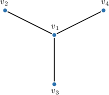

This undirected simple graph is connected and acyclic, so it is a tree. It has $4$ vertices and $3$ edges. However, adding any edge introduces a cycle, making it no longer a tree, as illustrated below.

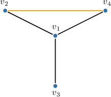

Indeed, the graph above is not a tree because it contains a cycle: $v_1-v_2-v_4-v_1$.

### Example: Identifying Trees

#### Question

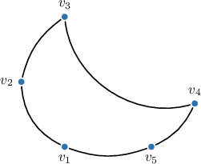

Determine whether or not the above graph is a tree, giving a reason.

#### Explanation

A ** is an undirected connected simple graph with no cycles.

A ** is a undirected simple graph with no cycles (its connected components are trees).

A tree with $N$ vertices always has exactly $N-1$ edges. This leads to an alternative definition of a tree, which also serves as a criterion for verifying whether a given graph is a tree: a tree is a connected graph where the number of edges is one less than the number of vertices.

Notice that the given graph is connected but contains the cycle $v_1-v_2-v_3-v_4-v_5-v_1.$

Therefore:

The above graph is $\boxed{\color{blue}\textrm{not a tree}}$ because it has $𝑣_{1}−𝑣_{2}−𝑣_{3}−𝑣_{4}−𝑣_{5}−𝑣_{1}$

### Spanning Trees

A subgraph of a connected graph $G$ is called a **spanning tree** of $G$ if it is a tree that includes all the vertices of $G.$ Alternatively, a spanning tree of a connected graph $G$ with $N$ vertices is a connected subgraph with $N$ vertices and $N-1$ edges. This follows from the fact that any connected graph with $N$ vertices and $N-1$ edges is necessarily a tree.

Since any connected graph with $N$ vertices has spanning trees with exactly $N-1$ edges, all spanning trees of an unweighted graph are "minimal," meaning they are equal in terms of their numbers of edges.

For example, consider the graph below.

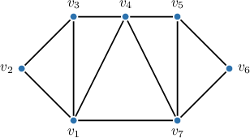

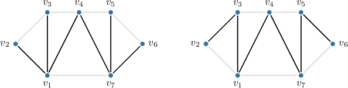

### Example: Identifying Spanning Trees

#### Question

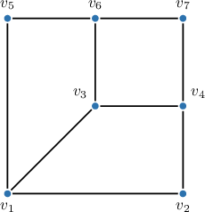

How many edges does a spanning tree of the graph above have?

#### Explanation

Recall that a ** is a connected undirected simple graph with no cycles.

A subgraph of a graph $G$ is called a ** of $G$ if it is a tree that includes all the vertices of $G.$ Additionally, we can use the fact that all of the spanning trees of a connected graph with $N$ vertices have exactly $N-1$ edges.

Our graph has $7$ vertices. Therefore, any of its spanning trees will have $\boxed{\color{blue}6}$ edges.

For example, a spanning tree of the given graph could be as follows:

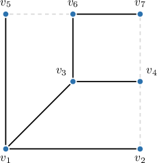

### The Minimum Spanning Tree of a Weighted Graph

A **minimum spanning tree** (**MST**) of a weighted graph is a spanning tree with the smallest possible total weight. Like any spanning tree, an MST of a weighted graph with $N$ vertices contains exactly $N-1$ edges.

For example, consider the graph below.

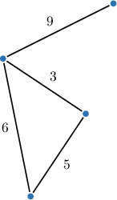

Recall that a spanning tree of $G$ must be acyclic and must include all the vertices of $G.$

Since the graph above has only one cycle, removing any one of the edges in the cycle makes the graph acyclic, forming a tree. This tree retains all vertices of the original graph, making it a spanning tree. We should remove the edge with the largest weight to ensure our spanning tree is minimal.

The cycle has $3$ edges with weights of $3, 5,$ and $6.$ By removing the edge with the greatest weight $(6),$ we obtain the minimum possible total weight: $9+3+5 = 17.$

Therefore, the remaining edges, highlighted below, form the (unique, in this case) minimum spanning tree of the original graph.

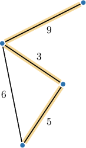

### Example: Identifying Minimum Spanning Trees

#### Question

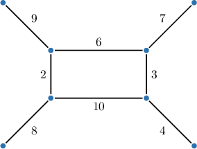

Find the weight of the minimum spanning tree of the above graph.

#### Explanation

Recall that a subgraph of a graph $G$ is called a ** of $G$ if it is a tree that includes all the vertices of $G.$

A spanning tree of a weighted graph with the minimum weight is called a ** (**). Like any other spanning tree, the MST for a weighted graph with $N$ vertices must have $N-1$ edges.

Our graph has one cycle with $4$ edges. Hence, to obtain a minimum spanning tree, we need to remove one of the edges from the cycle:

- First, by removing the edge with a weight of $10$ we obtain the following tree with a total weight of

- Second, by removing the edge with a weight of $2$ we obtain the following tree with a total weight of

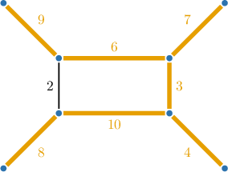

- Third, by removing the edge with a weight of $6$ we obtain the following tree with a total weight of

- Finally, by removing the edge with a weight of $3$ we obtain the following tree with a total weight of

Therefore, the minimum spanning tree has a weight of $\boxed{\color{blue}39}.$
