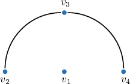
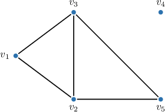
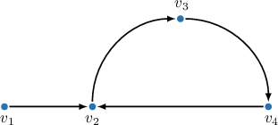
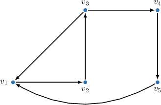
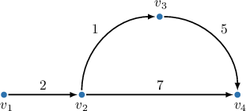
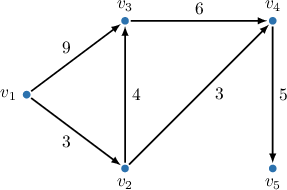

# Distance Matrices

Source: https://www.mathacademy.com/topics/1392?courseId=109
Topic ID: 1392

## Prerequisites

- [Symmetric Matrices](./3118-symmetric-matrices.md)
- [Walks, Paths, and Distances in Directed Graphs](./5431-walks-paths-and-distances-in-directed-graphs.md)

## Lesson

### Introduction

Recall that the distance between vertices $u$ and $v$ in an unweighted undirected graph, $d(u,v),$ is the length (i.e., the number of edges) of the shortest path from $u$ to $v.$ If no path from $u$ to $v$ exists, we say that the distance is $\infty.$

In a simple undirected unweighted graph $G=(V,E)$ with $n$ vertices $v_1, v_2, \ldots, v_n,$ the **distance matrix** $D$ of the graph is an $n \times n$ matrix (table), where the entry $a_{ij}$ at the intersection of the $i$th row and the $j$th column equals the *distance* between the vertices $v_i$ and $v_j.$

Notice that, according to this definition:

- If no path exists between $v_i$ and $v_j,$ then the entry $a_{ij}$ is $\infty.$

- If $i=j$ (i.e., it is the same vertex), then the entry $a_{ii}$ is $0.$

- The distance matrix of an undirected graph is symmetric about the main diagonal.

Let's look at an example of how to build the distance matrix for the graph below.

We start with a square $4 \times 4$ matrix with $0$s on the main diagonal and examine every pair of vertices to determine the remaining matrix entries.

- The path $v_2-v_3-v_4$ has two edges and is the shortest path between $v_2$ and $v_4.$ Hence, we write $2$ in the entry $a_{24}$ and, by symmetry, in the entry $a_{42}.$

- Since the vertices $v_2$ and $v_3$ are adjacent, the shortest path between them is $1.$ Hence, we write $1$ in the entry $a_{23}$ and, by symmetry, in the entry $a_{32}.$ Similarly, since $v_3$ and $v_4$ are adjacent, we write $1$ in the entry $a_{34}$ and $a_{43}.$

- Since the vertex $v_1$ is isolated, the distance from it to any other vertex is $\infty.$ Hence, we write $\infty$ in every entry of the $1$st row and in every entry of the $1$st column, except for $a_{11}.$

The distance matrix is completed. In regular matrix notation, we can write this distance matrix as follows:

$$

\begin{aligned}0 & ∞ & ∞ & ∞ \\ ∞ & 0 & 1 & 2 \\ ∞ & 1 & 0 & 1 \\ ∞ & 2 & 1 & 0\end{aligned}

$$

### Example: Building the Distance Matrix of a Graph

#### Question

Consider the following disconnected graph.

Fill in the missing values in the following distance matrix for the graph above.

#### Explanation

Given a fixed order of vertices $v_1, v_2, \ldots, v_n$ in an undirected graph, the ** $D$ of the graph is an $n \times n$-matrix (table), where the element $d_{ij}$ at the intersection of the $i$th row and the $j$th column equals the distance between the vertices $v_i$ and $v_j.$

If there is no path form $v_i$ and $v_j,$ we define $d_{ij}=\infty.$

The distances are calculated as follows:

- First, the entry $d_{11}$ is the distance from $v_1$ to itself, which is always zero. Hence,

- Now, recall that the distance matrix of an undirected graph is symmetric about the main diagonal. Hence, by symmetry, we have

- Finally, the distance from $v_2$ to $v_4$ is $\infty$ because there is no path from $v_2$ to $v_4.$ Hence, we have

Therefore, the distance matrix is as follows:

### Distance Matrix of a Directed Graph

Recall that the distance between vertices and in an unweighted directed graph, is the length (i.e., the number of edges) of the shortest path from to If no path from to exists, we say that the distance is

In a simple directed unweighted graph with vertices the **distance matrix** of the graph is an matrix, where the entry at the intersection of the th row and the th column represents the *distance* between the vertices and

Notice that, according to this definition:

- If no path exists between and then the entry is

- If (i.e., it is the same vertex), then the entry is

- The distance matrix of a directed graph is *not* symmetric about the main diagonal in general.

Let's look at an example of how to build the distance matrix for the graph below.

We start with a square matrix with s on the main diagonal and examine every pair of vertices to determine the remaining matrix entries.

- The path has three edges and is the shortest path between and Hence, we write in the entry

- The path has two edges and is the shortest path between and Hence, we write in the entry

- The path has two edges and is the shortest path between and Hence, we write in the entry

- The path has two edges and is the shortest path between and Hence, we write in the entry

- The path has two edges and is the shortest path between and Hence, we write in the entry

- We write in every entry that represents a vertex pair connected by a direct edge: and

- Finally, we write in all other empty cells to indicate that no paths exist between the corresponding vertex pairs.

The distance matrix is completed. In regular matrix notation, we can write this distance matrix as follows:

### Example: Building the Distance Matrix of a Directed Graph

#### Question

Consider the following graph.

Fill in the missing values in the following distance matrix for the graph above.

#### Explanation

Given a fixed order of vertices $v_1, v_2, \ldots, v_n$ in a directed graph, the ** $D$ of the graph is an $n \times n$-matrix (table), where the element $d_{ij}$ at the intersection of the $i$th row and the $j$th column equals the distance from the vertex $v_i$ to the vertex $v_j.$

In our case, the vertices are arranged as $v_1,v_2,v_3,v_4,$ and $v_5.$ Let's determine the distances.

Recall that the distance matrix of a directed graph is not symmetric in general. Some of the distances are calculated as follows:

- The distance from $v_1$ to $v_2$ is $1$ since the shortest path from $v_1$ to $v_2$ (namely, $v_1 \to v_2$) has a length of $1.$ Hence, we have

- The distance from $v_1$ to $v_3$ is $2$ since the shortest path from $v_1$ to $v_3$ (namely, $v_1 \to v_2 \to v_3$) has a length of $2.$ Hence, we have

- The entry $d_{33}$ is the distance from $v_3$ to itself, which is always $0$. Hence,

- The distance from $v_5$ to $v_2$ is $2$ since the shortest path from $v_5$ to $v_2$ (namely, $v_5 \to v_1 \to v_2$) has a length of $2.$ Hence,

Therefore, the distance matrix is as follows:

### Distance Matrix of a Weighted Graph

Recall that the distance between vertices and in a weighted graph, is the length (i.e., sum of the weights of edges) of the shortest path from to If no path from to exists, we say that the distance is

In a weighted graph with vertices the **distance matrix** of the graph is an matrix, where the entry at the intersection of the th row and the th column equals the *distance* between the vertices and Here can be either directed or undirected.

Notice that, according to this definition:

- If no path exists between and then the entry is

- If (i.e., it is the same vertex), then the entry is

- The distance matrix of an undirected weighted graph is symmetric about the main diagonal, but the distance matrix of a directed weighted graph is *not* symmetric in general.

Let's look at an example of how to build the distance matrix for the directed weighted graph below.

We start with a square matrix with s on the main diagonal and examine every pair of vertices to determine the remaining matrix entries.

- The detour path has a weight of and is the shortest path between and (Notice that the alternative path which has fewer edges, has a greater weight of) Hence, we write in the entry

- Similarly, the path has a weight of and is the shortest path between and Hence, we write in the entry

- We write the weight of an edge in the entry corresponding to a vertex pair connected by a direct edge with no shorter detours exist: and

- Finally, we write in all other empty cells to indicate that no paths exist between the corresponding vertex pairs.

The distance matrix is completed. In regular matrix notation, we can write this distance matrix as follows:

### Example: Building the Distance Matrix of a Weighted Graph

#### Question

Consider the following directed weighted graph.

Fill in the missing values in the following distance matrix for the graph above.

#### Explanation

Given a fixed order of vertices $v_1, v_2, \ldots, v_n$ in a directed weighted graph, the ** $D$ of the graph is an $n \times n$-matrix (table), where the element $d_{ij}$ at the intersection of the $i$th row and the $j$th column equals the distance between the vertices $v_i$ and $v_j.$

If there is no path from $v_i$ to $v_j,$ we define $d_{ij}=\infty.$

In our case, the vertices are arranged as $v_1,v_2,v_3,v_4,$ and $v_5.$ Some of the distance calculations are here as follows:

- The entry $d_{11}$ is the distance from $v_1$ to itself, which is always zero. Hence,

- The distance from $v_1$ to $v_3$ is $7$ because the shortest path between these vertices (namely, $v_1 \to v_2 \to v_3$, not $v_1 \to v_3$) has a total length of $3+4=7.$ Hence, we have

- The distance from $v_2$ to $v_5$ is $8$ because the shortest path between these vertices (namely, $v_2 \to v_4 \to v_5$) has a total length of $3+5=8.$ Hence, we have

- The distance from $v_3$ to $v_2$ is $\infty$ because there is no path from $v_3$ to $v_3$. Hence, we have

Therefore, the distance matrix is as follows:
