# Kruskal's Algorithm

Source: https://www.mathacademy.com/topics/1393?courseId=109
Topic ID: 1393

## Prerequisites

- [Trees and Forests](./1284-trees-and-forests.md)
- [Connected Graphs](./2756-connected-graphs.md)

## Lesson

### Introduction

**Kruskal's algorithm** finds a *minimum spanning tree* of a connected, weighted graph $G.$ It follows a so-called **greedy approach,** selecting the edges in increasing order of weight while avoiding cycles. It is used in network design, cluster analysis in machine learning, and image segmentation.

The steps for the Kruskal's algorithm are as follows:

- **Step 1:** Initiate a forest containing all the vertices of $G$ but no edges.

- **Step 2:** Order the edges of $G$ by their weight from smallest to largest.

- **Step 3:** Iterate through this list of edges in ascending order, adding an edge to the forest only if its ends belong to different connected components (i.e., only if it doesn't create a cycle).

- **Step 4:** Terminate the iteration when all vertices are included in a single connected component with no cycles.

We can express Kruskal's algorithm using **pseudocode**. Pseudocode is a simplified, programming language-independent way of describing an algorithm. It uses a mix of natural language and programming concepts, helping programmers to plan and visualize code logic without focusing on syntax.

The pseudocode for Kruskal's algorithm is as follows.

Let's take a look at how to apply Kruskal's algorithm to a concrete graph.

### A Concrete Example of Kruskal's Algorithm

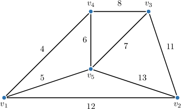

Let's use Kruskal's algorithm to find a minimum spanning tree of the graph given above.

First, we put all the vertices of our graph into a forest with no edges.

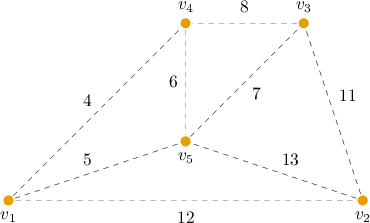

The dashed lines denote the edges of the original graph.

Next, we order the edges of the original graph according to their weights:

$$

\begin{aligned} & 𝑣_{1}−𝑣_{4},\,𝑣_{1}−𝑣_{5},\,𝑣_{4}−𝑣_{5},\,𝑣_{3}−𝑣_{5},\,𝑣_{3}−𝑣_{4}, \\ & 𝑣_{2}−𝑣_{3},\,𝑣_{1}−𝑣_{2},\,𝑣_{2}−𝑣_{5}\end{aligned}

$$

Now, we consider each edge in turn.

- If an edge's endpoints (vertices) are in two *different* connected components of the forest, we add the edge to the forest.

- If an edge's endpoints (vertices) are in the *same* connected components of the forest, we do *not* add the edge to the forest.

We proceed step-by-step.

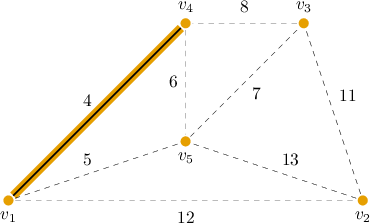

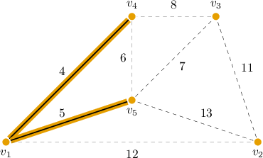

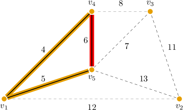

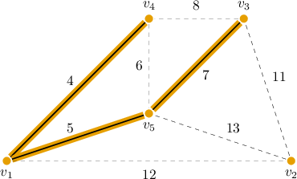

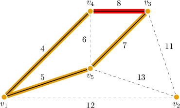

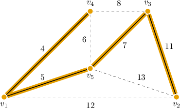

All vertices of the initial graph are included in a single connected component with no cycles. So, we obtained a spanning tree.

The total weight of the resulting minimum spanning tree is

$$

4 + 5 + 7 + 11 = 27.

$$

### Example: Applying a Step of Kruskal's Algorithm

#### Question

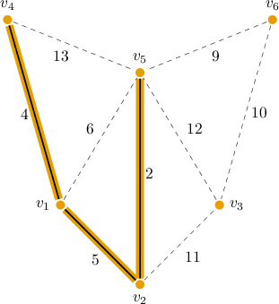

Consider the weighted graph $G$ with vertices $V=\{v_1, \ldots, v_7\}$ and edges indicated above. Kruskal's algorithm for finding a minimum spanning tree is applied to $G,$ and after a few steps, the highlighted edges are added to the forest. According to the algorithm, what edge will be added next to the forest?

#### Explanation

Kruskal's algorithm finds a minimum spanning tree of a connected, weighted graph $G.$ The pseudocode for Kruskal's algorithm is the following:

By inspection, the order of the edges of the original graph according to their weights is as follows:

$$

\begin{aligned} & 𝑣_{2}−𝑣_{5},\,𝑣_{1}−𝑣_{4},\,𝑣_{1}−𝑣_{2},\,𝑣_{1}−𝑣_{5},\,𝑣_{5}−𝑣_{6}, \\ & 𝑣_{3}−𝑣_{6},\,𝑣_{2}−𝑣_{3},\,𝑣_{3}−𝑣_{5},\,𝑣_{4}−𝑣_{5}\end{aligned}

$$

We see that $v_2-v_5, v_1-v_4$ and $v_1-v_2$ have already been added to the forest.

$$

\begin{aligned} & 𝑣_{2}−𝑣_{5},\,𝑣_{1}−𝑣_{4},\,𝑣_{1}−𝑣_{2},\,𝑣_{1}−𝑣_{5},\,𝑣_{5}−𝑣_{6}, \\ & \,\,𝑣_{3}−𝑣_{6},\,\,\,𝑣_{2}−𝑣_{3},\,\,\,𝑣_{3}−𝑣_{5},\,\,\,𝑣_{4}−𝑣_{5}\end{aligned}

$$

So, at the next step of Kruskal's algorithm, we consider the edge with the smallest weight among the remaining ones. This is the edge $v_1 - v_5.$ However, adding it to our forest will form a cycle since $v_1$ and $v_5$ belong to the same connected component.

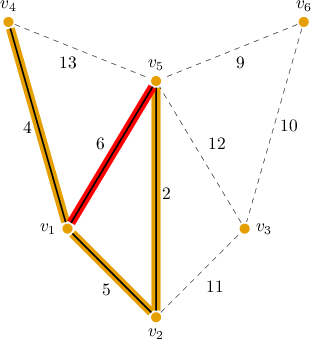

Hence, we consider the next edge of the smallest weight: edge $v_5-v_6.$ Adding it to our forest will not form a cycle since $v_5$ and $v_6$ belong to different connected components.

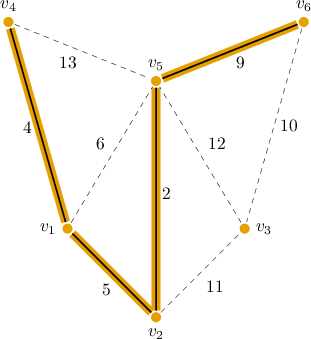

Therefore, the correct answer is $v_5-v_6.$

### Example: Applying Kruskal's Algorithm

#### Question

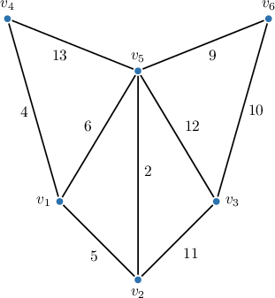

Use Kruskal's algorithm to find a minimum spanning tree of the graph given above.

#### Explanation

Kruskal's algorithm finds a minimum spanning tree of a connected, weighted graph $G.$ The pseudocode for Kruskal's algorithm is the following:

First, we put all the vertices of our graph into a forest with no edges.

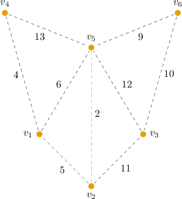

The dashed lines denote the edges of the original graph.

Next, we order the edges of the original graph according to their weights:

$$

\begin{aligned} & 𝑣_{2}−𝑣_{5},\,𝑣_{1}−𝑣_{4},\,𝑣_{1}−𝑣_{2},\,𝑣_{1}−𝑣_{5},\,𝑣_{5}−𝑣_{6}, \\ & 𝑣_{3}−𝑣_{6},\,𝑣_{2}−𝑣_{3},\,𝑣_{3}−𝑣_{5},\,𝑣_{4}−𝑣_{5}\end{aligned}

$$

Now, we consider each edge in turn.

- If an edge's endpoints (vertices) are in two ** connected components of the forest, we add the edge to the forest.

- If an edge's endpoints (vertices) are in the ** connected components of the forest, we do ** add the edge to the forest.

We proceed step-by-step.

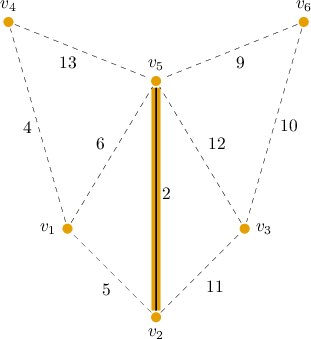

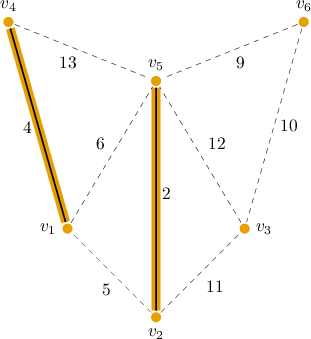

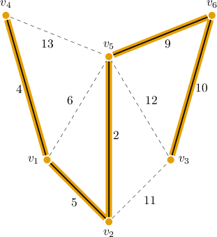

All vertices of the initial graph are included in a single connected component with no cycles. So, we obtained a spanning tree.

The total weight of the resulting minimum spanning tree is

$$

2 + 4 + 5 + 9 + 10 = 30.

$$
