# Cycles in Graphs

Source: https://www.mathacademy.com/topics/1702?courseId=109
Topic ID: 1702

## Prerequisites

- [Walks, Paths, and Distances in Directed Graphs](./5431-walks-paths-and-distances-in-directed-graphs.md)

## Lesson

### Introduction

A **circuit** of length $n$ in an undirected graph is a trail of length $n$ in which the first and last vertices coincide. In other words, it is a closed walk with no repeated edges.

A **cycle** (or *simple circuit*) is a circuit in which all vertices, except the first and last, are distinct. In other words, it is a closed walk with no repeated edges or vertices (except the first and last vertices).

For example, consider the following graph.

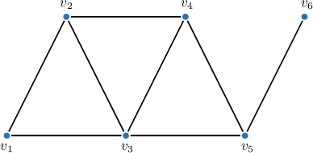

The walk $v_1 - v_2 - v_3 - v_4 - v_5 - v_3 - v_1$ shown below is a circuit but not a cycle because it has a repeated vertex, $v_3.$

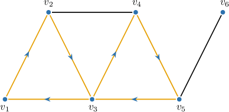

At the same time, the walk $v_1 - v_2 - v_3 - v_1$ shown below is both a circuit and a cycle.

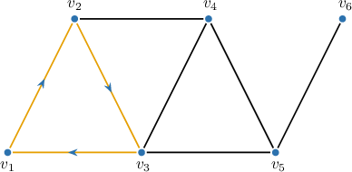

### Example: Identifying Circuits and Cycles in Graphs

#### Question

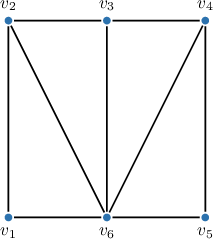

Given the graph above, which of the following statements are true?

1. $v_1 - v_2 - v_6 - v_1$ is a cycle

2. $v_2 - v_3 - v_6 - v_4 - v_3$ is a circuit

3. $v_1 - v_2 - v_6 - v_4 - v_5 - v_6 - v_1$ is a circuit

#### Explanation

A ** of length $n$ in an undirected graph is a trail of length $n,$ in which the first and last vertices coincide. In other words, it is a closed walk with no repeated edges.

A ** (or **) is a circuit in which all vertices, except the first and last, are distinct. In other words, it is a closed walk with no repeated edges or vertices (except the first and last vertices).

With that in mind, let's examine our statements.

- Statement I is true. It is a closed walk with distinct edges and distinct vertices, except for the first and last.

- Statement II is false. It is not a closed walk because the first and last vertices are distinct.

- Statement III is true. It is a closed walk with distinct edges.

Therefore, the correct answer is "I and III only."

### Directed Cycles

A **directed circuit** of length $n$ in a directed graph is a directed trail of length $n$ in which the first and last vertices coincide. In other words, it is a closed directed walk with no repeated edges.

A **directed cycle** (or *simple directed circuit*) is a directed circuit in which all vertices except the first and last are distinct. In other words, it is a closed directed walk with no repeated edges and no repeated vertices except for the first and last.

For example, consider the following directed graph.

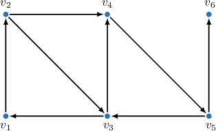

In this graph, the walk $v_1 \to v_2 \to v_3 \to v_4 \to v_5 \to v_3 \to v_1$ is a directed circuit but not a directed cycle because it has a repeated vertex, $v_3.$

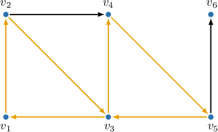

At the same time, the walk $v_3 \to v_1 \to v_2 \to v_4 \to v_5 \to v_3$ shown below is both a directed circuit and a directed cycle.

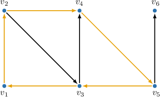

### Example: Identifying Circuits and Cycles in Directed Graphs

#### Question

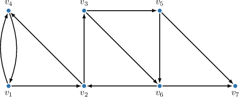

Given the directed graph above, which of the following statements are true?

1. $v_2 \to v_3 \to v_6 \to v_2$ is a directed cycle

2. $v_4 \to v_1 \to v_2 \to v_3 \to v_6 \to v_2 \to v_4$ is a directed circuit

3. $v_3 \to v_5 \to v_6 \to v_3$ is a directed circuit

#### Explanation

A ** of length $n$ in a directed graph is a directed trail of length $n$ where the first and last vertices coincide.

A ** (or a **) is a directed circuit in which all vertices, except the first and last, are distinct.

With that in mind, let's examine our statements.

- Statement I is true. It is a directed trail where all the vertices, except the first and last, are distinct.

- Statement II is true. It is a directed trail where the first and last vertices coincide.

- Statement III is false. There are no edges from $v_6 \to v_3$ (only from $v_3 \to v_6$). Hence, it is not even a walk.

Therefore, the correct answer is "I and II only."

### The Girth and Circumference of a Graph

The **girth** of a graph is the length of its shortest cycle, while the **circumference** is the length of its longest cycle.

If a graph has no cycles, its girth is defined as infinity $(\infty)$, and its circumference is defined as zero $0.$

For example, consider the following graph.

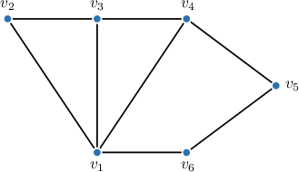

In the given graph:

- The cycle $v_1 - v_2 - v_3 - v_1$ has a length of $3,$ and the graph does not contain any shorter cycles. Therefore, the girth of the graph is $3.$

- The cycle $v_1 - v_2 - v_3 - v_4 - v_5 - v_6 - v_1$ shown below has a length of $6,$ and the graph does not contain any longer cycles. Therefore, the circumference of the graph is $6.$

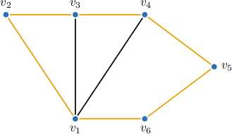

As the next example, consider the graph shown below.

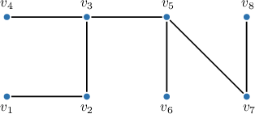

This graph has no cycles. Therefore, its girth is $\infty,$ and its circumference is $0.$

### Example: Finding the Girth and Circumference of a Graph

#### Question

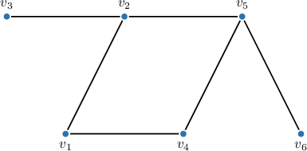

Given the graph above, determine its girth and circumference.

#### Explanation

The ** of a graph is the length of its shortest cycle, while the ** is the length of its longest cycle. If a graph has no cycles, its girth is defined as infinity $(\infty)$, and its circumference is defined as $0.$

The given graph contains only one cycle, namely, $v_1 - v_2 - v_5 - v_4 - v_1.$ This cycle has a length of $4.$ Therefore, the girth and the circumference of the graph are both $4.$
