# Planar Graphs

Source: https://www.mathacademy.com/topics/2754?courseId=109
Topic ID: 2754

## Prerequisites

- [Connected Graphs](./2756-connected-graphs.md)
- [Proof by Contradiction](../methods-of-proof/3414-proof-by-contradiction.md)
- [Complete and Bipartite Graphs](./5639-complete-and-bipartite-graphs.md)

## Lesson

### Introduction

A graph $G$ is **planar** if it can be drawn in the plane such that its edges intersect only at their endpoints (vertices). Such a drawing is called an *embedding* of $G$ in the plane.

For example, all three graphs shown below are planar, and each image represents an embedding.

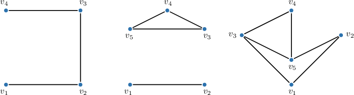

An embedding of a planar graph divides the plane into regions called **faces.**

A **face** is a connected region of the plane bounded by the graph's edges (as drawn in a given embedding). The **outer face** is the unbounded region that extends infinitely beyond the graph.

For example, consider the graph below.

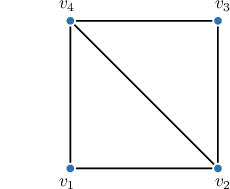

This graph is planar, and its image represents an embedding. The $3$ faces of the graph, including the outer face, are listed below.

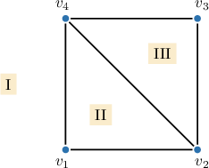

Each face is a region in the plane bounded by a cycle. For example:

- Face $\textrm{I}$ is bounded by the cycle $v_1-v_2-v_3-v_4 - v_1.$

- Face $\textrm{II}$ is bounded by the cycle $v_1-v_2-v_4-v_1.$

- Face $\textrm{III}$ is bounded by the cycle $v_2-v_3-v_4-v_2.$

For *simple* graphs, each of these bounding cycles must contain *at least three edges*. This fact becomes important in a proof that we'll study later.

### Euler's Formula for Planar Graphs

For any connected planar graph with $v$ vertices, $e$ edges, and $f$ faces, **Euler's formula** for planar graphs states that

$$

v-e+f=2.

$$

Recall that an undirected graph is *connected* if there is a path between every pair of vertices. If you've studied geometry, this is closely related to Euler's formula for polyhedra.

For example, consider a planar graph with $8$ vertices and $12$ edges.

Let's find the number of faces, $f,$ by substituting $v=8$ and $e=12$ into Euler's formula and then solving for $f$ as follows:

$$

\begin{aligned}𝑣−𝑒+𝑓 & =2 \\ 8−12+𝑓 & =2 \\ −4+𝑓 & =2 \\ 𝑓 & =6\end{aligned}

$$

Therefore, the graph has $6$ faces.

We can verify this result by examining the graph below, which has $8$ vertices and $12$ edges. It indeed has $6$ faces.

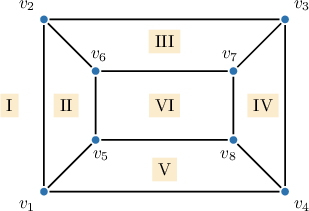

### Example: Determining the Number of Faces of a Planar Graph

#### Question

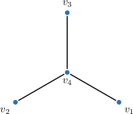

How many faces does the planar graph above have?

#### Explanation

A ** is a connected region on the plane enclosed by the edges of a planar graph. The ** is the unbounded region surrounding the entire graph.

The given graph is planar and is represented in the diagram without crossing edges.

Since the edges of the graph do not form any cycles, it has no internal faces. Hence, it has only one face: the outer face.

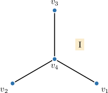

This graph has $1$ face (only the outer one).

### Example: Using Euler's Formula for Planar Graphs

#### Question

If a planar graph has $12$ edges and $8$ faces, then how many vertices does it have?

#### Explanation

Euler's formula for planar graphs states that

$$

v - e + f = 2,

$$

where $v$ is the number of vertices, $e$ is the number of edges, and $f$ is the number of faces in the planar graph.

Substituting $e=12$ and $f=8$ into the formula above, we can solve for $e$ as follows:

$$

\begin{aligned}𝑣−𝑒+𝑓 & =2 \\ 𝑣−(12)+(8) & =2 \\ 𝑣−4 & =2 \\ 𝑣 & =6\end{aligned}

$$

Therefore, the graph has $6$ vertices.

### The Complete Graph K(5) is not Planar

The complete graphs $K_1,$ $K_2,$ $K_3,$ and $K_4$ are planar, as illustrated in the image below.

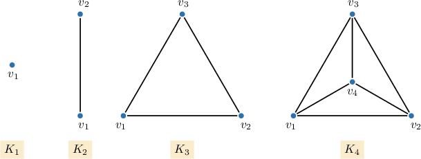

However, it turns out that the complete graph $K_5$ is not planar; that is, it cannot be drawn in the plane without edges crossing.

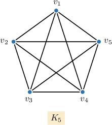

To prove that $K_5$ is not planar, we use proof by contradiction. We proceed as follows:

*Assume, for contradiction, that $K_5$ is planar. Then, the graph must satisfy Euler's formula for planar graphs:*

$$

v-e+f=2,

$$

*where $v,$ $e,$ and $f$ are the number of vertices, edges, and faces, respectively.*

*The number of edges in a complete graph $K_n$ is given by the formula*

$$

e=\dfrac{n\left(n-1\right)}{2}.

$$

*Since $K_5$ has $5$ vertices, it has $\frac12\cdot 5\left(5-1\right)= 10$ edges. Now, substituting $v=5$ and $e=10$ into Euler's formula:*

$$

5 - 10 + f = 2

$$

*Thus, $K_5$ must have $f=7$ faces.*

*In a planar graph, a face is a region on the plane bounded by a cycle. Since $K_5$ is a simple graph, each cycle contains at least three edges. Hence, at least $3f=3(7)=21$ face-edge incidences must be present in these cycles.*

*Each edge in a planar graph is incident to at most two faces. Hence, at most $2e=2(10)=20$ face-edge incidences are possible in the graph.*

*Finally, since the required number of face-edge incidences $(21)$ exceeds the maximum possible number of such incidences $(20),$ we obtain a contradiction:*

$$

21 \leq 20,

$$

*which is false.*

*Therefore, $K_5$ is **** planar.*

### The Complete Bipartite Graph K(3,3) is not Planar

The complete bipartite graph $K_{3,3}$ is not planar because it cannot be drawn in the plane without edges crossing.

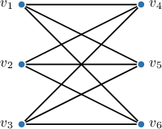

To prove that $K_{3,3}$ is not planar, we use proof by contradiction. We proceed as follows:

*Assume, for contradiction, that $K_{3,3}$ is planar. Then, the graph must satisfy Euler's formula for planar graphs:*

$$

v-e+f=2,

$$

*where $v,$ $e,$ and $f$ are the number of vertices, edges, and faces, respectively.*

*The number of vertices and edges in a complete bipartite graph $K_{m,n}$ are given by the formulas:*

$$

v=m+n, \ \ \ e=mn.

$$

*Hence, $K_{3,3}$ has $3+3=6$ vertices and $3\times 3 = 9$ edges. Now, we proceed by substituting $v=6$ and $e=9$ into Euler's formula:*

$$

6 - 9 + f = 2.

$$

*Thus, $K_{3,3}$ must have $f=5$ faces.*

*In a planar graph, a face is a region on the plane bounded by a cycle. Since a bipartite graph cannot contain odd-length cycles, each cycle must have at least four edges. Thus, the total number of face-edge incidences must be at least $4f=4(5)=20.$*

*Each edge in a planar graph is incident to at most two faces. Hence, at most $2e=2(9)=18$ face-edge incidences are possible in the graph.*

*Finally, since the required number of face-edge incidences $(20)$ exceeds the maximum possible number $(18),$ we obtain a contradiction:*

$$

20 \leq 18,

$$

*which is false.*

*Therefore, $K_{3,3}$ is not planar.*

### Example: Proving a Graph is Not Planar

#### Question

Prove the following statement:

**

#### Explanation

We use the proof by contradiction. So, we start as follows:

Seeking a contradiction, assume that $K_6$ is planar. Then, the graph must satisfy Euler's formula for planar graphs:

$$

v-e+f=2,

$$

where $v,$ $e,$ $f$ are the number of vertices, edges, and faces, respectively.

The number of edges in a complete graph $K_n$ equals $\dfrac{n(n-1)}{2}.$ Since our graph $K_6$ has $6$ vertices, it has $\dfrac{6(6-1)}{2} = 15$ edges. Now, we proceed by substituting $e$ and $v$ into the Euler's formula:

Since $K_6$ has $6$ vertices and $15$ edges, we get

$$

6 - 15 + f = 2.

$$

Thus, $K_6$ must have $f=11$ faces.

In a planar graph, a face is a region on the plane bounded by a cycle. Each cycle contains at least three edges. Hence, at least $3f$ face-edge incidences must be involved in these cycles:

Each face must be bounded by at least $3$ edges. Thus, the total number of face-edge incidences for $11$ faces must be at least $33.$

Each edge in a planar graph is incident to at most two faces. Hence, at most $2e$ face-edge incidences are possible in the graph:

On the other hand, each edge is incident to at most $2$ faces. Thus, the total number of face-edge incidences for $15$ edges can be at most $30.$

Finally, since the required number of face-edge incidences $(33)$ is greater than the maximum possible number of such incidences $(30),$ we obtain a contradiction:

Comparing the required and maximum possible number of face-edge incidences, we get the following inequality:

$$

33 \leq 30,

$$

which is false. Therefore, we obtain a contradiction, and $K_6$ is not planar.

### Elementary Subdivisions

An **elementary subdivision** of a loop-free graph occurs when an edge ($u-v$) is removed, and a new vertex $(w)$ is introduced, with edges $u-w$ and $w-v$ added to the graph. Effectively, this operation splits the original edge into two by inserting a new vertex.

An elementary subdivision $G'$ of a planar graph $G$ remains a planar graph; this is because we can convert a planar embedding of $G$ into a planar embedding of $G'$ by drawing the new vertex in the middle of the edge being subdivided.

For example, let's apply an elementary subdivision to the edge $v_2-v_3$ in the graph below.

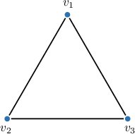

First, remove the edge $v_2-v_3.$

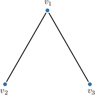

Next, add a new vertex, $v_4.$

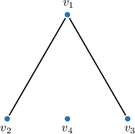

Finally, connect the new vertex to the two original vertices by adding the edges $v_2-v_4$ and $v_4-v_3.$

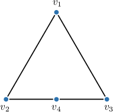

Note that the original graph was planar, and so is the new graph.

### Homeomorphic Graphs

Two loop-free graphs are **homeomorphic** if they are isomorphic or if both can be obtained from the same loop-free undirected graph through a sequence of elementary subdivisions.

For example, consider the two graphs below.

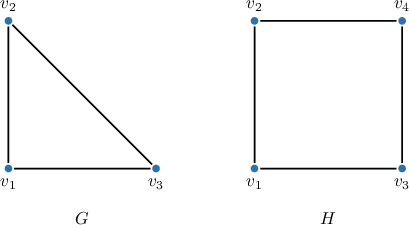

First, remove the edge $v_2-v_3.$

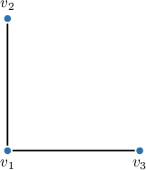

Next, add a new vertex, $v_4.$

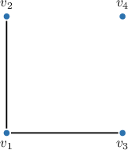

Finally, connect the new vertex to the two original vertices by adding the edges $v_2-v_4$ and $v_4-v_3.$

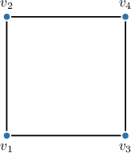

Therefore, since it is possible to obtain the graph $H$ by subdividing the edge $v_2-v_3$ in the graph $G,$ the graphs $G$ and $H$ are homeomorphic.

### Example: Applying Subdivisions to a Graph

#### Question

Sketch a possible result from subdivisions of the edges $v_1-v_2$ and $v_2-v_3$ in the graph below.

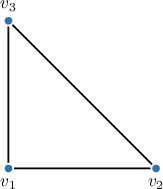

#### Explanation

Let $G$ be a loop-free graph with an edge $u - v.$ An ** of $G$ occurs when the edge $u-v$ is removed from $G,$ and then a new vertex $w,$ along with the edges $u-w$ and $w-v,$ are added to the graph.

You may consider an elementary subdivision as introducing a new vertex on an existing edge.

In this case, we subdivide the edge $v_1-v_2$ by adding the vertex $v_4,$ and the edge $v_1-v_3$ by adding the vertex $v_5,$ as shown below.

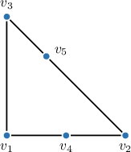

### Kuratowski's Theorem

**Kuratowski's Theorem** states that a graph is nonplanar if and only if it contains a subgraph that is homeomorphic to either $K_5$ or $K_{3,3}.$

For example, consider the following graphs.

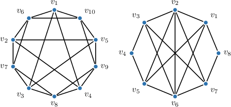

They have the subgraphs shown below.

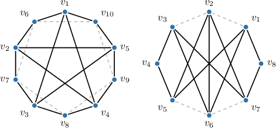

These subgraphs are homeomorphic to $K_5$ and $K_{3,3},$ respectively.

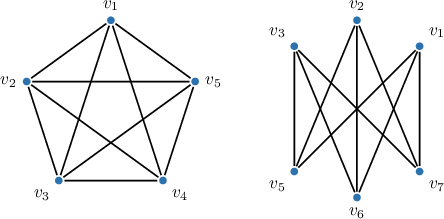

Therefore, by Kuratowski's Theorem, the given graphs are not planar.
