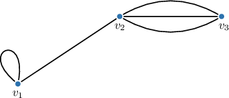
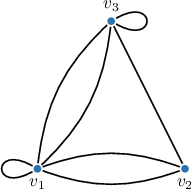
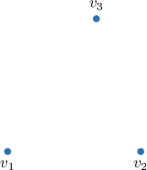
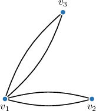
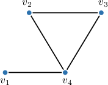
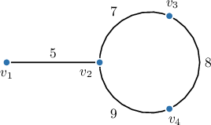
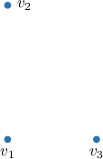
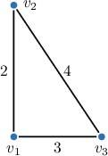

# Adjacency Matrices

Source: https://www.mathacademy.com/topics/2757?courseId=109
Topic ID: 2757

## Prerequisites

- [Walks, Trails, Paths, and Distances](./951-walks-trails-paths-and-distances.md)
- [The Degree of a Vertex](./954-the-degree-of-a-vertex.md)
- [Symmetric Matrices](./3118-symmetric-matrices.md)

## Lesson

### Introduction

In an undirected graph $G=(V,E)$ with $n$ vertices $v_1, v_2, \ldots, v_n,$ the **adjacency matrix** $A$ of the graph is an $n \times n$ square matrix (table), where the element $a_{ij}$ at the intersection of the $i$th row and the $j$th column equals the number of edges connecting the vertices $v_i$ and $v_j.$ Each loop at a vertex $v_i$ contributes $2$ into the entry $a_{ii}$ on the main diagonal.

In an undirected graph, $a_{ij}$ is always equal to $a_{ji};$ that is, the adjacency matrix of an undirected graph is symmetric about the main diagonal.

As we know, graphs can be represented graphically in various equally valid ways. In contrast, if we fix an ordering on the vertices, the adjacency matrix is unique.

Consider the graph below.

Let's examine the vertices $v_1,v_2,$ and $v_3$ of the graph to determine the entries of the adjacency matrix step by step.

- There is a loop at $v_1.$ Hence, we write $2$ at the entry $a_{11},$ which is at the intersection of the 1st row and the 1st column. Since there are no loops at $v_2$ and $v_3,$ we write $0$ at the entries $a_{22}$ and $a_{33}.$

- There is an edge from $v_1$ to $v_2.$ Hence, we write $1$ at the entry $a_{12},$ and by symmetry, at the entry $a_{21}.$

- There are no edges from $v_1$ to $v_3.$ Hence, we write $0$ at the entry $a_{13},$ and by symmetry, at the entry $a_{31}.$

- There are three edges from $v_2$ to $v_3.$ Hence, we write $3$ at the entry $a_{23},$ and by symmetry, at the entry $a_{32}.$

The adjacency matrix is completed. Using regular matrix notation, we can write it as follows:

$$

\begin{aligned}2 & 1 & 0 \\ 1 & 0 & 3 \\ 0 & 3 & 0\end{aligned}

$$

Notice that in the adjacency matrix of an undirected graph, the sum of each column and each row is always equal to the degree of the corresponding vertex.

### Example: Building the Adjacency Matrix of a Graph

#### Question

Fill in the missing values in the adjacency matrix for the graph above.

Hint: Use the convention that a loop contributes $2$ to the corresponding entry in the adjacency matrix.

#### Explanation

Given a fixed order of vertices $v_1, v_2, \ldots, v_n$ in an undirected graph, the ** $A$ of the graph is an $n \times n$-matrix (table), where the element $a_{ij}$ at the intersection of the $i$th row and the $j$th column represents the number of edges connecting the vertices $v_i$ and $v_j.$

In an undirected graph, $a_{ij}$ is always equal to $a_{ji};$ that is, the adjacency matrix of an undirected graph is symmetric about the main diagonal.

In our case, the vertices are arranged as $v_1,v_2,v_3.$ Let's examine the edges of our graph to find the remaining entries.

- There are two edges from $v_1$ to $v_2.$ Thus, we write $2$ in the intersection of the $1$st row and the $2$nd column in the adjacency matrix. These edges can be traversed in either direction. Hence, by symmetry, we also write $2$ in the intersection of the $2$nd row and the $1$st column.

- There is no loop in $v_2.$ Thus, we write $0$ in the intersection of the $2$nd row and the $2$nd column of the adjacency matrix.

- There is a loop at $v_3.$ This loop can be traversed in both directions. Hence, we write $2$ in the intersection of the $3$rd row and the $3$rd column of the adjacency matrix.

Therefore, the adjacency matrix is as follows:

### Example: Identifying a Graph Given Its Adjacency Matrix

#### Question

$$

\begin{aligned}0 & 2 & 2 \\ 2 & 0 & 0 \\ 2 & 0 & 0\end{aligned}

$$

The undirected graph with vertices $v_1,$ $v_2,$ $v_3$ (in this exact order) has the adjacency matrix $A$ shown above. Draw the corresponding graph.

#### Explanation

Given a fixed order of vertices $v_1, v_2, \ldots, v_n$ in an undirected graph, the ** of the graph is an $n \times n$-matrix (table), where the element $a_{ij}$ at the intersection of the $i$th row and the $j$th column represents the number of edges connecting the vertices $v_i$ and $v_j.$

First, we draw the vertices on the plane (the exact positions of the points do not matter).

Now, let's examine the adjacency matrix.

- Since we have an undirected graph, the matrix is symmetric about the main diagonal. Hence, we need to analyze only the main diagonal and the upper triangle above it.

- The main diagonal contains only $0$'s, which indicates that our graph has no loops.

- In the upper triangle, we have the following: Since $a_{12}=2,$ there are two edges $v_1 - v_2.$ Since $a_{13}=2,$ there are two edges $v_1 - v_3.$ Since $a_{23}=0,$ there are no edges $v_2 - v_3.$

The resulting graph is shown below.

### Powers of Adjacency Matrices of Simple Graphs

If is the adjacency matrix of a simple graph, then the -entry of represents the number of walks of length from the th vertex to the th vertex.

Let's consider a concrete example before building intuition about why this works. Consider the following graph:

It's a simple graph with vertices arranged as and hence, its adjacency matrix is:

Suppose we want to determine the number of walks of length from to in the graph. In this case, we need to compute the matrix and then examine the entry of the result.

After several hours of struggling to compute or manually, or just using a computer, we can compute the 2nd and 3rd powers of the matrix as follows:

The entry that sits at the intersection of the nd row and the th column of is equal to Therefore, there are distinct walks of length from to

We can verify this result by listing all walks of length that start at and end at

### Intuition Behind the Result

To understand why the $(i, j)$-entry $(A^n)_{ij}$ of $A^n$ give us the number of walks from $v_i$ to $v_j,$ let's consider the following graph once more.

The adjacency matrix $A$ and its square are given by

$$

\begin{aligned}0 & 0 & 0 & 1 \\ 0 & 0 & 1 & 1 \\ 0 & 1 & 0 & 1 \\ 1 & 1 & 1 & 0\end{aligned}

$$

Recall that $a_{ij} = 1$ if $v_i$ and $v_j$ are adjacent. Thus, if $a_{ij} = 1,$ there exists a walk of length $1$ between $v_i$ and $v_j.$

Consider the element $(A^2)_{23}$ located in the second row and third column of $A^2$ (highlighted above). To calculate this element, we calculate the dot product of the second row and third column of $A{:}$

$$

\begin{aligned}(𝐴^{2})_{23}=𝑎_{21}⋅𝑎_{13}+𝑎_{22}⋅𝑎_{23}+𝑎_{23}⋅𝑎_{33}+𝑎_{24}⋅𝑎_{43}\end{aligned}

$$

Each term of the product is of the form $a_{2k}\cdot a_{k3},$ where $k\in\{1,2,3,4\}.$ Now, notice that

$$

\begin{aligned}1,\, & 𝑎_{2𝑘}=𝑎_{𝑘3}=1 \\ 0,\, & otherwise.\end{aligned}

$$

In other words, the product $a_{2k}\cdot a_{k3} = 1$ only if there exists a walk $v_2 - v_k - v_3$ of length $2.$ Otherwise, this product equals zero. Thus, by summing the terms of the product to calculate $(A^2)_{23}$, we *count* the number of distinct walks of length $2$ from $v_2$ to $v_3.$

More generally, the $(i, j)$-entry $(A^2)_{ij}$ is the number of distinct walks between $v_i$ and $v_j$ of length $2.$

Using similar arguments, we can deduce that

- $A^3 = A^2\cdot A$ counts the number of walks of length $3,$

- $A^4 = A^3\cdot A$ counts the number of walks of length $4,$

- $\cdots$

and so on. We can formally prove that $A^n$ counts the number of walks of length $n$ using a technique known as *mathematical induction* (we won't discuss this here).

### Example: Finding the Number of Distinct Walks Between Two Vertices

#### Question

The simple graph with vertices $v_1,$ $v_2,$ $v_3,$ and $v_4$ (in this exact order) has the adjacency matrix $A,$ shown below.

$$

\begin{aligned}0 & 0 & 0 & 1 \\ 0 & 0 & 1 & 0 \\ 0 & 1 & 0 & 1 \\ 1 & 0 & 1 & 0\end{aligned}

$$

Fill in the blank boxes below corresponding to the matrix $A^2,$ and use it to determine the number of different walks of length $2$ from $v_1$ to $v_3$ in the graph.

$$

\begin{aligned}1 & 0 & 𝑋 & 0 \\ 0 & 1 & 0 & 𝑋 \\ 𝑋 & 0 & 2 & 0 \\ 0 & 𝑋 & 0 & 2\end{aligned}

$$

#### Explanation

Recall that to find $c_{ij}$ in the matrix product $C=A \times B,$ we must multiply the $i$th row of the matrix $A$ by the $j$th column of the matrix $B,$ i.e., to find the sum of products for corresponding elements from the $i$th row of $A$ and the $j$th column of $B.$

Hence, to find $b_{13}$ in the matrix $B=A^2=A \times A,$ we multiply the $1$st row of $A$ by the $3$rd column of $A$ as follows:

$$

\begin{aligned}𝑏_{13} & =𝑎_{11}⋅𝑎_{13}+𝑎_{12}⋅𝑎_{23}+𝑎_{13}⋅𝑎_{33}+𝑎_{14}⋅𝑎_{43} \\ & =0⋅0+0⋅1+0⋅0+1⋅1 \\ & =1.\end{aligned}

$$

Next, by symmetry, $b_{31}=b_{13}=1.$

Finally, to find $b_{24},$ we multiply the $2$nd row of $A$ by the $4$th column of $A{:}$

$$

\begin{aligned}𝑏_{24} & =𝑎_{21}⋅𝑎_{14}+𝑎_{22}⋅𝑎_{24}+𝑎_{23}⋅𝑎_{34}+𝑎_{24}⋅𝑎_{44} \\ & =0⋅1+0⋅0+1⋅1+0⋅0 \\ & =1.\end{aligned}

$$

Next, by symmetry, $b_{42}=b_{24}=1.$

Therefore, the matrix $A^2$ is

$$

\begin{aligned}1 & 0 & 1 & 0 \\ 0 & 1 & 0 & 1 \\ 1 & 0 & 2 & 0 \\ 0 & 1 & 0 & 2\end{aligned}

$$

Now, recall that if $A$ is the adjacency matrix of a simple graph, then the $(i,j)$-entry of $A^n$ represents the number of walks of length $n$ from the $i$th vertex to the $j$th vertex.

We are required to find the number of walks of length $2$ from $v_1$ to $v_3.$ This is given by the entry $b_{13}=1$ of $A^2.$

Thus the number of different walks of length $2$ from $v_1$ to $v_3$ is $1$.

### Adjacency Matrices of Weighted Graphs

In a simple undirected weighted graph $G=(V,E)$ with $n$ vertices $v_1, v_2, \ldots, v_n,$ the **adjacency matrix** $A$ of the graph is an $n \times n$ matrix (table), where the entry $a_{ij}$ at the intersection of the $i$th row and the $j$th column equals the weight of the edge connecting the vertices $v_i$ and $v_j.$ If no edge exists between $v_i$ and $v_j,$ or if $i=j$ (i.e., it is the same vertex), then the entry $a_{ij}$ is $\infty.$

In an undirected graph, $a_{ij}$ is always equal to $a_{ji};$ that is, the adjacency matrix of an undirected graph is symmetric about the main diagonal.

Let's look at an example of how to build the adjacency matrix for the graph below.

Let's examine the edges of the graph to determine the entries of the matrix step by step.

- The edge $v_1-v_2$ has a weight of $5.$ Hence, we write $5$ in the entry $a_{12}$ at the intersection of the $1$st row and the $2$nd column, and, by symmetry, in the entry $a_{21}.$

- The edge $v_2-v_3$ has a weight of $7.$ Hence, we write $7$ in the entries $a_{23}$ and $a_{32}.$

- The edge $v_2-v_4$ has a weight of $9.$ Hence, we write $9$ in the entries $a_{24}$ and $a_{42}.$

- The edge $v_3-v_4$ has a weight of $8.$ Hence, we write $8$ in the entries $a_{34}$ and $a_{43}.$

- Finally, we write $\infty$ for all remaining entries: those where no edges exist and on the main diagonal $a_{ii}.$

The adjacency matrix is completed. Using regular matrix notation, we can write it as follows:

$$

\begin{aligned}∞ & 5 & ∞ & ∞ \\ 5 & ∞ & 7 & 9 \\ ∞ & 7 & ∞ & 8 \\ ∞ & 9 & 8 & ∞\end{aligned}

$$

### Example: Building the Adjacency Matrix of a Simple Weighted Graph

#### Question

$$

\begin{aligned}∞ & 2 & 3 \\ 2 & ∞ & 4 \\ 3 & 4 & ∞\end{aligned}

$$

The simple weighted graph with vertices $v_1,$ $v_2,$ $v_3$ (in this exact order) has the adjacency matrix shown above. Draw a graph that corresponds to this adjacency matrix.

#### Explanation

Given a fixed order of vertices $v_1, v_2, \ldots, v_n$ in a simple weighted graph, the ** $A$ of the graph is an $n \times n$-matrix (table), where the element $a_{ij}$ at the intersection of the $i$th row and the $j$th column represents the weight of the edge connecting the vertices $v_i$ and $v_j.$ When the symbol $\infty$ appears at this intersection, there is no edge between the vertices $v_i$ and $v_j.$

In an undirected weighted graph, $a_{ij}$ is always equal to $a_{ji};$ that is, the adjacency matrix of an undirected graph is symmetric about the main diagonal.

First, we draw our vertices on the plane.

Now, let's examine the adjacency matrix $A.$

- Since we have an undirected weighted graph, the matrix is symmetric about the main diagonal. Hence, we need to analyze only the main diagonal and the upper triangle above it.

- Each entry on the main diagonal is $\infty,$ which indicates that our graph has no loops.

- In the upper triangle, we have the following: Consider the $1$st row. Since $a_{12}=2$ and $a_{13}=3,$ we have the edges $v_1 - v_2$ and $v_1 - v_3$ with a weight of $2$ and $3,$ respectively. Consider the $2$nd row. Since $a_{23}=4,$ we have the edge $v_2 - v_3$ with a weight of $4$

The resulting graph is shown below.

