# Breadth-First Search

Source: https://www.mathacademy.com/topics/2893?courseId=109
Topic ID: 2893

## Prerequisites

- [Connected Graphs](./2756-connected-graphs.md)

## Lesson

### Introduction

**Breadth-first search (BFS)** is a graph traversal algorithm that explores vertices level-by-level from a starting vertex. Edward F. Moore first formally described it in 1959. Since then, it has become helpful in network analysis, identifying the shortest paths in unweighted graphs, and identifying the connected components of a graph.

BFS uses a **queue,** which follows a first-in, first-out (FIFO) structure, ensuring that the earliest inserted vertex is processed first. This allows BFS to explore vertices in a structured manner, expanding outward layer by layer. The process begins by selecting a starting vertex, and BFS is guaranteed to visit every vertex within the same connected component as that vertex in an undirected graph.

The steps involved in a BFS traversal are as follows:

- **Step 1:** Initialize the empty queue and the empty list of visited vertices.

- **Step 2:** Add the starting vertex to the queue and to the list of visited vertices.

- **Step 3:** Pop the first vertex from the head of the queue.

- **Step 4:** For every unvisited neighbor of the dequeued vertex, process it and add to the list of visited vertices.

- **Step 5:** Repeat steps 3 and 4 until the queue is empty.

We can express the BFS algorithm using pseudocode. Pseudocode is a simplified, programming language-independent way of describing an algorithm. It uses a mix of natural language and programming concepts, helping programmers to plan and visualize code logic without focusing on syntax.

The pseudocode for the breadth-first search algorithm is the following:

Before we continue, please note the following:

- In general, a BFS traversal is not unique, even for the same starting vertex, because multiple vertices can be added to the queue at any given step.

- To avoid ambiguity, we will *fix* the order of the vertices before proceeding with the algorithm. Given a choice of two or more vertices to add to the queue, we will always add the vertex with the *smallest* index first.

- Please note that, in practical applications, such as writing a BFS program on a computer, fixing the order of the vertices is unnecessary. If given a choice, we can select a vertex at random.

Let's look at how to apply BFS to a concrete graph.

### A Worked Example

Let's apply the breadth-first search algorithm to the graph below, starting at $v_3.$

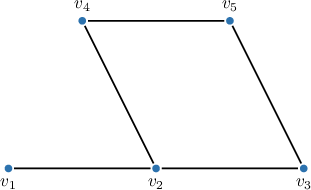

First, let's fix the following order of vertices.

$$

v_1, \: v_2,\: v_3,\: v_4, \: v_5, \: v_6

$$

Now, we proceed as follows:

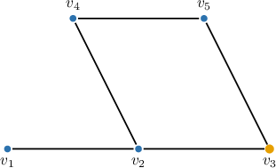

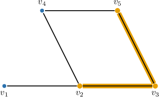

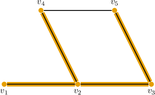

And we're done. The BFS algorithm is complete, and the list of visited vertices, in the order they're visited, are as follows:

$$

v_3,\quad v_2,\quad v_5,\quad v_1,\quad v_4

$$

### Example: Applying Steps of the Breadth-First Search Algorithm

#### Question

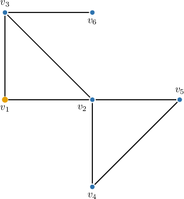

Suppose we fix the following order of the vertices in the above graph: $v_1,$ $v_2,$ $v_3,$ $v_4,$ $v_5,$ $v_6.$ The breadth-first search algorithm is applied to the graph, starting at $v_1.$ After pushing $v_1$ to the end of the queue and adding it to visited vertices, we have the following configuration:

What are the vertices visited by the algorithm on the next iteration?

#### Explanation

Breadth-first search (BFS) is an algorithm that systematically explores a graph by starting at a source node and discovering all its directly connected neighbors. Then, it lists and visits these neighbors, layer by layer, until all reachable nodes have been visited.

The pseudocode for the breadth-first search algorithm is the following:

So, at the next step of the breadth-first search algorithm, we pop (i.e., remove) the vertex from the head (i.e., the front) of the queue. This would be the vertex $v_1.$

Next, we traverse all the vertices that are adjacent to $v_1.$ So, we add $𝑣_{2}$ to the list of visited vertices and push them into the end of the queue.

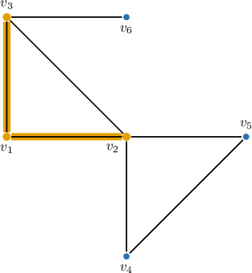

### Example: Applying the Breadth-First Search Algorithm

#### Question

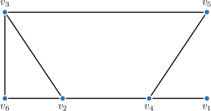

Suppose we fix the following order of vertices in the above graph: $v_1,$ $v_2,$ $v_3,$ $v_4,$ $v_5,$ $v_6.$ Apply the breadth-first search algorithm to this graph, starting at $v_5.$

#### Explanation

Breadth-first search (BFS) is an algorithm that systematically explores a graph by starting at a source node and discovering all its directly connected neighbors. Then, it lists and visits these neighbors, layer by layer, until all reachable nodes have been visited.

The pseudocode for the breadth-first search algorithm is the following:

With that in mind, we proceed as follows:

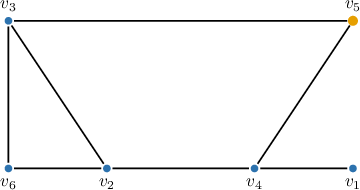

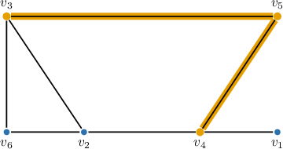

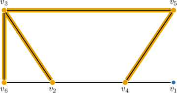

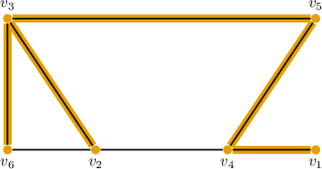
