# Shortest Paths in Unweighted Graphs

Source: https://www.mathacademy.com/topics/2895?courseId=109
Topic ID: 2895

## Prerequisites

- [Breadth-First Search](./2893-breadth-first-search.md)

## Lesson

### Introduction

Finding the shortest path between two vertices in a graph is a fundamental problem in graph theory. Solutions to shortest-path problems have applications in network routing, robotics, game AI, social networks, and urban planning.

The breadth-first search (BFS) algorithm can be augmented for unweighted graphs to efficiently find the shortest path between two vertices.

The steps involved in finding the shortest path using BFS are as follows:

- **Step 1:** Initialize an empty queue and an empty list of visited vertices. Initialize the lists $\texttt{dist[]}$ (initialized to $\infty$) and $\texttt{prev[]}$ (initialized to $-1$) to track distances and predecessors.

- **Step 2:** Add the starting vertex to the queue and the list of visited vertices. Set $\texttt{dist[v] = 0}$ and $\texttt{prev[v] = -1}.$

- **Step 3:** Pop the first vertex $\texttt{u}$ from the head of the queue.

- **Step 4:** For every unvisited neighbor $\texttt{w}$ of $\texttt{u},$ add $\texttt{w}$ to the list of visited vertices, set $\texttt{dist[w] = dist[u] + 1},$ and $\texttt{prev[w] = u}.$

- **Step 5:** Repeat steps 3 and 4 until the queue is empty.

We can recursively trace the shortest path from any vertex to the starting vertex using $\texttt{prev[]}.$

The pseudocode for this modified breadth-first search algorithm is the following:

### A Worked Example

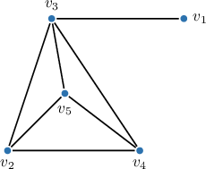

Suppose we fix the following order of vertices in the above graph:

$$

v_1, \: v_2, \: v_3, \: v_4, \: v_5

$$

Let's apply the breadth-first search algorithm to find the shortest path between $v_4$ and $v_1,$ starting from the vertex $v_4.$

We proceed as follows:

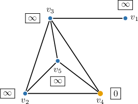

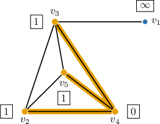

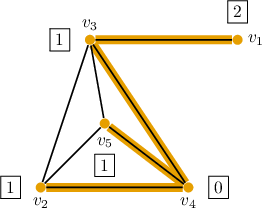

The results show that the distance from $v_4$ to $v_1$ is $2$ (highlighted in the table below).

To find the path from $v_4$ to $v_1,$ we find the previous vertex of $v_1,$ which is $v_3,$ then find the previous vertex to $v_3,$ which is $v_4.$ Therefore, a shortest path from $v_4$ to $v_1$ is $v_4 - v_3 - v_1.$

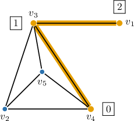

### Example: Applying One Iteration of BFS for Finding Shortest Paths

#### Question

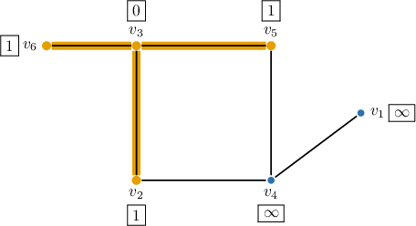

Suppose we fix the following order of the vertices in the above graph: $v_1,$ $v_2,$ $v_3,$ $v_4,$ $v_5,v_6.$ The breadth-first search algorithm for finding the shortest path is applied to the graph, starting at $v_3.$ After considering all the vertices that are connected to $v_3,$ we have the following configuration, where the queue and the array of visited vertices are ordered from left to right:

What is the next step of the algorithm?

#### Explanation

The breadth-first search (BFS) algorithm can be used to find the shortest path from the starting vertex to all the remaining vertices of a graph.

The pseudocode for this modified breadth-first search algorithm is the following:

So, at the next step of the breadth-first search algorithm, we pop (i.e., remove) the vertex from the head (i.e., the front) of the queue. This would be the vertex $v_2.$

Next, we traverse all the vertices that are adjacent to $v_2.$ So, we add $𝑣_{4}$ to the list of visited vertices and push it into the end of the queue.

Then, we set the distance to this newly visited vertex equal to

$$

\begin{aligned}dist[𝑣_{4}] & =dist[𝑣_{2}]+1 \\ & =1+1 \\ & =2\end{aligned}

$$

and set the previous vertex $\boxed{\color{blue}v_2}.$

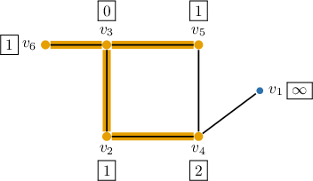

### Example: Finding Shortest Paths Using BFS

#### Question

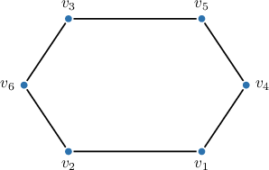

Let's fix the following order of vertices in the above graph: $v_1,$ $v_2,$ $v_3,$ $v_4,$ $v_5,$ $v_6.$ Apply the breadth-first search algorithm for finding the shortest path from $v_3$ to $v_4.$

#### Explanation

The breadth-first search (BFS) algorithm can be used to find the shortest path from the starting vertex to all the remaining vertices of a graph.

The pseudocode for this modified breadth-first search algorithm is the following:

With that in mind, we proceed as follows:

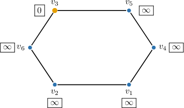

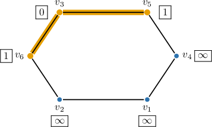

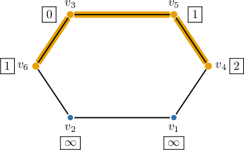

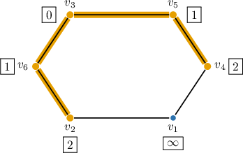

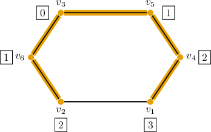

According to the results, the distance from $v_3$ to $v_4$ equals $2$ (highlighted in the table below).

To find the path from $v_3$ to $v_4,$ we find the previous vertex of $v_4,$ which is $v_5,$ then find the previous vertex of $v_5,$ which is $v_3.$

Therefore, a shortest path from $v_3$ to $v_4$ is $v_3 - v_5 - v_4.$

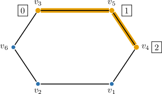
