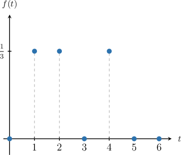

# The Discrete Uniform Distribution

Source: https://www.mathacademy.com/topics/3010?courseId=109
Topic ID: 3010

## Prerequisites

- [Probability Mass Functions of Discrete Random Variables](./1290-probability-mass-functions-of-discrete-random-variables.md)
- [Infinite Sets](../linear-algebra/4386-infinite-sets.md)

## Lesson

### Introduction

A discrete random variable $X$ follows a **discrete uniform distribution** over a set $S$ if each value in $S$ is equally likely.

The probability mass function for the discrete uniform distribution on a set $S$ is given by

$$

\begin{aligned}\frac{1}{|𝑆|},\, & 𝑥∈𝑆, \\ 0, & otherwise.\end{aligned}

$$

When a random variable $X$ follows a discrete uniform distribution over the set $S=\{s_1, s_2, \ldots, s_n\},$ we denote it as

$$

X \sim U \left\{ s_1, s_2, \ldots, s_n\right\}

$$

and we say that $X$ is **uniformly distributed** over $S.$

For example, consider the random variable $T\sim U\{1,2,4\}.$ In this case, $S = \{1,2,4\},$ $|S| = 3,$ and therefore the probability mass function for $T$ is

$$

\begin{aligned}\frac{1}{3},\, & 𝑡∈{1,2,4}, \\ 0, & otherwise.\end{aligned}

$$

A sketch of $f(t)$ is shown below.

**Note:** In this lesson, we will make use of the following formula for computing the cardinality of a set of consecutive numbers:

$$

\left| \{ a, a+1, a+2, \ldots, b \} \right| = b - a + 1

$$

Don't forget about the $+1$ at the end of the formula. The $+1$ is needed because we are including both endpoints $a$ and $b$ in the count. (Not convinced? Notice that $\left| \{4, 5 \} \right| = 5 - 4 + 1 = 2.$)

### Example: Computing a Probability at a Single Point

#### Question

Given that $X \sim U \left\lbrace 7, 8, 9, \ldots, 21 \right\rbrace,$ compute $P(X = 18).$

#### Explanation

If $X$ follows a discrete uniform distribution over a set $S,$ then $X$ has the following probability mass function:

$$

\begin{aligned}\frac{1}{|𝑆|}, & 𝑥∈𝑆 \\ 0, & otherwise\end{aligned}

$$

Here, we have $X \sim U \left\lbrace 7, 8, 9, \ldots, 21 \right\rbrace,$ and the set $S = \left\lbrace 7, 8, 9, \ldots, 21 \right\rbrace$ has $|S|=21 - 7 + 1 = 15$ items. So, we have

$$

\begin{aligned}\frac{1}{15}, & 𝑥=7,8,9,…,21 \\ 0, & otherwise.\end{aligned}

$$

Therefore,

$$

P(X = 18) = f(18) = \dfrac{1}{15}.

$$

### Example: Computing a Probability on an Unbounded Interval

#### Question

Given $X \sim U \left\lbrace 5, 6, 7, \ldots, 14 \right\rbrace,$ compute $P(X \geq 9).$

#### Explanation

If $X$ follows a discrete uniform distribution over a set $S,$ then $X$ has the following probability mass function:

$$

\begin{aligned}\frac{1}{|𝑆|}, & 𝑥∈𝑆 \\ 0, & otherwise\end{aligned}

$$

Here, we have $X \sim U \left\lbrace 5, 6, 7, \ldots, 14 \right\rbrace,$ and the set $S = \left\lbrace 5, 6, 7, \ldots, 14 \right\rbrace$ has $|S|=14 - 5 + 1 = 10$ items. So, we have

$$

\begin{aligned}\frac{1}{10}, & 𝑥=5,6,7,…,14 \\ 0, & otherwise.\end{aligned}

$$

In $S,$ the items that satisfy $X \geq 9$ are $9, 10, 11, \ldots, 14.$ There are $14 - 9 + 1 = 6$ of these items. Therefore,

$$

P(X \geq 9) = 6 \cdot \dfrac{1}{10} = \dfrac{3}{5}.

$$

### Example: Computing a Probability on a Bounded Interval

#### Question

Given $X \sim U \left\lbrace 7, 8, 9, \ldots, 16\right\rbrace,$ compute $P(8 \leq X < 13).$

#### Explanation

If $X$ follows a discrete uniform distribution over a set $S,$ then $X$ has the following probability mass function:

$$

\begin{aligned}\frac{1}{|𝑆|}, & 𝑥∈𝑆 \\ 0, & otherwise\end{aligned}

$$

Here, we have $X \sim U \left\lbrace 7, 8, 9, \ldots, 16 \right\rbrace,$ and the set $S = \left\lbrace 7, 8, 9, \ldots, 16 \right\rbrace$ has $|S|=16 - 7 + 1 = 10$ items. So, we have

$$

\begin{aligned}\frac{1}{10}, & 𝑥=7,8,9,…,16 \\ 0, & otherwise.\end{aligned}

$$

In $S,$ there are $5$ items $(8, 9, 10, 11, 12)$ that satisfy $8 \leq X < 13.$ Therefore,

$$

P(8 \leq X < 13) = 5 \cdot \dfrac{1}{10} = \dfrac{1}{2}.

$$
