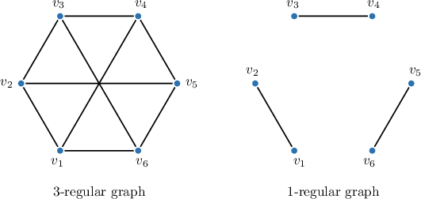
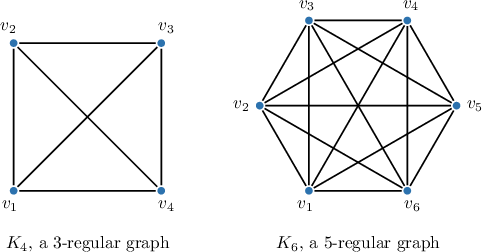
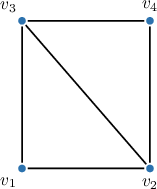
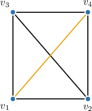
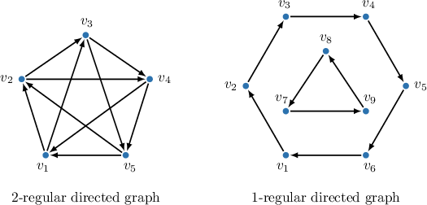
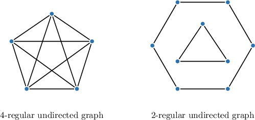
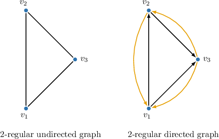
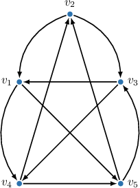

# Regular Graphs

Source: https://www.mathacademy.com/topics/3032?courseId=109
Topic ID: 3032

## Prerequisites

- [Adjacency Matrices of Directed Graphs](./5415-adjacency-matrices-of-directed-graphs.md)
- [Complete and Bipartite Graphs](./5639-complete-and-bipartite-graphs.md)

## Lesson

### Introduction

An undirected graph is called a **regular graph** if all vertices have the same degree.

A regular graph in which all vertices have a degree of $k$ is called a **$k$‑regular graph**.

For example, consider the regular graphs below: for the graph on the left, each vertex has a degree of $3,$ while for the graph on the right, each vertex has a degree of $1.$

If $E$ is the set of all edges in a $k$-regular graph with $n$ vertices, then the number of edges can be calculated using the following formula:

$$

|E|=\dfrac{n\cdot k}{2}

$$

Indeed, there are $n$ vertices, each connected by $k$ edges. Since each edge contributes exactly $2$ to the total sum (as every edge connects two vertices), we need to divide $n\cdot k$ by $2.$

For the graphs above:

- The $3$-regular graph with $6$ vertices has $\dfrac{6\cdot 3}{2}=9$ edges.

- The $1$-regular graph with $6$ vertices has $\dfrac{6\cdot 1}{2}=3$ edges.

Any complete graph (a graph in which each vertex is connected to every other vertex) is a regular graph. More specifically, the complete graph with $n$ vertices, $K_n,$ is an $(n-1)$-regular graph. For example, the graph $K_4$ is a $3$-regular graph, the graph $K_6$ is a $5$-regular graph, and so on. These graphs are drawn below:

### Example: Identifying Regular Graphs

#### Question

Which one edge, if added to the graph above, would make it regular?

#### Explanation

An undirected graph is **** if all its vertices have the same degree. A regular graph in which all vertices have a degree of $k$ is called a $k$‑**.

With that in mind, let's determine the degrees of all vertices:

- Vertices $v_2,$ and $v_3$ have a degree of $3.$

- Vertices $v_1$ and $v_4$ have a degree of $2.$

Hence, to make this graph $3$-regular, we need to increase the degrees of $v_1$ and $v_4$ by $1.$ We can achieve this by adding an edge between them.

Therefore, to make the graph regular, we would need to add the edge $v_1 - v_4.$

### Example: Calculating a Property of a K-Regular Graph

#### Question

If a $k$-regular graph with $8$ vertices has $16$ edges, then what is the value of $k$?

#### Explanation

The number of edges in a $k$-regular graph with $n$ vertices is given by

$$

\begin{aligned}|𝐸|=\frac{𝑛⋅𝑘}{2}.\end{aligned}

$$

Substituting the known values $|E|=16$ and $n=8$ into the formula above and solving for $n,$ we get

$$

\begin{aligned}16 & =\frac{8⋅𝑘}{2} \\ 16 & =4⋅𝑘 \\ 𝑘 & =\frac{16}{4} \\ 𝑘 & =4.\end{aligned}

$$

### Regular Directed Graphs

Recall that, in a directed graph $G=(V,E),$ the indegree of a vertex is the number of incoming edges, while the outdegree is the number of outgoing edges.

A directed graph is called a **regular directed graph** if all its vertices have the same indegree and outdegree, and **$k$-regular** if that degree is $k$. In other words, a $k$-regular directed graph satisfies

$$

\deg^-(v_i)=\deg^+(v_i)=k

$$

for all $v_i\in V$ and some fixed constant $k,$ and a regular directed graph is a directed graph which is $k$-regular for some $k$.

For example, consider the regular directed graphs shown below: in the graph on the left, each vertex has an indegree and an outdegree of $2,$ while in the graph on the right, each vertex has an indegree and an outdegree of $1.$

Every $k$‑regular directed graph can be converted into a $2k$‑regular undirected graph by replacing each of its directed edges with an undirected edge.

For example, if we replace directed edges with undirected edges in the $2$-regular directed graph above (on the left), we obtain a $4$-regular undirected graph. Similarly, if we replace directed edges with undirected edges in the $1$-regular directed graph above (on the right), we obtain a $2$-regular undirected graph.

Conversely, every $k$‑regular undirected graph can be converted into a $k$‑regular directed graph by replacing each of its undirected edges with two oppositely directed edges.

If $E$ is the set of all edges in a $k$-regular directed graph with $n$ vertices, then the number of edges can be calculated using the following formula:

$$

|E|=n \cdot k

$$

Indeed, there are $n$ vertices, each connected by $k$ incoming and $k$ outgoing edges, i.e., $2k$ per vertex in total. Since each edge contributes exactly $2$ to the total sum (as every edge connects two vertices), we need to divide $n\cdot 2k$ by $2.$

For example, consider the regular directed graphs shown above in the beginning:

- The $2$-regular directed graph (on the left) with $5$ vertices has $5 \cdot 2=10$ edges.

- The $1$-regular directed graph (on the right) with $9$ vertices has $9 \cdot 1=9$ edges.

### Example: Identifying Regular Directed Graphs

#### Question

$$

\begin{aligned}0 & 0 & 0 & 1 & 1 \\ 1 & 0 & 1 & 0 & 0 \\ 1 & 0 & 0 & 1 & 0 \\ 0 & 1 & 0 & 0 & 1 \\ 0 & 1 & 1 & 0 & 0\end{aligned}

$$

What type of regular directed graph is represented by this adjacency matrix above?

#### Explanation

A directed graph is called **** if all its vertices have the same indegree and outdegree. Each vertex in a $k$‑regular directed graph has exactly $k$ incoming and $k$ outgoing edges.

Recall that the indegree and outdegree of a vertex is the sum of the values in its corresponding column and row in the adjacency matrix, respectively. As a result, the adjacency matrix of a $k$-regular directed graph must contain exactly $k$ ones in each row and each column.

The given adjacency matrix $A$ contains exactly $2$ ones in each row and each column; hence, it represents a $2$-regular directed graph.

The corresponding $2$-regular directed graph is shown below.

### Example: Calculating a Characteristic of a K-Regular Directed Graph

#### Question

How many vertices does a $2$-regular directed graph with $12$ edges have?

#### Explanation

The number of edges in a $k$-regular directed graph with $n$ vertices is given by

$$

\begin{aligned}|𝐸|=𝑛⋅𝑘.\end{aligned}

$$

Substituting the known values $|E|=12$ and $K=2$ into the formula above and solving for $n,$ we get

$$

\begin{aligned}12 & =𝑛⋅2 \\ 𝑛 & =\frac{12}{2} \\ 𝑛 & =6.\end{aligned}

$$

Therefore, a $2$-regular directed graph with $12$ edges has $\boxed{\color{blue}6}$ vertices.
