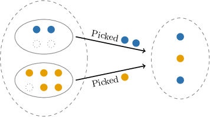

# The Hypergeometric Distribution

Source: https://www.mathacademy.com/topics/3073?courseId=109
Topic ID: 3073

## Prerequisites

- [Computing Probabilities Using Combinatorics](../geometry/132-computing-probabilities-using-combinatorics.md)
- [Probability Mass Functions of Discrete Random Variables](./1290-probability-mass-functions-of-discrete-random-variables.md)

## Lesson

### Introduction

Suppose a bag contains $10$ candies, $4$ of which are blue and $6$ are orange. We randomly select $3$ candies from the bag *without replacement* and count the number of blue candies.

Let's assume we run this experiment and draw the following sequence:

$$

\stackrel{\color{green}{\checkmark}}{\textrm{blue}},\qquad {\color{black}{\textrm{orange}}},\qquad \stackrel{\color{green}{\checkmark}}{\textrm{blue}}

$$

A diagram like the one shown below can help us visualize this process. It helps to imagine the bag containing two distinct sets of candies (blue and orange).

Let's interpret choosing a blue candy as a "success" and orange as a "failure."

Let the random variable $X$ equal the number of successes (blue candies in the sample). In the example above, we have $X=2.$ The probability $P(X=2)$ is given by the following ratio:

$$

3

$$

The denominator represents all possible ways to choose $3$ candies from $10,$ while the numerator represents only those cases where exactly $2$ are blue.

To calculate this probability, we proceed as follows:

- **Step 1**: Determine the number of samples of size $3$ containing $2$ blue candies: The number of ways of selecting $2$ blue candies from a total of $4$ in the population is given by The number of ways of selecting $1$ orange candy from a total of $6$ in the population is So, by the *rule of product,* the number of samples of size $3$ with precisely $2$ blue candies is (Note. The symbol $\textrm{#}$ is shorthand for "number").

- **Step 2**: Determine the total number of samples of size $3.$ This is simply the number of ways of selecting $3$ objects from a population of $10.$ This is given by

- **Step 3**: Divide the results. Therefore, we conclude that

This same reasoning applies in more general situations where we sample without replacement. If we have a population of $N$ objects, where $K$ are "successes," and we randomly draw $n$ objects, then the number of successes follows a so-called **hypergeometric distribution,** and we write

$$

X \sim \textrm{Hypergeometric}(N, K, n).

$$

In our example, we had

$$

X\sim \textrm{Hypergeometric}(10, 4, 3),

$$

since there were $N=10$ candies, $K=4$ blue candies (successes), and we were considering samples of size $n=3.$

### Example: Finding a Hypergeometric Probability

#### Question

A jar contains $30$ coins, $18$ of which are quarters, and the rest are dimes. A sample of $9$ coins is drawn. If $X$ represents the number of quarters in the sample, find an expression representing $P (X = 5).$

#### Explanation

The probability that a sample of $9$ coins contains precisely $5$ quarters is given by

$$

9

$$

Let's calculate the numerator and denominator separately.

- First, let's find the number of samples of size $9$ with precisely $5$ quarters. The number of ways of selecting $5$ quarters from a total of $18$ in the population is The other $9-5=4$ coins in the sample are dimes. The number of ways of selecting $4$ dimes from a total of $30-18=12$ in the population is So, by the rule of product, the number of samples of size $9$ with precisely $5$ quarters is

$$

\begin{aligned}# of samples with precisely 5 quarters & =# of ways to select 5 quarters \\ & \,\,×\,# of ways to select 4 dimes \\ & =(\frac{18}{5})⋅(\frac{12}{4}).\end{aligned}

$$

- Next, we find the number of samples of size $9$ from a population of size $30.$ This is given by

Therefore,

$$

\begin{aligned}𝑃(𝑋=5) & =\frac{# of samples of size 9 with precisely 5 quarters}{# of samples of size 9} \\ & =\frac{(\frac{18}{5})⋅(\frac{12}{4})}{5}.\end{aligned}

$$

### Example: Calculating a Hypergeometric Probability

#### Question

Given that $X \sim \textrm{Hypergeometric}(12, 7, 5),$ compute $P(X = 3).$ Round your answer to $3$ decimal places.

#### Explanation

A hypergeometric random variable $X \sim \textrm{Hypergeometric}(N, K, n)$ counts the number of successes in a random sample of size $n,$ drawn without replacement from a population of size $N,$ which contains $K$ items with a successful characteristic.

The probability that a sample of size $5$ contains precisely $3$ successes is given by

$$

5

$$

Let's calculate the numerator and denominator separately.

- First, let's find the number of samples of size $5$ with precisely $3$ successes. The number of ways of selecting $3$ successes from a total of $7$ successes in the population is The other $5-3=2$ items in the sample are failures. The number of ways of selecting $2$ failures from a total of $12-7=5$ failures in the population is So, by the rule of product, the number of samples of size $5$ with precisely $3$ successes is

$$

\begin{aligned}# of samples with precisely 3 successes & =# of ways to select 3 successes \\ & \,\,×\,# of ways to select 2 failures \\ & =(\frac{7}{3})⋅(\frac{5}{2}).\end{aligned}

$$

- Next, we find the number of samples of size $5$ from a population of size $12.$ This is given by

Therefore,

$$

\begin{aligned}𝑃(𝑋=3) & =\frac{# of samples of size 5 with precisely 3 successes}{# of samples of size 5} \\ & =\frac{(\frac{7}{3})⋅(\frac{5}{2})}{3} \\ & =\frac{35⋅10}{792} \\ & ≈0.442.\end{aligned}

$$

### Example: Finding a Hypergeometric Probability Over an Interval

#### Question

If $X \sim \textrm{Hypergeometric}(16, 7, 5)$ with $X \in \{0,\ldots,5\},$ find $P(X \lt 2)$ rounded to $3$ decimal places.

#### Explanation

A hypergeometric random variable $X \sim \textrm{Hypergeometric}(N, K, n)$ counts the number of successes in a random sample of size $n,$ drawn without replacement from a population of size $N,$ which contains $K$ items with a successful characteristic.

Firstly, since $X \in \{0,\ldots,5\},$ we have

$$

P(X \lt 2) = P(X \in \left\{ 0,1 \right\}) = P(X = 0) + P(X = 1) .

$$

The probability that a sample of size $5$ contains precisely $x$ successes is given by

$$

5

$$

Note that there are $16-7=9$ failures in the population. Now, let's compute each probability separately.

- For $x = 0$ successes, there are $5-0=5$ failures in the sample. So, we have

$$

\begin{aligned}𝑃(𝑋=0) & =\frac{# of samples of size 5 with precisely 0 successes}{# of samples of size 5} \\ & =\frac{# of ways to select 0 successes×# of ways to select 5 failures}{# of samples of size 5} \\ & =\frac{(\frac{7}{0})⋅(\frac{9}{5})}{0}.\end{aligned}

$$

- Similarly, for $x = 1$ success, there are $5-1=4$ failures in the sample. So, we get

$$

\begin{aligned}𝑃(𝑋=1) & =\frac{# of samples of size 5 with precisely 1 success}{# of samples of size 5} \\ & =\frac{# of ways to select 1 success×# of ways to select 4 failures}{# of samples of size 5} \\ & =\frac{(\frac{7}{1})⋅(\frac{9}{4})}{1}.\end{aligned}

$$

Therefore, we have

$$

\begin{aligned}𝑃(𝑋<2) & =𝑃(𝑋=0)+𝑃(𝑋=1) \\ & =\frac{(\frac{7}{0})⋅(\frac{9}{5})}{0}+\frac{(\frac{7}{1})⋅(\frac{9}{4})}{1} \\ & =\frac{1⋅126}{4368}+\frac{7⋅126}{4368} \\ & ≈0.231,\end{aligned}

$$

rounded to $3$ decimal places.
