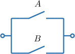
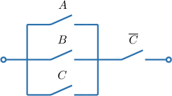
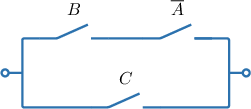
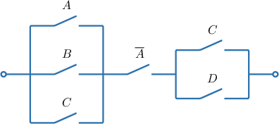
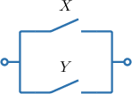

# Introduction to Logic Circuits

Source: https://www.mathacademy.com/topics/3789?courseId=109
Topic ID: 3789

## Prerequisites

- [Boolean Functions And Logical Operations](./3779-boolean-functions-and-logical-operations.md)

## Lesson

### Introduction

A **logic circuit** is an electrical circuit that performs logical operations on one or more binary inputs to produce a binary output. These circuits are fundamental to digital systems and can be represented mathematically using Boolean functions, which define their behavior.

One such logic circuit is a **switch circuit**. A Boolean variable $A$ (or a negation $\overline{A}$) represents a switch in the circuit.

Conjunction $A \land B$ can be represented by switches $A$ and $B$ connected "in series," i.e., consecutively. For an electrical current to flow through the circuit, it must pass through switches $A$ *and* $B$ (i.e., both must be true).

A disjunction $A \lor B$ can be represented by switches $A$ and $B$ connected "in parallel." For current to flow through the circuit, it must pass either through either switch $A$ *or* switch $B$ (i.e., at least one must be true).

To create larger circuits, we can combine "in series" and "in parallel" switches. For example, let's construct the logic circuit represented by the expression $A \lor (\overline{B} \land C).$

Considering the expression from right to left and taking into account the parentheses, we get the following:

- The conjunction of $\overline{B}$ and $C$ corresponds to a series connection, as shown below.

- Now, the disjunction of $A$ and $\overline{B} \land C$ corresponds to a parallel connection. Therefore, the given expression represents the following circuit:

### Example: Constructing a Logical Expression Given a Switching Circuit

#### Question

Find an expression representing the switching circuit above.

#### Explanation

Recall that:

- The conjunction $X \land Y$ represents switches $X$ and $Y$ connected "in series" (i.e., consecutively):

- The disjunction $X \lor Y$ represents switches $X$ and $Y$ connected "in parallel":

Considering the given circuit from right to left, we get the following:

- The switches $A,$ $B,$ and $C$ are connected in parallel. So, this part can be represented as $A \lor B \lor C.$

- Now, the part corresponding to $A \lor B \lor C$ and the switch $\overline{C}$ are connected in series. Therefore, the whole circuit can be represented by the expression

### Example: Constructing a Switching Circuit Given a Logical Expression

#### Question

Draw a switching circuits representing the logical expression $(B\land \overline{A})\lor C?$

#### Explanation

Recall that:

- The conjunction $X \land Y$ represents switches $X$ and $Y$ connected "in series" (i.e., consecutively):

- The disjunction $X \lor Y$ represents switches $X$ and $Y$ connected "in parallel":

Considering the given expression from left to right and taking into account the parentheses, we get the following:

- The conjunction of $B$ and $\overline{A}$ corresponds to a series connection, as shown below.

- Now, the disjunction of $(B \land \overline{A})$ and $C$ corresponds to a parallel connection. Therefore, the given expression represents the following circuit:

### Example: Constructing a Logical Expression Given a Switching Circuit: Advanced Cases

#### Question

Write the expressions represented by the switching circuit below.

#### Explanation

Recall that:

- The conjunction $X \land Y$ represents switches $X$ and $Y$ connected "in series" (i.e., consecutively):

- The disjunction $X \lor Y$ represents switches $X$ and $Y$ connected "in parallel":

The left part of the circuit represents

$$

A \lor B\lor C

$$

and the right part represents

$$

\ \overline {A}\land (C\lor D).

$$

These parts are connected in series. Therefore, the given circuit represents the following expression:

$$

(A \lor B\lor C)\land \overline {A}\land (C\lor D)

$$
