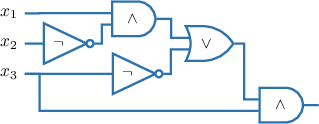
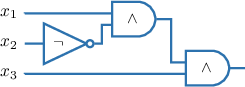
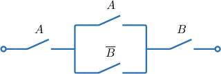
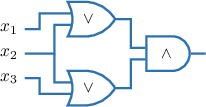
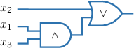

# Simplifying Logic Circuits

Source: https://www.mathacademy.com/topics/3790?courseId=109
Topic ID: 3790

## Prerequisites

- [Tautologies and Contradictions](../methods-of-proof/249-tautologies-and-contradictions.md)
- [The Distributive Laws](../methods-of-proof/2822-the-distributive-laws.md)
- [Logic Gates and Combinational Circuits](./3791-logic-gates-and-combinational-circuits.md)

## Lesson

### Introduction

We can simplify logical circuits by simplifying the logical expressions they represent. This has application in the design of electrical circuits, where we want our designs to be as simple as possible.

For example, let's simplify the circuit below.

First, notice that the given circuit represents the expression

$$

((x_1 \land \overline{x_2}) \lor \overline{x_3}) \land x_3.

$$

We can simplify the obtained expression using the laws of propositional logic:

$$

\begin{aligned}((𝑥_{1}∧\overset{𝑥_{2}}{})∨\overset{𝑥_{3}}{})∧𝑥_{3} & ≡((𝑥_{1}∧\overset{𝑥_{2}}{})∧𝑥_{3})∨(\overset{𝑥_{3}}{}∧𝑥_{3}) \\ & ≡(𝑥_{1}∧\overset{𝑥_{2}}{}∧𝑥_{3})∨𝐜 \\ & ≡𝑥_{1}∧\overset{𝑥_{2}}{}∧𝑥_{3}\end{aligned}

$$

The final expression corresponds to the following combinatorial circuit:

This circuit is equivalent to the original but is much simpler.

Let's look at how to use the same idea to simplify a switching circuit. In real-world applications involving electronic circuit design, this type of simplification could streamline manufacturing processes and reduce costs.

### Example: Simplifying Switching Circuits

#### Question

Simplify the switching circuit shown above.

#### Explanation

First, notice that the given circuit represents the expression

$$

A \land (A \lor \overline{B} ) \land B.

$$

Now, we can simplify the obtained expression using the logical associative law and the absorption law:

$$

\begin{aligned}𝐴∧(𝐴∨\overset{𝐵}{})∧𝐵 & ≡(𝐴∧(𝐴∨\overset{𝐵}{}))∧𝐵 \\ & ≡𝐴∧𝐵\end{aligned}

$$

The final expression corresponds to the following switching circuit:

### Example: Simplifying Combinatorial Circuits

#### Question

Simplify the combinatorial circuit shown above.

#### Explanation

First, notice that the given circuit represents the expression

$$

(x_1 \lor x_2) \land (x_2 \lor x_3).

$$

Now, we can simplify the obtained expression using the laws of propositional logic:

$$

\begin{aligned}(𝑥_{1}∨𝑥_{2})∧(𝑥_{2}∨𝑥_{3}) & ≡(𝑥_{2}∨𝑥_{1})∧(𝑥_{2}∨𝑥_{3}) \\ & ≡𝑥_{2}∨(𝑥_{1}∧𝑥_{3})\end{aligned}

$$

The final expression corresponds to the following combinatorial circuit:

