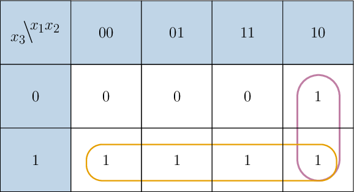
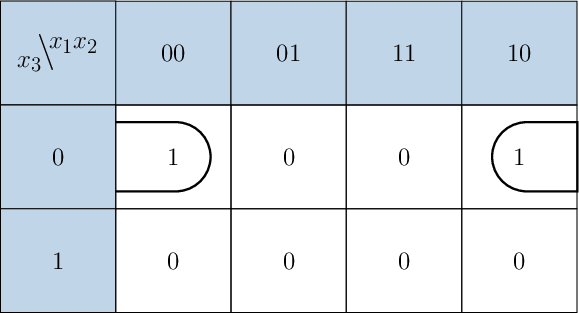
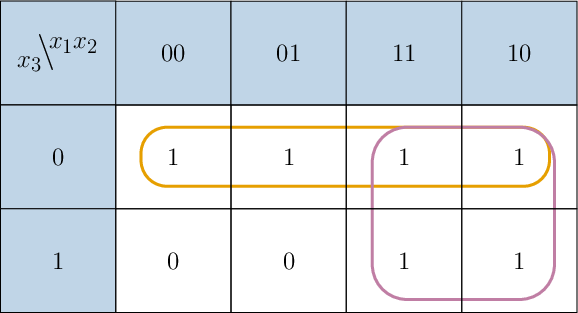

# Simplifying Logical Expressions Using Karnaugh Maps

Source: https://www.mathacademy.com/topics/3793?courseId=109
Topic ID: 3793

## Prerequisites

- [Disjunctive Normal Forms](./3780-disjunctive-normal-forms.md)

## Lesson

### Introduction

A **Karnaugh map**, also known as a K-map, is a graphical method for simplifying Boolean expressions and minimizing logical functions. It is a two-dimensional representation of the truth table, with each cell corresponding to a unique combination of input variables.

Let's see how to create a Karnaugh map. Consider the Boolean function $f$ represented by the following truth table:

First, we draw an empty Karnaugh map. Since there are three variables, we arrange a table where the different variable values of $x_1x_2$ control the columns, and the different variable values of $x_3$ control the rows, as shown below.

Notice that the tuples corresponding to the variables $x_1x_2$ in the heading are $00,$ $01,$ $11,$ $10$ (in that exact order). This is because any two neighboring tuples must differ from each other by exactly one place/value.

Now, let's fill in the missing values.

- The intersection of column $00$ and row $0$ corresponds to the binary tuple $(x_1,x_2,x_3) = (0,0,0).$ From the truth table of our function, we have $f(0,0,0)=0.$ So, we put $0$ in the cell located at this intersection. $\Large _{x_3} \!\backslash\! ^{x_1x_2}$ $00$ $01$ $11$ $10$ $0$ $0$ $1$

- The intersection of column $00$ and row $1$ corresponds to the binary tuple $(x_1,x_2,x_3) = (0,0,1).$ From the truth table of our function, we have $f(0,0,1)=1.$ So, we put $1$ in the cell located at this intersection. $\Large _{x_3} \!\backslash\! ^{x_1x_2}$ $00$ $01$ $11$ $10$ $0$ $0$ $1$ $1$

- The intersection of column $01$ and row $0$ corresponds to the binary tuple $(x_1,x_2,x_3) = (0,1,0).$ From the truth table of our function, we have $f(0,1,0)=0.$ So, we put $0$ in the cell located at this intersection. $\Large _{x_3} \!\backslash\! ^{x_1x_2}$ $00$ $01$ $11$ $10$ $0$ $0$ $0$ $1$ $1$

- The intersection of column $01$ and row $1$ corresponds to the binary tuple $(x_1,x_2,x_3) = (0,1,1).$ From the truth table of our function, we have $f(0,1,1)=1.$ So, we put $1$ in the cell located at this intersection. $\Large _{x_3} \!\backslash\! ^{x_1x_2}$ $00$ $01$ $11$ $10$ $0$ $0$ $0$ $1$ $1$ $1$

Continuing similarly, we obtain the following Karnaugh map.

### Example: Building a Karnaugh Map

#### Question

Given the Boolean function $f$ above, fill in the missing values in the corresponding Karnaugh map for three variables below.

#### Explanation

First, let's draw an empty Karnaugh map, as shown below. Notice that the tuples corresponding to the variables $x_1x_2$ in the heading are $00,$ $01,$ $11,$ $10$ (in that exact order). This is because any two neighboring tuples must differ from each other by exactly one place/value.

We are already given some values in the map. So, let's write them down to the table.

Now, let's fill in the missing values in turn.

- The intersection of column $01$ and row $0$ corresponds to the binary tuple $(x_1,x_2,x_3) = (0,1,0).$ From the truth table of our function, we have $f(0,1,0)=0.$ So, we put $0$ in the cell located at this intersection. $\Large _{x_3} \!\backslash\! ^{x_1x_2}$ $00$ $01$ $11$ $10$ $0$ $1$ $0$ $0$ $1$ $0$ $1$ $0$

- The intersection of column $10$ and row $0$ corresponds to the binary tuple $(x_1,x_2,x_3) = (1,0,0).$ From the truth table of our function, we have $f(1,0,0)=0.$ So, we put $0$ in the cell located at this intersection. $\Large _{x_3} \!\backslash\! ^{x_1x_2}$ $00$ $01$ $11$ $10$ $0$ $1$ $0$ $0$ $0$ $1$ $0$ $1$ $0$

- The intersection of column $11$ and row $1$ corresponds to the binary tuple $(x_1,x_2,x_3) = (1,1,1).$ From the truth table of our function, we have $f(1,1,1)=1.$ So, we put $1$ in the cell located at this intersection. $\Large _{x_3} \!\backslash\! ^{x_1x_2}$ $00$ $01$ $11$ $10$ $0$ $1$ $0$ $0$ $0$ $1$ $0$ $1$ $1$ $0$

Therefore, the final Karnaugh map is the following:

### Finding a Minimized DNF Using Karnaugh Maps

The grid format of Karnaugh maps helps visualize the grouping of minterms in a Boolean function's disjunctive normal form (DNF). This makes it easier to identify common factors and apply Boolean algebra simplification techniques to minimize the DNF expression.

To simplify an expression using its Karnaugh map, we group $1$'s into blocks that obey the following rules:

- The dimensions of each block must be a power of $2,$ i.e., $1 \times 1,$ $2 \times 1,$ $1 \times 2,$ $4 \times 1,$ $1 \times 4,$ or $2 \times 2.$

- Blocks should be as large as possible. For example, prioritize a $4 \times 1$ block over two $2 \times 1$ blocks.

- All the $1$'s must be in *at least* one block. Some can be in more than one block.

Each block corresponds to specific values of some of the variables, which in turn corresponds to an elementary conjunction. Combining the conjunctions with disjunctions, we obtain the minimized DNF.

To demonstrate, consider the Karnaugh map we constructed previously.

Here, we can

- group the $1$'s in the cells $100$ and $101$ into a $2\times 1$ block, and

- group the $1$'s in the cells $001,$ $011,$ $111,$ and $101$ into a $1\times 4$ block,

as shown below.

Let's find the elementary conjunction corresponding to each block:

- Over the $2 \times 1$ block, we have $x_1 = 1$ and $x_2 = 0.$ So, this corresponds to $x_1 \land \overline{x_2} \equiv x_1\,\overline{x_2}.$

- Over the $1 \times 4$ block, we have $x_3 = 1.$ So, this corresponds to $x_3.$

Therefore, combining the elementary conjunctions with a disjunction, we obtain the following minimized DNF expression:

$$

x_1\,\overline{x_2} \lor x_3

$$

**Note:** Blocks may "wrap around" the table, such as the $1\times2$ block shown below, corresponding to $\overline{x_2}\,\overline{x_3}.$

### Example: Interpreting a Karnaugh Map to Minimize a DNF

#### Question

A Boolean function $f$ of three variables has the corresponding Karnaugh map shown above. Find a minimized DNF representing the given function.

#### Explanation

To simplify a disjunctive normal form using Karnaugh maps, we need to combine $1 \times 1,$ $2 \times 1,$ $1 \times 2,$ $4 \times 1,$ $1 \times 4,$ or $2 \times 2$ blocks of $1$'s in the map, where each block is as large as possible.

For the given map, we can proceed as follows.

- Combine cells $000$ and $100$ into a $1 \times 2$ block, as shown below. Over this block, $x_2=0$ and $x_3=0,$ while $x_1$ changes its value. So, this corresponds to the conjunction

- Combine cells $001$ and $011$ into a $1 \times 2$ block, as shown below. Over this block, $x_1=0$ and $x_3=1,$ while $x_2$ changes its value. So, this corresponds to the conjunction

Therefore, we obtain the following minimized expression:

$$

f\equiv \overline{x_2} \, \overline{x_3} \lor \overline{x_1} \, {x_3}

$$

### Example: Minimizing a DNF

#### Question

Consider the Boolean function $f$ given by the table below.

Fill in the blanks below corresponding to the Karnaugh map for the function $f.$

Finally, find a minimized DNF that represents the function $f.$

#### Explanation

Comparing the column and row of each missing cell with the truth table of our function, we get the following Karnaugh map corresponding to the function:

To simplify a disjunctive normal form using Karnaugh maps, we need to combine $1 \times 1,$ $2 \times 1,$ $1 \times 2,$ $4 \times 1,$ $1 \times 4,$ or $2 \times 2$ blocks of $1$'s in the map, where each block is as large as possible.

Here, we have one $2 \times 2$ block and one $1 \times 4$ block, as shown below.

- Over the $2\times2$ block, we have $x_1=1.$ So, this corresponds to $x_1.$

- Over the $1\times4$ block, we have $x_3=0.$ So, this corresponds to $\overline{x_3}.$

Therefore, we obtain the following minimized expression:

$$

f\equiv x_1 \lor \overline{x_3}

$$
