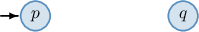
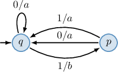
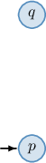
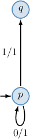
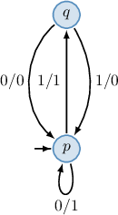
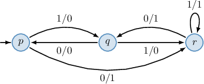

# Mealy Machines

Source: https://www.mathacademy.com/topics/3795?courseId=109
Topic ID: 3795

## Prerequisites

- [Processing Strings Using Deterministic Finite Automata](./5414-processing-strings-using-deterministic-finite-automata.md)

## Lesson

### Introduction

In a previous lesson, we discussed that there are two main types of automata: *acceptors* and *transducers*. Recall:

- An acceptor is a machine that receives a string as input and then either accepts or rejects the string.

- A transducer is a machine that receives a string as input and then returns another string as output.

In this lesson, we will focus on transducers.

One example of a transducer is the **Mealy machine**, which processes an input string and produces a corresponding output string.

More formally, a Mealy machine is a six-tuple of the form $M=(Q, \Sigma, \Gamma, \delta, \omega, q_0),$ where:

- $Q$ is a nonempty finite set of **states**. These are all the possible configurations the machine can be in.

- $\Sigma$ is a nonempty finite set of **input symbols**. The machine can process this "alphabet" of symbols as inputs.

- $\Gamma$ is a nonempty finite set of **output symbols**. The machine can write this "alphabet" of symbols as outputs.

- $\delta$ is a **transition function** of the form $\delta: Q \times \Sigma \to Q.$ It takes a state and an input symbol and returns a state. This function determines how the machine moves from one state to another based on a given input symbol.

- $\omega$ is an **output function** of the form $\omega: Q \times \Sigma \to \Gamma.$ It takes a state and an input symbol and returns an output symbol. This function determines what symbol to write based on a given state and input symbol.

- $q_0 \in Q$ is a **start state** (or **initial state**). This is the state in which the machine begins.

We can visualize a Mealy machine as a directed graph where

- the vertices represent the states,

- the arcs, labeled with input and output symbols, represent transitions from one state to another, and the corresponding output symbol, and

- the start state is labeled by the input arrow $\to.$

An example of a Mealy machine is shown in the diagram below.

In this case, the machine has the following components:

- The set of states $Q = \{p,q,r\}$ (represented by the vertices).

- The set of input symbols $\Sigma = \{0,1\}$ (represented by the first part of the arcs' labels).

- The set of output symbols $\Gamma = \{0,1\}$ (represented by the second part of the arcs' labels).

- The transition and output functions $\delta$ and $\omega$ with the following transitions and outputs defined by the arcs: For instance, the arrow from $p$ to $q,$ labeled $1/0,$ means that $\delta(p,1) = q$ and $\omega(p,1) = 0.$

- The start state $p$ (that is labeled by the input arrow $\to$), as shown below.

### Transition and Output Tables of Mealy Machines

Transition and output functions, $\delta$ and $\omega,$ are often put into tables, where a row represents a state $q,$ a column represents an input symbol $a,$ and their intersection is the value of the functions $\delta(q,a)$ and $\omega(q,a),$ respectively.

Below is an example of a Mealy machine's transition table (on the left) and output table (on the right). Note that we place $\to$ next to the start state in the transition table.

Let's construct a diagram of the machine given by these tables. From the tables, we determine that the machine has the following components:

- the set of states $Q = \{p, q\}$ (given by the rows),

- the set of input symbols $\Sigma = \{0,1\}$ (given by the columns),

- the set of output symbols $\Gamma = \{x,y\}$ (given by the values in the output table),

- the start state $p$ (labeled by $\to$ in the transition table), and

- the transition function $\delta$ and the output function $\omega$ are given in the tables.

Now that we have the components, we can construct the diagram. First, let's draw the states of our machine.

According to the transition table, $p$ is the start state, so we labeled it with an input arrow. From the tables, we also get the following:

- Consider row $p$ of the tables. Its intersection with column $0$ in the transition table is $p,$ indicating that $\delta(p,0) = p,$ and its intersection with column $0$ in the output table is $x,$ indicating that $\omega(p,0)=x.$ So, we draw an arrow (loop) from $p$ to $p,$ labeled $0/x.$ Its intersection with column $1$ in the transition table is $q,$ indicating that $\delta(p,1) = q,$ and its intersection with column $1$ in the output table is $y,$ indicating that $\omega(p,1)=y.$ So, we draw an arrow from $p$ to $q,$ labeled $1/y.$

- Consider row $q$ of the tables. Its intersection with column $0$ in the transition table is $p,$ indicating that $\delta(q,0) = p,$ and its intersection with column $0$ in the output table is $y,$ indicating that $\omega(q,0)=y.$ So, we draw an arrow from $q$ to $p,$ labeled $0/y.$ Its intersection with column $1$ in the transition table is $q,$ indicating that $\delta(q,1) = q,$ and its intersection with column $1$ in the output table is $x,$ indicating that $\omega(q,1)=x.$ So, we draw an arrow (loop) from $q$ to $q,$ labeled $1/x.$

We have gone through every cell in the tables and added all the arcs, so our diagram is complete.

### Example: Constructing Transition and Output Tables Given a Diagram

#### Question

The diagram above shows a Mealy machine. Write down the correct options in the corresponding output table below.

#### Explanation

In our case, the automaton has the following components:

- the set of states $Q=\{p,q\},$

- the set of input symbols $\Sigma=\{0,1\},$

- the set of output symbols $\Gamma=\{a,b\},$ and

- the start state $q.$

With that in mind, let's determine the output function.

First, we draw an empty table with a different state written in each row and a different input symbol written in each column:

Next, we fill in the empty cells:

- There is an arrow from $p$ to $q,$ labeled $0/\boxed{a}.$ This means that $\omega(p,0)=\boxed{a}.$ So, we write $a$ at the intersection of row $p$ and column $0.$

- There is an arrow from $p$ to $q,$ labeled $1/\boxed{a}.$ This means that $\omega(p,1)=\boxed{a}.$ So, we write $a$ at the intersection of row $p$ and column $1.$

- There is an arrow (loop) from $q$ to $q,$ labeled $0/\boxed{a}.$ This means that $\omega(q,0)=\boxed{a}.$ So, we write $a$ at the intersection of row $q$ and column $0.$

- There is an arrow from $q$ to $p,$ labeled $1/\boxed{b}.$ This means that $\omega(q,1)=\boxed{b}.$ So, we write $b$ at the intersection of row $q$ and column $1.$

The output table corresponding to the given diagram is shown below.

### Example: Drawing a Diagram Given Transition and Output Tables

#### Question

Draw the diagram that represents the Mealy machine given by the above transition table (on the left) and the output table (on the right)?

#### Explanation

In our case, the Mealy machine has the following components:

- the set of states $Q=\{p,q\},$

- the set of input symbols $\Sigma=\{0,1\},$

- the set of output symbols $\Gamma=\{0,1\},$

- the start state $p,$ and

- the transition function $\delta$ and the output function $\omega$ are given in the tables.

First, let's draw the states of our machine.

According to the transition table, $p$ is the start state, so we labeled it with an input arrow.

From the tables, we also get the following:

- Consider row $p$ of the tables. Its intersection with column $0$ in the transition table is $p,$ indicating that $\delta(p,0)=p,$ and its intersection with column $0$ in the output table is $1,$ indicating that $\omega(p,0)=1.$ So, we draw an arrow (loop) from $p$ to $p,$ labeled $0/1.$ Its intersection with column $1$ in the transition table is $q,$ indicating that $\delta(p,1)=q,$ and its intersection with column $1$ in the output table is $1,$ indicating that $\omega(p,1)=1.$ So, we draw an arrow from $p$ to $q,$ labeled $1/1.$

- Consider row $q$ of the tables. Its intersection with column $0$ in the transition table is $p,$ indicating that $\delta(q,0)=p,$ and its intersection with column $0$ in the output table is $0,$ indicating that $\omega(q,0)=0.$ So, we draw an arrow from $q$ to $p,$ labeled $0/0.$ Its intersection with column $1$ in the transition table is $p,$ indicating that $\delta(q,1)=p,$ and its intersection with column $1$ in the output table is $0,$ indicating that $\omega(q,1)=0.$ So, we draw an arrow from $q$ to $p,$ labeled $1/0.$

We have been through every cell in the tables, so our diagram is complete.

### Using Mealy Machines to Process Strings

A Mealy machine can process a string by extending the definition of its output function $\omega$ to process each symbol of the string in turn.

Let $\sigma = a\beta$ be a string, where $a$ is the first symbol of $\sigma,$ and $\beta$ is the remainder of $\sigma$ after removing the first symbol. Then, more formally, we can extend the output function $\omega$ of the machine to strings recursively as follows:

$$

\begin{aligned}𝜔(𝑞,𝜖) & =𝜖 \\ 𝜔(𝑞,𝜎) & =𝜔(𝑞,𝑎)⋅𝜔(𝛿(𝑞,𝑎),𝛽)\end{aligned}

$$

where $\epsilon$ denotes the empty string (the string containing no symbols), $q$ is a state of the machine, $\delta$ is the transition function, and $\cdot$ denotes a concatenation of strings.

To demonstrate, let's find $\omega(p, 110),$ where $\omega: Q \times \Sigma \to \Gamma$ is the output function of the Mealy machine represented by the diagram below.

According to the definition of the extension of the output function $\omega$ on the set of strings, we obtain the following:

$$

\begin{aligned}𝜔(𝑝,110) & =𝜔(𝑝,1)⋅𝜔(𝛿(𝑝,1),10) \\ & =0⋅𝜔(𝑞,10) \\ & =0⋅𝜔(𝑞,1)⋅𝜔(𝛿(𝑞,1),0) \\ & =00⋅𝜔(𝑟,0) \\ & =001\end{aligned}

$$

Working with the formal definition can be tricky. So, let's describe what is going on in the computations from a slightly different point of view.

- **Step 1.** The machine is in the start state $p$ and observes the first letter of the string: From the diagram, $\delta(p,1)=q.$ So, the machine switches to state $q$ and moves to the next letter of the input string. At the same time, since $\omega(p,1)=0,$ the machine outputs $\boxed{0}.$

- **Step 2.** The machine is in the state $q$ and observes the second letter of the string: From the diagram, $\delta(q,1)=r.$ So, the machine switches to state $r$ and moves to the next letter of the string. At the same time, since $\omega(q,1)=0,$ the machine outputs $\boxed{0}.$

- **Step 3.** The machine is in the state $r$ and observes the third letter of the string: From the diagram, $\delta(r,0)=q.$ So, the machine switches to state $q$ and stops since the entire string has been processed. At the same time, since $\omega(r,0)=1,$ the machine outputs $\boxed{1}.$

Therefore, $\omega(p, 110)=\boxed{001}.$

### Example: Applying a Mealy Machine to a String

#### Question

Consider the Mealy machine represented by the above transition table (on the left) and the output table (on the right). Given that $\omega: Q \times \Sigma \to \Gamma$ is the output function of the machine, find $\omega(p, 010).$

#### Explanation

Let $\sigma= a \beta$ be a finite sequence of input symbols (string), where $a$ is the first symbol of $\sigma$ and $\beta$ is the remainder of $\sigma$ after removing the first symbol.

Then, we can extend the output function $\omega$ of a Mealy machine to strings recursively using

$$

\begin{aligned}𝜔(𝑞,𝜖) & =𝜖, \\ 𝜔(𝑞,𝜎) & =𝜔(𝑞,𝑎)⋅𝜔(𝛿(𝑞,𝑎),𝛽),\end{aligned}

$$

where $\epsilon$ denotes the empty string (the string containing no symbols), $q$ is a state of the machine, $\delta$ is the transition function, and $\cdot$ denotes a concatenation of strings.

Now, we can compute the result using this definition of the extension of the output function $\omega$ on the set of strings. In our case, we obtain the following:

$$

\begin{aligned}𝜔(𝑝,010) & =𝜔(𝑝,0)⋅𝜔(𝛿(𝑝,0),10) \\ & =0⋅𝜔(𝑞,10) \\ & =0⋅𝜔(𝑞,1)⋅𝜔(𝛿(𝑞,1),0) \\ & =00⋅𝜔(𝑞,0) \\ & =001\end{aligned}

$$

Let's describe what is going on in the computations from a slightly different point of view.

- ** The machine is in the start state $p$ and observes the first letter of the string: From the table, $\delta(p,0)=q.$ So, the machine switches to state $q$ and moves to the next letter of the input string. At the same time, since $\omega(p,0)=0,$ the machine outputs $\boxed{0}.$

- ** The machine is in the state $q$ and observes the second letter of the string: From the table, $\delta(q,1)=q.$ So, the machine switches to state $q$ (in this case, does not change the state) and moves to the next letter of the string. At the same time, since $\omega(q,1)=0,$ the machine outputs $\boxed{0}.$

- ** The machine is in the state $q$ and observes the third letter of the string: From the table, $\delta(q,0)=p.$ So, the machine switches to state $p$ and stops since the entire string has been processed. At the same time, since $\omega(q,0)=1,$ the machine outputs $\boxed{1}.$

Therefore, $\omega(p, 010)=\boxed{001}.$
