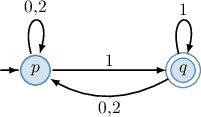
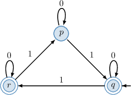
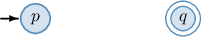
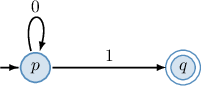
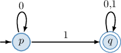
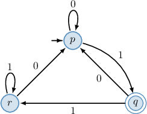
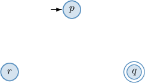
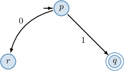
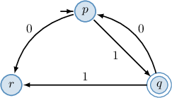
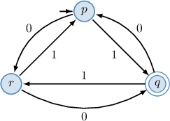

# Deterministic Finite Automata

Source: https://www.mathacademy.com/topics/3797?courseId=109
Topic ID: 3797

## Prerequisites

- [Introduction to Graphs](./950-introduction-to-graphs.md)

## Lesson

### Introduction

In mathematics, there are two main types of "machines" known as **automata**. These structures represent the first step toward formally defining the concept of an **algorithm**.

The first type of automaton is called an **acceptor.** It processes a string of symbols and determines whether to accept or reject it. The second is called a **transducer,** which takes an input string and transforms it into another string. In this lesson, we will focus on acceptors.

A deterministic finite automaton (DFA) is a specific type of acceptor. It has a finite number of states and processes symbols from an input alphabet, transitioning between states based on predefined rules determined by the input symbols.

More formally, a DFA is a five-tuple of the form $A=(Q, \Sigma, \delta, q_0, F),$ where the components are as follows:

- $Q$ is a nonempty finite set of **states**. These are all the possible configurations the automaton can be in.

- $\Sigma$ is a nonempty finite set of **input symbols**. This is the "alphabet" of symbols that the DFA can process as inputs.

- $\delta$ is a **transition function** of the form $\delta: Q \times \Sigma \to Q.$ It takes a state and an input symbol and returns a state. This function determines how the DFA moves from one state to another based on a given input symbol.

- $q_0 \in Q$ is a **start state** (or **initial state**). This is the state in which the automaton begins.

- $F \subseteq Q$ is a set of **final** (or **accepting**) **states**.

We can visualize a DFA as a directed graph, where

- vertices represent the states,

- arcs, labeled with input symbols, represent transitions from one state to another,

- the start state is labeled by the input arrow $\to,$ and

- the final states are circled by a double line.

For example, a deterministic finite automaton is given in the diagram below.

In this case, the automaton has the following components:

- The set of states $Q = \{p,q\}$ (represented by the vertices).

- The set of input symbols $\Sigma = \{0,1,2\}$ (represented by the arcs' labels).

- The transition function $\delta$ with the following transitions defined by the arcs: For instance, the arrow from $p$ to $q,$ labeled $1,$ means that $\delta(p,1)=q.$

- The start state $p$ (that is labeled by the input arrow $\to$), as shown below.

- The set of final states $F = \{q\}$ (circled by the double line), as shown below.

### Example: Identifying Components of a DFA

#### Question

Consider the deterministic finite automaton represented by the above diagram. Given that $\delta: Q \times \Sigma \to Q$ is the transition function of the automaton, determine the set of states, the set of input symbols, the start point, and the set of final states of the automaton. Also, determine $\delta(q,1).$

#### Explanation

A deterministic finite automaton is a five-tuple of the form $A = (Q, \Sigma, \delta, q_0, F),$ where

- $Q$ is a nonempty finite set of **,

- $\Sigma$ is a nonempty finite set of **,

- $\delta$ is a ** of the form $\delta: Q \times \Sigma \to Q$ that takes a state and an input symbol and returns a state,

- $q_0 \in Q$ is a ** (or **), and

- $F \subseteq Q$ is a set of ** (or **) states.

In our case, the automaton has the following components:

- the set of states $Q=\{p,q,r\}$ (represented by the vertices),

- the set of input symbols $\Sigma=\{0,1\}$ (represented by the arcs' labels),

- the start state $q$ (that is labeled by the input arrow $\to$), and

- the set of final states $F=\{q,r\}$ (these are circled by the double line).

Finally, the diagram shows an arrow from $q$ to $r,$ labeled $1.$ This means that

$$

\delta(q,1) = r.

$$

### Transition Tables of Deterministic Finite Automata

It's common to put the values of a transition function in a table. Each row corresponds to a different state $q,$ each column corresponds to a different input symbol $a,$ and their intersection is the value of the transition function $\delta(q,a).$

An example is given below. Note that we place $\to$ next to the start state and $\ast$ next to any final states.

Let's construct a diagram representing the automaton given by this transition table. From the table, we determine that the automaton has the following components:

- the set of states $Q=\{p,q\}$ (given by the rows),

- the set of input symbols $\Sigma=\{0,1\}$ (given by the columns),

- the start state $p$ (labeled by $\to$), and

- the set of final states $F=\{q\}$ (labeled by $\ast$).

Now that we have the components, we can construct the diagram. First, let's draw the states of our automaton.

According to the transition table, $p$ is the start state, and $q$ is a final state. So, we labeled $p$ with an input arrow and circled $q$ with a double line.

From the transition table, we also get the following:

- Consider row $p$ of the table. Its intersection with column $0$ is $p,$ indicating that $\delta(p,0)=p.$ So, we draw an arrow (loop) from $p$ to $p,$ labeled $0.$ Its intersection with column $1$ is $q,$ indicating that $\delta(p,1)=q.$ So, we draw an arrow from $p$ to $q,$ labeled $1.$

- Consider row $q$ of the table. Its intersection with column $0$ is $q,$ indicating that $\delta(q,0)=q.$ So, we draw an arrow (loop) from $q$ to $q,$ labeled $0.$ Its intersection with column $1$ is $q,$ indicating that $\delta(q,1)=q.$ So, we draw an arrow (loop) from $q$ to $q,$ labeled $1.$

We have been through every cell in the table, so we have added all the arcs. Therefore, our diagram is complete.

**Watch out!** We draw only one loop from $q$ to $q,$ labeled with both $0,1$ instead of two separate loops for each of the symbols $0$ and $1.$

### Example: Constructing a Transition Table Given a Diagram

#### Question

The diagram above shows a deterministic finite automaton. Construct the transition table corresponding to the given diagram.

#### Explanation

In our case, the automaton has the following components:

- the set of states $Q=\{p,q,r\},$

- the set of input symbols $\Sigma=\{0,1\},$

- the start state $p,$ and

- the set of final states $F=\{q\}.$

With that in mind, let's determine the transition function.

First, we draw an empty table with a different state written in each row and a different input symbol written in each column:

Notice that we write $\to$ next to $p$ since it's the start state, and we write $\ast$ next to $q$ since it's a final state.

Next, we fill in the remaining cells:

- There is an arrow (loop) from $p$ to $p,$ labeled $0.$ This means that $\delta(p,0)=p.$ So, we write $p$ at the intersection of row $p$ and column $0.$

- There is an arrow from $p$ to $q,$ labeled $1.$ This means that $\delta(p,1)=q.$ So, we write $q$ at the intersection of row $p$ and column $1.$

- There is an arrow from $q$ to $p,$ labeled $0.$ This means that $\delta(q,0)=p.$ So, we write $p$ at the intersection of row $q$ and column $0.$

- There is an arrow from $q$ to $r,$ labeled $1.$ This means that $\delta(q,1)=r.$ So, we write $r$ at the intersection of row $q$ and column $1.$

- There is an arrow from $r$ to $p,$ labeled $0.$ This means that $\delta(r,0)=p.$ So, we write $p$ at the intersection of row $r$ and column $0.$

- There is an arrow (loop) from $r$ to $r,$ labeled $1.$ This means that $\delta(r,1)=r.$ So, we write $r$ at the intersection of row $r$ and column $1.$

The transition table corresponding to the given diagram is shown below.

### Example: Drawing a Diagram Given a Transition Table

#### Question

Construct a diagram representing the deterministic finite automaton from the transition table above.

#### Explanation

In our case, the automaton has the following components:

- the set of states $Q=\{p,q,r\},$

- the set of input symbols $\Sigma=\{0,1\},$

- the start state $p,$ and

- the set of final states $F=\{q\}.$

First, let's draw the states of our automaton.

According to the transition table, $p$ is the start state, and $q$ is a final state. So, we labeled $p$ with an input arrow and circled $q$ with a double line.

From the transition table, we also get the following:

- Consider row $p$ of the table. Its intersection with column $0$ is $r,$ indicating that $\delta(p,0)=r.$ So, we draw an arrow from $p$ to $r,$ labeled $0.$ Its intersection with column $1$ is $q,$ indicating that $\delta(p,1)=q.$ So, we draw an arrow from $p$ to $q,$ labeled $1.$

- Consider row $q$ of the table. Its intersection with column $0$ is $p,$ indicating that $\delta(q,0)=p.$ So, we draw an arrow from $q$ to $p,$ labeled $0.$ Its intersection with column $1$ is $r,$ indicating that $\delta(q,1)=r.$ So, we draw an arrow from $q$ to $r,$ labeled $1.$

- Consider row $r$ of the table. Its intersection with column $0$ is $q,$ indicating that $\delta(r,0)=q.$ So, we draw an arrow from $r$ to $q,$ labeled $0.$ Its intersection with column $1$ is $p,$ indicating that $\delta(r,1)=p.$ So, we draw an arrow from $r$ to $p,$ labeled $1.$

We have been through every cell in the table, so our diagram is complete.
