# Nondeterministic Finite Automata

Source: https://www.mathacademy.com/topics/3798?courseId=109
Topic ID: 3798

## Prerequisites

- [Power Sets](../methods-of-proof/51-power-sets.md)
- [Processing Strings Using Deterministic Finite Automata](./5414-processing-strings-using-deterministic-finite-automata.md)

## Lesson

### Introduction

Recall that a deterministic finite automaton (DFA) is a specific type of acceptor transitioning between states based on predefined rules determined by the input symbols.

Another type of acceptor, similar to a DFA, is a **nondeterministic finite automaton** (NFA). The difference is that unlike a DFA, where each state has exactly one transition for every input symbol, an NFA can have multiple or no transitions.

More formally, an NFA is a five-tuple of the form $A = (Q, \Sigma, \delta, q_0, F),$ where the components are as follows:

- $Q$ is nonempty finite set of **states**. These are all the possible configurations the NFA can be in.

- $\Sigma$ is a nonempty finite set of **input symbols**. The NFA can process this "alphabet" of symbols as inputs.

- $\delta$ is a **transition function** of the form $\delta: Q \times \Sigma \to 2^Q,$ where $2^Q$ denotes the power set of $Q.$ It takes a state and an input symbol and returns a *set of states*. This function determines how the NFA moves from one state to another based on a given input symbol.

- $q_0 \in Q$ is a **start state** (or **initial state**). This is the state in which the NFA begins.

- $F \subseteq Q$ is a set of **final** (or **accepting**) **states**.

We can visualize an NFA as a directed graph and write the transition function in a table, just like for a DFA. An example of the transition table of an NFA is given below.

Notice that each state can have no (empty set $\emptyset$), one, or multiple transitions for every input symbol. Now, let's construct a diagram representing the automaton given by this transition table.

From the table, we determine that the automaton has the following components:

- the set of states $Q=\{q,r\},$ (given by the rows)

- the set of input symbols $\Sigma=\{0,1\},$ (given by the columns)

- the start state $q$ (labeled by $\to$), and

- the set of final states $F=\{r\}$ (labeled by $\ast$).

First, let's draw the states of our automaton.

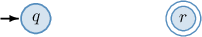

According to the transition table, $q$ is the start state, and $r$ is a final state. So, we labeled $q$ with an input arrow and circled $r$ with a double line.

From the transition table, we also get the following:

- Consider row $q$ of the table. Its intersection with column $0$ is $\{r\},$ indicating that $\delta(q,0)=\{r\}.$ So, we draw an arrow from $q$ to $r$ labeled $0.$ Its intersection with column $1$ is $\emptyset,$ indicating that $\delta(q,1)=\emptyset.$ So, there are no arrows from $q$ that are labeled with $1.$

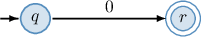

- Consider row $r$ of the table. Its intersection with column $0$ is $\{q,r\},$ indicating that $\delta(r,0)=\{q,r\}.$ So, we draw an arrow from $q$ to $r$ and an arrow (loop) from $r$ to $r,$ both labeled $0.$ Its intersection with column $1$ is $\{r\},$ indicating that $\delta(r,1)=\{r\}.$ So, we draw an arrow (loop) from $r$ to $r$ labeled $1.$

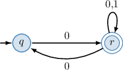

We have gone through every cell in the table and added all the arcs, so our diagram is complete.

**Watch out!** As with DFAs, we draw only one loop from $r$ to $r$ labeled with both $0,1$ instead of two separate loops for each of the symbols $0$ and $1.$

### Example: Constructing a Transition Table Given a Diagram

#### Question

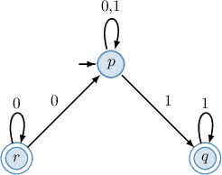

#### Explanation

In our case, the automaton has the following components:

- the set of states $Q=\{p,q,r\},$

- the set of input symbols $\Sigma=\{0,1\},$

- the start state $p,$ and

- the set of final states $F=\{q,r\}.$

With that in mind, let's determine the transition function.

First, we draw an empty table with a different state written in each row and a different input symbol written in each column:

Notice that we write $\to$ next to $p$ since it's the start state, and we write $\ast$ next to $q$ and $r$ since they are final states.

Next, we fill in the remaining cells:

- There is an arrow (loop) from $p$ to $p,$ labeled $0.$ This means that $\delta(p,0)=\{p\}.$ So, we write down $\{p\}$ at the intersection of row $p$ and column $0.$

- There is an arrow (loop) from $p$ to $p,$ labeled $1,$ and there is an arrow from $p$ to $q,$ also labeled $1.$ This means that $\delta(p,1)=\{p,q\}.$ So, we write down $\{p,q\}$ at the intersection of row $p$ and column $1.$

- There are no arrows from $q$ that are labeled with $0.$ This means that $\delta(q,0)=\emptyset.$ So, we write down $\emptyset$ at the intersection of row $q$ and column $0.$

- There is an arrow (loop) from $q$ to $q,$ labeled $1.$ This means that $\delta(q)=\{q\}.$ So, we write down $\{q\}$ at the intersection of row $q$ and column $1.$

- There is an arrow (loop) from $r$ to $r,$ labeled $0,$ and there is an arrow from $r$ to $p,$ also labeled $0.$ This means that $\delta(r,0)=\{r,p\}.$ So, we write down $\{r,p\}$ at the intersection of row $r$ and column $0.$

- There are no arrows from $r$ that are labeled with $1.$ This means that $\delta(r,1)=\emptyset.$ So, we write down $\emptyset$ at the intersection of row $r$ and column $1.$

The transition table corresponding to the given diagram is shown below.

### Example: Drawing a Diagram Given a Transition Table

#### Question

Draw a diagram representing the nondeterministic finite automaton given by the transition table above.

#### Explanation

In our case, the automaton has the following components:

- the set of states $Q=\{p,q,r\},$

- the set of input symbols $\Sigma=\{0,1\},$

- the start state $p,$ and

- the set of final states $F=\{r\}.$

First, let's draw the states of our automaton.

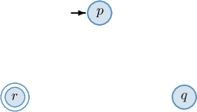

According to the transition table, $p$ is the start state, and $r$ is a final state. So, we labeled $p$ with an input arrow and circled $r$ with a double line.

From the transition table, we also get the following:

- Consider row $p$ of the table. Its intersection with column $0$ is $\{p,q\},$ indicating that $\delta(p,0)=\{p,q\}.$ So, we draw an arrow from $p$ to $q$ and an arrow (loop) from $p$ to $p,$ both labeled $0.$ Its intersection with column $1$ is $\emptyset,$ indicating that $\delta(p,1)=\emptyset.$ So, there are no arrows from $p$ that are labeled with $1.$

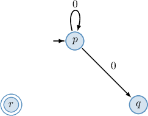

- Consider row $q$ of the table. Its intersection with column $0$ is $\{q,r\},$ indicating that $\delta(q,0)=\{q,r\}.$ So, we draw an arrow from $q$ to $r$ and an arrow (loop) from $q$ to $q,$ both labeled $0.$ Its intersection with column $1$ is $\emptyset,$ indicating that $\delta(q,1)=\emptyset.$ So, there are no arrows from $q$ that are labeled with $1.$

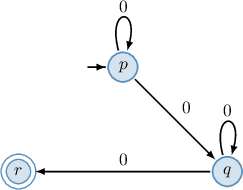

- Consider row $r$ of the table. Its intersection with column $0$ is $\{r,p\},$ indicating that $\delta(r,0)=\{r,p\}.$ So, we draw an arrow from $r$ to $p$ and an arrow (loop) from $r$ to $r,$ both labeled $0.$ Its intersection with column $1$ is $\{r\},$ indicating that $\delta(r,1)=\{r\}.$ So, we draw an arrow (loop) from $r$ to $r,$ labeled $1.$

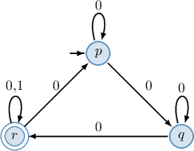

We have been through every cell in the table, so our diagram is complete.

### Extending the Transition Function to Strings

We know that a nondeterministic finite automaton (NFA) is a subtype of acceptors - automata that process a sequence of symbols (a string) and decide whether to "accept" or "reject" it. We'll now explore how an NFA performs this task.

Let $\omega = a \beta$ be a string, where $a$ is the first symbol of $\omega$ and $\beta$ is the remainder of $\omega$ after removing the first symbol. Then, we can extend the transition function $\delta$ of a nondeterministic finite automaton to strings recursively as follows:

$$

\begin{aligned}𝛿(𝑞,𝜀) & =∅ \\ 𝛿(𝑞,𝜔) & =\underset{𝑠∈𝛿(𝑞,𝑎)}{⋃}𝛿(𝑠,𝛽)\end{aligned}

$$

where $\varepsilon$ denotes the empty string (the string containing no symbols) and $q$ is a state of the automaton.

To demonstrate, let's find $\delta(q, 001),$ where $\delta: Q \times \Sigma \to 2^Q$ is the transition function of our previous DFA represented by the diagram below.

According to the definition of the transition function $\delta,$ for $\omega = 001$ we obtain the following:

$$

\begin{aligned}𝛿(𝑞,001) & =\underset{𝑠∈𝛿(𝑞,0)}{⋃}𝛿(𝑠,01) \\ & =𝛿(𝑟,01) \\ & =\underset{𝑠∈𝛿(𝑟,0)}{⋃}𝛿(𝑠,1) \\ & =𝛿(𝑞,1)∪𝛿(𝑟,1) \\ & =∅∪{𝑟} \\ & ={𝑟}\end{aligned}

$$

Let's describe what is going on in the computations from a slightly different point of view.

- **Step 1.** The automaton is at the start state $q$ and observes the first letter of the string: From the diagram, $\delta(q,0)= \{r\}.$ So, the automaton switches to state $r$ and moves to the next letter of the string.

- **Step 2.** The automaton is at the state $r$ and observes the second letter of the string: From the diagram, $\delta(r,1)= \{q,r\}.$ So, the automaton goes to states $q$ and $r$ simultaneously and moves to the next letter of the string. **Step 3.1.** The automaton is at the state $q$ and observes the third letter of the string: From the diagram, $\delta(q,1)= \emptyset.$ So, the automaton is stuck. **Step 3.2.** The automaton is at the state $r$ and observes the third letter of the string: From the diagram, $\delta(r,1)= \{r\}.$ So, the automaton switches to state $r$ and stops since the entire string has been processed.

The diagram below summarizes the process. It notes the state of the DFA and the part of the string left to process at each step.

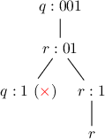

The process properly terminates at the state $r.$ Therefore,

$$

\delta(q, 001) = \{r\}.

$$

### Example: Applying a Transition Function to a String

#### Question

Consider the nondeterministic finite automaton represented by the transition table above. Given that $\delta: Q \times \Sigma \to 2^Q$ is the transition function of the automaton, find $\delta(b, 001).$

#### Explanation

The diagram corresponding to our automaton is shown below.

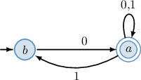

Let $\omega = a \beta$ be a finite sequence of symbols (a string), where $a$ is the first symbol of $\omega$ and $\beta$ is the remainder of $\omega$ after removing the first symbol.

Then, we can extend the transition function $\delta$ of the automaton to strings recursively as

$$

\begin{aligned}𝛿(𝑞,𝜀) & =∅, \\ 𝛿(𝑞,𝜔) & =\underset{𝑠∈𝛿(𝑞,𝑎)}{⋃}𝛿(𝑠,𝛽),\end{aligned}

$$

where $\varepsilon$ denotes the empty string (the string containing no symbols) and $q$ is a state of an automaton.

According to the definition of the transition function $\delta,$ for $\omega = 001$ we obtain the following:

$$

\begin{aligned}𝛿(𝑏,001) & =\underset{𝑠∈𝛿(𝑏,0)}{⋃}𝛿(𝑠,01) \\ & =𝛿(𝑎,01) \\ & =\underset{𝑠∈𝛿(𝑎,0)}{⋃}𝛿(𝑠,1) \\ & =𝛿(𝑎,1) \\ & ={𝑎,𝑏}\end{aligned}

$$

Let's describe what is going on in the computations from a slightly different point of view.

- Step 1. The automaton is at the start state $b$ and observes the first letter of the string: From the diagram, $\delta(b,0)= \{a\}.$ So, the automaton switches to state $a$ and moves to the next letter of the string.

- Step 2. The automaton is at the state $a$ and observes the second letter of the string: From the diagram, $\delta(a,0)= \{a\}.$ So, the automaton goes to states $a$ and moves to the next letter of the string.

- Step 3. The automaton is at the state $a$ and observes the third letter of the string: From the diagram, $\delta(a,1)= \{a,b\}.$ So the automaton goes to states $a$ and $b$ simultaneously and stops since the entire string has been processed.

We can summarize the process in the diagram below.

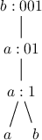

The process properly terminates at the states $a$ and $b.$ Therefore,

$$

\delta(b, 001) = \{a,b\}.

$$

### The Language of a NFA

A nondeterministic finite automaton accepts a finite string if, after processing the entire string, the automation ends in one of its final states. Otherwise, the string is rejected. The set of all accepted finite strings is the **language** of the NFA.

For example, consider the three strings $100,$ $0101,$ and $0110.$ Are any of these accepted by the nondeterministic automaton represented by the diagram below?

To find out, let's apply the extended transition function to our strings.

- Processing the string $100,$ we get: The process is "stuck". So, the string $100$ is rejected.

- Processing the string $0101,$ we get: The process terminates at the state $r.$ Since $r$ is a final (accepting) state, the string $0101$ is accepted.

- Processing the string $0110,$ we get: The process is terminated at the states $q$ and $r.$ Since $r$ is a final (accepting) state, the string $0110$ is accepted.

The language of this NFA consists of all finite strings of $0$'s and $1$'s that start with $0.$

We begin processing a string in state $q.$ Notice that when the automaton initially reads a $1,$ the automaton gets stuck. However, when it initially encounters a $0,$ it switches to the accepting state $r$. If the automaton is in $r$ and processes another symbol, it remains in the accepting state.

Therefore, the automaton will end in the accepting state $r$ if and only if the input starts with $0.$

### Example: Identifying Strings Accepted by an NFA

#### Question

Which of the following strings are accepted by the finite nondeterministic automaton represented by the transition table above?

#### Explanation

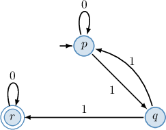

Let's apply the extended transition function to our strings.

- Consider the string

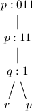

- Consider the string

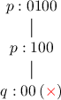

- Consider the string

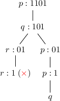
