# Introduction to Turing Machines

Source: https://www.mathacademy.com/topics/3802?courseId=109
Topic ID: 3802

## Prerequisites

- [Mealy Machines](./3795-mealy-machines.md)

## Lesson

### Introduction

A **Turing machine** is similar to a deterministic finite automaton. However, it is *not* finite because it has an associated tape of infinite length split into cells, and data may be read and written to the tape, one cell at a time. It is a **universal machine,** acting as an acceptor *or* a transducer depending on the setup.

More formally, a Turing machine is a seven-tuple of the form $T=(Q,\Sigma,\Gamma,q_1,q_0,\square,\delta),$ where

- $Q$ is a nonempty finite set of states,

- $\Sigma$ is a nonempty finite set of input symbols,

- $\Gamma$ is a finite set of tape symbols with $\Sigma \subseteq \Gamma,$

- $q_1 \in Q$ is the start state,

- $q_0$ is the final or accepting state,

- $\square \in \Gamma \setminus \Sigma$ is the **blank cell symbol**, representing an empty cell on the tape, and

- $\delta$ is a transition function of the form

The function $\delta$ takes the current state $q$ and current tape symbol $X$ and returns a state $q,$ a tape symbol $Y,$ and a direction $D,$ either left ($L$) or right ($R$).

Before discussing the tape's mechanics, let's ensure we can understand Turing machine diagrams and transition tables.

### Representing Turing Machines Using Transition Diagrams and Tables

We can visualize a Turing machine as a directed graph, just like for finite automata, where

- vertices represent the states,

- edges, each labeled with a state, a tape symbol, and a direction, represent transitions from one state to another,

- the start state is labeled by the input arrow $\to,$ and

- the final state is circled by a double line.

For example, shown below is a diagram representing the Turing machine with states $Q=\{q_1,q_2,q_0\},$ input symbols $\{0,1\},$ tape symbols $\{0,1, \square\},$ blank cell symbol $\square,$ start state $q_1,$ and final state $q_0.$

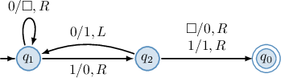

On a transition diagram representing a Turing machine, an edge from state $\color{blue}q$ to state $p$ labeled "${\color{blue}X}/Y,D$" means that

$$

\delta({\color{blue}q},{\color{blue}X}) = (p,Y,D).

$$

For instance, the edge from $\color{red}q_1$ to $q_2$ in the Turing machine above is labeled "${\color{red}1}/0,R$". This means that

$$

\delta({\color{blue}q_1},{\color{blue}1}) = (q_2,0,R).

$$

This can be interpreted as follows: if the machine in state ${\color{blue}q_1}$ observes symbol ${\color{blue}1}$ on the tape, it swaps to state $q_2,$ writes $0$ on the tape, and moves right $(R).$

The same machine can be represented using the transition table below.

### Example: Constructing the Transition Table of a Turing Machine Given a Transition Diagram

#### Question

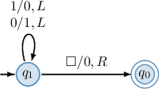

Fill the blanks in the transition table of the Turing machine given in the diagram above.

#### Explanation

A Turing machine is a seven-tuple of the form $T = (Q, \Sigma, \Gamma, q_1, q_0, \square, \delta),$ where

- $Q$ is a nonempty finite set of states,

- $\Sigma$ is a nonempty finite set of input symbols,

- $\Gamma$ is a finite set of tape symbols with $\Sigma \subseteq \Gamma,$

- $q_1 \in Q$ is the start state,

- $q_0$ is the final or accepting state,

- $\square \in \Gamma \setminus \Sigma$ is the blank cell symbol, and

- $\delta$ is a transition function of the form $\delta: Q \times \Gamma \to Q \times \Gamma \times \{L, R \}.$

The arguments of $\delta$ are a state and a tape symbol currently scanned by the tape head. The function returns a new state, a new tape symbol replacing the old symbol in the scanned cell, and the direction in which the head moves ($L$ stands for "left" and $R$ stands for "right").

With that in mind, let's examine our diagram.

- Consider the cell at the intersection of row $q_1$ and column ${\color{red}0}.$ In the diagram, this corresponds to the loop from $q_1$ to $q_1,$ labeled by ${\color{red}0}/1,L.$ This means that being in state $q_1$ and observing symbol ${\color{red}0}$ in a cell, we stay in state $q_1,$ write down $1$ into the cell, and move left. So, $\delta(q_1,0) = \boxed{\color{blue}(q_1,1,L)}.$

- Consider the cell at the intersection of row $q_1$ and column ${\color{red}\square}.$ In the diagram, this corresponds to the arrow from $q_1$ to $q_0,$ labeled by ${\color{red}\square}/0,R.$ This means that being in state $q_1$ and observing an empty cell ${\color{red}\square},$ we swap to state $q_0,$ write down $0$ into the cell, and move right. So, $\delta(q_1,\square) = \boxed{\color{blue}(q_0,0,R)}.$

- Consider the cell at the intersection of row $q_0$ and column ${\color{red}1}.$ In the diagram, there are no arrows from $q_0$ with a label of the form $0$ This means that being in state $q_0$ and observing symbol ${\color{red}1}$ in a cell, the machine gets stuck. So, $\delta(q_0,1)$ is undefined and we write $\boxed{\color{blue}-}$ into the transition table.

Finally, the transition table of the Turing machine takes on the following form:

### Example: Constructing the Transition Diagram of a Turing Machine Given a Transition Table

#### Question

Draw a transition diagram corresponding to the Turing machine given in the table above.

#### Explanation

A Turing machine is a seven-tuple of the form $T = (Q, \Sigma, \Gamma, q_1, q_0, \square, \delta),$ where

- $Q$ is a nonempty finite set of states,

- $\Sigma$ is a nonempty finite set of input symbols,

- $\Gamma$ is a nonempty finite set of tape symbols with $\Sigma \subseteq \Gamma,$

- $q_1 \in Q$ is the start state,

- $q_0$ is the final or accepting state, and

- $\square \in \Gamma \setminus \Sigma$ is the blank cell symbol, and

- $\delta$ is a transition function of the form $\delta: Q \times \Gamma \to Q \times \Gamma \times \{L, R \}.$

The arguments of $\delta$ are a state and a tape symbol currently scanned by the tape head. The function returns a new state, a new tape symbol replacing the old symbol in the scanned cell, and the direction in which the head moves ($L$ stands for "left" and $R$ stands for "right").

Let's now build the corresponding diagram. We start by placing out the machine's states:

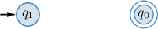

- Consider the cell at the intersection of row $q_1$ and column ${\color{red}1}$ where we have $(q_1,\square,R).$ This means that being in state $q_1$ and observing symbol ${\color{red}1}$ in a cell, we stay in state $q_1,$ write down $\square$ in the cell, and move right ($R$). So, we draw a loop from $q_1$ to $q_1,$ labeled by ${\color{red}1}/\square,R.$

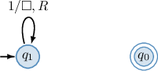

- Consider the cell at the intersection of row $q_1$ and column ${\color{red}\square}$ where we have $(q_0,1,L).$ This means that being in state $q_1$ and observing the empty cell ${\color{red}\square},$ we swap to state $q_0,$ write down $1$ in the cell, and move left ($L$). So, we draw an arrow from $q_1$ to $q_0,$ labeled by ${\color{red}\square}/1,L.$

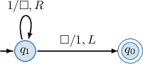

Since we have been through every non-empty cell in the table, our diagram is complete.

### Configurations of a Turing Machine

A Turing machine reads and writes data onto a **tape.** Let's explore how this works.

A tape is divided into cells, each containing one of the tape symbols. A finite-length string is written onto the tape (one symbol per cell), and all other cells hold the special "blank" symbol. At any point in the process, a tape head $\triangle$ is positioned at one of the cells and labeled with the machine's current state.

Recall our previous Turing machine, shown in the diagram below.

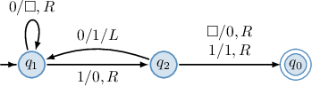

Suppose, at the current moment, the machine is in the configuration depicted below. The string $0110$ is written onto the tape, and the tape head $\triangle$ is at the second cell containing the string and is in the state $q_1.$

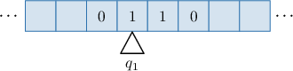

Let's find the machine's configuration after applying one more step. We use the machine's transition function $\delta$ to do so. The transition $\delta(q,X) = (p,Y,D)$ tells us to

- change from state $q$ to state $p,$

- replace the tape symbol $X$ in the cell at the head with the tape symbol $Y,$ and

- move the head in the direction $D,$ either left ($L$) or right ($R$).

Knowing this, we can apply the next step. The machine is currently in state $q_1$ and observes the symbol $1,$ given by the label and position of the tape head $\triangle,$ respectively. Then, according to the transition diagram, $\delta(q_1,1) = (q_2,0,R).$

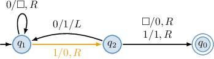

This means we should swap to state $q_2,$ write $0$ in the cell, and move the tape's head one cell to the right. Performing this transition gives us the following new configuration:

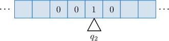

### Example: Updating the Configurations of a Turing Machine

#### Question

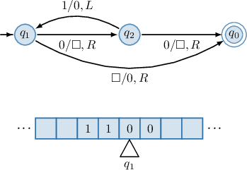

A Turing machine is given by the transition diagram above, and at the current moment, it's in the configuration depicted below the diagram. What is the machine's configuration after applying two steps?

#### Explanation

We're shown that our Turing machine is currently in the following configuration:

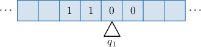

The machine is in state $q_1$ and observes a symbol $0.$ According to the transition diagram, $\delta(q_1,0) = (q_2,\square,R).$

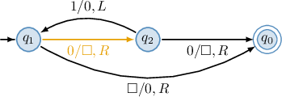

This means, in the first step, we should swap to state $q_2,$ write $\square$ in the cell, and move right. Performing this transition gives us the following new configuration:

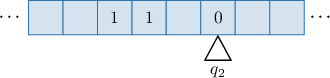

Now, the machine is in state $q_2$ and observes a symbol $0.$ According to the transition diagram, $\delta(q_2,0) = (q_0,\square,R).$

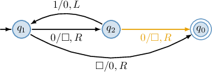

This means, in the second step, we should swap to state $q_0,$ write $\square,$ in the cell, and move right. Performing this transition gives us the following new configuration:

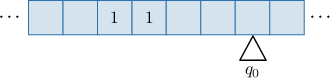
