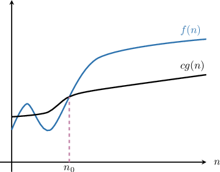
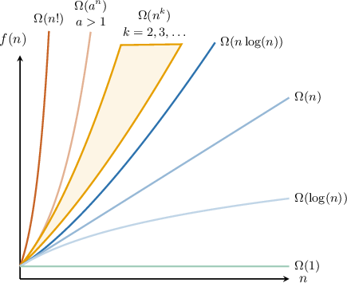

# Big-Omega Notation

Source: https://www.mathacademy.com/topics/3805?courseId=109
Topic ID: 3805

## Prerequisites

- [Big-O Notation](./3803-big-o-notation.md)

## Lesson

### Introduction

In a previous lesson, we saw how big-O notation $O(g(n))$ is used to construct a set containing all functions bounded above by $cg(n),$ where $g(n)$ is a nonnegative function, $c$ is a positive constant and $n$ is sufficiently large. This definition helps classify the behavior of algorithms as the parameter $n$ increases.

If particular, if $f(n)\in O(g(n)),$ then $cg(n)$ is an *asymptotic upper bound* for $f(n)$ as $n\to\infty.$

In this lesson, we'll discuss **big-omega** notation, which helps us to define asymptotic *lower* bounds for functions as $n\to\infty.$

The notation $\Omega(g(n))$ defines the set of all functions $f(n)$ for which there exist positive constants $c$ and $n_0$ such that for all $n$ larger than $n_0,$ the values of $f(n)$ are not smaller than $c \cdot g(n){:}$

$$

\Omega(g(n)) = \big\{ f(n) \: : \: \exists c, n_0 > 0, \: \forall n \geq n_0, \: 0 \leq c g(n) \leq f(n) \big\}

$$

Geometrically, this means that starting from a certain point $n=n_0,$ the graph $y=c \cdot g(n)$ lies *below* the graph of $y=f(n)$ for $n\geq n_0.$

For example, the set $\Omega(n^2)$ is defined as follows:

$$

\Omega(n^2) = \big\{ f(n) \: : \: \exists c, n_0 > 0 , \: \forall n \geq n_0 , \: 0 \leq c\cdot n^2 \leq f(n)\big\}

$$

Thus, the following statements are all true:

- $n^3 \in \Omega(n^2)$ since $0\leq 1\cdot n^2\leq n^3$ for all $n\geq 1.$

- $n^3 \in \Omega(n^3)$ since $0\leq \dfrac12\cdot n^3\leq n^3$ for all $n\geq 1.$

- $n^3 \in \Omega(1)$ since $0\leq 10\cdot 1 \leq n^3$ for all $n\geq 3.$

However, $n^3\notin \Omega(n^4)$ since there are no constants $c$ and $n_0$ such that $0\leq c\cdot n^4 \leq n^3$ for $n\geq n_0.$ Intuitively, the function $cn^4$ will always outgrow $n^3$ eventually.

### Example: Understanding the Definition of Big-Omega

#### Question

Let's suppose $n \in \mathbb{N}.$ In the context of algorithmic complexity, define the set $\Omega(6^n).$ Describe this set geometrically.

#### Explanation

According to the definition, $\Omega(g(n))$ is the set of all functions $f(n)$ for which there exist positive constants $c$ and $n_0$ such that for all $n$ larger than $n_0,$ the values of $f(n)$ are not smaller than $c \cdot g(n){:}$

$$

\Omega(g(n)) = \big\{ f(n) \: : \: \exists c, n_0 > 0, \: \forall n \geq n_0, \: 0 \leq c g(n) \leq f(n) \big\}

$$

Geometrically, this means the following:

The set $\Omega(6^n)$ consists of all functions $f(n)$ for which there exist positive constants $c$ and $n_0$ such that the graph of $y=c \cdot 6^n$ lies below the graph of $y=f(n)$ for all $n\geq n_0.$

### Example: Proving That a Function Belongs to a Big-Omega Set

#### Question

Let $n \in \mathbb{N}.$ Prove that $8n^2-5 \in \Omega(n).$

#### Explanation

According to the definition, $\Omega(g(n))$ is the set of all functions $f(n),$ for which there exist positive constants $c$ and $n_0$ such that for all $n$ larger than $n_0,$ the values of $f(n)$ are not smaller than $c g(n){:}$

$$

\Omega(g(n)) = \big\{ f(n) \: : \: \exists c, n_0 > 0, \: \forall n \geq n_0, \: 0 \leq c g(n)\leq f(n) \big\}

$$

So, we start as shown below.

We need to show that there exists a constant $c$ such that for sufficiently large $n,$ we have

$$

8n^2-5 \geq c n.

$$

Now, let's isolate $c$ on the right-hand side of the inequality.

Dividing both sides of the inequality by $n,$ we get the following:

$$

\begin{aligned}8𝑛^{2}−5 & ≥𝑐𝑛 \\ \frac{8𝑛^{2}−5}{𝑛} & ≥\frac{𝑐𝑛}{𝑛} \\ \frac{8𝑛^{2}}{𝑛}−\frac{5}{𝑛} & ≥\frac{𝑐𝑛}{𝑛} \\ 8𝑛−\frac{5}{𝑛} & ≥𝑐\end{aligned}

$$

Notice that $8n=8$ and $\dfrac{5}{n}=5$ if $n=1.$ Also, $8n$ monotonically approaches $\infty$ and $\dfrac{5}{n}$ monotonically approaches $0$ as $n \to \infty.$ As a result,

$$

8n-\dfrac{5}{n} \geq 3

$$

for all $n \geq 1,$ and we can now pick our constants.

By setting $n_0=1$ and $c=3,$ we make the above inequality hold for any $n \geq n_0.$

Of course, other choices for the constants $c$ and $n_0$ may do the job, but the important thing is we found at least one such combination.

Therefore, $8n^2-5 \in \Omega(n).$

The full proof is given below.

We need to show that there exists a constant $c$ such that for sufficiently large $n,$ we have

$$

8n^2-5 \geq c n.

$$

Dividing both sides of the inequality by $n,$ we get the following:

$$

\begin{aligned}8𝑛^{2}−5 & ≥𝑐𝑛 \\ \frac{8𝑛^{2}−5}{𝑛} & ≥\frac{𝑐𝑛}{𝑛} \\ \frac{8𝑛^{2}}{𝑛}−\frac{5}{𝑛} & ≥\frac{𝑐𝑛}{𝑛} \\ 8𝑛−\frac{5}{𝑛} & ≥𝑐\end{aligned}

$$

By setting $n_0=1$ and $c=3,$ we make the above inequality hold for any $n \geq n_0.$

Therefore, $8n^2-5 \in \Omega(n).$

### Properties of Big-Omega Notation

Earlier, we saw that

$$

n^3 \in \Omega(n^2), \qquad n^3 \in \Omega(n^3), \qquad n^3 \notin \Omega(n^4).

$$

In fact, for *any* function $f\in \Omega(n^3)$ that's bounded below by $cn^3$ for sufficiently large $n,$ it must also be bounded below by a function of the form $kn^2,$ where $k$ is a constant. Therefore, it follows that $f\in \Omega(n^2),$ and since this is true for any $f\in\Omega(n^3),$ we have

$$

\Omega(n^2) \supset \Omega(n^3).

$$

By similar reasoning, it follows that

$$

\Omega(n^2) \supset \Omega(n^3) \supset \Omega(n^4).

$$

We can summarize the scales of certain frequently used functions in terms of big-Omega notation in the diagram below.

Here, we have the following inclusions:

$$

\Omega(1) \supset \Omega(\log(n)) \supset \Omega(n) \supset \Omega(n\log(n)) \supset \Omega(n^k) \supset \Omega(a^n) \supset \Omega(n!)

$$

Furthermore, $\Omega(n^k) \supset \Omega(n^{k+1})$ for all $k=2,3,\ldots$ and $\Omega(a^n) \supset \Omega(b^n)$ whenever $a < b.$ Notice that all inclusions are proper.

Also, we'll use the following two facts:

- If $c$ is any constant,

- If $\Omega(g(n)) \supset \Omega(f(n)),$ then

Let's see an example.

### A Worked Example

Let's prove that $\Omega(7^n+3n!+9^n) = \Omega(n!).$

Since $\Omega(7^n) \supset \Omega(9^n),$ we can re-write this lower bound as follows:

$$

\begin{aligned}Ω(7^{𝑛}+3𝑛!+9^{𝑛}) & =Ω(9^{𝑛}+3𝑛!)\end{aligned}

$$

Next, since $\Omega(3n!) = \Omega(n!),$ we get the following:

$$

\begin{aligned}Ω(9^{𝑛}+3𝑛!) & =Ω(9^{𝑛}+𝑛!)\end{aligned}

$$

Finally, since $\Omega(9^n) \supset \Omega(n!),$ we obtain that

$$

\begin{aligned}Ω(9^{𝑛}+𝑛!) & =Ω(𝑛!).\end{aligned}

$$

### Example: Using Properties of Omega Notation

#### Question

Simplify the asymptotic notation $\Omega\left(5\log(n) + 10n\right).$

#### Explanation

We can summarize the scales of certain frequently used functions in terms of Big-Omega notation in the diagram below.

Here, we have the following inclusions:

$$

\Omega(1) \supset \Omega(\log(n)) \supset \Omega(n) \supset \Omega(n\log(n)) \supset \Omega(n^k) \supset \Omega(a^n) \supset \Omega(n!)

$$

Furthermore, $\Omega(n^k) \supset \Omega(n^{k+1})$ for all $k=2,3,\ldots$ and $\Omega(a^n) \supset \Omega(b^n)$ whenever $a < b.$ Notice that all inclusions are proper.

Also, $\Omega(c g(n)) = \Omega(g(n))$ for any constant multiplier $c,$ and if $\Omega(g(n)) \supset \Omega(f(n)),$ then

$$

\Omega(g(n)+f(n)) = \Omega(f(n)).

$$

Now, since $\Omega(10n) = \Omega(n),$ we can re-write the lower bound as follows:

$$

\begin{aligned}Ω(5log⁡(𝑛)+10𝑛) & =Ω(5log⁡(𝑛)+𝑛)\end{aligned}

$$

Next, since $\Omega(5\log(n)) = \Omega(\log(n)),$ we get the following:

$$

\begin{aligned}Ω(5log⁡(𝑛)+𝑛) & =Ω(log⁡(𝑛)+𝑛)\end{aligned}

$$

Finally, since $\Omega(\log(n)) \supset \Omega(n),$ we obtain that

$$

\begin{aligned}Ω(log⁡(𝑛)+𝑛) & =Ω(𝑛).\end{aligned}

$$

Therefore, we have

$$

\Omega\left(5\log(n) + 10n\right) = \Omega(n).

$$
