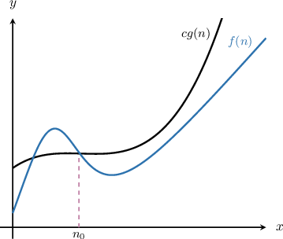
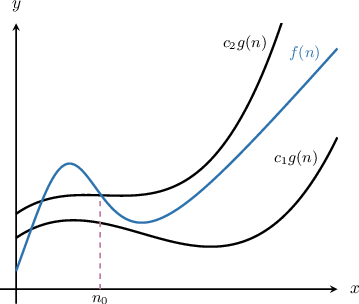
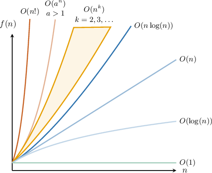

# Big-Theta Notation

Source: https://www.mathacademy.com/topics/3807?courseId=109
Topic ID: 3807

## Prerequisites

- [Big-Omega Notation](./3805-big-omega-notation.md)

## Lesson

### Introduction

Let's recall some of the asymptotic notations we've seen in previous lessons, defined in the context of algorithmic complexity.

The set $O(g(n))$ contains all nonnegative functions $f(n)$ such that $f(n) \leq c g(n)$ for $c > 0$ and sufficiently large $n.$ Formally:

$$

O(g(n)) = \big\{ f(n) \: : \: \exists c, n_0 > 0, \: \forall n \geq n_0, \: 0 \leq f(n) \leq c g(n) \big\}

$$

If $f\in O(g(n)),$ then $c g(n)$ is an *asymptotic upper bound* of $f,$ as shown below.

The set $\Omega(g(n))$ contains all nonnegative functions $f(n)$ such that $f(n) \geq c g(n)$ for $c > 0$ and sufficiently large $n.$ Formally:

$$

\Omega(g(n)) = \big\{ f(n) \: : \: \exists c, n_0 > 0, \: \forall n \geq n_0, \: 0 \leq c g(n) \leq f(n) \big\}

$$

If $f\in \Omega(g(n)),$ then $c g(n)$ is an *asymptotic lower bound* of $f,$ as shown below.

A related valuable concept for classifying the asymptotic behavior of algorithms is **big-theta** notation.

Suppose we have two nonnegative functions $f(n)$ and $g(n)$ such that there exist positive constants $c_1$ and $c_2$ such that, for sufficiently large $n,$ we have

$$

c_1 g(n) \leq f(n) \leq c_2 g(n)

$$

as depicted in the graph below.

In plain English, beyond some threshold value $n_0,$ the function $f(n)$ is sandwiched between two multiples of $g(n),$ ensuring that $f(n)$ grows at the same rate as $g(n)$ up to constant factors. In such cases, we write

$$

f(n) \in \Theta(g(n))

$$

where the formal definition of the set $\Theta(g(n))$ is given below:

$$

\Theta(g(n)) = \left\{ f(n) : \exists c_1 c_2,n_0 \gt 0, \forall n \geq n_0, 0 \leq c_1g(n) \leq f(n) \leq c_2 g(n)\right\}

$$

Big-Theta notation is helpful because it provides a tight bound on a function's growth by specifying both an upper and a lower bound.

### Example: Understanding the Definition of Big-Theta

#### Question

Suppose $n \in \mathbb{N}.$ In the context of algorithmic complexity, what is the definition of $\Theta(n^{10})?$

#### Explanation

According to the definition, $\Theta(g(n))$ is the set of all functions $f(n)$ for which there exist positive constants $c_1,$ $c_2,$ and $n_0$ such that for all $n$ larger than $n_0,$ the values of $f(n)$ lies between $c_1 \cdot g(n)$ and $c_2 \cdot g(n).$

$$

\Theta(g(n)) = \big\{ f(n) \: : \: \exists c_1,c_2, n_0 > 0, \: \forall n \geq n_0, \: 0\leq c_1\cdot g(n) \leq f(n) \leq c_2\cdot g(n) \big\}

$$

Geometrically, this means the following:

The set $\Theta(n^{10})$ consists of all the functions $f(n),$ for which there exist positive constants $c_1, c_2,$ and $n_0$ such that the graph of $f(n)$ lies between $y=c_1\cdot n^{10}$ and $y=c_2\cdot n^{10}$ for all $n\geq n_0.$

### Example: Proving That a Function Belongs to Big-Theta Set

#### Question

Prove that $3n^2+1 \in \Theta(n^2)$ for $n\in\mathbb N.$

#### Explanation

According to the definition, $\Theta(g(n))$ is the set of all functions $f(n)$ for which there exist positive constants $c_1$, $c_2$ and $n_0$ such that for all $n$ larger than $n_0,$ the values of $f(n)$ lies between $c_1 \cdot g(n)$ and $c_2 \cdot g(n)$

$$

\Theta(g(n)) = \big\{ f(n) \: : \: \exists c_1,c_2, n_0 > 0, \: \forall n \geq n_0, \: 0 \leq c_1\cdot g(n)\leq f(n) \leq c_2\cdot g(n) \big\}

$$

So, we start as shown below.

We need to show that there exists constants $c_1$ and $c_2$ such that for sufficiently large $n,$ we have

$$

c_1n^2 \leq 3n^2+1 \leq c_2n^2.

$$

Now, let's isolate $c_1$ and $c_2$ on the inequality.

Dividing both sides of the inequality by $n^2,$ we get follows:

$$

\begin{aligned}𝑐_{1}𝑛^{2} & ≤3𝑛^{2}+1≤𝑐_{2}𝑛^{2} \\ \frac{𝑐_{1}𝑛^{2}}{𝑛^{2}} & ≤\frac{3𝑛^{2}+1}{𝑛^{2}}≤\frac{𝑐_{2}𝑛^{2}}{𝑛^{2}} \\ 𝑐_{1} & ≤\frac{3𝑛^{2}}{𝑛^{2}}+\frac{1}{𝑛^{2}}≤𝑐_{2} \\ 𝑐_{1} & ≤3+\frac{1}{𝑛^{2}}≤𝑐_{2}\end{aligned}

$$

Notice that $\dfrac{1}{n^2} = 1$ and $3+\dfrac{1}{n^2}=4$ if $n=1.$ Also, $\dfrac{1}{n^2}$ monotonically approach $0$ as $n \to \infty.$ That means the minimum possible value of $\left(3+\dfrac{1}{n^2}\right)$ is $3$ and the maximum is $4.$ As a result,

$$

3\leq 3+\dfrac{1}{n^2} \leq 4

$$

for all $n \geq 1,$ and we can now pick our constants.

By setting $n_0=1$, $c_1=3$ and $c_2=4$ we make the above inequality hold for any $n \geq n_0.$

Of course, other choices for the constants $c_1$, $c_2,$ and $n_0$ may do the job, but the important thing is we found at least one such combination.

Therefore, $3n^2+1 \in \Theta(n^2).$

The full proof is given below.

We need to show that there exists constants $c_1$ and $c_2$ such that for sufficiently large $n,$ we have

$$

c_1n^2 \leq 3n^2+1 \leq c_2n^2.

$$

Dividing both sides of the inequality by $n^2,$ we get follows:

$$

\begin{aligned}𝑐_{1}𝑛^{2} & ≤3𝑛^{2}+1≤𝑐_{2}𝑛^{2} \\ \frac{𝑐_{1}𝑛^{2}}{𝑛^{2}} & ≤\frac{3𝑛^{2}+1}{𝑛^{2}}≤\frac{𝑐_{2}𝑛^{2}}{𝑛^{2}} \\ 𝑐_{1} & ≤\frac{3𝑛^{2}}{𝑛^{2}}+\frac{1}{𝑛^{2}}≤𝑐_{2} \\ 𝑐_{1} & ≤3+\frac{1}{𝑛^{2}}≤𝑐_{2}\end{aligned}

$$

By setting $n_0=1$, $c_1=3$ and $c_2=4$ we make the above inequality hold for any $n \geq n_0.$

Therefore, $3n^2+1 \in \Theta(n^2).$

### Properties of Big-Theta

Recall that we can summarize the scales of some frequently used functions in terms of Big-O notation using the diagram below.

Here, we have the following inclusions:

$$

O(1) \subset O(\log(n)) \subset O(n) \subset O(n\log(n)) \subset O(n^k) \subset O(a^n) \subset O(n!)

$$

Furthermore, $O(n^k) \subset O(n^{k+1})$ for all $k=1,2,3,\ldots,$ and $O(a^n) \subset O(b^n)$ whenever $a < b.$

We can use the properties of Big-O to simplify expressions involving Big-Theta.

In addition, we have the following two facts:

- If $c$ is any constant,

- If $O(g(n)) \subset O(f(n)),$ then

With that in mind, let's prove that

$$

\Theta(3n!+4n^3) = \Theta(n!).

$$

Since $O(3n!)=O(n!)$ and $O(4n^3)=O(n^3),$ we can re-write our expression as follows:

$$

\begin{aligned}Θ(3𝑛!+4𝑛^{3}) & =Θ(𝑛!+𝑛^{3}).\end{aligned}

$$

Finally, since $O(n^3) \subset O(n!),$ we obtain that

$$

\Theta(n!+n^3) = \Theta(n!).

$$

### Example: Using the Properties of Big-Theta Notation

#### Question

Simplify the asymptotic notation $\Theta(2^n+3\log(n)+1).$

#### Explanation

We can summarize the scales of some frequently used functions in terms of Big-O notation in the diagram below.

Here, we have the following inclusions:

$$

O(1) \subset O(\log(n)) \subset O(n) \subset O(n\log(n)) \subset O(n^k) \subset O(a^n) \subset O(n!)

$$

Furthermore, $O(n^k) \subset O(n^{k+1})$ for all $k=1,2,3,\ldots,$ and $O(a^n) \subset O(b^n)$ whenever $a < b.$

Notice that $\Theta(c g(n)) = \Theta(g(n))$ for any constant multiplier $c.$ Also, if $O(g(n)) \subset O(f(n)),$ then

$$

\Theta(g(n)+f(n)) = \Theta(f(n)).

$$

Now, since $O(1) \subset O(3\log(n)),$ we can re-write our expression as follows:

$$

\begin{aligned}Θ(2^{𝑛}+3log⁡(𝑛)+1) & =Θ(2^{𝑛}+3log⁡(𝑛)).\end{aligned}

$$

Next, since $O(3\log(n))=O(\log(n)),$ we get the following:

$$

\begin{aligned}Θ(2^{𝑛}+3log⁡(𝑛)) & =Θ(2^{𝑛}+log⁡(𝑛)).\end{aligned}

$$

Finally, since $O(\log(n)) \subset O(2^n),$ we obtain that

$$

\Theta(2^n+\log(n)) = \Theta(2^n).

$$

Therefore, we have

$$

\Theta(2^n+3\log(n)+1) = \Theta(2^n).

$$
