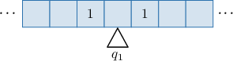
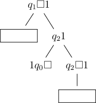
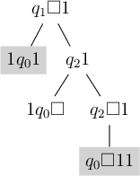
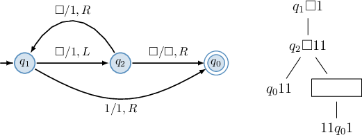
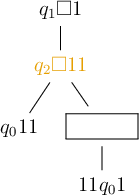
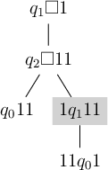

# Nondeterministic Turing Machines

Source: https://www.mathacademy.com/topics/3814?courseId=109
Topic ID: 3814

## Prerequisites

- [Nondeterministic Finite Automata](./3798-nondeterministic-finite-automata.md)
- [Big-Theta Notation](./3807-big-theta-notation.md)
- [Processing Strings Using Turing Machines](./5420-processing-strings-using-turing-machines.md)

## Lesson

### Introduction

Until now, we have only considered *deterministic* Turing machines (DTMs) in which a state and tape symbol correspond to one transition.

Another type is a **nondeterministic Turing machine** (NTM), where a state and tape symbol can correspond to multiple transitions. The transition function of an NTM has the form

$$

\delta: Q \times \Gamma \to 2^{Q \times \Gamma \times \{L, R\}},

$$

where $Q$ is a finite set of states, $\Gamma$ is the set of tape symbols, and $L$ and $R$ indicate whether to move left or right on the tape.

Let's consider the NTM given by the transition table below.

Note the intersection of row $q_2$ and column $1.$ This tells us that being in state $q_2$ and observing symbol $1$ on the tape, our machine performs the following two operations:

- Applies transition $(q_2,1) \to (q_0,\square,R).$ In other words, it swaps to state $q_0,$ erases $1$ from the tape and moves the head to the right.

- Applies transition $(q_2,1) \to (q_2,1,R).$ In other words, it stays in state $q_2,$ doesn't change the symbol on the tape, and moves the head to the right.

The important thing here is that the machine conducts both of these transitions simultaneously! Thus, to illustrate how an NTM processes a string, we use a **tree of moves**, where each node is an instantaneous description (ID), and its children correspond to the transitions of the NTM. Also, the root is the initial ID.

### A Worked Example

To demonstrate, suppose the string $1\square1$ is written on the tape of the Turing machine represented by the transition table above, where $\square$ is the blank symbol, and the tape head initially observes the central blank symbol in state $q_1.$ In other words, we start with the following configuration:

Let's now construct the corresponding tree of moves.

- Constructing the root of the tree. We start with the initial configuration, as shown below.

- Constructing the first layer of the tree. According to the transition table, $\delta(q_1,\square) = \{(q_1,1,R), (q_2,\square,L) \}.$ As a result, we have Hence, the node $1 q_1 \square 1$ has two children: $11 q_1 1$ and $q_2 1 \square1,$ as depicted below.

- Constructing the second layer of the tree. First, the left branch. According to the transition table, $\delta(q_1,1) = \{(q_0,\square,L) \}.$ As a result, we have Hence, the node $11 q_1 1$ has one child: $1 q_0 1 \square,$ as depicted below. Next, the right branch. According to the transition table, $\delta(q_2,1) = \{(q_0,\square,R), (q_2,1,R) \}.$ As a result, we have Hence, the node $q_21\square 1$ has two children: $q_0 \square1$ and $1 q_2 \square1,$ as depicted below.

### Example: Building a Tree of Moves for a NTM Using a Table

#### Question

The string $\square1$ is written on the tape of the Turing machine given by the transition table below, where $\square$ is the blank symbol. The tape head initially observes the left-most symbol of the string in state $q_1.$ From left to right, what are the missing parts of the tree of moves shown above for the given machine?

#### Explanation

Let's consider each missing part from left to right:

- The parent node of the first missing part corresponds to the instantaneous description $q_1\square1.$ According to the transition table, $\delta(q_1,\square) = \{(q_0,1,R), (q_2,\square,R) \}.$ As a result, we have So, the first missing part is $1q_0 1.$

- The parent node of the second missing part corresponds to the instantaneous description $q_2\square1.$ According to the transition table, $\delta(q_2,\square) = \{(q_0,1,L) \}.$ As a result, we have So, the second missing part is $q_0\square 11.$

Hence, the tree of moves for the given machine is the following:

Therefore, from left to right, the missing parts are $1 q_0 1$ and $q_0\square 11.$

### Example: Building a Tree of Moves for a NTM Using a Diagram

#### Question

The string $\square1$ is written on the tape of the Turing machine given by the transition diagram above, where $\square$ is the blank symbol. The tape head initially observes the left-most symbol of the string in state $q_1.$ What is the missing part of the tree of moves shown above for the given machine?

#### Explanation

The parent node of the missing part corresponds to the instantaneous description $q_2 \square 11.$

### Other Types of Turing Machines

We've considered deterministic and nondeterministic Turing machines with tapes that extend infinitely in both directions. However, there are several other variations:

- *Left-infinite* Turing machines, where the tape is infinite only to the left, with a fixed right boundary.

- *Right-infinite* Turing machines, where the tape is infinite only to the right, with a fixed left boundary.

- *Multi-tape* Turing machines, which have multiple tapes and heads that operate independently.

Despite these differences, all these models are computationally equivalent and, when used as acceptors, define the same class of languages, called the **decidable languages**.

A Turing machine is one of many formal definitions of an **algorithm**. In other words, we say that a particular problem is "algorithmically solvable" if there exists a Turing machine that solves this problem.

There are other formal definitions of algorithms in the theory of computations, but all those definitions are equivalent.

### Algorithmically Unsolvable Problems

Now that we have a formal definition of an algorithm (as a Turing machine), we can explore some interesting questions.

Earlier in this lesson, we mentioned that some mathematical problems are algorithmically unsolvable - meaning no algorithmic solution exists. This can be understood intuitively as follows.

Suppose we fix a finite input alphabet (e.g., $\{0,1\}$). Then, there are only finitely many possible Turing machines for any fixed number of states. Since the total set of Turing machines is a countable union of finite sets, it is countable.

In contrast, the set of all possible problems - even just over the natural numbers - is uncountable. Indeed, for every subset of $\mathbb{N},$ there exists a mathematical problem whose solution set corresponds to that subset. Since uncountable infinity is strictly larger than any countable set, it follows that most problems will never have an algorithmic solution.

One example of an algorithmically unsolvable problem is determining the roots of an arbitrary polynomial with integer coefficients. This does not mean there are no algorithms for solving specific polynomial equations. For instance, the quadratic formula provides a solution for any quadratic equation. However, there can never be a general algorithm that, given an arbitrary polynomial with integer coefficients, finds its roots in a finite number of steps.

### The P vs NP Problem

Another fundamental problem in computational theory is closely tied to deterministic and nondeterministic Turing machines.

The class $P$ consists of problems that can be solved using a deterministic Turing machine in polynomial time. More formally, a problem belongs to $P$ if there exists a deterministic Turing machine that solves it in time $\Theta(p(n)),$ where $n$ is the number of input symbols on the tape, and $p(n)$ is a polynomial in $n.$ On the other hand, the class $NP$ consists of problems that can be solved in polynomial time using a nondeterministic Turing machine.

Intuitively, $P$ contains problems that can be solved relatively quickly, whereas $NP$ includes problems for which, given a potential solution, it can be verified relatively quickly.

One of the most famous unsolved problems in mathematics is whether

$$

P \stackrel{?}{=} NP.

$$

Since a deterministic Turing machine is a special case of a nondeterministic one, we know that $P \subseteq NP.$ The central question is whether there exist problems in $NP$ that are not in $P.$ In other words, are there problems for which solutions can be verified quickly but not necessarily found quickly (without being given the solution in advance)?

The answer to this question is crucial, as most modern cryptography is based on the assumption that

$$

P \neq NP.

$$

If this assumption were false, many widely used cryptographic systems would be insecure.

An example of a problem believed to be in $NP$ but not in $P$ is integer factorization:

Given an integer that is the product of two large prime numbers, find those prime factors.

If the factors are provided, verification is simple - multiplication confirms the result. However, no efficient algorithm is known for factoring large integers within a reasonable (polynomial) time. Mathematicians hope no such algorithm exists, as its discovery would break widely used cryptographic schemes.

Moreover, this problem is so crucial that $P$ versus $NP$ is one of the so-called *Millennium Prize Problems*. The Clay Mathematics Institute has pledged $\,1\,000\,000$ prize for the first correct solution to this problem.
